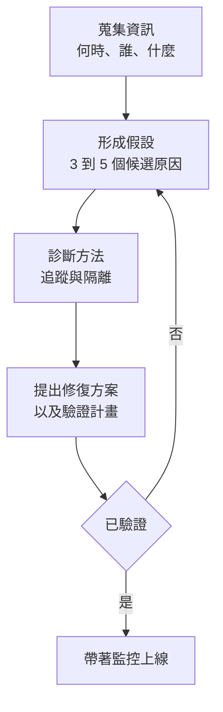

<a id="answer-frameworks-for-ai-system-design-interviews"></a>
# AI 系統設計面試的答題框架

五種適用於 AI 系統設計面試的結構化框架：設計題用的 SPIDER、概念題用的 ETA、取捨分析、除錯，以及行為題用的 STAR-L。

強而有力的面試回答通常遵循一致的結構。本章提供不同題型可用的框架，並附上範例與反模式。可搭配 [題庫](01-question-bank.md) 中的實戰題目，以及 [白板練習](04-whiteboard-exercises.md) 一起練習。

<a id="table-of-contents"></a>
## 目錄

- [系統設計框架（SPIDER）](#system-design-framework-spider)
- [概念說明框架（ETA）](#concept-explanation-framework-eta)
- [取捨分析框架](#tradeoff-analysis-framework)
- [除錯與疑難排解框架](#debugging-and-troubleshooting-framework)
- [行為題框架（STAR-L）](#behavioral-questions-framework-star-l)
- [面對未知主題](#handling-unknown-topics)
- [常見錯誤與避免方式](#common-mistakes-and-how-to-avoid-them)

---

<a id="system-design-framework-spider"></a>
## 系統設計框架（SPIDER）

任何包含 AI 元件的系統設計題，都可以使用這個框架。以下是完整流程與各階段的大致時間分配：


<a id="s-scope-and-clarify"></a>
### S - 界定範圍並澄清

**目的：** 縮小問題空間，展現你會先思考再動手設計。

**可以問的問題：**
- 規模多大？（使用者數、請求量、資料量）
- 延遲要求是什麼？
- 必須達到什麼準確率或品質門檻？
- 是否有合規或安全要求？
- 既有基礎設施是什麼？
- 預算限制是什麼？

**範例：**
```
面試官：設計一個客服聊天機器人。

你：在開始深入之前，我想先澄清幾件事：
- 預期流量是多少？每天數千還是數百萬段對話？
- 這是面向客戶，還是內部支援用途？
- 需要支援哪些語言？
- 是否需要與既有 ticketing systems 整合？
- 已解決與升級轉人工案件的準確率目標是什麼？
```

**反模式：** 還沒理解需求就直接跳進架構設計。

---

<a id="p-prioritize-requirements"></a>
### P - 排定需求優先順序

**目的：** 找出最重要的事，並讓設計朝那個方向收斂。

**建立優先級矩陣：**

| 需求 | 優先級 | 影響 |
|-------------|----------|-------------|
| 低延遲 | 高 | 可能限制模型大小 |
| 高準確率 | 高 | 需要良好的 retrieval + eval |
| 成本效率 | 中 | 可透過 caching 最佳化 |
| 多語言 | 中 | 會影響 embedding 選擇 |

**明確說出你的優先順序：**
```
「基於這些需求，我會優先考慮延遲與準確率。
成本最佳化會是第二層考量，等基本系統能正常運作後再處理。」
```

---

<a id="i-initial-architecture"></a>
### I - 初始架構

**目的：** 在深入細節前，先畫出高層架構。

**AI 系統的標準元件：**
```
┌──────────┐     ┌──────────┐     ┌──────────┐     ┌──────────┐
│  Client  │────▶│  API GW  │────▶│ AI Layer │────▶│  LLM(s)  │
└──────────┘     └──────────┘     └──────────┘     └──────────┘
                                        │
                                        ▼
                                  ┌──────────┐
                                  │ Data/RAG │
                                  └──────────┘
```

**簡要說明每個元件：**
- 它做什麼
- 為什麼需要它
- 有哪些替代方案

---

<a id="d-deep-dive-into-critical-paths"></a>
### D - 深入關鍵路徑

**目的：** 在最重要的部分展現深度。

**依據以下因素挑 2-3 個區域深入：**
- 面試官似乎最感興趣的是什麼
- 這個系統中哪些部分最新穎或最複雜
- 最大風險在哪裡

**適合深入的範例：**
- RAG pipeline：chunking、embedding、retrieval、reranking
- Agent loop：tool selection、error handling、termination
- Data pipeline：ingestion、processing、indexing
- Security：isolation、permissions、audit

**先表明你的意圖：**
```
「接下來我會更深入說明 RAG pipeline，因為 retrieval 品質對這個系統至關重要。」
```

---

<a id="e-evaluation-and-observability"></a>
### E - 評估與可觀測性

**目的：** 展現你有考慮到 production 環境的營運需求。

**應涵蓋：**
1. **Metrics：** 你量測哪些指標？
2. **Evaluation：** 你如何知道它有效？
3. **Monitoring：** 你如何偵測問題？
4. **Alerting：** 什麼情況下會通知人工介入？

**AI 系統的標準指標：**
- 延遲（p50、p95、p99）
- Token 使用量 / 成本
- 品質分數（離線與線上抽樣）
- 各類型錯誤率
- Cache hit rates

---

<a id="r-reliability-and-scale"></a>
### R - 可靠性與擴展性

**目的：** 回應失效模式與成長需求。

**可討論的失效模式：**
- LLM provider outage
- Rate limiting
- 錯誤的模型輸出
- Data pipeline failures
- Cache invalidation

**擴展性考量：**
- 瓶頸在哪裡？
- 哪些部分適合水平擴展，哪些適合垂直擴展？
- 哪些成本會隨使用量成長？

---

<a id="concept-explanation-framework-eta"></a>
## 概念說明框架（ETA）

遇到像是「Explain RAG」或「What is speculative decoding?」這類概念題時，可使用這個框架。

<a id="e-explain-simply"></a>
### E - 簡單說明

先用一句任何人都能理解的定義開場。

**以 KV Cache 為例：**
```
「KV cache 會在 LLM 生成過程中儲存中間計算結果，
讓我們在生成每個新 token 時，不必重新計算先前 token 的工作。」
```

---

<a id="t-technical-details"></a>
### T - 技術細節

根據面試官的程度補上適當的技術深度。

**以 KV Cache 為例：**
```
「更具體地說，在 transformer 的每一層中，我們會快取所有位置的 Key 與
Value tensors。每次出現新 token 時，只需要計算新位置的 K 與 V，
再與既有 cache 串接。

記憶體會依下式成長：2 × layers × heads × head_dim × sequence_length × batch_size

對於一個 70B、8K context 的模型來說，每個 request 大約需要 10GB。」
```

---

<a id="a-applications-and-tradeoffs"></a>
### A - 應用與取捨

把概念連到實務使用情境，並討論取捨。

**以 KV Cache 為例：**
```
「這對 production serving 非常關鍵。沒有它的話，生成成本會隨 sequence length
呈平方成長。

代價是記憶體使用量。這也是為什麼會有 PagedAttention
和 Grouped Query Attention 這類技術：在保留優勢的同時降低 KV cache 記憶體需求。

OpenAI 與 Anthropic 的 context caching 功能，本質上就是針對共享 prefix 的
server-side KV cache persistence。」
```

---

<a id="tradeoff-analysis-framework"></a>
## 取捨分析框架

當被要求比較選項或為某個決策辯護時，可使用這個結構。

<a id="step-1-state-the-options-clearly"></a>
### Step 1: 清楚列出選項

```
「對 embedding models 來說，我們有三個主要選項：
1. OpenAI text-embedding-3-large：品質最高，但有 API 成本
2. Cohere embed-v3：品質不錯，價格更好
3. Self-hosted BGE：完全掌控，但有營運負擔」
```

<a id="step-2-define-evaluation-criteria"></a>
### Step 2: 定義評估標準

挑選對這次決策真正重要的標準：

| 評估標準 | 權重 | 理由 |
|----------|--------|-----------|
| 品質 | 高 | 搜尋準確率是關鍵功能 |
| 規模化成本 | 高 | 每月 100M embeddings |
| 延遲 | 中 | 批次 indexing，不是即時 |
| 營運負擔 | 中 | 團隊規模小 |

<a id="step-3-analyze-each-option"></a>
### Step 3: 分析每個選項

建立比較矩陣：

| 選項 | 品質 | 成本 | 延遲 | Ops | 分數 |
|--------|---------|------|---------|-----|-------|
| OpenAI | ★★★★★ | ★★ | ★★★★ | ★★★★★ | 4.2 |
| Cohere | ★★★★ | ★★★★ | ★★★★ | ★★★★★ | 4.2 |
| BGE | ★★★★ | ★★★★★ | ★★★ | ★★ | 3.6 |

<a id="step-4-make-a-recommendation-with-reasoning"></a>
### Step 4: 帶著理由提出建議

```
「我會為這個 use case 推薦 Cohere，原因是：
1. 根據 MTEB scores，它的品質接近 OpenAI
2. 在我們的流量規模（每月 100M embeddings）下，價格更好
3. 相較 self-hosting，沒有營運負擔
4. 如果成本變得不可接受，之後仍可切換到 self-hosted

風險是 vendor dependency，而我們可透過
抽象化 embedding interface 來降低這個風險。」
```

---

<a id="debugging-and-troubleshooting-framework"></a>
## 除錯與疑難排解框架

當被問到「How would you debug X?」或「系統出現 Y，你會怎麼修？」時，可以用這個四步驟診斷流程：



<a id="step-1-gather-information"></a>
### Step 1: 蒐集資訊

```
「首先，我會問：
- 這是從什麼時候開始的？中間變更了什麼？
- 是所有 requests 都受影響，還是只有某一部分？
- 錯誤具體長什麼樣子？
- 是否有任何模式（時段、使用者族群、查詢類型）？」
```

<a id="step-2-form-hypotheses"></a>
### Step 2: 形成假設

```
「根據這些症狀，我最優先的假設是：
1. Retrieval 品質下降（最近資料有變更？）
2. 模型輸出品質下降（prompt 變了？模型不同了？）
3. Context length 超限（文件變長了？）
4. Rate limiting 造成 timeouts」
```

<a id="step-3-describe-diagnostic-approach"></a>
### Step 3: 描述診斷方法

```
「為了隔離原因：
1. 檢查失敗 requests 的 traces，看看在哪裡開始分歧
2. 將 retrieval 結果與已知良好的 baseline 比較
3. 檢查部署中的 model version 與 prompt version
4. 檢視 metrics，找出是否有相關聯的變化」
```

<a id="step-4-propose-fixes-and-verification"></a>
### Step 4: 提出修復方案與驗證方式

```
「如果問題是 retrieval 品質，我會：
1. 用已驗證的 chunking 方式重新建立索引
2. 在部署前先用 test set 驗證
3. 用 A/B comparison 漸進式 rollout
4. 針對 retrieval quality metrics 設定 alerts，以便及早發現未來問題」
```

---

<a id="behavioral-questions-framework-star-l"></a>
## 行為題框架（STAR-L）

AI 職缺的行為題可使用 STAR-L（STAR + Learnings）。

<a id="s-situation"></a>
### S - 情境

簡短交代背景。

```
「我們剛上線 RAG-powered search 功能，就收到不少技術查詢回答錯誤的抱怨。」
```

<a id="t-task"></a>
### T - 任務

你具體負責的是什麼？

```
「身為 tech lead，我需要快速診斷問題並推出修復，同時維持使用者信任。」
```

<a id="a-action"></a>
### A - 行動

你**本人**做了什麼？用「我」，不要用「我們」。

```
「我先加上更細的 tracing，以理解失敗發生在哪裡。
我發現 chunking strategy 會在函式中間切開 code blocks。
我設計了能保留語意單元的 code-aware chunking 方法。
我也加入 confidence score 顯示，讓使用者能校準信任程度。」
```

<a id="r-result"></a>
### R - 結果

如果可以，請量化。

```
「技術查詢的回答品質在我們的 evaluation suite 中，從 65% 提升到 89%。
兩週內使用者抱怨下降了 70%。」
```

<a id="l-learnings"></a>
### L - 學到的事

如果重來一次，你會做什麼不同的事？

```
「我學到 chunking strategy 必須從一開始就根據內容特性設計。
現在我在上線前一定會先用真實文件分布測試 chunking。
我也會更早建立 evaluation suites。」
```

---

<a id="handling-unknown-topics"></a>
## 面對未知主題

不可能什麼都知道；重點是要專業地處理未知。

<a id="if-you-do-not-know-at-all"></a>
### 如果你完全不知道

```
「我對 [X] 不熟悉。從名稱來看，我猜它和 [Y] 有關。
如果你願意多說一些它的作用，我可以說明我會如何處理它要解決的問題。」
```

<a id="if-you-know-partially"></a>
### 如果你只知道一部分

```
「我讀過 [X]，但沒有在 production 中使用過。我的理解是
它會 [description]。實務上，在做架構決策前，我會需要先讀文件，
而且大概率會先做 prototype。」
```

<a id="if-you-know-the-concept-but-not-details"></a>
### 如果你知道概念但不清楚細節

```
「我理解 [X] 的整體方法——[brief explanation]。
我沒有把具體參數或 benchmarks 背起來，但我知道該去哪裡找，
以及在評估它時要問哪些問題。」
```

---

<a id="common-mistakes-and-how-to-avoid-them"></a>
## 常見錯誤與避免方式

<a id="mistake-1-jumping-to-solutions"></a>
### 錯誤 1：太快跳到解法

**錯誤示範：**
```
面試官：「你會怎麼設計一個文件 Q&A 系統？」
你：「我會用 LangChain、Pinecone 和 GPT-4。」
```

**較佳做法：**
```
「在定義解法之前，我想先理解需求。
文件類型是什麼？量有多大？需要什麼程度的準確率？」
```

---

<a id="mistake-2-ignoring-cost"></a>
### 錯誤 2：忽略成本

**錯誤示範：**
```
「我會永遠使用 GPT-4，以取得最佳品質。」
```

**較佳做法：**
```
「模型選擇取決於品質門檻與流量。對高流量、低風險的查詢，
我可能會用 GPT-4o-mini 或 Claude Haiku，並保留
GPT-4 或 Claude Sonnet 給複雜案例。若每天 1M queries，這樣做
每月可能省下 $50K，而幾乎沒有明顯的品質損失。」
```

---

<a id="mistake-3-not-discussing-failure-modes"></a>
### 錯誤 3：沒有討論失效模式

**錯誤示範：**
```
「系統會檢索文件、送到 LLM，然後回傳答案。」
```

**較佳做法：**
```
「Happy path 很直接，但我也想談談失效模式：
- 如果 retrieval 找不到相關文件怎麼辦？
- 即使有好的 context，LLM 仍 hallucinate 怎麼辦？
- 如果 provider 被 rate-limit 或停機怎麼辦？

對每一種情況，我們都需要偵測與 fallback 策略。」
```

---

<a id="mistake-4-overcomplicating"></a>
### 錯誤 4：過度複雜化

**錯誤示範：**
```
「我們需要一個專門做 chunking 的服務、另一個做 embedding 的服務，
中間還要有 message queue，再加上一個即時 stream processor，
以及三種不同的 vector databases 做備援……」
```

**較佳做法：**
```
「我會先從能運作的最簡單架構開始，
只有在需求真的需要時才增加複雜度。

以這個規模來看，一個搭配 async processing 的單一服務可能就足夠。
如果需要更高吞吐量，到時再加入 message queues。」
```

---

<a id="mistake-5-not-asking-for-feedback"></a>
### 錯誤 5：沒有主動確認回饋

**錯誤示範：**
```
*連續講了 10 分鐘，完全沒有確認對方是否跟上*
```

**較佳做法：**
```
「我已經說完高層架構。你希望我更深入某個特定元件，
還是繼續談 evaluation？」
```

---

<a id="quick-reference-signals-of-strong-answers"></a>
## 快速參考：強回答的訊號

| 訊號 | 範例 |
|--------|---------|
| 會先問澄清問題 | 「延遲需求是什麼？」 |
| 會使用具體數字 | 「這會增加約 50ms 延遲」 |
| 會討論取捨 | 「我們得到 X，但失去 Y」 |
| 會提到失效模式 | 「如果這裡失敗了，我們需要……」 |
| 會連結真實系統 | 「有點像 Notion 的做法……」 |
| 願意承認不確定性 | 「這部分我會需要實際 benchmark」 |
| 會和面試官確認方向 | 「這裡要不要再深入一點？」 |
| 會連結自身經驗 | 「以我做過 X 的經驗……」 |

---

<a id="anti-patterns-to-avoid"></a>
## 要避免的反模式

| 反模式 | 更好的做法 |
|--------------|-----------------|
| 只丟 buzzwords | 清楚解釋你的意思 |
| 只提名字沒有深度 | 只提你真的講得深的內容 |
| 只說「It depends」卻不展開 | 解釋到底取決於哪些因素 |
| 使用絕對化說法 | 適當使用保留語氣 |
| 直接否定合理選項 | 承認取捨 |
| 不知道何時該停 | 觀察面試官的訊號 |

---

<a id="key-takeaways"></a>
## 重點整理

- 框架是鷹架，不是腳本；面試官分得出你是在背稿還是在思考，所以要內化結構，再把回答講得像對話。
- SPIDER 適用於任何 45 分鐘的 system design 流程；就算面試官中途打斷你，你通常也已覆蓋最有訊號價值的階段。
- 「It depends」可以說，但**一定**要接著補上「它取決於 X、Y、Z，而這些因素會如何改變答案」；否則只會像在閃躲。
- 每次 deep dive 最後都要補一句 observability 和一句 failure modes；這是 senior 和 staff 答案之間最大的差距之一。
- 行為題若沒有量化結果（STAR-L 的 R），很容易被當成軼事描述；就算是近似值，也要帶數字。

---

*另請參考：[題庫](01-question-bank.md) | [常見陷阱](03-common-pitfalls.md) | [白板練習](04-whiteboard-exercises.md)*
