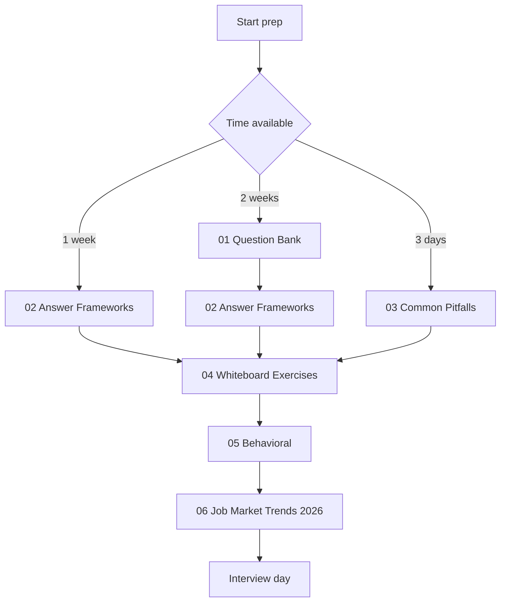
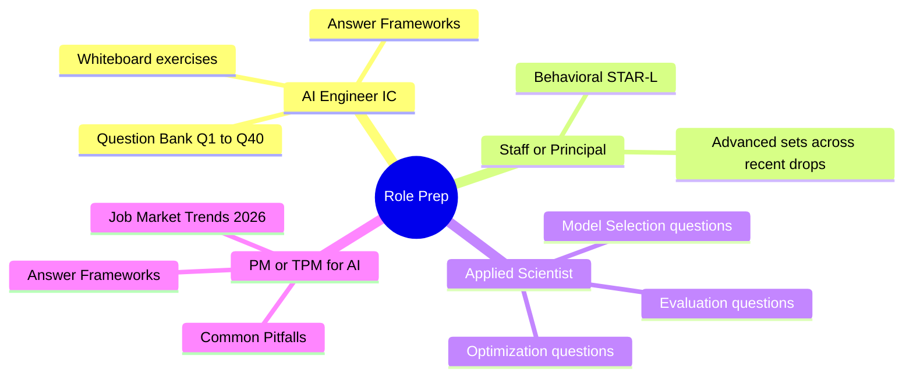

# AI 系統設計面試準備

針對資深與 staff 級 AI 工程職位的面試準備：110+ 系統設計題、答題框架、常見陷阱、白板演練，以及 2026 招聘趨勢。

此資料夾中的六個檔案是依序設計來閱讀的。每一份都建立在前一份之上：題庫教你掌握範圍，框架教你如何組織回答，陷阱教你哪些地方會讓你失去 offer，演練讓你熟悉實戰節奏，行為面試篇涵蓋 staff 級訊號，而就業市場趨勢篇則說明當前的招聘環境。

## 依序閱讀

## 依角色區分的準備路徑

## 本資料夾中的檔案

| File | Purpose |
|------|---------|
| [01-question-bank.md](01-question-bank.md) | 依主題整理的 110+ 真實面試題，含示範答案與追問（截至 2026 年 5 月）。 |
| [02-answer-frameworks.md](02-answer-frameworks.md) | 五種結構化答題框架：用於設計題的 SPIDER、用於概念題的 ETA、tradeoff 分析、debugging，以及用於行為題的 STAR-L。 |
| [03-common-pitfalls.md](03-common-pitfalls.md) | 會讓 staff 級 offer 失手的模式：在 tradeoff 上含糊帶過、缺少 observability、忽略 failure mode。 |
| [04-whiteboard-exercises.md](04-whiteboard-exercises.md) | 含完整解答的系統設計演練。最接近真實面試流程的模擬。 |
| [05-behavioral-for-ai-roles.md](05-behavioral-for-ai-roles.md) | AI 特定情境的行為面試準備：模型淘汰、production hallucination、eval 文化。 |
| [06-job-market-trends-2026.md](06-job-market-trends-2026.md) | 職位分類、薪酬區間、面試流程模式，以及新興職稱（FDE、AI Eval Engineer、AI Reliability Engineer、MCP Engineer）。 |
| [07-faq.md](07-faq.md) | 以簡短直接的方式回答 AI engineering、RAG、agents、models、eval、inference、memory 與 security 最常見的問題。適合快速查閱，也適合剛進入這個領域的人。 |

## 補充資源

- [Role Transition Guide](../TRANSITION_GUIDE.md)：協助你從 backend、frontend、QA、PM 或 EM 轉向 AI 做準備。
- [Recommended Courses](../COURSES.md)：在面試準備之前先建立基礎所需的學習資源。
- [Glossary](../GLOSSARY.md)：方便準備過程中快速查閱術語定義。
- [Case Studies](../16-case-studies/)：與白板題直接對應的 production 架構案例。

## 重點整理

- 這六份檔案是依序設計來閱讀的；若還沒吸收答題框架就直接跳去做題，回答通常會缺乏結構。
- 白板演練（檔案 04）是最接近真實面試的模擬；在進入任何面試 loop 前，至少做三題。
- 行為面試準備（檔案 05）是區分 staff 候選人與 senior 候選人的關鍵；不要跳過。
- 2026 年 5 月的就業市場章節（檔案 06）是一道護城河：了解招聘環境的候選人能問出更好的問題，也更能調整自己的故事。
- 每月重新查看一次這個資料夾；隨著招聘趨勢變化，新的題目批次也會持續加入。
