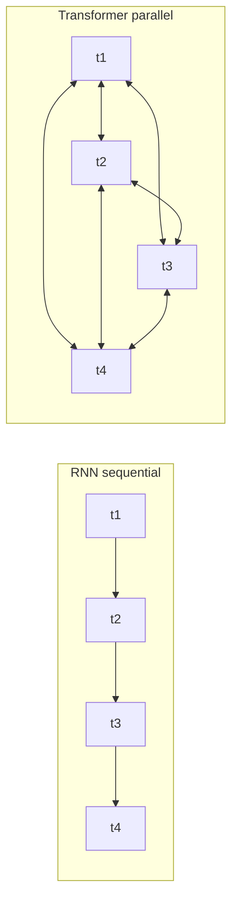
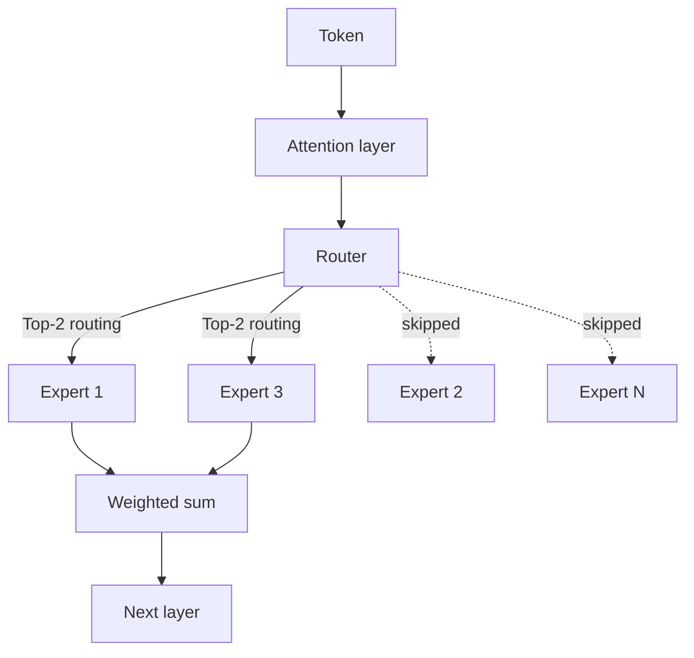

<a id="llm-internals"></a>
# LLM 內部機制

現代 LLM 的架構核心：transformer、MoE、attention 數學、RoPE、GQA、KV cache，以及推動 2026 模型設計的 inference-optimal scaling 轉向。

本章涵蓋大型語言模型背後的核心概念。理解這些內部機制，對於為 AI 系統做出有根據的架構決策至關重要。若要了解這些架構選擇的實務影響，請參閱 [Inference Optimization](../04-inference-optimization/)（KV cache、PagedAttention）、[Model Taxonomy](../02-model-landscape/01-model-taxonomy.md)（正式上線的 MoE 模型），以及 [Glossary](../GLOSSARY.md) 中對 MoE、RoPE、ALiBi、GQA、MLA 的定義。

<a id="table-of-contents"></a>
## 目錄

- [Transformer 革命](#the-transformer-revolution)
- [架構變體](#architecture-variants)
- [Mixture of Experts (MoE)](#mixture-of-experts-moe)
- [Scaling Laws：Training vs. Inference Optimal](#scaling-laws-training-vs-inference-optimal)
- [原生多模態](#native-multimodality)
- [Self-Attention 機制](#self-attention-mechanism)
- [Multi-Head Attention](#multi-head-attention)
- [位置編碼](#position-encodings)
- [Feed-Forward Networks](#feed-forward-networks)
- [Layer Normalization](#layer-normalization)
- [整體串接](#putting-it-all-together)
- [需要記住的關鍵數字](#key-numbers-to-know)
- [面試題](#interview-questions)
- [參考資料](#references)

---

<a id="the-transformer-revolution"></a>
## Transformer 革命

在 2017 年之前，序列建模依賴逐一處理 token 的循環式架構（RNN、LSTM）。這帶來了兩個問題：

1. **訓練速度慢**：序列式處理無法平行化
2. **長距離依賴難以處理**：資訊必須穿越許多 hidden states 才能傳遞

Transformer 架構由〈Attention Is All You Need〉（Vaswani et al., 2017）提出，透過以 self-attention 取代 recurrence，一次解決了這兩個問題。

**給分散式系統工程師的心智模型：**
把 recurrence 想成單執行緒的 request pipeline，每一步都依賴前一步。self-attention 則像一張完全連通的圖，每個節點都能平行查詢其他所有節點。



---

<a id="architecture-variants"></a>
## 架構變體

依據原始 Transformer 使用了哪些部分，後續演化出三種主要變體：

| 架構 | Attention 類型 | 範例 | 最適用於 |
|------|---------------|------|----------|
| Encoder-only | 雙向 | BERT、RoBERTa | 分類、NER、embeddings |
| Decoder-only | Causal（由左至右） | GPT-4、Claude、Llama | 文字生成、chat |
| Encoder-Decoder | Cross-attention | T5、BART | 翻譯、摘要 |

<a id="decoder-only-most-llms-today"></a>
### Decoder-only（當今大多數 LLM）

```
┌─────────────────────────────────────────────────────┐
│                 Decoder Block (×N)                  │
│  ┌───────────────────────────────────────────────┐  │
│  │           Masked Self-Attention               │  │
│  │   (Each token attends only to previous)       │  │
│  └───────────────────────────────────────────────┘  │
│                         │                           │
│                    Add & Norm                       │
│                         │                           │
│  ┌───────────────────────────────────────────────┐  │
│  │              Feed-Forward Network             │  │
│  └───────────────────────────────────────────────┘  │
│                         │                           │
│                    Add & Norm                       │
└─────────────────────────────────────────────────────┘
                          │
                          ▼
                   Output Probabilities
```

**為何 Decoder-only 佔主導地位：**
- 架構最簡單
- 預訓練目標（next token prediction）與生成任務天然對齊
- 能隨著算力良好擴展

<a id="encoder-only-bert-style"></a>
### Encoder-only（BERT 風格）

使用雙向 attention。每個 token 都能看到其他所有 token。它不能做 autoregressive 文字生成，但在理解型任務上表現出色。

**實務相關性：**
- 可微調用於分類（intent detection、sentiment）
- 是 embedding 模型的 backbone
- 在特定任務上更小、更快

<a id="encoder-decoder-the-return-of-the-encoder"></a>
### Encoder-Decoder（Encoder 的回歸）

雖然 Decoder-only 多年來一直佔主流，但到了 2025 年末，Encoder-Decoder 架構又回到了特化的 **reasoning** 與 **verification** 任務中（例如 o3 的內部 verifier）。

---

<a id="mixture-of-experts-moe"></a>
## Mixture of Experts (MoE)

**這是 frontier models（GPT-4o、DeepSeek-V3、Mixtral）中最重要的架構轉變。**

MoE 以多個「experts」與一個負責挑選 expert 的「router」，取代了稠密的 Feed-Forward Network（FFN），讓不同 token 交由不同 experts 處理。

```
┌─────────────────────────────────────────────────────┐
│                 MoE Layer (Decoder)                 │
│  ┌───────────────────────────────────────────────┐  │
│  │               Attention Layer                 │  │
│  └───────────────────────────────────────────────┘  │
│                         │                           │
│                 ┌───────▼───────┐                   │
│                 │     Router    │                   │
│                 └─┬───┬───┬───┬─┘                   │
│          ┌────────┘   │   │   └────────┐            │
│          ▼            ▼   ▼            ▼            │
│   ┌──────────┐ ┌──────────┐ ┌──────────┐ ┌──────────┐│
│   │ Expert 1 │ │ Expert 2 │ │ Expert 3 │ │ Expert N ││
│   └────┬─────┘ └────┬─────┘ └────┬─────┘ └────┬─────┘│
│        └────────────┴───┬───┴────────────┘        │
└─────────────────────────▼───────────────────────────┘
```

<a id="key-moe-nuances-for-system-design"></a>
### 系統設計中 MoE 的關鍵細節：
1. **總參數 vs. 啟用參數**：一個 1.2T 參數的 MoE 模型（如傳聞中的 GPT-4o）每個 token 可能只會啟用 100B 參數。
    - **記憶體限制**：你仍然必須保存全部 1.2T 參數（高 VRAM）。
    - **計算限制**：你實際只需支付 100B 參數的 FLOPs 成本（延遲更快）。
2. **Routing Collapse**：如果 router 永遠只挑同一個 expert，其餘 experts 就學不到東西。現代模型使用 **load balancing loss** 與 **auxiliary losses**，確保所有 experts 都會被利用。
3. **DeepSeek-V3 的改良**：引入 **Multi-head Latent Attention (MLA)** 與 **Auxiliary-loss-free load balancing**，為 2025 年的效率標準立下新基準。

每個 token 的 routing 決策流程如下：



---

<a id="scaling-laws-training-vs-inference-optimal"></a>
## Scaling Laws：Training vs. Inference Optimal

原始的 Chinchilla laws（2022）聚焦於 **Training-Optimal**：在固定訓練預算下找到最佳模型大小。

到了 2025 年末，產業已轉向 **Inference-Optimal** scaling：
- **Over-training**：在遠超 Chinchilla 點的位置，用海量資料（15T+ tokens）訓練較小的模型（例如 Llama 3 8B）。
- **為什麼？**：面對數百萬使用者時，推論成本遠遠超過一次性的訓練成本。與其在 Chinchilla 點訓練 70B 模型，不如把 7B 模型多訓練 10 倍，實際提供服務會更便宜。

---

<a id="native-multimodality"></a>
## 原生多模態

較舊的模型使用 **Vision Adapters**（把凍結的 CLIP 風格 vision encoder 接到 LLM 上）。而 frontier models（GPT-5.2、Gemini 3）則是 **Native Multimodal**。

- **共享詞彙表**：視覺 token 與文字 token 存在於同一個 latent space。
- **統一的 Transformer**：同一套 block 同時處理 pixels 與文字。
- **優勢**：相較於 adapter-based 方法，空間推理與「world model」理解能力好得多。

---

<a id="self-attention-mechanism"></a>
## Self-Attention 機制

Self-attention 是核心創新。它讓每個 token 都能對序列中的其他所有 token 進行「注意」（蒐集資訊）。

<a id="the-intuition"></a>
### 直覺

考慮這句話：「The animal didn't cross the street because it was too tired.」

其中的「it」指的是誰？要理解這句話，就得把「it」和「animal」連起來。Self-attention 透過計算所有 token pair 之間的相關性分數，學會這種連結。

<a id="the-math"></a>
### 數學形式

對於維度為 d、長度為 n 的輸入序列 X：

```
Q = XW_Q   (Query: What am I looking for?)
K = XW_K   (Key: What do I contain?)
V = XW_V   (Value: What do I contribute?)

Attention(Q, K, V) = softmax(QK^T / √d_k) × V
```

**逐步拆解：**
1. **QK^T**：點積衡量 queries 與 keys 的相似度（n × n 矩陣）
2. **/ √d_k**：縮放以避免大維度下 softmax 飽和
3. **softmax**：轉成機率（每一列總和為 1）
4. **× V**：依 attention 權重對 values 做加權總和

<a id="why-scale-by-dk"></a>
### 為什麼要除以 √d_k？

**面試愛問題**：這題很常出現，因為它能看出你是否理解數值穩定性。

若不做縮放，隨著維度 d 增大，點積也會等比例變大。過大的點積會把 softmax 推進飽和區，導致梯度消失。

```python
# Without scaling (problematic for large d)
d = 512
q = np.random.randn(d)
k = np.random.randn(d)
dot = np.dot(q, k)  # Expected magnitude: ~√d ≈ 22.6

# With scaling
scaled_dot = dot / np.sqrt(d)  # Expected magnitude: ~1
```

<a id="attention-complexity"></a>
### Attention 複雜度

| 操作 | 時間複雜度 | 空間複雜度 |
|------|------------|------------|
| QK^T 計算 | O(n²d) | O(n²) |
| Softmax | O(n²) | O(n²) |
| 與 V 做加權總和 | O(n²d) | O(nd) |

O(n²) 的複雜度限制了 context length。100K 的 context window，代表每層需要做 100 億次 attention 計算。

---

<a id="multi-head-attention"></a>
## Multi-Head Attention

現代 transformer 不使用單一 attention，而是使用多個可平行運作的「heads」，各自關注不同面向。

```
┌─────────────────────────────────────────────────────────────┐
│                    Multi-Head Attention                      │
│                                                              │
│   ┌─────────┐  ┌─────────┐  ┌─────────┐       ┌─────────┐   │
│   │ Head 1  │  │ Head 2  │  │ Head 3  │  ...  │ Head h  │   │
│   │ d_k=64  │  │ d_k=64  │  │ d_k=64  │       │ d_k=64  │   │
│   └────┬────┘  └────┬────┘  └────┬────┘       └────┬────┘   │
│        │            │            │                  │        │
│        └────────────┴────────────┴──────────────────┘        │
│                              │                               │
│                         Concatenate                          │
│                              │                               │
│                         W_O (project)                        │
└─────────────────────────────────────────────────────────────┘
```

**為什麼需要多個 heads？**
- 不同 heads 會學到不同模式（syntax、semantics、coreference）
- 類似 ensemble methods：多種視角能提升穩健性
- 能在 heads 之間平行處理

**典型設定：**
- GPT-3 175B：96 heads × 128 維 = 12,288 總維度
- Llama 2 70B：64 heads × 128 維 = 8,192 總維度

<a id="grouped-query-attention-gqa"></a>
### Grouped Query Attention (GQA)

**對正式上線系統至關重要**：標準 multi-head attention 需要在 KV cache 中為每個 head 分別儲存 K 與 V。GQA 則讓一組 query heads 共用 K 與 V。

| Attention 類型 | 每個 Query 對應的 K,V | KV Cache 降幅 | 範例 |
|----------------|----------------------|---------------|------|
| Multi-Head (MHA) | 1:1 | 基準線 | GPT-3 |
| Grouped-Query (GQA) | 常見為 8:1 | 約 8x | Llama 2、Mistral |
| Multi-Query (MQA) | All:1 | 約 n_heads × | PaLM、Falcon |

**實務影響：**
對 Llama 2 70B、8K context 而言：
- MHA KV cache：約每個 request 10 GB
- GQA KV cache：約每個 request 1.3 GB

這會直接影響 batch size，也因此直接影響 throughput。

---

<a id="position-encodings"></a>
## 位置編碼

Self-attention 對排列順序不敏感。若沒有位置資訊，「dog bites man」與「man bites dog」會完全一樣。位置編碼就是用來注入序列順序。

<a id="sinusoidal-original-transformer"></a>
### Sinusoidal（原始 Transformer）

使用不同頻率的 sine 與 cosine 函數：

```
PE(pos, 2i) = sin(pos / 10000^(2i/d))
PE(pos, 2i+1) = cos(pos / 10000^(2i/d))
```

**特性：**
- 決定性，不需學習參數
- 理論上可外推到更長序列
- 實務上外推效果並不好

<a id="learned-absolute"></a>
### Learned Absolute

為每個位置學一個獨立 embedding：

```python
position_embeddings = nn.Embedding(max_length, d_model)
```

**特性：**
- 簡單且有效
- 無法外推超過訓練長度
- 多見於早期模型（GPT-2、BERT）

<a id="rotary-position-embedding-rope"></a>
### Rotary Position Embedding (RoPE)

透過旋轉 query 與 key 向量來編碼位置：

```
RoPE(x, pos) = x × cos(pos × θ) + rotate(x) × sin(pos × θ)
```

**特性：**
- 相對式：attention 取決於 (pos_q - pos_k)
- 比 absolute 位置編碼更能外推
- 使用於：Llama、Mistral、PaLM

<a id="alibi-attention-with-linear-biases"></a>
### ALiBi（Attention with Linear Biases）

直接把與位置有關的 bias 加到 attention 分數上：

```
Attention = softmax(QK^T / √d_k - m × distance)
```

其中 m 是每個 head 專屬的 slope，distance 則是 |pos_q - pos_k|。

**特性：**
- 不需修改 embeddings
- 外推能力極佳
- 使用於：BLOOM、MPT

<a id="position-encoding-comparison"></a>
### 位置編碼比較

| 方法 | 外推能力 | 計算額外負擔 | 現代使用情況 |
|------|----------|--------------|--------------|
| Sinusoidal | 差 | 無 | 很少 |
| Learned | 無 | 極低 | 傳統做法 |
| RoPE | 好 | 約 5% | 多數 LLM |
| ALiBi | 極佳 | 約 2% | 部分 LLM |

---

<a id="feed-forward-networks"></a>
## Feed-Forward Networks

每個 transformer layer 都有一個 feed-forward network（FFN），用來獨立處理每個位置：

```python
def feed_forward(x):
    hidden = activation(x @ W1 + b1)  # Expand: d → 4d
    output = hidden @ W2 + b2         # Contract: 4d → d
    return output
```

**關鍵特性：**
- 逐位置處理：同一組權重會套用到每個位置
- 擴張比例：通常是 4x（例如 4096 → 16384 → 4096）
- 參數主要所在：FFN 約占每層參數的 2/3

<a id="activation-functions"></a>
### 啟用函數

| Activation | 公式 | 特性 | 用途 |
|------------|------|------|------|
| ReLU | max(0, x) | 簡單、稀疏 | 原始版本 |
| GELU | x × Φ(x) | 平滑，BERT 常用 | GPT-2、BERT |
| SwiGLU | Swish(xW) × xV | 目前最佳水準 | Llama、PaLM |

SwiGLU 加入 gating 機制，以 FFN 多約 50% 參數為代價換取更好的表現。

<a id="glu-variants"></a>
### GLU 變體

```python
# Standard FFN
hidden = gelu(x @ W1)
output = hidden @ W2

# SwiGLU FFN
gate = silu(x @ W_gate)
hidden = x @ W_up
output = (gate * hidden) @ W_down
```

---

<a id="layer-normalization"></a>
## Layer Normalization

Layer normalization 透過標準化 activations 來穩定訓練：

```python
def layer_norm(x, gamma, beta):
    mean = x.mean(dim=-1, keepdim=True)
    var = x.var(dim=-1, keepdim=True)
    normalized = (x - mean) / sqrt(var + eps)
    return gamma * normalized + beta
```

<a id="pre-ln-vs-post-ln"></a>
### Pre-LN vs Post-LN

**Post-LN（原始 Transformer）：**
```
x = x + Attention(LayerNorm(x))  # Wrong - this is Pre-LN
x = LayerNorm(x + Attention(x))  # Post-LN: normalize after residual
```

**Pre-LN（現代 LLM）：**
```
x = x + Attention(LayerNorm(x))  # Pre-LN: normalize before sublayer
```

| 變體 | 訓練穩定性 | 最終表現 | 使用情境 |
|------|------------|----------|----------|
| Post-LN | 較難 | 略好 | 原始論文 |
| Pre-LN | 容易得多 | 好 | 多數現代 LLM |

Pre-LN 之所以成為標準，是因為它能在不必仔細調 learning rate 的情況下，訓練很深的模型。

<a id="rmsnorm"></a>
### RMSNorm

一種省略 mean centering 的簡化版本：

```python
def rms_norm(x, gamma):
    rms = sqrt(mean(x^2) + eps)
    return gamma * (x / rms)
```

比 LayerNorm 快約 10-15%，且表現相近。Llama、Mistral 都使用它。

---

<a id="putting-it-all-together"></a>
## 整體串接

一個完整的 transformer layer：

```python
class TransformerLayer:
    def __init__(self, d_model, n_heads, d_ff):
        self.attn_norm = RMSNorm(d_model)
        self.attn = MultiHeadAttention(d_model, n_heads)
        self.ff_norm = RMSNorm(d_model)
        self.ff = SwiGLU_FFN(d_model, d_ff)

    def forward(self, x, mask=None):
        # Pre-norm attention with residual
        h = x + self.attn(self.attn_norm(x), mask)

        # Pre-norm FFN with residual
        out = h + self.ff(self.ff_norm(h))
        return out
```

**完整模型：**
```
Token IDs → Embedding → [Transformer Layer × N] → Output Norm → LM Head → Logits
```

---

<a id="key-numbers-to-know"></a>
## 需要記住的關鍵數字

<a id="model-sizes"></a>
### 模型規模

| 模型 | 參數量 | Layers | Heads | 維度 | FFN 維度 |
|------|--------|--------|-------|------|----------|
| GPT-3 | 175B | 96 | 96 | 12,288 | 49,152 |
| Llama 2 70B | 70B | 80 | 64 | 8,192 | 28,672 |
| Llama 2 7B | 7B | 32 | 32 | 4,096 | 11,008 |
| Mistral 7B | 7B | 32 | 32 | 4,096 | 14,336 |

<a id="memory-requirements"></a>
### 記憶體需求

```
Model weights (FP16) ≈ 2 bytes × parameters
- 70B model: ~140 GB
- 7B model: ~14 GB

KV Cache per token (FP16):
= 2 × layers × heads × head_dim × 2 bytes
- Llama 70B: 2 × 80 × 64 × 128 × 2 = 2.6 MB per token
- At 8K context: 21 GB per request
```

<a id="compute-requirements"></a>
### 算力需求

```
FLOPs per token forward pass ≈ 2 × parameters
- 70B model: ~140 TFLOPs per token
- Generate 100 tokens: 14 PFLOPs

H100 at 990 TFLOPS (FP16):
- Single token: 140ms theoretical (actual: ~20-50ms with batching)
```

---

<a id="key-takeaways"></a>
## 關鍵重點

- 從 RNN 轉向 Transformer，關鍵不只在品質，更在於平行化；這也是後來 GPU scaling laws 得以成立的原因。
- MoE 將總參數（記憶體成本）與啟用參數（計算成本）拆開：1.2T 的 MoE 模型，可以用接近 100B dense model 的延遲提供服務。
- 在正式環境中，inference-optimal scaling 勝過 Chinchilla：因為模型生命週期中的推論成本高於訓練成本，所以應該把較小模型訓練得更久。
- GQA 是目前模型中影響 KV cache 最大的最佳化；討論 serving cost 前，先搞懂 N:G ratio。
- 搭配 RMSNorm 的 Pre-LN 是現代預設；如果你在面試答案中看到 Post-LN，代表對方引用的是 2018 年的論文脈絡。

---

<a id="interview-questions"></a>
## 面試題

<a id="q-explain-why-transformer-attention-is-on2-and-what-alternatives-exist"></a>
### Q：解釋為什麼 transformer attention 是 O(n²)，以及有哪些替代方案？

**強回答：**
Attention 需要計算所有 token 兩兩之間的相似度。對於長度為 n 的序列：
- QK^T 是 [n, d] × [d, n] = 每個 head 需要 n² 次乘法
- 儲存 attention weights 需要 n² 個浮點數

替代方案：
- Sparse attention（Longformer）：使用 local + global patterns，複雜度 O(n)
- Linear attention（Performer）：以 random feature approximation 達成 O(n)
- Flash Attention：計算量仍為 O(n²)，但透過 kernel fusion 把記憶體降到 O(n)
- State-space models（Mamba）：完全線性，O(n)

取捨在於：完整的長距離依賴需要 n²，但多數任務其實不需要所有 token pair 都互相作用。

<a id="q-what-is-the-kv-cache-and-why-does-it-matter-for-serving"></a>
### Q：什麼是 KV cache，為什麼它對 serving 很重要？

**強回答：**
在 autoregressive 生成中，我們一次產生一個 token。若沒有 caching，每一步都必須重新計算所有先前 token 的 K 與 V。

KV cache 會保存先前位置的 K 與 V。對每個新 token：
1. 只為新位置計算 Q、K、V
2. 把新的 K、V 串接到已快取的 K、V 後面
3. 用完整的 K、V 計算 attention

這讓每個 token 的 K 與 V 計算複雜度從 O(n) 降到 O(1)。

**代價：**記憶體會隨序列長度線性成長。對 Llama 70B 與 8K context 而言，KV cache 約為每個 request 21 GB。這限制了 batch size，也因此需要像 PagedAttention 這類技術。

<a id="q-why-do-modern-llms-use-pre-ln-instead-of-post-ln"></a>
### Q：為什麼現代 LLM 使用 Pre-LN 而不是 Post-LN？

**強回答：**
Pre-LN 把 normalization 放在每個 sublayer 之前，而不是之後。這為梯度穿過 residual connections 建立了更直接的路徑。

使用 Post-LN 時，梯度必須穿過 normalization，這會在訓練初期造成不穩定。Post-LN 通常需要 learning rate warmup 與更仔細的初始化。

Pre-LN 能讓超深模型（100+ layers）不靠特殊初始化也能訓練。它的代價是最終表現可能略低，但在實務上，訓練穩定性更值得。

<a id="q-what-is-the-difference-between-mha-mqa-and-gqa"></a>
### Q：MHA、MQA 與 GQA 有什麼差別？

**強回答：**
三者都是 multi-head attention 的變體，差別在於 K 與 V heads 的共享方式：

- **MHA (Multi-Head Attention)**：每個 query head 都有自己的 K 與 V heads。N:N 比例。
- **MQA (Multi-Query Attention)**：所有 query heads 共用單一組 K 與 V head。N:1 比例。
- **GQA (Grouped-Query Attention)**：一組 query heads 共用一組 K 與 V heads。N:G 比例（常見 G=8）。

KV cache 的記憶體影響：
- MHA：完整大小
- MQA：1/N 大小（但品質會下降）
- GQA：1/G 大小（整體取捨最佳）

Llama 2 70B 對 64 個 query heads 使用 8 個 KV heads 的 GQA，讓 KV cache 降低 8 倍，同時幾乎不損失品質。

---

<a id="references"></a>
## 參考資料

- Vaswani et al. "Attention Is All You Need" (2017)
- Su et al. "RoFormer: Enhanced Transformer with Rotary Position Embedding" (2021)
- Press et al. "Train Short, Test Long: Attention with Linear Biases" (ALiBi, 2022)
- Shazeer "GLU Variants Improve Transformer" (2020)
- Ainslie et al. "GQA: Training Generalized Multi-Query Transformer Models" (2023)
- [Illustrated Transformer](https://jalammar.github.io/illustrated-transformer/)
- [The Annotated Transformer](https://nlp.seas.harvard.edu/2018/04/03/attention.html)

---

*下一篇：[Tokenization Deep Dive](02-tokenization-deep-dive.md)*
