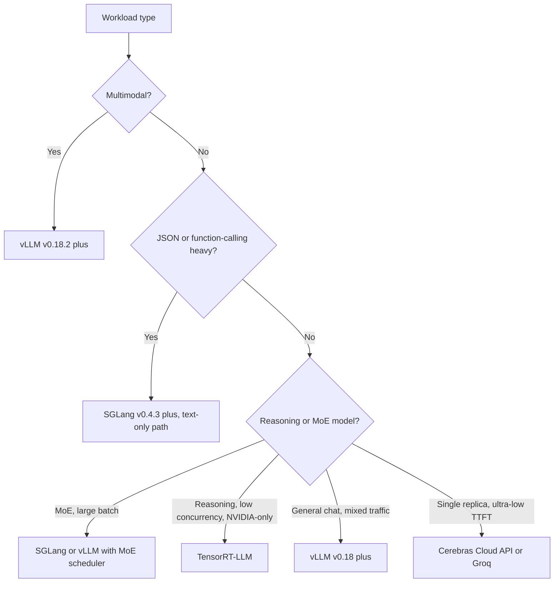

# Serving 基礎設施

要大規模部署 LLM，需要一層健壯的基礎設施來處理負載平衡、模型平行化與多租戶隔離。焦點已從「把模型服務出去」轉變為「協調整個推論艦隊」。

## 目錄

- [推論閘道](#inference-gateway)
- [模型平行化（Tensor vs. Pipeline）](#parallelism)
- [多 GPU 協調](#multi-gpu)
- [串流與長連線](#streaming)
- [2026 年 5 月的推論引擎版圖](#may-2026-inference-engine-landscape)
- [面試題](#interview-questions)
- [參考資料](#references)

---

## 推論閘道

Gateway 是 AI 工作負載的「交通控制塔」。

| 元件 | 職責 |
|-----------|---------------------------|
| **Auth & Rate Limiting** | 以 token 為基礎的配額與租戶隔離。 |
| **Model Router** | 將請求導向特定模型版本（Canary/A-B）。 |
| **Context Tracker** | 確保使用者的 prompt cache 送往相同 GPU 節點（Sticky sessions）。 |
| **Output Filter** | 對串流回應做即時安全檢查與 PII 清洗。 |

---

## 模型平行化

對於無法放進單張 GPU 的模型（例如 Llama 4 405B 需要約 800GB VRAM），我們必須把它拆分。

### 1. Tensor Parallelism (TP)
把單一 layer/tensor 拆到多張 GPU 上。
- **Latency**：低（最快）。
- **Communication**：高（需要 NVLink）。
- **Standard**：90% 的正式環境 serving 都在單一節點內（8x GPUs）使用它。

### 2. Pipeline Parallelism (PP)
把不同 layers 拆開（例如 GPU 1 跑 layers 1-40，GPU 2 跑 41-80）。
- **Latency**：高（有 micro-batching overhead）。
- **Efficiency**：利用率較低（Bubble time）。
- **Standard**：只用於跨多節點的大型模型。

---

## 多 GPU 協調

Kubernetes operators（例如 **Kube-Ray** 或 **Gloo**）在正式環境中負責管理「GPU Pools」。

- **Heterogeneous Clusters**：在同一叢集中混用 H100（前沿模型）與 L4（小模型）。
- **Autoscaling**：根據 **KV Cache utilization** 而不是 CPU 或一般記憶體使用率來擴縮。
- **Cold Booting**：使用 **Un-quantized Base Images**，並從高速 Lustre/mount 載入權重，把啟動時間從數分鐘縮短到 15-20 秒。

---

## 串流與長連線

LLM 幾乎都透過 **Server-Sent Events (SSE)** 或 **WebSockets** 對外服務。

**基礎設施挑戰**：標準負載平衡器（Layer 4）不擅長處理長時間存活的 AI 連線。
- **解法**：使用理解「End of Sequence」token 的 **Layer 7 Load Balancers**（Envoy/Istio），讓流量能在使用者回合之間重新平衡，而不是只在連線層級處理。

---

## 2026 年 5 月的推論引擎版圖

到了 2026 年 5 月，引擎選擇已不再是「哪一個最快」這麼單純。每個主流引擎都在特定工作負載類別中勝出，正確答案變成依工作負載選引擎，而不是整家公司只押單一引擎。以下是團隊實際採用的實戰地圖。

### vLLM v0.18+：預設的開放式引擎

[vLLM](https://docs.vllm.ai/) 在 2026 年第一季達到 **v0.18**，並一路發布到 5 月。主要進展包括：

- 原始碼已納入 **Blackwell Ultra (B300) support**，包含 FP4 與 dynamic sparsity（見 [vLLM v0.18 release notes](https://github.com/vllm-project/vllm/releases)）。
- **PagedAttention v3** 與 NUMA-aware allocation，可在多 socket 主機上明顯改善 tail latency。
- 透過設定旗標提供 **disaggregated prefill / decode**，主要用於超長上下文工作負載。
- 為 Llama 4 Maverick、DeepSeek V4 Pro、Mixtral 8x22B 加入 **MoE schedulers**，支援 expert-residency-aware batching。

**重要安全說明**：vLLM 修補了一個高嚴重性的 **multimodal RCE**（[GHSA 於 2026 年 2 月發布](https://github.com/vllm-project/vllm/security/advisories)），影響 v0.18.2 之前版本的 multimodal preprocessor。**所有 multimodal vLLM 部署都必須執行 v0.18.2 或更新版本。** 修補本身只是一行 patch，但 CVE 真實存在，且可透過精心構造的圖片輸入進行利用。請升級。

當工作負載是「Llama / Mistral / Qwen / DeepSeek，在 continuous batching 下執行」時，vLLM 仍是預設開放式引擎。它不一定永遠最快，但最容易營運、測試最完整，也最可能在新漏洞出現的同一週就拿到修補。

### SGLang v0.4.3+：吞吐量領先者，但有重要限制

[SGLang](https://github.com/sgl-project/sglang) v0.4.3（2026 年 4 月）在多種工作負載上都是吞吐量冠軍：

- 在已發布 benchmark 中，**結構化輸出 / function-calling 工作負載比 vLLM 約快 29%**（見 [SGLang blog, April 2026](https://lmsys.org/blog/2024-12-04-sglang-v0-4/)）。優勢來自 **async constrained decoding**，也就是約束編譯與 LLM forward pass 並行執行。
- 具備同級最佳的 **RadixAttention** prefix-cache reuse，適合 chat 工作負載。
- 對 **MoE serving** 提供一流支援，具備 expert-routing-aware batching。

**截至 2026 年 5 月的關鍵安全警語**：SGLang 在 multimodal 與 disaggregated-prefill 路徑中仍有**尚未修補的 RCE**（見 [SGLang security advisory, March 2026](https://github.com/sgl-project/sglang/security/advisories)）。文字專用路徑是安全的，也是所有公開 benchmark 所採用的路徑。multimodal 路徑在 patch 上線前都應視為**尚未達到 production-ready**。多個大型部署已把 multimodal 流量從 SGLang 移回 vLLM v0.18.2，同時保留 SGLang 處理純文字 function-calling 工作負載。

因此，2026 年 5 月的正確姿勢是：在**純文字 function-calling 與 structured-output 工作負載**中使用 SGLang，享受吞吐優勢；但在 **multimodal 或 disaggregated-prefill 正式流量**中，於 CVE 修補前不要使用 SGLang。

### TensorRT-LLM：NVIDIA 吞吐巔峰，但營運成本高

[TensorRT-LLM](https://github.com/NVIDIA/TensorRT-LLM) 依然是純 NVIDIA 硬體上的吞吐量王者：

- 在 H200、B200、B300 上，對經手工調校的模型提供**最高峰值 tokens/sec/$**。
- 與 **NVIDIA Triton**（serving）及 **NVIDIA NIM**（託管部署）深度整合。
- 對 **Blackwell Ultra** 的 FP4 / FP8 提供客製核心，往往比開放式引擎早數月支援。

代價在於營運：

- 每個新模型都需要做一次 **engine build**（數小時編譯步驟，且與模型與 GPU 綁定）。
- 必須固定在特定 TensorRT 與 CUDA 版本；升級通常很痛苦。
- **僅限 NVIDIA**。若要離開 CUDA，就必須整個重建平台。

這是一個二元選擇：如果你未來兩年都會押在 NVIDIA 上，而且只有一兩個旗艦模型需要榨出每一點 tokens/sec，TensorRT-LLM 值得投入。若你需要引擎彈性、供應商獨立性，或快速迭代模型，vLLM 或 SGLang 會更適合。

### MoE 感知 Serving（Llama 4 Maverick、DeepSeek V4 Pro）

MoE 模型打破了「serving 成本會隨 batch size 平滑擴張」的假設。2026 年 5 月，MoE serving engine 必須關心的特性包括：

- **Expert weight residency**：一個 400B 參數、每 token 僅啟用 17B 的 MoE 模型，若把未使用 experts 全部常駐在 VRAM，會浪費大部分容量。引擎必須理解 expert-to-token routing，並能固定熱門 experts 或串流冷門 experts。
- **Expert routing latency**：router 決策會**每個 token**發生一次，且帶來可觀成本。引擎如今會跨 batch 維度批次處理 routing 決策。
- **Non-monotonic batching profile**：如果加入新請求讓更多冷門 experts 必須活化，throughput 甚至可能下降。最佳 batch size 取決於 batch 中**routing patterns 的分布**，不只是 batch 數量。
- **Pipeline-aware scheduling**：最佳引擎會把新請求排入與既有 in-flight batch 共享 experts activations 的批次中。

| Engine | Llama 4 Maverick（2026 年 5 月） | DeepSeek V4 Pro（2026 年 5 月） |
|--------|-----------------------------|-----------------------------|
| vLLM v0.18+ | 穩定，內建 MoE scheduler | 穩定 |
| SGLang v0.4.3+ | 穩定，在 batch >32 時吞吐領先 | 穩定 |
| TensorRT-LLM | 穩定，在低併發時吞吐領先 | 穩定 |

面試版重點：**MoE serving 已不再只是「權重更大的 vLLM」。** 它是一個不同的排程問題，而各家引擎在過去 12 個月都已發展出專用的 MoE 路徑。

### 決策框架：依工作負載選引擎

更明確地對應團隊實際部署的工作負載：

| Workload | Engine Choice（2026 年 5 月） | 原因 |
|----------|---------------------------|-----|
| Public chatbot（混合流量，必須快速修補） | **vLLM v0.18.2+** | 最容易營運，安全修補節奏最佳 |
| JSON function-calling backend | **SGLang v0.4.3+**（text-only path） | 結構化輸出有約 29% 吞吐優勢 |
| Single-model latency-critical（單模型、單團隊） | **TensorRT-LLM** on B300 | 單模型值得投入營運成本以換取 NVIDIA 峰值吞吐 |
| Multimodal（image、audio、video 輸入） | **vLLM v0.18.2+** | SGLang multimodal 尚未完成修補 |
| Reasoning model（長 CoT、低併發） | **TensorRT-LLM** 或 **vLLM** with disaggregated prefill | 以 decode 為瓶頸，受益於客製 kernels |
| MoE model（Llama 4 Maverick、DeepSeek V4 Pro） | **vLLM v0.18+** 或 **SGLang v0.4.3+** with MoE scheduler | 兩者現在都有一流 MoE 路徑 |
| Single-replica、sub-50ms TTFT | **Cerebras Cloud API** 或 **Groq LPU** | GPU 無法在 70B+ 模型上達成此延遲 |

### 2026 年 5 月的營運姿勢

- **永遠使用已修補版本。** 推論引擎現在的 CVE 節奏已接近 Web 伺服器。Multimodal RCE 並非理論問題。
- **在第二個引擎上跑 canary。** 正式流量跑 vLLM，另有 1-5% canary 跑 SGLang 或 TensorRT-LLM，並對品質與延遲偏差設警報。這能提早抓出引擎特定 bug，也能加快遷移路徑。
- **把引擎視為部署 manifest 的一部分。** 一個模型不是單純的「Llama 4 Maverick」，而是「Llama 4 Maverick 跑在 vLLM v0.18.3、搭配這組 batch config 與這套硬體上」。四者都要固定。
- **盯安全 advisory feed，不只看 release notes**：[vLLM advisories](https://github.com/vllm-project/vllm/security/advisories)、[SGLang advisories](https://github.com/sgl-project/sglang/security/advisories)、[TensorRT-LLM CVE list](https://nvd.nist.gov/vuln/search/results?form_type=Basic&search_type=all&query=tensorrt-llm)。

---

## 面試題

### Q: 為什麼低延遲 serving 會偏好 Tensor Parallelism，而不是 Pipeline Parallelism？

**強答：**
Tensor Parallelism (TP) 會把單一 layer 的矩陣乘法同時分散到多張 GPU 執行，因此該 layer 的延遲會隨 GPU 數量下降。相反地，Pipeline Parallelism (PP) 會把不同 layers 依序交給不同 GPU。當 GPU 2 在跑 layers 40-80 時，GPU 1 若沒有深度管線中的其他請求可處理，就會閒置。對單一使用者請求而言，PP 會把所有 GPU 的延遲加總起來，而 TP 則是把延遲分攤出去。

### Q: 在多租戶 LLM 叢集中，你如何處理「Noisy Neighbors」？

**強答：**
我們會透過 **Tiered Iteration-Level Scheduling** 來處理 noisy neighbors。每個租戶都會被分配一定比例的 GPU cycles。在 continuous batching 迴圈中，scheduler 會確保單一租戶無法占滿 100% 的 KV cache slots。若 Tenant A 把系統塞爆，scheduler 會優先替 Tenant B 與 C 安排「Prefill」步驟，或限制 Tenant A 在每個 cycle 中只處理部分 decode iterations。這會在 Gateway 端以 token-bucket rate limiting 強制執行，並在 serving engine 端透過特定排程策略落地。

---

## 參考資料
- Narayanan et al. "Efficient Large-Scale Language Model Training on GPU Clusters Using Pipedream" (2019/2021)
- NVIDIA. "Megatron-LM: Training Multi-Billion Parameter Models on GPU Clusters" (2021)

---

*下一篇：[Cost Optimization Playbook](07-cost-optimization-playbook.md)*
