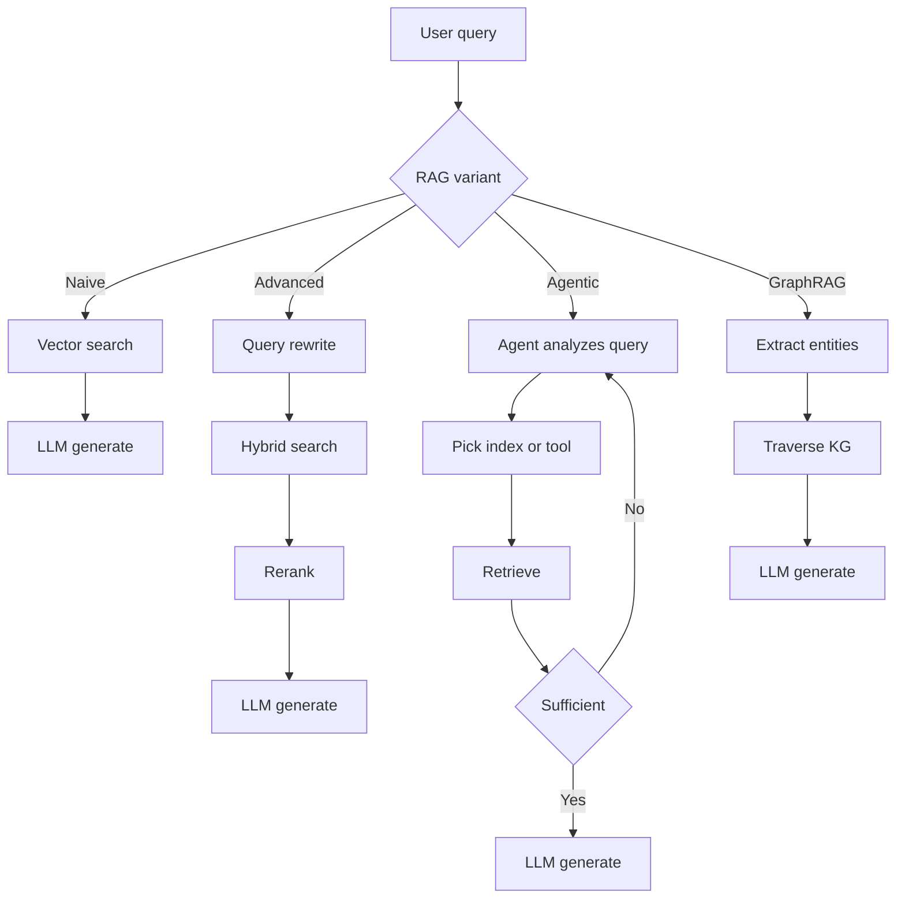
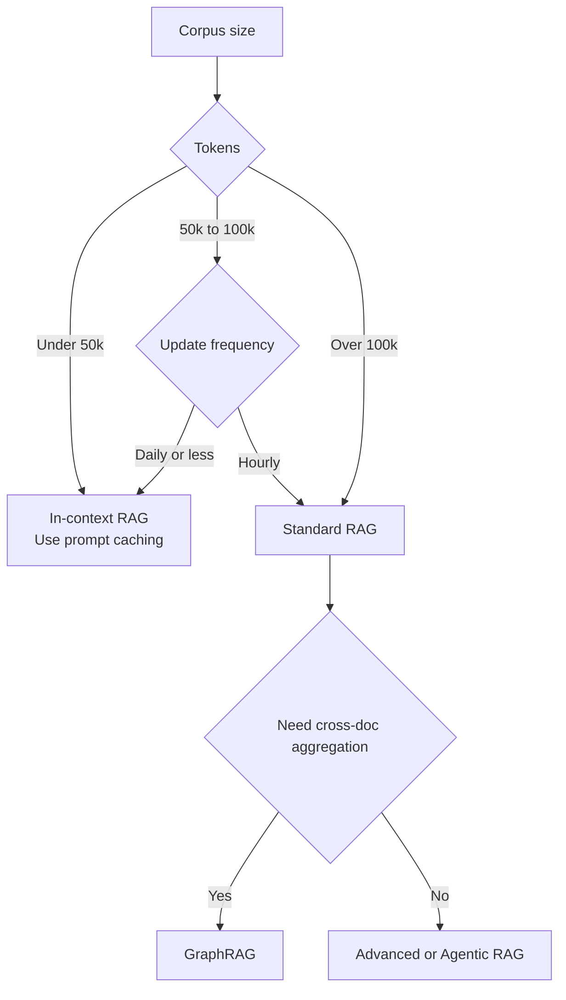

# RAG 基礎

RAG 如何從樸素的向量搜尋演進到 agentic 與 graph-based retrieval。何時該選擇 RAG 而非長上下文，以及導致正式環境失敗的三種 retrieval 落差。

Retrieval-Augmented Generation (RAG) 是一種架構模式：為 LLM 提供外部且可驗證的上下文，讓回應能建立在可查證的基礎上。它已從「單純向量搜尋」演進為多階段推理流程：hybrid retrieval、reranking、contextual chunking，以及 agentic loops，如今都是正式環境的基本配備。更深入的內容可參考[分塊策略](02-chunking-strategies.md)、[向量資料庫](04-vector-databases.md)、[重排序](06-reranking-strategies.md)、[情境式檢索](10-contextual-retrieval.md)、[ColBERT Late Interaction](11-late-interaction-colbert.md)，以及 [GraphRAG 的重新框架化](07-graph-rag.md)。

## 目錄

- [核心哲學：Grounding vs. Training](#philosophy)
- [RAG 分類法](#taxonomy)
- [RAG vs. 2M Context（混合時代）](#rag-vs-long-context)
- [檢索品質落差](#quality-gap)
- [面試題](#interview-questions)
- [參考資料](#references)

---

## 核心哲學：Grounding vs. Training

| 面向 | Fine-Tuning | RAG |
|--------|-------------|-----|
| **知識型態** | 內化（Weights） | 外部化（Context） |
| **更新週期** | 高成本（Retraining） | 零成本（更新 DB） |
| **可歸因性** | 無（Black box） | 明確（Citations） |
| **隱私** | 難以「Unlearn」 | 容易過濾／刪除 |

**經驗法則**：Fine-tuning 用於 **Form**（風格、語氣、語法）；RAG 用於 **Fact**（知識、資料、grounding）。

---

## RAG 分類法

正式環境中的 RAG 系統，通常依其「Agentic Depth」分類：

### 1. 樸素 RAG（Retrieve-then-Generate）
- **流程**：User Query -> Vector Search -> Top-K -> LLM。
- **狀態**：由於存在「Retrieval Gap」且精準度偏低，已不適合正式環境。

### 2. 進階 RAG（多階段）
- **流程**：Query Transformation -> Hybrid Search -> Reranking -> LLM。
- **關鍵細節**：使用 **RRF (Reciprocal Rank Fusion)** 結合 keyword 與 semantic 結果。

### 3. Agentic RAG（迴圈式）
- **流程**：Agent 分析查詢 -> 決定要搜尋哪些工具或索引 -> 評估結果 -> 若資訊不足則重新檢索。
- **技術**：Self-RAG、Corrective RAG (CRAG)。

### 4. GraphRAG（結構化上下文）
- **流程**：抽取實體／關係 -> 建立 Knowledge Graph -> 遍歷圖譜找出「相連的知識」。
- **優勢**：能處理「Aggregative Questions」（例如：「總結 50 份文件中的所有法律風險」）。

依 agentic 深度區分的四種變體：

---

## RAG vs. 2M Context（「混合時代」）

隨著 Gemini 1.5 Pro（2M+）與 Claude Sonnet 4.6（1M+）這類上下文視窗出現，RAG 也在改變。

- **In-Context RAG (ICR)**：對於小於 50k tokens 的資料集，我們會跳過 vector DB，把**所有內容**直接放進 prompt。
- **Prompt Caching**：透過快取「Background Knowledge」，讓 Long-Context RAG 便宜 90%。

**架構決策**：
- 若你的語料庫 **> 100k tokens** 且是動態的：使用 **Standard RAG**。
- 若你的語料庫 **< 100k tokens**：使用 **In-Context RAG**。

在 Standard RAG 與 In-Context RAG 之間做選擇的決策樹：

---

## 檢索品質落差

「Retrieval Gap」是 RAG 失敗的頭號原因。
- **Gap 1：Semantic Mismatch**：查詢寫的是「fast cars」，資料庫裡卻是「Porsche 911」。可用 **Embedding Rerankers** 解決。
- **Gap 2：Missing Context**：相關資訊其實在資料庫中，但 Retriever 沒抓到。可用 **Hybrid Search** 解決。
- **Gap 3：Lost-in-the-Middle**：資訊已經進到 prompt，但 LLM 仍忽略它。可用 **Context Compression** 解決。

---

## 面試題

### Q：如果 frontier models 已經提供 1M-2M token 的上下文，為什麼你還是會用 RAG？

**強回答：**
理由可分成三層：
1. **成本與延遲**：即使用了 prompt caching，每次新的使用者查詢都重新讀取 2M tokens，仍遠比只檢索 5 個相關 chunk（約 2k tokens）昂貴，且 TTFT（Time to First Token）也更高。
2. **新鮮度**：RAG 可以連接即時 API（股價、新聞），這些資訊無法靜態嵌入在上下文視窗中。
3. **規模**：企業資料集（SharePoint、TB 級日誌）甚至超過 2M tokens。RAG 是那個「過濾器」，能從資料中找出真正該進入高價值上下文視窗的 0.01%。

### Q：什麼是「Agentic RAG」？它和「Advanced RAG」有何不同？

**強回答：**
Advanced RAG 是一條**確定性的 pipeline**（線性：Rewrite -> Search -> Rerank）。Agentic RAG 則是**隨機性的 loop**。在 Agentic RAG 中，模型會被賦予工具，自行決定**如何**檢索。例如，若 agent 發現取回的文件不相關，它可以改決定去「Search Google」或「Query SQL database」。本質上，它在 retrieval 前後都加入「Reasoning step」，以確保上下文足以回答 prompt。

---

## 重點整理

- 樸素 RAG（vector search + top-K + LLM）已不適合正式環境；新的基準線是 Advanced RAG（hybrid + RRF + rerank）。
- 長上下文視窗不會讓 RAG 消失：成本、延遲、新鮮度與語料規模，仍會把你推回 retrieval，即使上下文已達 2M。
- 依語料規模選擇：小於 50k tokens 用 in-context + prompt caching；超過 100k 用 standard RAG；需要跨文件彙整的問題則用 GraphRAG。
- 多數 RAG 失敗其實是 retrieval 失敗，而非 generation 失敗；在調整 prompts 前，先診斷三種 gap（semantic、missing context、lost-in-the-middle）。
- Agentic RAG 與 Advanced RAG 的差別，在於 stochastic loop vs. deterministic pipeline；只有在查詢型態過於多樣、固定 pipeline 不夠用時，才採用 agentic。

---

## 參考資料
- Gao et al.「Retrieval-Augmented Generation for LLMs: A Survey」（2024 update）
- Microsoft.「From RAG to GraphRAG」（2024）
- Google.「Long-context LLMs as Retrievers」（2025）
- [Anthropic.「Introducing Contextual Retrieval」（Sep 2024）](https://www.anthropic.com/news/contextual-retrieval)

---

*下一篇：[分塊策略](02-chunking-strategies.md)*
