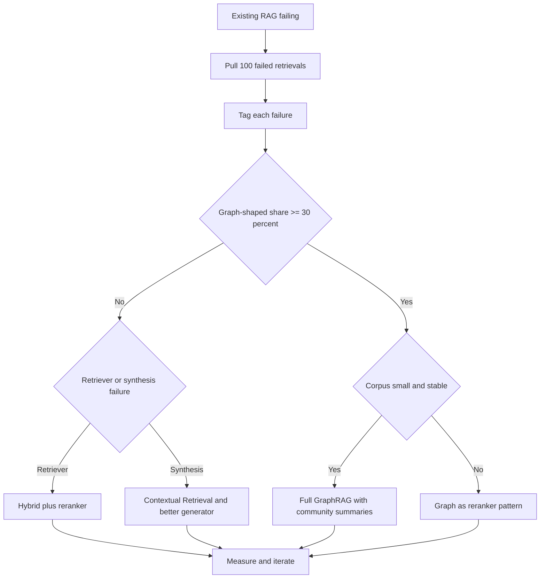
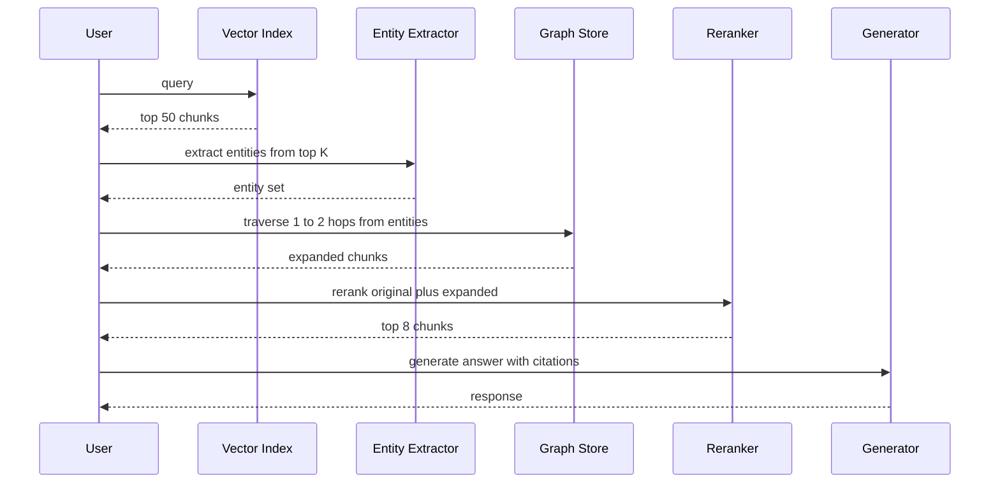

# GraphRAG

GraphRAG 是 **Knowledge Graphs（KG）** 與 **Retrieval-Augmented Generation** 的結合。Vector RAG 擅長「找出特定 chunk」，而 GraphRAG 則是為了在整個資料集上進行 **Global Reasoning** 而設計。

## 目錄

- [GraphRAG 真正勝出的時機（以及不適用的時機）](#when-graphrag-actually-wins-and-when-it-doesnt)
- [圖作為 Reranker 的模式（2026 年 5 月）](#graph-as-reranker-pattern-may-2026)
- [Vector RAG 的限制](#the-limitations-of-vector-rag)
- [GraphRAG 架構](#graphrag-architecture)
- [Community Summarization（Microsoft 模式）](#community-summarization)
- [實體－關係檢索](#entity-relationship-retrieval)
- [何時使用 GraphRAG](#when-to-use-graphrag)
- [面試題](#interview-questions)
- [參考資料](#references)

---

## GraphRAG 真正勝出的時機（以及不適用的時機）

GraphRAG 是專門處理圖結構問題的工具，不是 vector RAG 的預設升級。對大約 80% 的正式環境檢索工作負載來說，先用 BM25 加 dense retriever 的 hybrid 檢索，再接 cross-encoder reranker，通常更便宜、維運成本更低，而且答案品質也很有競爭力。只有當問題真的需要多跳 traversal，而 vector similarity 無法找回答案時，才值得建圖。

決策應該由資料驅動，而不是美學偏好。從你現有的 RAG 系統中抽出 100 個失敗檢索案例，將每個失敗標記到以下三個桶子之一，然後讓分布結果決定方向：

1. **詞彙或 chunking 失敗**：答案明明在語料中，但 retriever 沒找出來。這時應該修 retriever（更好的 embeddings、hybrid scoring、更大的 top-k、reranker，或 Contextual Retrieval）。
2. **綜合失敗**：retriever 已經找到了正確 chunks，但 generator 沒有把它們組合好。這時應該修 prompt、reranker 或模型。
3. **圖結構型失敗**：答案需要沿著跨文件的關係鏈前進，而這些文件之間沒有任何表面文字重疊。這才是 GraphRAG 的領域。

如果第三個桶子少於失敗案例的 30%，就不要建圖。建置與維護成本不會回本。如果達到或超過 30%，那麼 GraphRAG（或下文提到的 graph-as-reranker hybrid）就是下一個正確投資。

### GraphRAG 適用的工作負載

這些案例的共通點是：問題需要連接那些不會在同一個 chunk 中共現的實體，而且關係本身就帶有表意能力，是表層 embeddings 抓不到的。

- **藥物發現與生醫研究**：沿著基因、蛋白質、化合物與疾病之間的路徑追蹤。像 GraLC-RAG 這種以 UMLS 為基礎的變體，就是專為此領域調校。
- **金融詐欺集團**：跨越互不直呼彼此的帳戶、裝置、地點與交易文件，找出連結。
- **法律先例鏈**：沿著多層司法轄區追蹤案例引用，而每個案例通常只會引用它的直接上游。
- **企業組織圖與政策責任歸屬**：例如「region Y 中，誰能批准 policy X 的例外？」這類問題需要沿著匯報線與政策責任邊遍歷。
- **repo 規模的程式碼 intelligence**：call graphs、型別階層與依賴關係本質上就是圖；若只對程式碼 chunks 做 vector similarity，會失去真正讓答案可被找出的結構。

### 決策流程

### 維護尾端成本

GraphRAG 的隱藏成本不在抽取，而在維護。語料會漂移：新文件會進來、實體會改名、關係會重寫。1 月建立的圖，到 4 月時可能已經顯著失真。請預先規劃每季 refresh：對變更文件重新跑 extraction，並在 diff 範圍內重新對齊實體身分。若不一開始就編列這筆 LLM 成本與工程時間，就不要建圖。忽略這一步的團隊，最後往往會得到一張「很有信心、卻很錯」的圖，這比完全沒有圖還糟。

---

## 圖作為 Reranker 的模式（2026 年 5 月）

2026 年主流的正式環境模式其實不是完整的 GraphRAG，而是 graph-as-reranker。它能用完整 GraphRAG 一小部分的建置成本，拿到大部分 multi-hop 的效益。核心直覺是：你不需要整個語料庫的全域圖索引；你只需要一張能覆蓋 top-k vector 結果中出現實體的圖，並往外擴展到足以找到相連證據即可。

流程如下：

1. 先用你現有的 hybrid scoring，讓 vector 檢索使用者 query 的 top-50 chunks。
2. 用實體抽取器（小型 fine-tuned 模型或 structured-output 的 LLM call）從這 50 個 chunks 中抽出 named entities。
3. 從這些實體出發，在圖中做一到兩跳 traversal，找回相連實體與它們出現的 chunks。
4. 把擴展後的候選集合（原本的 50 個加上圖擴展 chunks）交給 cross-encoder reranker。
5. 將 rerank 後的 top-k chunks 送給 generator。

你建的只是 query 實際碰到的那一小片圖，而且是惰性建立，不是全域索引。建置成本會降一個數量級。維護尾端成本也更低，因為不需要重新索引完全沒被碰觸的區域。實務上，團隊常回報：大約用完整 GraphRAG 20% 的前期成本，就能拿到 70-80% 的品質提升。

### 模式流程

### 近期變體（2024 到 2026）

以下是值得認識的幾種變體：

- **HippoRAG 與 HippoRAG 2**（Princeton，2024 與 2025）：把檢索視為記憶圖上的 Personalized PageRank 問題，在 multi-hop benchmark 上表現強勁，索引成本也低於 Microsoft GraphRAG。
- **LightRAG**（HKU，2024）：以實體為中心的檢索，索引流程更簡單；它在全域型問題上犧牲部分召回，但換來更快的建置與更新速度。
- **GraLC-RAG**（2026 年 3 月）：把 graph-aware late chunking 與 UMLS grounding 結合，用於生醫場景；在 multi-hop biomedical QA 上有很強的已發表成果。
- **Microsoft GraphRAG indexing pipeline v2**（2025）：原始的 community-summarization 方法，重新設計為支援增量更新且抽取成本顯著更低；如果你真的需要 global summarization，而不是局部 multi-hop，這會是首選。

這四條路線的共同方向很一致：更少的單體式索引、更增量與惰性的圖建構，以及更清楚區分「全域摘要」工作負載（Microsoft 式 communities 仍較強）與「局部 multi-hop」工作負載（HippoRAG 式 traversal 更便宜也很有競爭力）。

**來源：**
- [Microsoft GraphRAG](https://microsoft.github.io/graphrag)
- [HippoRAG: Neurobiologically Inspired Long-Term Memory](https://arxiv.org/abs/2405.14831)
- [Edge et al., From Local to Global: A GraphRAG Approach](https://arxiv.org/abs/2404.16130)
- [Graph-aware late chunking (arXiv 2603.22633)](https://arxiv.org/html/2603.22633v1)
- [Anthropic Contextual Retrieval (Sep 2024)](https://www.anthropic.com/news/contextual-retrieval)

---

## Vector RAG 的限制

Vector RAG 是在空間中的「點」上運作。這會讓它在以下問題上失效：
- *「所有 500 份員工評價的主要主題是什麼？」*
- *「告訴我 Project Alpha 與 Q3 預算刪減之間所有的連結。」*

**問題點**：Vector search 只能找「相似文字」，但不理解「彼此相連的實體」。

---

## GraphRAG 架構

現代 GraphRAG pipeline 由三個階段組成：

1. **Extraction（VLB）**：LLM 掃描文本並抽出 **Entities**（人、專案、日期）與 **Relationships**（例如「Person A *works on* Project B」）。
2. **圖建構**：把實體作為節點、關係作為邊，存入 Graph Database（Neo4j、Memgraph）。
3. **查詢**：
   - **Local Search**：找到某個節點及其鄰居。
   - **Global Search**：利用 **Community Summaries** 回答高階問題。

---

## Community Summarization

此技術由 Microsoft 推廣，做法包括：
1. 以圖演算法（例如 Leiden）識別相關節點的群集（Communities）。
2. 為 *每個* community 產生自然語言摘要。
3. 在查詢時，搜尋的是這些 **summaries**，而不是原始 chunks。

**優勢**：讓模型不需要讀 100 萬 tokens，也能回答「整體大局」類問題。

---

## 實體－關係檢索

正式環境堆疊通常會使用 **Hybrid Graph-Vector Search**。
- **Dense Pass**：透過 embeddings 找到最相似的節點。
- **Graph Pass**：沿著這些節點的邊走，找出那些語意上不一定和 query 相似、但在邏輯上相關的支援資訊。

---

## 何時使用 GraphRAG

| 特性 | Vector RAG | GraphRAG |
|---------|------------|----------|
| **資料型態** | 非結構化文字 | 高度連結的資料 |
| **查詢型態**| 「找出 X」 | 「解釋 X 與 Y 的關係」 |
| **規模** | Petabytes | 數百萬個實體 |
| **成本** | 低 | 高（Extraction 很昂貴） |

**2025 建議**：對於 **Internal Knowledge Bases**（Wiki、Codebase、法律資料庫）這類文件之間連結與內容同樣重要的場景，使用 GraphRAG 很有價值。

---

## 面試題

### Q：為什麼「Extraction」階段會是 GraphRAG 的瓶頸？

**強答：**
Knowledge Graph 抽取極度耗 token。要建出高品質的圖，你必須用「Frontier」模型處理每一份文件，才不會漏掉細微的實體連結。對一份 10,000 頁的資料集來說，光是 LLM API 呼叫就可能花掉數千美元。標準緩解方式是：第一輪用 **SLM-based Extraction**（Small Language Models），只有在重疊實體之間需要「衝突解決」時，才使用大型模型。Microsoft 的 LazyGraphRAG 也透過把 community-summarization 延後到 query time，進一步延遲成本發生。

### Q：GraphRAG 如何解決聚合型問題中的「Context Window」限制？

**強答：**
對聚合型問題（例如「總結 1,000 份文件的情緒」）來說，標準 RAG 系統得把 1,000 個 chunks 全塞進 context window，這不是做不到，就是成本高得無法接受。GraphRAG 透過 **Pre-Summarization** 解決：它會階層式地總結圖中的資訊群集（Communities）。當使用者提出全域性問題時，系統只需檢索高階 community summaries，這些摘要既精簡又資訊密集，讓模型能透過壓縮後的視角「看見」整個資料集。

---

## 參考資料
- Edge et al. "From Local to Global: A GraphRAG Approach" (Microsoft Research, 2024)
- Neo4j. "Generative AI and Graph Databases" (2025)
- WhyHow AI. "Deterministic RAG with Knowledge Graphs" (2024)

---

*下一節：[Agentic RAG](08-agentic-rag.md)*

