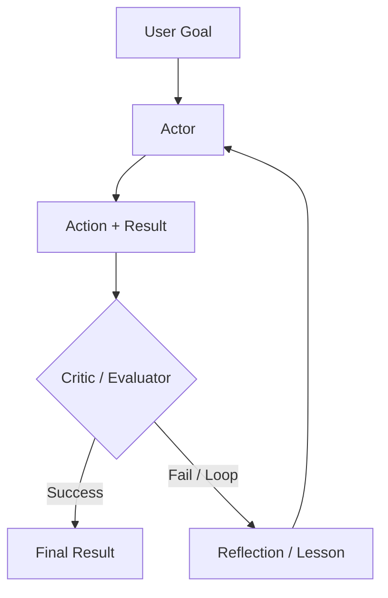

# 推理迴圈：ReAct 及其後續演進

推理迴圈定義了 agent 的控制流程。雖然 **ReAct** 是 2023 年的基準，但目前的系統已採用更進階的模式，例如 **Plan-and-Solve**、**Self-Reflexion** 與執行於 reasoning-native 模型之上的 **Inference-Time Scaling**。

## 目錄

- [迴圈的演進](#evolution)
- [ReAct：經典模式](#react)
- [Self-Reflexion 迴圈](#reflexion)
- [Plan-and-Solve（Soto）](#plan-and-solve)
- [Flow Engineering（LangGraph 模式）](#flow-engineering)
- [面試問題](#interview-questions)
- [參考資料](#references)

---

## 迴圈的演進

| 時代 | 模式 | 核心哲學 |
|-----|------|----------|
| **2023** | ReAct | 交錯進行思考與行動。 |
| **2024** | Reflexion | 評估錯誤並重試。 |
| **現在** | System 2 Loops | 使用隱藏 CoT 來完成穩健的多步推理。 |

---

## ReAct：Reasoning + Acting

90% 代理都會用到的基礎迴圈：
1. **Thought**：「我需要找到 X。」
2. **Action**：`search_engine("X")`
3. **Observation**：「X 在 Y。」
4. **Repeat**。

**批判**：ReAct 很脆弱。如果搜尋回傳「No results」，天真的 ReAct agent 往往會再做一次同樣的搜尋。現代迴圈會注入 **「Negative Constraints」**（例如「不要再試我們已經看過的搜尋結果」）。

---

## Self-Reflexion 迴圈

Reflexion 會在迴圈中加入一個 **「Critic」** 步驟。

**優點**：把這些「Reflections」存進短期記憶後，agent 就能在當前 session 中建立一張「哪些方法行不通」的心理地圖。

---

## Plan-and-Solve

agent 不再一步一步地貪婪決策，而是先建立 **Static Plan**，再開始執行。

1. **Planner**：「我會先做 A，再做 B，最後做 C。」
2. **Executor**：執行這些步驟。
3. **Re-planner**：若步驟 B 失敗，觸發完整重規劃，而不是只做局部修補。

**為什麼？**：規劃能降低「Stochastic Errors」。先承諾一條路徑後，模型比較不會被嘈雜的工具結果帶偏。

---

## Flow Engineering（LangGraph）

現代代理系統已從「Chat interfaces」轉向 **「State Machines」**。

- **Cyclic Graphs**：我們不再只定義線性序列，而是定義一張圖，讓模型可以多次回到「Cleaning」節點或「Validation」節點。
- **Micro-Agents**：圖中的每個節點都是專門化的「Prompt」或「Tool」。

**關鍵細節**：如今的「Agent」不再只是 LLM；agent 本身其實是 **Graph Execution Engine**。

---

## 面試問題

### Q：你會在什麼情況下使用「Reasoning Loop」（ReAct），又會在什麼情況下使用「Plan-and-Solve」架構？

**強答案：**
對於環境不可預測的 **Exploratory** 任務（例如瀏覽一個全新網站，還不知道 URL 結構），我會選 **ReAct**。agent 需要對每個 observation 即時反應。對於可預測但複雜的 workflow（例如從 5 個已知 API 產生財務報表），我會選 **Plan-and-Solve**。規劃能避免模型「漫無目的地遊走」，也有助於把彼此無依賴的步驟更好地平行化。

### Q：什麼是「Inference-Time Scaling」，它與 Agentic Loops 有什麼關係？

**強答案：**
Inference-Time Scaling（常與 OpenAI 的 o1 關聯）指的是把更多算力花在*回應生成期間*，而不只是在訓練階段。放在 agentic 的脈絡中，這代表模型不會只輸出第一個看起來合理的動作。它會先用 **Search Tree**（例如 Monte Carlo Tree Search）在內部模擬不同的行動路徑，再承諾最可能成功的一條。這能減少所需的「真實世界」工具呼叫次數，節省外部 API 成本並降低失敗率。

---

## 參考資料
- Yao et al.《ReAct: Synergizing Reasoning and Acting》（2022/2025 更新）
- Shinn et al.《Reflexion: Language Agents with Iterative Homeostatic Learning》（2024）
- Wang et al.《Plan-and-Solve Prompting》（2023）

---

*下一章：[Tool Use and the Model Context Protocol (MCP)](03-tool-use-and-mcp.md)*
