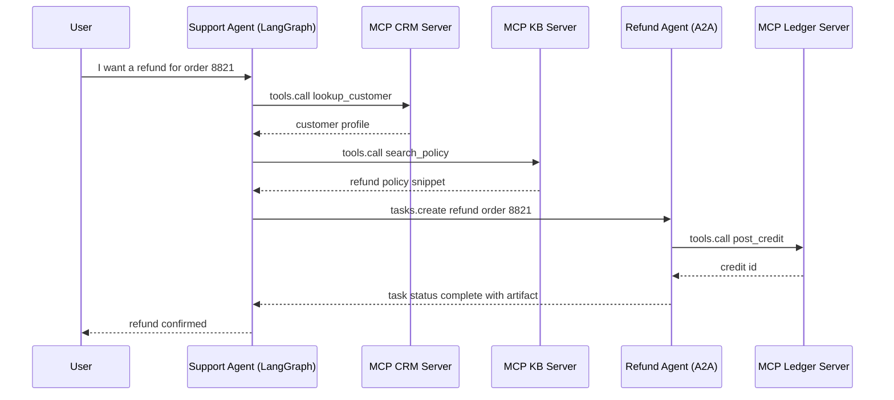
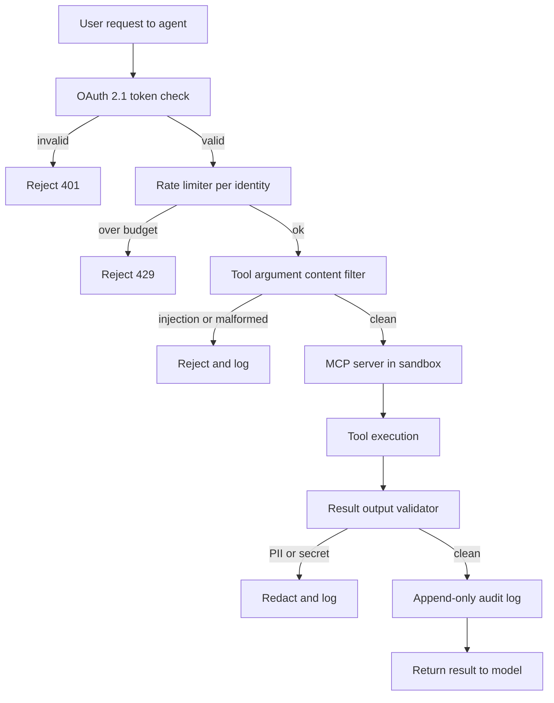

<a id="tool-use-and-mcp"></a>
# 工具使用與 MCP

工具就是 agent 的「雙手」。業界已經標準化到 **Model Context Protocol (MCP)**，用統一、local-first 的通訊層取代零碎的客製工具定義。MCP 在 2025-2026 年間有重大更新，包括 Streamable HTTP transport 與原生 computer-use 工具。與此同時，**Agent-to-Agent (A2A)** 與其他互通協定也開始出現，補足 MCP 的工具存取層，提供代理協調能力。

<a id="table-of-contents"></a>
## 目錄

- [工具使用機制](#mechanism)
- [Model Context Protocol (MCP)](#mcp)
- [MCP 2.0：Streamable HTTP 與 Auth](#mcp-updates)
- [MCP 路線圖與生態系](#mcp-roadmap)
- [Agent-to-Agent Protocol (A2A)](#a2a)
- [協定版圖：MCP + A2A + ACP](#protocol-landscape)
- [Computer-Use Tools（Anthropic）](#computer-use)
- [高精度工具的定義方式](#precision)
- [MCP vs. OpenAI Function Calling](#mcp-vs-openai)
- [Context7：即時文件 MCP](#context7)
- [串流式工具呼叫](#streaming)
- [面試問題](#interview-questions)
- [參考資料](#references)

---

<a id="mechanism"></a>
<a id="the-tool-use-mechanism"></a>
## 工具使用機制

工具使用會以 3 個步驟循環進行：
1. **Schema Presentation**：把工具的 JSON schema 提供給模型。
2. **Intent & Extraction**：模型輸出一個「Call」（例如 `{"tool": "get_weather", "args": {"city": "Tokyo"}}`）。
3. **Execution & Contextualization**：系統執行函式，並把結果餵回 prompt。

**細節補充**：生產環境的技術堆疊不再把工具定義「硬編碼」進 system prompt。它們會使用 **Dynamic Manifests**，依據使用者意圖只抓取必要的工具。

---

<a id="mcp"></a>
<a id="model-context-protocol-mcp"></a>
## Model Context Protocol (MCP)

MCP 由 Anthropic 開發（於 2024 年 11 月釋出），現在已是 Anthropic、OpenAI、Google、Microsoft 與 AWS 之間通用的工具整合標準，讓模型不論資料與工具位在哪裡都能互動。其治理在 2025 年 12 月移交給 Linux Foundation 的 Agentic AI Foundation。

- **MCP Client**：AI 應用程式（例如你的 agent 程式碼）。
- **MCP Server**：暴露 Tools（Functions）、Resources（Data）與 Prompts（Templates）的獨立程序。
- **Communication**：以 stdio 或 HTTP 上的 JSON-RPC 溝通。

<a id="why-mcp"></a>
### 為什麼是 MCP？
- **Security**：工具在自己的程序中執行，而不是在模型邏輯裡。
- **Portability**：只要寫一次「Postgres Tool」，就能在 Claude、GPT 或 Llama 中使用。
- **Discoverability**：標準化的 `list_tools` 與 `get_resource` 指令。

---

<a id="precision"></a>
<a id="defining-high-precision-tools"></a>
## 高精度工具的定義方式

一個生產級工具必須包含：

1. **Strict Type Validation**：在模型看到呼叫之前，就先用 Pydantic 或 Zod 強制驗證 schema。
2. **Detailed Docstrings**：說明*什麼情況不要*使用這個工具。
3. **Confidence Thresholds**：要求模型在工具呼叫時輸出 `confidence` 分數。

```python
# MCP Server Example (Conceptual)
@server.tool()
class ExecuteSQL(PydanticModel):
    """Executes a Read-Only SQL query. DO NOT use for DROP/DELETE."""
    query: str = Field(..., description="The SELECT query to run.")

    async def run(self):
        # Implementation here...
        pass
```

---

<a id="mcp-vs-openai"></a>
<a id="mcp-vs-openai-function-calling"></a>
## MCP vs. OpenAI Function Calling

| 功能 | OpenAI 原生 | MCP |
|------|-------------|-----|
| **Coupling** | 高（OpenAI 專屬） | 低（Agnostic） |
| **Transport** | API body 中的 JSON | JSON-RPC（Local/Remote） |
| **Data Access**| 沒有原生資料 `Resource` | 原生支援 `Resources` |
| **Best For** | 原型開發 | 企業級協作 |

---

<a id="streaming"></a>
<a id="streaming-tool-calls"></a>
## 串流式工具呼叫

前沿模型支援 **Partial Tool Speculation**。
系統不必等完整 JSON 生成完畢，只要串流中已看見工具名稱與關鍵 ID，就能開始「prefetching」工具結果。這可將體感延遲降低 **400-800ms**。

---

<a id="mcp-updates"></a>
<a id="mcp-20-streamable-http--auth"></a>
## MCP 2.0：Streamable HTTP 與 Auth

MCP 2.0 規格（於 2026 年 3 月批准）帶來兩項重大變更：

<a id="1-streamable-http-transport"></a>
### 1. Streamable HTTP Transport
先前的 MCP 使用 `stdio` 或搭配 SSE 的基本 HTTP。MCP 2.0 新增 **Streamable HTTP**——單一、長連線的 HTTP 連線可處理雙向串流：

```
[MCP Client] ←── Streamable HTTP POST /mcp ──→ [MCP Server]
                  (with SSE response stream)
```

- 讓 MCP servers 可部署成雲端 microservices（不再只是本機程序）
- 允許在單一連線上同時進行多個工具呼叫
- 與 stdio transport 向後相容

<a id="2-oauth-21-authorization"></a>
### 2. OAuth 2.1 Authorization
遠端 MCP servers 現在可以要求正式的授權：

```json
{
  "type": "oauth2",
  "grant_type": "client_credentials",
  "scopes": ["tools:read", "resources:documents"]
}
```

這讓企業級 MCP servers 能為每個 tenant 啟用細粒度的存取控制。

---

<a id="mcp-roadmap"></a>
<a id="mcp-roadmap--ecosystem"></a>
## MCP 路線圖與生態系

截至 2026 年 5 月，已有超過 2,300 個公開 MCP servers，且主要 AI 工具（Claude、Cursor、Windsurf）都已原生支援。MCP 也已從開發者工具跨入消費型硬體（例如 Elgato Stream Deck 7.4 在 2026 年 3 月隨附 MCP 支援）。Microsoft 也採用 MCP 作為 Windows AI Foundry 與 Microsoft 365 Copilot 的主要整合標準。

MCP 路線圖聚焦於四大支柱：

1. **Transport Scalability**：持續演進 Streamable HTTP，讓它能在水平擴充的多個 server instance 間以無狀態方式運作，並在 load balancer 與 proxy 後方維持正確行為。**MCP Server Cards** 提供 `.well-known` URL，用於探索結構化 server metadata。
2. **Agent Communication**：在 MCP 既有的工具層之上支援 agent-to-agent 模式。
3. **Enterprise Authentication (Q2 2026)**：針對瀏覽器型 agents 提供帶有 PKCE 的 OAuth 2.1，並整合企業身分提供者的 SAML/OIDC，解鎖受監管產業的部署。
4. **MCP Registry (Q4 2026)**：建立經過策展與驗證的 server 目錄，提供安全稽核、使用統計與 SLA 承諾。

**Governance**：MCP Governance Working Group 引入了 Contributor Ladder 與 delegation model，讓特定領域的 working groups 能在不經完整 core-maintainer review 的情況下接受 SEP（Specification Enhancement Proposals）。

> *已於 2026 年 5 月驗證。來源：modelcontextprotocol.io/development/roadmap*

---

<a id="a2a"></a>
<a id="agent-to-agent-protocol-a2a"></a>
## Agent-to-Agent Protocol (A2A)

Google 在 2025 年 4 月推出 **Agent2Agent (A2A)** 協定，目的是解決 MCP 沒有處理的問題：**來自不同廠商的 agents** 該如何彼此溝通（而不只是和工具互動）？

<a id="what-a2a-solves"></a>
### A2A 解決了什麼

MCP 定義 agent 如何連接 **tools 與 data**。A2A 則定義 **協調代理如何把任務委派給來自不同廠商或 framework 的專家代理**，即使它們不共享記憶、工具或上下文也沒問題。

<a id="technical-foundation"></a>
### 技術基礎

- 建構於 **HTTP、SSE 與 JSON-RPC** 之上（與 MCP 共用基礎，便於整合）
- 支援與 OpenAPI auth schemes 同級的企業級驗證
- **Agent Cards**：描述 agent 能力、skills 與 endpoint 的 JSON metadata 文件——可視為代理版本的 MCP Server Cards

<a id="a2a-task-lifecycle"></a>
### A2A 任務生命週期

```
[Client Agent] ── POST /tasks ──→ [Remote Agent]
                                     │
                  ← SSE stream ──────┘  (status updates, artifacts)
                                     │
                  ← Task Complete ───┘  (final result)
```

A2A 任務支援帶有串流狀態更新的長時間操作，因此很適合跨越數分鐘或數小時的企業工作流程。

<a id="industry-adoption"></a>
### 業界採用情況

- 獲得 50+ 技術夥伴支持，包括 Atlassian、Salesforce、SAP、LangChain 與 PayPal
- 於 2025 年 6 月捐贈給 **Linux Foundation**，成為開放治理專案
- **Version 0.3**（截至 2026 年 5 月的最新版本）新增 gRPC 支援、簽章 security cards，以及更完整的 Python SDK 支援
- NIST 於 2026 年 2 月啟動「AI Agent Standards Initiative」，部分原因正是回應 A2A/MCP 的發展動能

> *已於 2026 年 5 月驗證。來源：developers.googleblog.com, a2a-protocol.org*

---

<a id="protocol-landscape"></a>
<a id="the-protocol-landscape-mcp--a2a--acp"></a>
## 協定版圖：MCP + A2A + ACP

在生產級企業系統中，多種協定會同時在不同層運作：

| 協定 | 層級 | 目的 | 治理單位 |
|------|------|------|----------|
| **MCP** | Agent-to-Tool | 通用工具與資料存取 | Anthropic（開放規格） |
| **A2A** | Agent-to-Agent | 跨廠商 agent 委派 | Linux Foundation |
| **ACP** | Agent Communication | 輕量非同步 agent 訊息傳遞（REST） | IBM / Linux Foundation |

<a id="how-they-complement-each-other"></a>
### 它們如何互補

```
┌──────────────────────────────────────────┐
│            Enterprise System             │
│                                          │
│  ┌─────────┐  A2A   ┌─────────┐         │
│  │ Agent A  │◄──────►│ Agent B │         │
│  │(Vendor X)│        │(Vendor Y)│        │
│  └────┬─────┘        └────┬─────┘        │
│       │ MCP                │ MCP          │
│  ┌────▼─────┐        ┌────▼─────┐        │
│  │ DB Tool  │        │ API Tool │        │
│  │ Server   │        │ Server   │        │
│  └──────────┘        └──────────┘        │
└──────────────────────────────────────────┘
```

**關鍵洞見**：MCP 與 A2A 是互補關係，不是競爭關係。MCP 負責 agent-to-tool 連線；A2A 負責 agent-to-agent 協調。生產系統會同時使用兩者。

**ACP 補充**：起源於 IBM 的 Agent Communication Protocol (ACP) 團隊，已於 2025 年 9 月與 Google A2A 團隊合併投入統一 agent communication 標準。新專案應以 A2A 作為主要 agent-to-agent 協定。

---

<a id="a2a-v10-ga-and-the-may-2026-mcp-production-story"></a>
## A2A v1.0 GA 與 2026 年 5 月的 MCP 生產實戰

A2A v1.0 在 Google Cloud Next 2026（4 月）達到 general availability，並獲得 150+ 組織的公開承諾，包括 AWS、Microsoft、Salesforce、SAP、ServiceNow、Workday 與 IBM。此專案已移至 Linux Foundation 的 Agentic AI Foundation 之下，現在與合併後的 ACP 工作一同由其治理。後續點版本（v1.2）加入了加密簽章的 Agent Cards：卡片是與 agent operator 公鑰綁定的 JWS 文件，因此 client agent 可以驗證位於 `https://refunds.acme.com/.well-known/agent.json` 的遠端 agent 是否真的屬於 ACME，再決定是否派發任務。Google ADK 1.0、LangGraph、CrewAI、LlamaIndex、Semantic Kernel 與 AutoGen 都已提供原生 A2A client/server 支援。

<a id="composition-pattern-support-agent-delegating-refunds"></a>
### 組合模式：客服代理委派退款

一個 LangGraph 客服代理擁有對話狀態，以及一組 MCP 工具（CRM、ticket search、knowledge base）。當使用者要求退款時，該工作屬於另一個團隊的財務退款代理，後者位於 A2A endpoint 後方，並自行執行 policy、audit log 與 SOX 控制。客服代理不會直接呼叫退款資料庫；它會送出 A2A task，讓財務代理自行判斷。



客服代理永遠不會看到 ledger。退款代理透過自己的 MCP server 掌管 ledger 存取，並執行不同的 policy。A2A task 是非同步的：在退款處理期間，客服代理可以先向使用者回覆等待訊息，等 artifact 抵達後再接續處理。

<a id="mcp-2026-roadmap-highlights"></a>
### MCP 2026 路線圖重點

MCP 在 2026 年剩餘時間的路線圖聚焦兩個方向。**Transport scalability** 針對多實例與負載平衡部署：Streamable HTTP 將加入 session resumption 與 sticky-session hints，使 MCP server 能以水平擴充的 Kubernetes Deployment 形式運行，而不會破壞長時間工具 session。**Enterprise-managed auth** 則正式化 OAuth Resource Server 姿態：MCP servers 現在被歸類為 RFC 8707 定義下的 Resource Servers，代表 token 會綁定特定 server URI 作為 audience，無法在不同 servers 間被重放。

<a id="mcp-production-hardening-post-may-2026"></a>
### MCP 生產環境強化（2026 年 5 月後）

2026 年 5 月暴露出 MCP STDIO transport 的一類弱點：STDIO MCP servers 過去隱含地假設程序邊界就是信任邊界，但來自上游模型的惡意工具參數，可能誘使寫得不夠安全的 STDIO server 以宿主使用者權限執行主機命令。架構上的修補分成兩步：

1. **盡可能把 STDIO MCP servers 遷移到具備 TLS 的 HTTP transport。** HTTP transport 會強制建立明確的信任邊界（網路），也能啟用 OAuth 2.1 Resource Server 強制執行，而這些是 STDIO 做不到的。
2. **對無法遷移的 STDIO servers**，讓每個 server 都執行在獨立容器中：不要掛載 host filesystem、不要有 network egress、設定嚴格的 CPU 與 memory 預算，並使用唯讀映像。把容器當作信任邊界；一旦受損，爆炸半徑就只限於容器內。

**生產級 MCP 的 Defense-in-Depth 檢查清單：**

- 所有遠端 MCP servers 都在 OAuth 2.1、PKCE 與 audience-bound tokens（RFC 8707）後面運作。
- STDIO servers 執行於容器內，設定 `network: none`、唯讀 root filesystem、無 host volume mounts，以及 `nproc` 與 `memory` 上限。
- 每次工具呼叫都要記錄使用者身分、綁定 token audience、工具名稱、參數雜湊與結果雜湊，並把日誌送往 append-only store。
- 每個 MCP server 前方都要有 rate limiter，並以使用者身分為 scope。對可寫入工具的 burst budget 要特別緊。
- 工具參數在到達 server 前，必須先通過內容過濾器：對字串欄位做模式式 prompt-injection 偵測、對結構化欄位做 schema 驗證、對不需要 shell metacharacters 的工具則直接硬性拒絕。
- 工具結果回餵給模型前，必須先通過輸出驗證器：PII 偵測、secret 偵測、大小上限，以及已知資料外洩標記的內容過濾。
- 危險工具（檔案寫入、shell 執行、對外 HTTP）必須要求人工批准步驟或簽章 capability token，而不是只依賴模型安全呼叫它們。

具備所有防護層的請求流程：



這條管線刻意採取保守設計。每一層都可以拒絕；只有通過全部五道關卡的結果，才會送回模型。

**本節來源：**
- [Google Cloud A2A v1.0 GA at Cloud Next 2026](https://cloud.google.com/blog/products/ai-machine-learning/agent2agent-protocol-is-getting-an-upgrade)
- [MCP 2026 Roadmap (The New Stack)](https://thenewstack.io/model-context-protocol-roadmap-2026/)
- [RFC 8707: Resource Indicators for OAuth 2.0](https://www.rfc-editor.org/rfc/rfc8707)
- [Adversa AI: Top MCP Security Resources May 2026](https://adversa.ai/blog/top-mcp-security-resources-may-2026/)
- [Anthropic Constitutional Classifiers](https://www.anthropic.com/research/constitutional-classifiers)

---

<a id="computer-use"></a>
<a id="computer-use-tools-anthropic"></a>
## Computer-Use Tools（Anthropic）

Claude 3.5+ 引入了原生 **computer-use** 工具——模型可以直接控制桌面或網頁瀏覽器。這些工具可透過 Anthropic API 使用：

| 工具 | 能力 | 備註 |
|------|------|------|
| `bash` | 執行 shell 指令 | 跨回合持久 session |
| `text_editor` | 讀取/寫入/編輯檔案 | 支援 view、create、str_replace 指令 |
| `computer` | 滑鼠、鍵盤、截圖 | 完整桌面 GUI 控制 |

```python
import anthropic

client = anthropic.Anthropic()

response = client.beta.messages.create(
    model="claude-3-7-sonnet-20250219",
    max_tokens=4096,
    tools=[
        {"type": "bash_20250124", "name": "bash"},
        {"type": "text_editor_20250124", "name": "str_replace_based_edit_tool"},
        {"type": "computer_20251022", "name": "computer",
         "display_width_px": 1280, "display_height_px": 800}
    ],
    messages=[{"role": "user", "content": "Open Firefox, go to GitHub, and clone my repo."}],
    betas=["computer-use-2024-10-22", "interleaved-thinking-2025-05-14"]
)
```

**computer-use 的生產安全規則：**
1. 一律在 sandboxed VM 中執行（Docker + VNC，或 E2B cloud）
2. 進行破壞性動作前，先用 screenshot 驗證關鍵狀態
3. 對不可逆動作（刪檔、送出表單）使用 HITL（Human-in-the-Loop）
4. 設定 `ANTHROPIC_MAX_COMPUTER_TOKENS` 以限制失控迴圈

---

<a id="context7"></a>
<a id="context7-live-documentation-mcp"></a>
## Context7：即時文件 MCP

2026 年最實用的 MCP servers 之一就是 **Context7**——它解決了 coding agents 的「訓練資料過時」問題：

```
# Without Context7:
Agent: "I'll use langchain's `create_openai_tools_agent` function..."
(This function was deprecated 6 months ago)

# With Context7 MCP:
Agent → MCP: list_resources("langchain")
MCP → Agent: Returns current v0.3.x docs
Agent: "I'll use the new `create_react_agent` interface..."
```

**在 Claude Desktop / Claude Code 中的設定：**
```json
{
  "mcpServers": {
    "context7": {
      "command": "npx",
      "args": ["-y", "@upstash/context7-mcp"]
    }
  }
}
```

Claude 會在撰寫使用該函式庫的程式碼前，自動呼叫 `resolve-library-id` 與 `get-library-docs`。

---

<a id="interview-questions"></a>
## 面試問題

<a id="q-how-does-mcp-solve-the-too-many-tools-problem-schema-overload"></a>
### Q：MCP 如何解決「工具太多」（Schema Overload）問題？

**強答案：**
在 2023 年，如果給模型 50 個工具，表現通常會下降，因為 prompt 變得太長。MCP 透過 **Dynamic Resource Discovery** 解決這件事。agent 不再把 50 個工具 schema 全部載入 prompt，而是先向 MCP server 發送 `list_resources` 呼叫，接著只「附加」與當前 `Resource` 上下文相關的工具。這讓 prompt 維持精簡，也讓 context window 專注在推理，而不是解析沒用到的 schema。

<a id="q-why-is-it-important-to-separate-tool-logic-from-the-agent-app-using-mcp-servers"></a>
### Q：為什麼使用 MCP servers 將「Tool Logic」與「Agent App」分離很重要？

**強答案：**
這是 separation of concerns。如果工具邏輯（例如 Python scraper）位在獨立的 MCP server 中，我就能把 scraping infrastructure 與 LLM orchestrator 分開擴展。更重要的是，這也提供了 **Security Sandbox**。如果模型試圖透過工具參數進行 injection，它只會影響 MCP server 程序；而該程序可以被容器化，並且完全不允許存取核心 Agent 狀態所需的網路。

<a id="q-how-do-mcp-and-a2a-work-together-in-a-production-multi-agent-system"></a>
### Q：MCP 與 A2A 在生產級多代理系統中如何協同運作？

**強答案：**
它們處理的是**不同的通訊層**。MCP 是 agent-to-tool 協定——它透過 MCP servers，為任何 agent 提供對資料庫、API 與檔案的標準化存取。A2A 是 agent-to-agent 協定——它讓協調代理（Vendor X）能把任務委派給專家代理（Vendor Y），而不用共享記憶或上下文。在生產環境中，我會對所有工具連線使用 MCP；當我需要跨廠商的代理協作時，再使用 A2A。舉例來說，一個建構於 LangGraph 之上的採購協調代理會先用 MCP 查詢庫存資料庫，再用 A2A 把合規檢查委派給另一個團隊所託管的專業代理。核心設計原則是：agent 自身工具堆疊內用 MCP，跨組織或跨廠商邊界則用 A2A。

---

<a id="references"></a>
## 參考資料
- Anthropic.《The Model Context Protocol Specification》（2025）
- Google.《Agent2Agent Protocol Specification v0.3》（2026）
- Linux Foundation.《Agent2Agent Protocol Project》（2025）
- NIST.《AI Agent Standards Initiative》（2026 年 2 月）
- JSON-RPC 2.0 Specification.
- Pydantic v3.0 Documentation.

---

*下一章：[Multi-Agent Orchestration](04-multi-agent-orchestration.md)*
