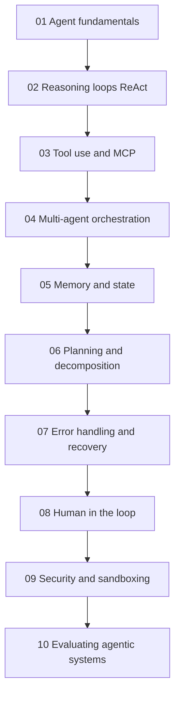
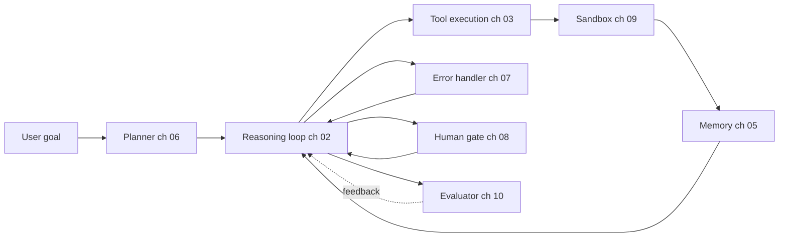

# 代理式系統

建構 2026 年的生產級 AI 代理：推理迴圈、MCP 工具使用、多代理協作、記憶、規劃、錯誤復原、human-in-the-loop，以及評估。

代理不是單一技術，而是由推理迴圈、工具層、記憶、規劃器、錯誤處理器與評估器所組成。此資料夾中的 10 個章節會依序深入介紹每一層，前面的章節也會建立後續章節使用的術語。

## 章節順序

## 參考架構

每一章的概念都會對應到已部署代理的一個元件。下圖展示各章內容在生產系統中的位置：

## 本資料夾中的檔案

| 檔案 | 內容重點 |
|------|----------|
| [01-agent-fundamentals.md](01-agent-fundamentals.md) | 什麼樣的系統才算是「agent」；agent 與 workflow 的差異；何時該選擇哪一種。 |
| [02-reasoning-loops-react-and-beyond.md](02-reasoning-loops-react-and-beyond.md) | ReAct、Plan-and-Execute、Reflexion、Tree-of-Thought；迴圈設計模式。 |
| [03-tool-use-and-mcp.md](03-tool-use-and-mcp.md) | Function calling、Model Context Protocol (MCP)、A2A v1.0、MCP 生產環境強化。 |
| [04-multi-agent-orchestration.md](04-multi-agent-orchestration.md) | 多代理何時有幫助、何時有害；orchestration 與 choreography 的差異。 |
| [05-agent-memory-and-state.md](05-agent-memory-and-state.md) | L1-L4 記憶階層（Working、Episodic、Semantic、Procedural）及其權衡。 |
| [06-planning-and-decomposition.md](06-planning-and-decomposition.md) | 任務拆解、計畫修正、長時程規劃。 |
| [07-error-handling-and-recovery.md](07-error-handling-and-recovery.md) | 工具失敗、重試、迴圈護欄，以及「第 100 次工具呼叫」問題。 |
| [08-human-in-the-loop-patterns.md](08-human-in-the-loop-patterns.md) | 確認關卡、升級處理、受監督自治。 |
| [09-agentic-security-and-sandboxing.md](09-agentic-security-and-sandboxing.md) | 程式碼執行 sandbox、能力閘控、代理中的 prompt injection。 |
| [10-evaluating-agentic-systems.md](10-evaluating-agentic-systems.md) | Trajectory evals、Agent-as-judge、Process Reward Models、代理基準測試。 |

## 延伸章節

- [Tool Use and Computer Agents](../17-tool-use-and-computer-agents/) 以 OpenClaw、Computer Use 與工具代理生態進一步延伸本節內容。
- [LangGraph Orchestration](../09-frameworks-and-tools/02-langgraph-orchestration.md) 是本節各種模式最常見的實作框架。
- [Agentic RAG](../06-retrieval-systems/08-agentic-rag.md) 是代理與檢索交會的主題。
- [Reliability and Safety](../13-reliability-and-safety/) 將代理式安全從第 09 章的 sandboxing 延伸出去。

## 重點整理

- 代理不是單一技術；它是由推理迴圈、工具層、記憶、規劃器與評估器組成。請先閱讀第 01 章。
- MCP 是 2026 年的標準工具互通協定；除非你有很強的理由，否則不要自行打造客製工具協定。
- 多代理協作（第 04 章）常被過度使用；對大多數使用情境而言，單一代理搭配良好工具通常比多代理更好。
- 記憶（第 05 章）與錯誤復原（第 07 章）是多數生產級代理 bug 的來源；請把評估資源優先投入這裡。
- Human-in-the-loop（第 08 章）不是備援方案；對高風險動作要有意識地設計關卡。
