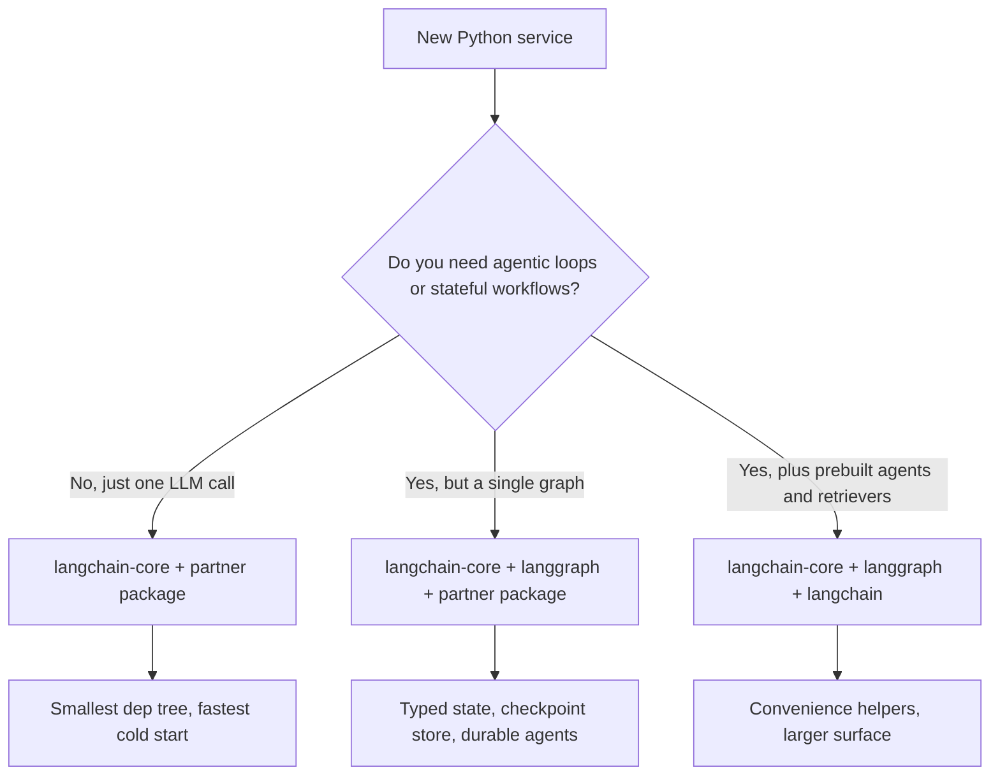

<a id="langchain-deep-dive"></a>
# LangChain 深入解析

LangChain 已不再只是「prompting library」。它已成熟為用來打造生產級 LLM 應用的 **模組化生態系**。LangGraph（已於 2025 年底正式升級到 v1.0，並成為所有 LangChain agents 的預設 runtime）負責有狀態的 orchestration。**LCEL（LangChain Expression Language）** 仍然是建立可組合 chains 的最快方式。

<a id="table-of-contents"></a>
## 目錄

- [LangChain 技術堆疊](#stack)
- [LCEL：以管線進行程式設計](#lcel)
- [標準抽象（Core）](#core)
- [管理複雜度（Community vs. Partner Packages）](#complexity)
- [LangChain 模組化推進](#langchain-modularity-push)
- [面試問題](#interview-questions)
- [參考資料](#references)

---

<a id="the-langchain-stack"></a>
## LangChain 技術堆疊

這個生態系現在分成三個明確層次：
1. **LangChain Core**：提供 Prompts、Output Parsers 與 Runnables 的最小抽象。（依賴體積低）
2. **LangChain Community/Partner**：整合 500+ 種資料庫、模型與工具。
3. **LangGraph**：有狀態的 orchestration 層（下一章會介紹）。

---

<a id="lcel-programming-with-pipes"></a>
## LCEL：以管線進行程式設計

LangChain Expression Language（LCEL）使用 `|` 運算子來建立執行用的 **有向無環圖（DAG）**。

```python
# Standard RAG chain
chain = (
    {"context": retriever, "question": RunnablePassthrough()}
    | prompt
    | model.with_structured_output(Schema) 
)
```

**為什麼要用 LCEL？**
- **預設支援 Async**：每條 chain 都支援 `.ainvoke()` 與 `.astream()`。
- **平行化**：多個分支會自動平行執行。
- **可觀測性**：可自動整合 **LangSmith**，提供完整 trace 視覺化。

---

<a id="standard-abstractions"></a>
## 標準抽象

<a id="1-runnables"></a>
### 1. Runnables
這是 LangChain 一切元件的「Base Class」。Runnables 為 `.invoke`、`.batch` 與 `.stream` 提供統一介面。

<a id="2-tools-tool-calling"></a>
### 2. Tools 與 Tool-Calling
LangChain 對 **MCP（Model Context Protocol）** 提供一級支援。
- 你可以把任何 MCP server 轉成 LangChain `BaseTool`。

<a id="3-output-parsers"></a>
### 3. Output Parsers
早期系統常用 regex，但現代程式碼多半使用 `.with_structured_output()`，它會利用模型原生的 JSON 能力（OpenAI `.json_mode` 或 Anthropic `tools`）。

---

<a id="managing-complexity"></a>
## 管理複雜度

> [!TIP]
> **Production 最佳實務**：在關鍵路徑上避免使用 `langchain-community`。改用 **Partner Packages**（例如 `langchain-openai`、`langchain-pinecone`），以降低 dependency hell 並提升穩定性。

---

<a id="langchain-modularity-push"></a>
## LangChain 模組化推進

到了 2026 年 5 月，整個生態系已完成從單體式 `langchain` import 遷移到分層結構的長期轉換，依賴邊界也更加清楚。這樣拆分的目的是讓團隊能精準選擇自己需要的 surface area，而不必一口氣帶入 500+ 種整合。

<a id="package-tiering-as-shipped"></a>
### 已發布的套件分層

| 套件 | 用途 | 直接依賴 |
|---------|---------|---------------------|
| `langchain-core` | Runnables、prompts、output parsers、tool abstractions | Pydantic、`tenacity`，以及幾乎沒有別的 |
| `langchain` | 純 Python 的參考 chains、retrievers、agents | `langchain-core` |
| `langgraph` | 有狀態的 graph orchestration、checkpointing、time-travel | `langchain-core` |
| `langchain-openai`, `langchain-anthropic`, `langchain-google-vertexai`, etc. | Provider partner packages | `langchain-core` + provider SDK |
| `langchain-community` | 各式長尾整合（仍保留可用，但不再建議放在 production 路徑） | 很多 |
| `langchain-classic` | 舊版 v0 chains，保留供遷移使用 | `langchain-core` |

根據 v1 發布資訊（[LangChain blog, Building with LangChain 1.0](https://blog.langchain.com/langchain-1-0/)），`langchain-core` 是唯一提供穩定 surface 與向後相容保證的套件。

<a id="standard-json-schema-across-validation-libraries"></a>
### 跨驗證函式庫的標準 JSON Schema

對應用程式碼來說，最大的改變是：`with_structured_output()`、`bind_tools()` 與 `@tool` 現在可接受任何相容於 [JSON Schema](https://json-schema.org/) 的物件。這包括：

- **Pydantic v2**（歷史上的預設選項）
- 透過 `zod-to-json-schema` 使用的 **[Zod 4](https://zod.dev/v4)**，供 JavaScript / TypeScript LangChain 使用
- **[Valibot](https://valibot.dev/)**（函數式、可 tree-shake 的 TS 驗證工具）
- **[ArkType](https://arktype.io/)**（把 TypeScript 型別當作 runtime schemas）
- Python 中的 plain dict / TypedDict
- 手寫的 JSON Schema 文件

這在 [LangChain v1 structured-output guide](https://docs.langchain.com/oss/python/langchain/structured-output) 與 [JS structured-output guide](https://js.langchain.com/docs/how_to/structured_output) 中都有說明。實際效果是：framework 的選擇不再綁定 validator 的選擇，而那些已在 HTTP layer 標準化使用 Valibot 或 ArkType 的團隊，也能直接重用這些 schemas 作為 LangChain 的 tool 定義。

```python
# Python: TypedDict tool schema, no Pydantic in the path
from typing import TypedDict, Annotated
from langchain_anthropic import ChatAnthropic

class CreateInvoice(TypedDict):
    """Create an invoice for a customer."""
    customer_id: Annotated[str, ..., "Stripe customer id"]
    amount_cents: Annotated[int, ..., "Amount in cents, > 0"]

llm = ChatAnthropic(model="claude-opus-4-7")
structured = llm.with_structured_output(CreateInvoice)
```

```typescript
// TypeScript: Valibot schema reused for both HTTP and tool calling
import * as v from "valibot";
import { ChatAnthropic } from "@langchain/anthropic";
import { toJsonSchema } from "@valibot/to-json-schema";

const CreateInvoice = v.object({
  customer_id: v.pipe(v.string(), v.description("Stripe customer id")),
  amount_cents: v.pipe(v.number(), v.minValue(1)),
});

const llm = new ChatAnthropic({ model: "claude-opus-4-7" });
const structured = llm.withStructuredOutput(toJsonSchema(CreateInvoice));
```

<a id="when-to-use-just-langchain-core-vs-full-langchain"></a>
### 何時只用 `langchain-core`，何時使用完整 LangChain



到 2026 年 5 月，建議採用以下做法：

- **Library / SDK 程式碼**：只依賴 `langchain-core`。可重用 building blocks（vector stores、chunkers、自訂 tools）的提供者，不應把 `langchain` 或 partner packages 當成直接依賴。[LangChain integrations guide](https://docs.langchain.com/oss/python/integrations/providers) 將這視為 `langchain-community` 貢獻者必須遵守的硬性規則。
- **應用服務**：使用 `langchain-core` + 你實際會呼叫的 partner packages + `langgraph`（如果你有多步 workflow）。除非你明確要使用內建 retriever 或舊版 chain，否則可跳過 `langchain`（指套件，不是品牌）。
- **Notebooks 與 prototypes**：為了方便，使用 `langchain` 沒問題。

版本鎖定很重要。對新程式碼而言，`langchain-core >= 1.0` 是受支援的最低版本；根據 [LangChain v1 release announcement](https://blog.langchain.com/langchain-1-0/)，0.3.x 分支仍會收到關鍵修補，但將在 2026 年第三季停止支援。

<a id="migration-notes-for-existing-code"></a>
### 現有程式碼的遷移注意事項

- `LLMChain`、`RetrievalQA`、`ConversationalRetrievalChain` 與 `AgentExecutor` 位於 `langchain-classic` 中，且已凍結。替代方案是 LCEL pipe，或更常見的 `langgraph` graph（[LangChain migration guide](https://python.langchain.com/docs/versions/v0_3/)）。
- Tool decorators 應從 `langchain_core.tools` 匯入，而不是 `langchain.tools`。
- 依賴 Pydantic v1 的 output parsers 必須移植。`langchain-core` v1.0 已移除 v1 shim（[release notes](https://github.com/langchain-ai/langchain/releases/tag/langchain-core%3D%3D1.0.0)）。

---

<a id="interview-questions"></a>
## 面試問題

<a id="q-what-is-the-main-benefit-of-lcel-over-traditional-python-chains-sequences-of-function-calls"></a>
### 問：相較於傳統的 Python「Chains」（函式呼叫序列），LCEL 的主要優勢是什麼？

**理想回答：**
LCEL 提供 **自動 Streaming 與平行化**。在傳統 Python chain 中，我必須手動用 `asyncio.gather` 處理平行步驟，還要用自訂 generators 來做 streaming。LCEL 的 `Runnable` 架構會在底層處理這些事情。如果我定義一個 `RunnableParallel` 區塊，LangChain 會同時執行它們。更重要的是，LCEL 透過 `RunnableBranch` 提供 **動態路由**，讓我能在不寫出層層巢狀 if/else 的情況下建立複雜邏輯。

<a id="q-langchain-is-often-criticized-for-being-too-bloated-how-do-you-architect-a-lean-production-system-with-it"></a>
### 問：LangChain 常被批評「太臃腫」，你會如何用它設計一個精簡的 production system？

**理想回答：**
關鍵在於 **只匯入 Core**。我會用 `langchain-core` 取得抽象層，並搭配特定的 **Partner Packages**（例如 `langchain-anthropic`）來接模型。我會避開 `langchain-community` 與舊版 `Chain` 類別（像 `LLMChain` 或 `RetrievalQA`），因為它們實際上已接近淘汰。我會用 **Runnable** primitives 來建構邏輯，這能讓依賴樹更小、執行路徑也更透明。

---

<a id="references"></a>
## 參考資料
- LangChain. "The LangChain Expression Language Specification" (2025)
- Anthropic. "Partner Integration Guide for LangChain" (2025)
- Harrison Chase. "The Future of AI Orchestration" (2024 podcast/post)

---

*下一步：[LangGraph Orchestration](02-langgraph-orchestration.md)*
