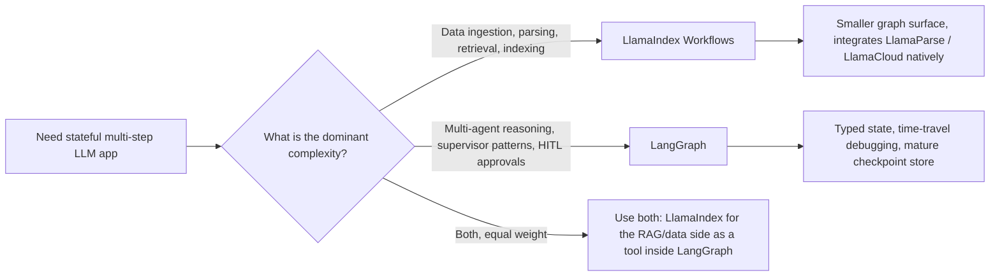

<a id="llamaindex"></a>
# LlamaIndex

雖然 LangChain 專注於「Orchestration」，**LlamaIndex** 則是 **Data-Centric AI** 的高手。它已從一個 RAG 函式庫演進為專注於 **Workflows** 與 **Agentic Data Manipulation** 的框架。

<a id="table-of-contents"></a>
## 目錄

- [資料框架哲學](#philosophy)
- [LlamaIndex Workflows](#workflows)
- [進階索引：超越向量搜尋](#indexing)
- [LlamaCloud 與受管 Ingestion](#llamacloud)
- [作為工具的 Agents](#agents-as-tools)
- [LlamaIndex Workflows：事件驅動應用程式框架](#llamaindex-workflows-event-driven-application-framework)
- [面試題](#interview-questions)
- [參考資料](#references)

---

<a id="philosophy"></a>
<a id="the-data-framework-philosophy"></a>
## 資料框架哲學

LlamaIndex 建立在一個信念上：**資料比模型更重要**。
- **Node**：每個資料切塊都是一個帶有豐富中繼資料的「Node」（關聯、摘要，以及父子連結）。
- **Retriever**：LlamaIndex 提供最豐富的 retriever 類型（Summary、Knowledge Graph、Tree，以及 Keyword）。

---

<a id="workflows"></a>
<a id="llamaindex-workflows"></a>
## LlamaIndex Workflows

在 2024 年底，LlamaIndex 推出了 **Workflows**，作為它對 LangGraph 的回應。
- **事件驅動架構**：節點透過發出 `Events` 進行溝通。
- **Concurrency**：Workflows 原生支援 async，比線性 chains 更擅長處理大規模平行資料處理。

```python
# Conceptual Workflow
class RAGWorkflow(Workflow):
    @step
    async def ingest(self, ev: StartEvent) -> RetrievalEvent:
        # Custom logic...
        return RetrievalEvent(results=nodes)
```

---

<a id="indexing"></a>
<a id="advanced-indexing"></a>
## 進階索引

1. **Property Graphs**：將向量切塊連結到圖節點，以支援 RAG。
2. **Context-Aware Splitters**：依照「意義」而不是「Token 數量」來分組文字（使用較小的 LLM 找出最佳切分點）。
3. **Dynamic Pathing**：retriever 會根據問題的複雜度，決定要查詢 *哪一種* index。

---

<a id="llamacloud"></a>
<a id="llamacloud-and-managed-ingestion"></a>
## LlamaCloud 與受管 Ingestion

為了支援企業級規模，LlamaIndex 聚焦於 **LlamaCloud**。
- **Managed Ingestion**：以服務形式處理 PDF parsing、OCR 與表格擷取。
- **Parsing as a Model**：使用 Vision-LLMs（Gemini 3.1 Pro、Claude Opus 4.7、GPT-5.5）來「理解」版面，而非使用規則式 parser。

---

<a id="agents-as-tools"></a>
## 作為工具的 Agents

LlamaIndex 將 agents 視為**高階 retrievers**。
- 你可以把複雜的 LlamaIndex query engine「包裝」成工具，並交給 LangGraph agent 使用。
- **優點**：agent 能獲得「Smart Data Access」，而不需要了解向量資料庫或 Graph schema 的技術細節。

---

<a id="llamaindex-workflows-event-driven-application-framework"></a>
## LlamaIndex Workflows：事件驅動應用程式框架

2024 年的說法是「Workflows 是我們的 LangGraph」。現在的說法不同了：Workflows 是適用於任何 AI 應用程式的通用事件驅動框架，而 RAG 只是其中一種可能用途。`llama-index-core` 的 1.x 主線將 Workflows 作為主要的應用層介面，而 index / retriever 類別則移至圍繞它的整合套件中（[LlamaIndex workflows docs](https://developers.llamaindex.ai/python/framework/understanding/workflows/)）。

<a id="what-changed-architecturally"></a>
### 架構上有哪些改變

| 面向 | Workflows 之前的 LlamaIndex | 以 Workflows 為先的 LlamaIndex |
|-----------|--------------------------|-----------------------------------|
| 主要抽象 | Query engine、chat engine | 具有 `@step` 方法的 `Workflow` 類別 |
| 控制流程 | 線性；巢狀 query engines | Steps 消費 / 發出具型別的 `Event` 子類別 |
| 狀態 | 隱含於 engine 實例中 | 具可序列化狀態的顯式 `Context` |
| Concurrency | 透過 async query engines 協作 | 一等公民：可發出多個 events、fan out、再 join |
| 持久化 | 無 | Context 可被 `pickle` 或儲存為 JSON 以供恢復 |
| 串流 | 依各 engine 而定 | 任一步驟都可透過 `ctx.write_event_to_stream()` |
| Human-in-the-loop | 手動實作 | `InputRequiredEvent` / `HumanResponseEvent` 模式 |

<a id="the-event-driven-mental-model"></a>
### 事件驅動的思維模型

```python
from llama_index.core.workflow import (
    Workflow, step, Event, StartEvent, StopEvent, Context
)

class RetrievedEvent(Event):
    nodes: list

class JudgedEvent(Event):
    nodes: list
    keep: bool

class GraphRAG(Workflow):
    @step
    async def plan(self, ctx: Context, ev: StartEvent) -> RetrievedEvent:
        await ctx.set("query", ev.query)
        nodes = await self.retriever.aretrieve(ev.query)
        return RetrievedEvent(nodes=nodes)

    @step
    async def judge(self, ctx: Context, ev: RetrievedEvent) -> JudgedEvent:
        keep = await self.relevance_judge(ev.nodes, await ctx.get("query"))
        return JudgedEvent(nodes=ev.nodes, keep=keep)

    @step
    async def answer(self, ctx: Context, ev: JudgedEvent) -> StopEvent:
        if not ev.keep:
            return StopEvent(result="No good evidence found.")
        return StopEvent(result=await self.llm.acomplete(...))
```

這種設計帶來兩個特性：

1. 引擎完全依據**事件型別**進行派發，因此新增分支就是新增一個 `Event` 子類別，以及一個消費它的 step。不需要修改中央 router。
2. **Concurrency 由資料驅動**：某個 step 若發出三個 `RetrievedEvent`，就會自動 fan out 成三次下游 `judge` 呼叫，而 join step 會用 `ctx.collect_events` 將它們收集起來。

<a id="workflows-vs-langgraph"></a>
### Workflows 與 LangGraph 的比較



| 面向 | LlamaIndex Workflows (1.x) | LangGraph (1.x) |
|-----------|----------------------------|-----------------|
| 控制流程原語 | 事件派發 | Graph nodes 與 edges，再加上具型別 reducer state |
| 狀態模型 | 自由形式的 `Context`（類似 dict） | 具 reducers 的 Pydantic / TypedDict state |
| 恢復 / time travel | 可 pickled 的 context，基本 resume | 一等公民的 checkpoints，可從任意 node 分支（[LangGraph persistence docs](https://docs.langchain.com/oss/python/langgraph/persistence)） |
| 原生整合 | LlamaParse、LlamaCloud、所有 LlamaHub loaders | LangSmith eval、所有 LangChain integrations |
| 最適合的複雜度 | 資料導向：parse、embed、retrieve、refine | 邏輯導向：plan、act、reflect、delegate |
| Multi-agent 輔助 | `AgentWorkflow`、function-calling agents（[LlamaIndex AgentWorkflow](https://developers.llamaindex.ai/python/framework/understanding/agent/multi_agent/)） | `create_supervisor`、`create_react_agent`、swarm patterns |
| 串流 UI | `ctx.write_event_to_stream` + AG-UI protocol | `astream_events` v2、AG-UI protocol |

你應該在什麼情況下選擇 LlamaIndex Workflows 而不是 LangGraph：

- 困難點在於**資料 ingestion**，而不是推理。LlamaCloud、LlamaParse 與 property-graph stack 都是原生能力，不是透過 adapter 橋接（[LlamaCloud overview](https://www.llamaindex.ai/llamacloud)）。
- 你想要**以文件為驅動的平行化**：解析 1000 份 PDF、對每個 chunk fan out 一個 embedding step，最後 join 成一次 index 更新。
- 你正在 `llama-index-ts` 的 **TypeScript** 生態系中開發，並希望與 Python core 保持功能對等。

LangGraph 何時更合適：

- 真正困難的是**agent 控制迴圈**本身：很多 agents、supervisor patterns、durable interrupts、replay。
- 你需要開箱即用的**time-travel debugging**。LlamaIndex 的 resume 很適合 crash recovery，但不像 LangGraph checkpoints 那樣，能從任意歷史狀態分支。
- 你已經採用 LangSmith eval stack，希望無需橋接就獲得 trace-level 整合。

<a id="real-world-posture"></a>
### 真實世界中的定位

許多資深架構其實兩者都用：以 LlamaIndex Workflows 作為資料平面（ingestion、indexing、hybrid retrieval、reranking），再把它包裝成工具，讓 LangGraph 作為上層的 agent 控制平面。這種模式可見於 [AIMultiple framework comparison](https://research.aimultiple.com/agentic-ai-frameworks/) 以及 LlamaIndex 自家的 [hybrid integration cookbook](https://developers.llamaindex.ai/python/framework/understanding/workflows/)。

如果你在全新的 greenfield 應用中只能選一個，問題就簡化成：**你的團隊會花更多時間處理資料管線，還是 agent orchestration？** 答案會決定框架的選擇。

---

<a id="interview-questions"></a>
## 面試題

<a id="q-langchain-and-llamaindex-now-both-have-graphworkflow-features-how-do-you-choose"></a>
### 問：LangChain 與 LlamaIndex 現在都有「Graph/Workflow」功能，你會如何選擇？

**強力回答：**
我會在**資料密集型**任務中選擇 **LlamaIndex Workflows**，因為主要複雜度在於 ingestion、多模態 parsing 與複雜 retrieval。它的事件驅動架構在大規模平行資料處理上效能更好。我會在**邏輯密集型**的 multi-agent 系統中選擇 **LangGraph**，因為複雜度集中在「推理」與「Human-in-the-loop」邏輯。許多資深架構其實會**兩者並用**：用 LlamaIndex 作為 RAG 引擎，用 LangGraph 作為整體 agent supervisor。

<a id="q-what-is-the-property-graph-in-llamaindex-and-why-is-it-superior-to-basic-vector-rag"></a>
### 問：LlamaIndex 中的「Property Graph」是什麼？為什麼它優於基本的 Vector RAG？

**強力回答：**
Property Graph 結合了向量的**語意彈性**與資料庫的**結構精確性**。在基本 RAG 中，你可能找到一段談「Project Alpha」的 chunk，但你不知道誰擁有它。在 Property Graph 中，向量 chunk 是一個節點，並連到 `User` 節點與 `Timeline` 節點。這使得**全域推理**成為可能（例如：「找出 Tom 上個月撰寫、且與 Project Alpha 有關的所有文件」）。基本 RAG 很可能會漏掉許多相關節點，因為它們未必包含精確的關鍵字「Alpha」。

---

<a id="references"></a>
## 參考資料
- LlamaIndex．《The Workflows Framework: Event-Driven Agents》（2025）
- Jerry Liu．《Data-Centric AI in the LLM Era》（2024/2025）
- LlamaHub．《The Repository of 1000+ Data Loaders》（2025）

---

*下一篇：[DSPy: Programming Language Models](05-dspy.md)*
