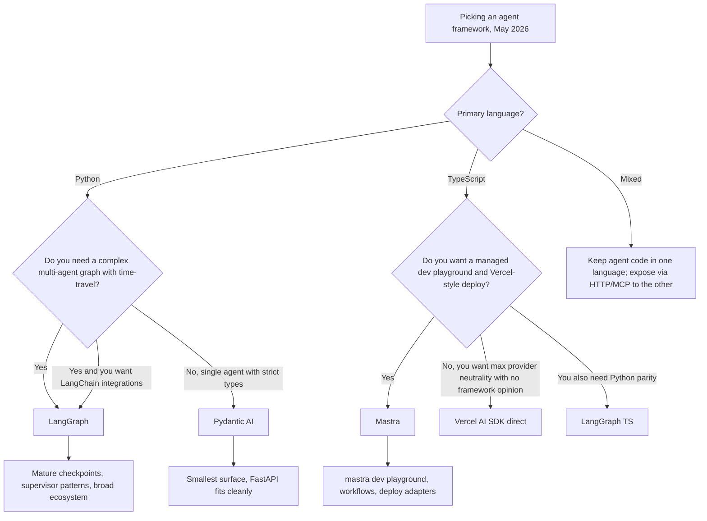

<a id="pydantic-ai-and-mastra-typed-agent-frameworks-2026"></a>
# Pydantic AI 與 Mastra：型別化 Agent 框架（2026）

到了 2026 年 5 月，agent framework 的辯論已不再只是「LangGraph 還是 LlamaIndex」。現在有兩個較新的參與者，已在重視型別安全多於整合廣度的團隊中取得實質正式環境市占：Python 世界的 **Pydantic AI**，以及 TypeScript 世界的 **Mastra**。兩者都拒絕延續舊框架所接受的「string in, string out」介面，也都押注在：**完整型別化的 agent**，會比聰明但未型別化的 agent 更容易測試、評估與營運。

<a id="table-of-contents"></a>
## 目錄

- [這些框架是什麼](#what-these-frameworks-are)
- [Pydantic AI：Python 中的型別化 Agents](#pydantic-ai-typed-agents-in-python)
- [Mastra：以 TypeScript 為優先的 Agents](#mastra-typescript-first-agents)
- [與 LangGraph 的比較](#comparison-with-langgraph)
- [如何選擇框架](#choosing-a-framework)
- [正式環境參考案例](#production-references)
- [面試問題](#interview-questions)
- [參考資料](#references)

---

<a id="what-these-frameworks-are"></a>
## 這些框架是什麼

Pydantic AI 與 Mastra 的誕生，都來自對 framework lock-in 與未型別化 prompt 拼接方式的不滿。它們聚焦於同一組核心觀念：

- Agent loop 是**由程式碼定義**，而不是由 YAML / JSON graph 定義。
- Tool calls、structured outputs 與 human-in-the-loop checkpoints 都是在**函式簽名層級完成型別化**。
- Provider portability 是硬性要求：只改一行就能把 Anthropic 換成 OpenAI 或 Google。
- Evals、tracing 與 deployment 都是一級公民，而不是事後拼上的功能。

兩者的差異主要來自技術堆疊：一個面向已經使用 Pydantic 做 HTTP 驗證的 Python 服務；另一個則面向想要 Vercel 風格開發者體驗的 Next.js / Node 團隊。

---

<a id="pydantic-ai-typed-agents-in-python"></a>
## Pydantic AI：Python 中的型別化 Agents

<a id="current-state"></a>
### 目前狀態

[Pydantic AI](https://ai.pydantic.dev/) 於 2025 年 9 月推出 v1.0，並在 2026 年 5 月成長到 **v1.85**（[PyPI release history](https://pypi.org/project/pydantic-ai/#history)）。這個函式庫由 Pydantic 背後的團隊打造，而該團隊同時也維護 [Pydantic Logfire](https://pydantic.dev/logfire)。它以 MIT 授權開源。

主要介面包括：

- 以輸出型別與一組型別化工具參數化的 `Agent` 類別。
- 適用於 Anthropic、OpenAI、Google、Mistral、Groq、Cohere、Ollama，以及任何 OpenAI-compatible endpoint 的 provider adapters。
- 原生 OpenTelemetry tracing，可匯出到 Logfire 或任何 OTLP collector。
- `pydantic_evals`，用於建立包含 LLM-judge 與 code-graded scorers 的宣告式 eval suites。
- 當簡單的 `Agent` loop 不夠用時，可使用明確 state machines 的 `Graph` API。

<a id="why-teams-pick-it"></a>
### 團隊為什麼選它

```python
from pydantic import BaseModel, Field
from pydantic_ai import Agent, RunContext

class RefundDecision(BaseModel):
    approved: bool
    amount_cents: int = Field(ge=0)
    reason: str

agent = Agent(
    "anthropic:claude-opus-4-7",
    output_type=RefundDecision,
    system_prompt="You are a refund analyst. Approve only if policy allows.",
)

@agent.tool
async def lookup_order(ctx: RunContext, order_id: str) -> dict:
    """Look up an order by id."""
    return await ctx.deps.orders.get(order_id)

result = await agent.run("Refund order 1234", deps=DepContainer(orders=db))
assert isinstance(result.output, RefundDecision)
```

有三個特性讓它在正式環境中特別有吸引力：

1. **回傳型別會被強制檢查。** `result.output` 要嘛是 `RefundDecision`，要嘛呼叫失敗，不存在悄悄偏移成字串的情況。
2. **Tools 是函式，不是 dicts。** schema 會在註冊時根據 Python signature 與 docstring 自動產生，因此不會讓面向 LLM 的 schema 與實作意外漂移。
3. **依賴注入是明確的。** `ctx.deps` 是一個型別化容器，讓 agent 很容易用 mocks 做 unit test。

[Pydantic AI evals docs](https://ai.pydantic.dev/evals/) 描述了一個典型流程：在正式 schema 中使用的同一個 Pydantic model，也同時用作 LLM 輸出型別與 eval scorer 的 `expected_output`。

<a id="when-pydantic-ai-is-the-right-choice"></a>
### 什麼時候 Pydantic AI 是正確選擇

- 服務是 **Python**，而且已經使用 Pydantic 做 HTTP 驗證（FastAPI 是最典型的情況）。
- 你希望做到端到端的**嚴格 schema**：HTTP 邊界、LLM tool call、LLM output、database row。
- 你希望有**provider portability**，但不想自己寫 adapter layer。
- 你願意把 agent loop 寫成命令式 Python，而不是 graph 定義。

<a id="when-it-is-not"></a>
### 什麼時候它不適合

- 你想要一個**宣告式 graph** 來做具 supervisor patterns 的多代理協作。`Graph` API 雖然存在，但比 LangGraph 更基礎。
- 你想要具備 branch-from-any-node 語意的 **time-travel debugging**。
- 你需要 LangChain 整合生態的廣度（vector stores、document loaders 等）。

---

<a id="mastra-typescript-first-agents"></a>
## Mastra：以 TypeScript 為優先的 Agents

<a id="current-state"></a>
### 目前狀態

[Mastra](https://mastra.ai/) 由 Gatsby 團隊創立，並於 2025 年 10 月宣布獲得 **1300 萬美元種子輪**，由 Lightspeed 領投（[TechCrunch coverage](https://techcrunch.com/2025/10/16/mastra-typescript-agent-framework-seed/)）。到了 2026 年 5 月，GitHub repository 已超過 **22K stars**（[mastra-ai/mastra](https://github.com/mastra-ai/mastra)）。Mastra 以 Elastic License v2 授權開源。

主要介面包括：

- `Agent`、`Workflow` 與 `Tool` primitives，全部以 TypeScript 定義並具備完整 inference。
- 內建 **local dev server**（`mastra dev`），附帶 playground UI、eval runner 與 trace viewer。
- 與 Vercel 的 **AI SDK** 緊密整合，用於 streaming、多步 tool calls 與 provider switching。
- 內建 memory 與 RAG，並提供 `libsql` / `pgvector` adapters。
- 可用單一命令部署到 **Mastra Cloud**、Vercel、Cloudflare Workers 或 Node server。

<a id="why-teams-pick-it"></a>
### 團隊為什麼選它

```typescript
import { Agent } from "@mastra/core/agent";
import { createTool } from "@mastra/core/tools";
import { anthropic } from "@ai-sdk/anthropic";
import { z } from "zod";

const lookupOrder = createTool({
  id: "lookup-order",
  description: "Look up an order by id",
  inputSchema: z.object({ orderId: z.string() }),
  outputSchema: z.object({ status: z.string(), totalCents: z.number() }),
  execute: async ({ context }) => ordersDb.get(context.orderId),
});

export const refundAgent = new Agent({
  name: "refund-agent",
  model: anthropic("claude-opus-4-7"),
  instructions: "You are a refund analyst. Approve only if policy allows.",
  tools: { lookupOrder },
});
```

有三個特性讓它特別有吸引力：

1. **端到端推導型別。** Zod schemas 同時驅動 tool 的執行期驗證、面向 LLM 的 JSON Schema，以及 `execute` 內 `context` 的 TypeScript 型別。單一真實來源。
2. **`mastra dev` 是殺手級功能。** 它會啟動一個本地 UI，讓你無須撰寫 frontend，就能呼叫任何 agent、重播任何 trace、執行任何 eval，並檢視任何 tool 的輸入／輸出。
3. **First-class workflows。** `createWorkflow` 會定義一個型別化的步驟圖（每一步都是 Mastra tool 或 agent），支援 branching、suspend / resume 與 human-in-the-loop，而且全部都能型別檢查。

[Generative.inc 的 Mastra 指南](https://generative.inc/blog/mastra-typescript-agent-framework) 展示了當整體技術堆疊已經是 TypeScript 時，團隊如何完全以 Mastra 取代 Python orchestration。

<a id="when-mastra-is-the-right-choice"></a>
### 什麼時候 Mastra 是正確選擇

- 團隊是 **TypeScript-first**，而且應用其餘部分是 Next.js / Node / Bun / Cloudflare Workers。
- 你想要 **Vercel-style DX**：單一 CLI、本地 playground、具主張的部署方式。
- Streaming UI 很重要，而且你想依賴 AI SDK 的 `useChat` 與 `streamText` primitives。
- 你想要內建接好 human approval steps 的 **suspend / resume workflows**。

<a id="when-it-is-not"></a>
### 什麼時候它不適合

- 你需要**大量現成 agent** 或社群整合。與 LangChain 相比，其生態仍然偏小。
- 你的團隊與大部分 AI 工具鏈都是 **Python**。透過 HTTP 層把 TS 接到 Python 服務雖然可行，但會增加延遲。
- 你需要**學術風格**的自訂推論行為（例如 custom decoding 等）。那就留在 Python。

---

<a id="comparison-with-langgraph"></a>
## 與 LangGraph 的比較

| 面向 | Pydantic AI v1.85 | Mastra（2026 年 5 月） | LangGraph 1.x |
|-----------|-------------------|---------------------|----------------|
| 語言 | Python | TypeScript | Python 與 TypeScript |
| 授權 | MIT | Elastic License v2 | MIT |
| 主要單位 | 具 `output_type` 的型別化 `Agent` | 型別化 `Agent` 與 `Workflow` | 基於型別化 state 的節點圖 |
| Schema 來源 | Pydantic v2 | Zod | JSON Schema（Pydantic、Zod、Valibot、ArkType） |
| Provider 中立性 | 內建 adapters | 透過 Vercel AI SDK | 透過 LangChain partner packages |
| 多代理 | 手動或使用 `Graph` API | `Workflow` + agent-as-tool | `create_supervisor`、swarm、自訂 graphs |
| 狀態持久化 | 手動或 `pydantic_graph` checkpoint | Workflow snapshot + storage adapters | First-class checkpoint stores（Postgres、Redis、SQLite、in-memory） |
| Time-travel debugging | 否 | 可在本地 playground 重播 | 可以，能從任何 checkpoint 分支 |
| Eval 框架 | `pydantic_evals` | Mastra evals（內建） | LangSmith 或外部工具 |
| Tracing | OTLP / Logfire | OTLP / Mastra Cloud | LangSmith 或 OTLP |
| 耦合度 | 不依賴 LangChain | 不依賴 LangChain | 與 LangChain 生態高度耦合 |
| 生態規模 | 小但成長中 | 小但成長中 | 大（LangChain 整合） |



---

<a id="choosing-a-framework"></a>
## 如何選擇框架

依重要性排序，有三個決策驅動因素：

1. **現有服務使用的語言。** Python 服務用 Pydantic AI 與 LangGraph（Python）。TypeScript 服務用 Mastra 與 LangGraph TS。跨越語言邊界，幾乎總是比在正確那一側選對工具來得更糟。
2. **複雜度的形狀。** 如果 agent 本質上只是「LLM + 幾個 tools + 嚴格輸出型別」，那麼 Pydantic AI 或 Mastra 就足夠，而且營運成本更低。如果你有許多會協作的 agents，還伴隨 branching、retries 與 approvals，那麼 LangGraph 的 graph + checkpoint 模型就會開始領先。
3. **生態耦合。** LangGraph 讓你取得 LangChain integrations、LangSmith eval，以及整個生態表面。Pydantic AI 與 Mastra 則提供更乾淨的型別保證與更快的冷路徑，但你需要自己接整合。

一個實用的經驗法則是：如果頁面上最長的是工具清單，就選 Pydantic AI 或 Mastra；如果最長的是 state machine，就選 LangGraph。

---

<a id="production-references"></a>
## 正式環境參考案例

以下是截至 2026 年 5 月，各框架被認真投入使用的公開案例：

- **Pydantic AI**
  - [Pydantic Logfire dashboards](https://pydantic.dev/logfire) 本身就使用 Pydantic AI 來驅動內部 triage agents。
  - [Sourcegraph Cody](https://sourcegraph.com/cody) 團隊曾在部落格中提到，[他們使用 Pydantic AI](https://ai.pydantic.dev/) 來為伺服器端工作流程中的 typed code-action agents 提供支援。
  - 許多 FastAPI 團隊採用它，因為同一個 Pydantic model 同時可作為 HTTP 邊界與 LLM 輸出型別。
- **Mastra**
  - [Stripe](https://stripe.com/) 的 developer-experience prototypes（[mastra.ai](https://mastra.ai/)）。
  - [Resend](https://resend.com/)、[Liveblocks](https://liveblocks.io/) 與 [Vercel](https://vercel.com/) 的 demo apps。
  - 種子輪公告（[TechCrunch](https://techcrunch.com/2025/10/16/mastra-typescript-agent-framework-seed/)）列出了 fintech 與 developer tools 領域的正式環境使用者。
- **LangGraph**（供參考）
  - [LinkedIn 的 SQL Bot](https://www.linkedin.com/blog/engineering/ai/practical-text-to-sql-for-data-analytics)、[Uber 的 coding assistants](https://www.uber.com/en-IN/blog/genie-uber-genai-on-call-copilot/)、[Klarna](https://www.klarna.com/)、[Elastic](https://www.elastic.co/) AI Assistant、[Replit](https://replit.com/) 等，還有更多收錄於 [LangChain customer page](https://www.langchain.com/built-with-langgraph)。

---

<a id="interview-questions"></a>
## 面試問題

<a id="q-when-would-you-choose-pydantic-ai-over-langgraph-for-a-python-service"></a>
### Q：對於 Python 服務，你會在什麼情況下選擇 Pydantic AI 而不是 LangGraph？

**有力的回答：**
當 agent 本質上是一個 LLM，加上一個型別化輸出與少數幾個 tools，而服務的其他部分本來就已經是 Pydantic 形狀（FastAPI、SQLModel 等）時，我會選 Pydantic AI。它的優勢是：同一個 Pydantic model 同時定義 HTTP response、LLM output，以及 eval scorer 預期的形狀，因此不會有 schema drift。只有當我需要真正的多代理 graph、基於 checkpoint 的 time travel、supervisor patterns，或 LangChain 的整合生態時，LangGraph 那個較重的表面積才值得。我的判斷問題會是：設計裡最複雜的是工具清單，還是 state machine？如果是工具清單，就用 Pydantic AI；如果是 state machine，就用 LangGraph。

<a id="q-is-mastra-a-vercel-ai-sdk-replacement"></a>
### Q：Mastra 是 Vercel AI SDK 的替代品嗎？

**有力的回答：**
不是。Mastra 是建立在 Vercel AI SDK 之上，用它來完成實際的 provider calls 與 streaming。Mastra 額外提供的是 **agent abstraction**、**workflow engine**、**memory**、**RAG**、**evals**，以及 **`mastra dev` playground**。如果你只需要在 Next.js app 中呼叫 LLM，並使用 streaming 與 tool calls，那麼單用 AI SDK 就很足夠。如果你想要具型別的 agent，還要有 workflows、suspend / resume、memory 與本地 playground，那麼 Mastra 就是替你補上這些能力的那一層。

<a id="q-what-does-typed-agent-framework-actually-buy-you-in-production"></a>
### Q：所謂的「typed agent framework」在正式環境中到底帶來什麼價值？

**有力的回答：**
有三點。第一，**較少錯誤輸入會漏進下游**。面向 LLM 的 schema 來自與執行期 payload 驗證相同的 Pydantic / Zod 定義，因此如果 LLM 幻覺出一個欄位，parse 步驟會在任何下游程式碼執行前先拒絕它。第二，**乾淨的 unit tests**。型別化 tool 本質上就是一個具有 Pydantic / Zod 邊界的函式，所以我可以在完全不跑 LLM 的情況下測試它。第三，**理解 schema 的 evals**。eval framework 可以逐欄位比較兩個型別化物件，而不是只比較字串差異，因此能抓到更細微的回歸，例如某個欄位變成 optional，或某個 enum 新增了一個值。

---

<a id="references"></a>
## 參考資料

- Pydantic AI v1.85 release notes: https://github.com/pydantic/pydantic-ai/releases
- Pydantic AI documentation: https://ai.pydantic.dev/
- Pydantic AI evals: https://ai.pydantic.dev/evals/
- Mastra repository: https://github.com/mastra-ai/mastra
- Mastra documentation: https://mastra.ai/
- TechCrunch, "Mastra raises $13M seed for TypeScript agent framework" (October 2025): https://techcrunch.com/2025/10/16/mastra-typescript-agent-framework-seed/
- Generative.inc Mastra guide: https://generative.inc/blog/mastra-typescript-agent-framework
- LangGraph 1.x docs: https://docs.langchain.com/oss/python/langgraph/
- LangChain "Built with LangGraph" customer list: https://www.langchain.com/built-with-langgraph
- Vercel AI SDK: https://ai-sdk.dev/
- AIMultiple "Agentic AI frameworks compared" (2026): https://research.aimultiple.com/agentic-ai-frameworks/

---

*下一步：請參閱[框架選擇指南](08-framework-selection-guide.md)，了解跨框架的選型標準。*
