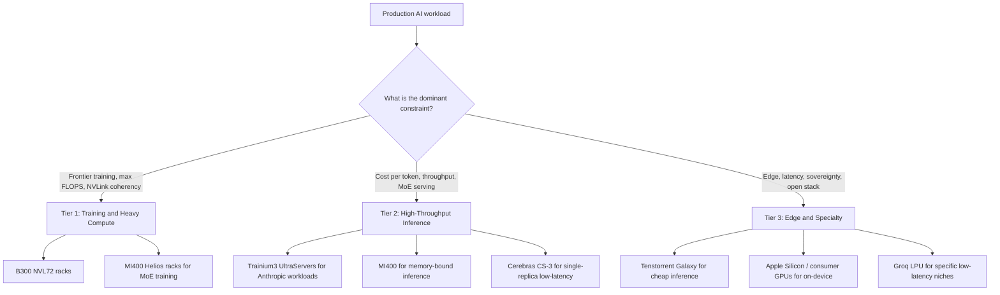

<a id="llm-infrastructure"></a>
# LLM 基礎設施

建置可投入生產的 LLM 系統，需要理解部署選項、擴展模式與維運考量。本章聚焦於基礎設施層。

<a id="table-of-contents"></a>
## 目錄

- [部署選項](#deployment-options)
- [服務架構](#serving-architecture)
- [擴展模式](#scaling-patterns)
- [成本管理](#cost-management)
- [監控與警示](#monitoring-and-alerting)
- [災難復原](#disaster-recovery)
- [2026 年 5 月 AI 加速器版圖](#may-2026-ai-accelerator-landscape)
- [面試題](#interview-questions)
- [參考資料](#references)

---

<a id="deployment-options"></a>
## 部署選項

<a id="api-vs-self-hosted"></a>
### API 與自託管

| 因素 | API 供應商 | 自託管 |
|--------|---------------|-------------|
| 設定時間 | 幾分鐘 | 幾天到幾週 |
| 維運負擔 | 無 | 顯著 |
| 低流量成本 | 較低 | 較高（固定成本） |
| 高流量成本 | 較高 | 較低（規模經濟） |
| 延遲控制 | 有限 | 完全控制 |
| 資料隱私 | 資料會離開你的基礎設施 | 資料留在本地 |
| 模型選擇 | 供應商提供的模型 | 任何開放模型 |
| 客製化 | 透過 API fine-tuning | 完全控制 |

<a id="when-to-use-api-providers"></a>
### 何時使用 API 供應商

```python
# Decision framework
def should_use_api(requirements: dict) -> bool:
    # Strong signals for API
    if requirements["time_to_market"] == "urgent":
        return True
    if requirements["query_volume"] < 100_000_per_month:
        return True
    if requirements["team_ml_expertise"] == "low":
        return True
    
    # Strong signals for self-hosted
    if requirements["data_residency"] == "strict":
        return False
    if requirements["latency_p99_ms"] < 100:
        return False
    if requirements["query_volume"] > 10_000_000_per_month:
        return False
    
    # Default to API for simplicity
    return True
```

<a id="self-hosting-options"></a>
### 自託管選項

| 選項 | 複雜度 | 效能 | 使用情境 |
|--------|------------|-------------|----------|
| vLLM | 中 | 極佳 | 生產服務 |
| TGI (HuggingFace) | 中 | 很好 | HuggingFace 生態系 |
| TensorRT-LLM | 高 | 最佳（NVIDIA） | 最高效能 |
| Ollama | 低 | 良好 | 開發、小規模 |
| llama.cpp | 低 | 良好 | CPU 推論、邊緣裝置 |

---

<a id="serving-architecture"></a>
## 服務架構

<a id="single-model-serving"></a>
### 單模型服務

```
┌─────────────┐     ┌─────────────┐     ┌─────────────┐
│   Client    │────▶│   Gateway   │────▶│  LLM Server │
└─────────────┘     └─────────────┘     └─────────────┘
                           │
                           ▼
                    ┌─────────────┐
                    │    Cache    │
                    └─────────────┘
```

<a id="multi-model-serving"></a>
### 多模型服務

```
                    ┌─────────────────────────────── │
                    │         Load Balancer          │
                    └───────────────┬────────────────┘
                                    │
            ┌───────────────────────┼───────────────────────┐
            │                       │                       │
            ▼                       ▼                       ▼
    ┌───────────────┐       ┌───────────────┐       ┌───────────────┐
    │  GPT-4 Pool   │       │  Claude Pool  │       │ Llama 70B Pool│
    │  (API calls)  │       │  (API calls)  │       │ (self-hosted) │
    └───────────────┘       └───────────────┘       └───────────────┘
```

<a id="model-router-pattern"></a>
### 模型路由模式

```python
class ModelRouter:
    def __init__(self):
        self.models = {
            "simple": GPT4oMini(),
            "complex": Claude35Sonnet(),
            "code": Claude35Sonnet(),
            "long_context": Gemini15Pro(),
            "vision": GPT4o()
        }
        self.classifier = QueryClassifier()
    
    async def route(self, request: Request) -> Response:
        # Classify request type
        request_type = self.classifier.classify(request)
        
        # Route to appropriate model
        model = self.models[request_type]
        
        # Execute with fallback
        try:
            return await model.generate(request)
        except RateLimitError:
            return await self.fallback(request, request_type)
    
    async def fallback(self, request: Request, original_type: str) -> Response:
        # Define fallback order
        fallbacks = {
            "simple": ["complex", "long_context"],
            "complex": ["simple"],
            "code": ["complex"]
        }
        
        for fallback_type in fallbacks.get(original_type, []):
            try:
                return await self.models[fallback_type].generate(request)
            except Exception:
                continue
        
        raise ServiceUnavailableError("All models unavailable")
```

---

<a id="scaling-patterns"></a>
## 擴展模式

<a id="horizontal-scaling"></a>
### 水平擴展

```python
# Kubernetes HPA config for LLM service
hpa_config = """
apiVersion: autoscaling/v2
kind: HorizontalPodAutoscaler
metadata:
  name: llm-service-hpa
spec:
  scaleTargetRef:
    apiVersion: apps/v1
    kind: Deployment
    name: llm-service
  minReplicas: 2
  maxReplicas: 20
  metrics:
  - type: Resource
    resource:
      name: cpu
      target:
        type: Utilization
        averageUtilization: 70
  - type: Pods
    pods:
      metric:
        name: requests_per_second
      target:
        type: AverageValue
        averageValue: 100
"""
```

<a id="gpu-scaling-for-self-hosted"></a>
### 自託管的 GPU 擴展

| 規模 | GPU 數量 | 建議配置 |
|-------|------|-----------------|
| 開發/測試 | 1 | 單張 A10G 或 L4 |
| 小型正式環境 | 2-4 | 2x A100 搭配 tensor parallel |
| 中型正式環境 | 4-8 | 4x H100 搭配 tensor parallel |
| 大型正式環境 | 8+ | 多節點搭配 pipeline parallel |

<a id="queue-based-architecture"></a>
### 以佇列為基礎的架構

適合高吞吐量非同步工作負載：

```
┌─────────────┐     ┌─────────────┐     ┌─────────────┐
│  Producers  │────▶│    Queue    │────▶│  Consumers  │
└─────────────┘     │  (Redis/    │     │  (LLM       │
                    │   SQS)      │     │   Workers)  │
                    └─────────────┘     └─────────────┘
                                               │
                                               ▼
                                        ┌─────────────┐
                                        │  Results    │
                                        │  Store      │
                                        └─────────────┘
```

```python
class AsyncLLMProcessor:
    def __init__(self):
        self.queue = RedisQueue("llm_requests")
        self.results = RedisResults("llm_results")
    
    async def submit(self, request: Request) -> str:
        request_id = generate_id()
        await self.queue.enqueue({
            "id": request_id,
            "request": request.to_dict()
        })
        return request_id
    
    async def get_result(self, request_id: str, timeout: int = 300) -> Response:
        return await self.results.wait_for(request_id, timeout)
    
    # Worker process
    async def worker_loop(self):
        while True:
            job = await self.queue.dequeue()
            try:
                result = await self.llm.generate(job["request"])
                await self.results.store(job["id"], result)
            except Exception as e:
                await self.results.store_error(job["id"], str(e))
```

---

<a id="cost-management"></a>
## 成本管理

<a id="cost-tracking"></a>
### 成本追蹤

```python
class CostTracker:
    # Pricing as of December 2025 (verify current rates)
    PRICING = {
        "gpt-4o": {"input": 2.50, "output": 10.00},  # per 1M tokens
        "gpt-4o-mini": {"input": 0.15, "output": 0.60},
        "claude-3.5-sonnet": {"input": 3.00, "output": 15.00},
        "claude-3.5-haiku": {"input": 0.25, "output": 1.25},
    }
    
    def calculate_cost(
        self,
        model: str,
        input_tokens: int,
        output_tokens: int
    ) -> float:
        pricing = self.PRICING[model]
        input_cost = (input_tokens / 1_000_000) * pricing["input"]
        output_cost = (output_tokens / 1_000_000) * pricing["output"]
        return input_cost + output_cost
    
    def track(self, request_id: str, model: str, tokens: dict):
        cost = self.calculate_cost(
            model,
            tokens["input"],
            tokens["output"]
        )
        
        self.metrics.record(
            "llm_cost",
            cost,
            tags={"model": model, "request_id": request_id}
        )
        
        return cost
```

<a id="cost-optimization-strategies"></a>
### 成本最佳化策略

| 策略 | 節省幅度 | 實作方式 |
|----------|---------|----------------|
| 模型路由 | 50-80% | 將簡單查詢導向便宜模型 |
| 快取 | 30-70% | 快取常見查詢 |
| Prompt 最佳化 | 10-30% | 更短的 prompt、結構化輸出 |
| Batch API | 50% | 對非同步工作使用 batch endpoint |
| 自託管 | 視情況而定 | 在足夠規模下可能更便宜 |

<a id="budget-alerts"></a>
### 預算警示

```python
class BudgetManager:
    def __init__(self, daily_budget: float, alert_threshold: float = 0.8):
        self.daily_budget = daily_budget
        self.alert_threshold = alert_threshold
    
    async def check_and_alert(self):
        today_cost = await self.get_today_cost()
        utilization = today_cost / self.daily_budget
        
        if utilization >= 1.0:
            await self.alert("CRITICAL: Daily budget exceeded", today_cost)
            # Consider enabling cost controls
            await self.enable_rate_limiting()
        elif utilization >= self.alert_threshold:
            await self.alert("WARNING: Approaching daily budget", today_cost)
    
    async def enable_rate_limiting(self):
        # Reduce throughput to stay within budget
        self.rate_limiter.set_rate(
            requests_per_minute=self.calculate_safe_rate()
        )
```

---

<a id="monitoring-and-alerting"></a>
## 監控與警示

<a id="key-metrics"></a>
### 關鍵指標

```python
LLM_METRICS = {
    # Latency
    "ttft_seconds": "Time to first token",
    "total_latency_seconds": "Total request time",
    
    # Throughput
    "requests_per_second": "Request rate",
    "tokens_per_second": "Token generation rate",
    
    # Resources
    "gpu_utilization": "GPU compute usage",
    "gpu_memory_utilization": "GPU memory usage",
    "kv_cache_utilization": "KV cache usage",
    
    # Quality (sampled)
    "quality_score": "LLM-as-judge score",
    "faithfulness_score": "RAG faithfulness",
    
    # Errors
    "error_rate": "Failed requests percentage",
    "rate_limit_hits": "Rate limit rejections",
    
    # Cost
    "cost_per_request": "Average cost per request",
    "daily_cost": "Total daily spend"
}
```

<a id="alert-configuration"></a>
### 警示設定

```yaml
alerts:
  - name: high_error_rate
    condition: error_rate > 0.05
    for: 5m
    severity: critical
    
  - name: high_latency
    condition: p99_latency > 10s
    for: 5m
    severity: warning
    
  - name: cost_spike
    condition: hourly_cost > 2 * avg_hourly_cost
    for: 1h
    severity: warning
    
  - name: quality_degradation
    condition: avg_quality_score < 3.5
    for: 30m
    severity: warning
    
  - name: gpu_memory_pressure
    condition: gpu_memory_utilization > 0.95
    for: 5m
    severity: warning
```

---

<a id="disaster-recovery"></a>
## 災難復原

<a id="multi-provider-failover"></a>
### 多供應商容錯移轉

```python
class MultiProviderClient:
    def __init__(self):
        self.providers = [
            OpenAIClient(),
            AnthropicClient(),
            GoogleClient()
        ]
        self.primary = 0
    
    async def generate(self, request: Request) -> Response:
        # Try primary provider first
        try:
            return await self.providers[self.primary].generate(request)
        except (RateLimitError, ServiceError) as e:
            return await self.failover(request, e)
    
    async def failover(self, request: Request, original_error: Exception) -> Response:
        for i, provider in enumerate(self.providers):
            if i == self.primary:
                continue
            try:
                response = await provider.generate(request)
                # Log failover for monitoring
                self.log_failover(self.primary, i, original_error)
                return response
            except Exception:
                continue
        
        raise AllProvidersUnavailable("All LLM providers failed")
```

<a id="graceful-degradation"></a>
### 優雅降級

```python
class GracefulDegradation:
    def __init__(self):
        self.cache = ResponseCache()
        self.fallback_responses = FallbackResponses()
    
    async def handle_outage(self, request: Request) -> Response:
        # Level 1: Try cache
        cached = await self.cache.get_similar(request.query)
        if cached and cached.similarity > 0.9:
            return Response(
                content=cached.response,
                metadata={"source": "cache", "degraded": True}
            )
        
        # Level 2: Try fallback responses
        fallback = self.fallback_responses.get(request.intent)
        if fallback:
            return Response(
                content=fallback,
                metadata={"source": "fallback", "degraded": True}
            )
        
        # Level 3: Graceful error
        return Response(
            content="I am currently experiencing issues. Please try again later or contact support.",
            metadata={"source": "error", "degraded": True}
        )
```

---

<a id="may-2026-ai-accelerator-landscape"></a>
## 2026 年 5 月 AI 加速器版圖

在 2026 年 1 月到 5 月之間，硬體局勢的變化速度比 AI 基礎建設歷來任何時刻都更快。各項產能公告累計已超過 **一兆美元的已承諾雲端支出**，供應鏈也不再是單一供應商主導。本節提供的是 2026 年 5 月高階架構師在容量規劃討論中應掌握的快照。

<a id="nvidia-blackwell-ultra-b300--gb300-nvl72"></a>
### NVIDIA Blackwell Ultra（B300 / GB300 NVL72）

旗艦產品是 **B300**（「Blackwell Ultra」），自 2026 年 1 月起已開始大量出貨（[NVIDIA newsroom announcement](https://nvidianews.nvidia.com/news/nvidia-blackwell-ultra-ai-factory-platform-paves-way-for-age-of-ai-reasoning)）。

| 規格 | B300 / GB300 NVL72 |
|------|---------------------|
| 每張 GPU 的 HBM3e | 288 GB |
| 峰值 FP4（稀疏） | ~15 PFLOPS |
| 外型規格 | NVL72 機櫃：72 張 Blackwell Ultra GPU + 36 顆 Grace CPU |
| NVL72 的總 NVLink 頻寬 | ~130 TB/s |
| 每個 NVL72 的總 HBM | ~20 TB |
| 2026 年預計出貨機櫃數 | ~60,000（Jensen Huang，GTC 2026 keynote） |

其策略主軸是「AI factories」：NVL72 被當成一致性的 NVLink domain 推論／訓練單元的最小銷售單位，而不是單張卡片。對前沿模型訓練（Anthropic、OpenAI、Google 的外部工作）以及最大型 reasoning-model 推論工作負載而言，截至 2026 年 5 月這仍是預設選項。

取捨沒有改變：絕對效能最高、絕對價格最高、軟體鎖定最深。CUDA、NCCL 與 TensorRT-LLM 都以 NVIDIA 為前提。如果你的架構圍繞它們打造，你就已經做出承諾。

<a id="amd-mi400-and-helios-rack"></a>
### AMD MI400 與 Helios 機櫃

[AMD 的 MI400](https://ir.amd.com/news-events/press-releases/detail/1252/amd-introduces-fifth-generation-instinct-mi400-series)（2025 年 Q4 宣布、2026 年 Q1 開始樣品、2026 年中 GA）是可信的第二來源。

| 規格 | MI400 |
|------|-------|
| 記憶體 | HBM4，**每張 GPU 432 GB** |
| 記憶體頻寬 | ~20 TB/s |
| 峰值 FP4 | ~13 PFLOPS |
| 機櫃方案 | **Helios**：EPYC Venice CPU、MI400 GPU、Pensando Vulcano 800Gb NIC |
| 軟體 | ROCm 7.x，對 PyTorch / vLLM / SGLang 提供一級支援 |

每張 GPU 432 GB 是最大的亮點：比 B300 的 288 GB 高出 50% 以上。對 MoE serving（瓶頸在於讓 expert weights 常駐）與 KV-cache 密集的長上下文工作負載而言，單 GPU 記憶體優勢是真實存在的。AMD 也已補上大部分軟體差距；ROCm 7.x 已不再像 2023 年那樣成為淘汰理由。開源服務框架現在也經常同時在兩者上測試。

但要注意的是：**正式環境部署成熟度**。NVIDIA 已連續兩代在所有 hyperscaler 上大規模出貨；AMD 仍在擴大量產供應鏈。各大 hyperscaler（Meta、Microsoft、Oracle Cloud，以及特別是 AWS 的 Trainium 機群在處理非 Trainium 工作負載時）都在運行混合機群。

<a id="aws-trainium3-and-the-anthropic-100b-deal"></a>
### AWS Trainium3 與 Anthropic 的 1000 億美元以上合作

2025 年 11 月，Anthropic 與 AWS 宣布將合作擴展至 **最高 5 吉瓦** 的 2026 年算力容量，核心建立在 Trainium 晶片上，並被描述為一筆 **「1000 億美元以上」的合作**（[AWS news release](https://press.aboutamazon.com/2025/11/anthropic-and-aws-announce-100-billion-strategic-partnership-investment-to-expand-trainium-compute-and-collaborate-on-ai-frontier-research)）。

關鍵數字：

| 規格 | Trainium3 |
|------|-----------|
| 製程節點 | 3nm |
| 配置 | **Trn3 UltraServer**，每套系統 **144 顆晶片** |
| 相對 T2 的峰值效能 | 在目標工作負載上約 **4.4x** |
| 記憶體 | HBM3e |
| 網路 | UltraServer 內使用 NeuronLink；叢集間使用 EFA |

其策略含義是：AWS 現在擁有可信的垂直整合 AI fabric（Trainium 晶片 + Annapurna 網路 + EC2 + Bedrock）。對 Anthropic 模型的推論型工作負載而言，其價格／效能已能與 NVIDIA H200 級硬體競爭，並朝 2026 年底接近 B300 水準持續改善。

限制在於：Trainium 使用的是 **AWS Neuron SDK**，不是 CUDA。移植整個技術棧代表你要重建 kernel、重新測試數值行為，並重新調整 batching。大規模時值得，小規模時痛苦。

<a id="cerebras-ipo-may-2026"></a>
### Cerebras IPO（2026 年 5 月）

Cerebras 於 **2026 年 5 月 14 日** 以 **每股 185 美元** 的價格完成 IPO，募得約 **55.5 億美元**，開盤高於 190 美元，首日收盤時估值接近 **約 1000 億美元**（[CNBC coverage](https://www.cnbc.com/2026/05/14/cerebras-ipo-priced.html)；[The Register](https://www.theregister.com/2026/05/15/cerebras_ipo/)）。

它對市場帶來的變化：

- **AWS 與 Cerebras 合作**提供高吞吐量推論（[AWS / Cerebras blog post](https://aws.amazon.com/blogs/machine-learning/cerebras-on-aws/)）。其主張是：Trainium3 用於 Anthropic 與其他內部工作負載的服務，Cerebras 則用於超低延遲的 Llama / OSS 工作負載。
- CS-3 wafer-scale engine 仍是唯一可信、可在 **單晶片、單副本情境下推論 70B+ 模型** 並達到 <50ms TTFT 的方案。
- 對以 GPU 為主堆疊、又想在不移植的情況下取得延遲優勢的團隊而言，Cerebras Cloud API 已被當作快速的第二來源使用。

這次 IPO 之所以具有結構性意義，在於它改變了融資論述：現在非 NVIDIA 的推論供應商已經有公開市場的退出路徑，讓下一批進入者更容易募資。

<a id="tenstorrent-galaxy-blackhole"></a>
### Tenstorrent Galaxy Blackhole

[Tenstorrent 的 Galaxy](https://tenstorrent.com/hardware/galaxy) 已於 **2026 年 4 月 28 日** 進入 GA（[The Register](https://www.theregister.com/2026/04/28/tenstorrent_galaxy_ga/)；[EE Times](https://www.eetimes.com/tenstorrent-launches-blackhole-galaxy/)）。

| 規格 | Galaxy Blackhole |
|------|------------------|
| 每台伺服器 | **32 顆 Blackhole 晶片** |
| 每顆晶片 | RISC-V cores、Tensix tiles、無外部記憶體階層 |
| 峰值 BlockFP8 | 每台伺服器約 **23 PFLOPS** |
| 記憶體 | LPDDR4X（晶片附掛）+ on-chip SRAM |
| 定價 | 每台 32 晶片伺服器約 **110,000 美元** |
| 架構 | 完全開放的 RISC-V control plane、開放韌體、開放編譯器 |

開源 RISC-V 故事對兩類受眾很重要：

- **Hyperscaler 與主權雲**：希望使用非 CUDA 技術棧，並能完整掌握韌體與工具鏈。
- **研究實驗室**：建置自訂 kernel 時，常會卡在 CUDA 的封閉部分。

以每台伺服器 11 萬美元來看，對某些工作負載而言，Galaxy 約比相當的 NVIDIA 推論機櫃便宜一個數量級。它不是前沿訓練的競爭者；它是推論與小型 fine-tuning 的競爭者，在每美元效益上極具吸引力。

<a id="stargate-and-the-scale-of-cloud-commitments"></a>
### Stargate 與雲端投入規模

產能故事已不再只是晶片，而是圍繞它們建造的機房與設施。

- **Stargate**（OpenAI / Oracle / SoftBank 合資）已承諾整個計畫約 **1.4 兆美元的總雲端支出**（[OpenAI announcement page](https://openai.com/index/stargate-update/)）。
- 旗艦站點 **Texas 州 Abilene** 已在 2026 年 Q1 上線，規模為 **1.2 GW**；另有 **七個已宣布站點** 正在興建多吉瓦擴充，總計約 **7 GW** 的規劃產能。
- 根據公開申報與公告（Oracle Q3 FY26 earnings、[SoftBank investor materials](https://group.softbank/en/ir)），這個足跡中已有超過 **4000 億美元** 被投資或簽約。

對高階工程師的架構意義在於：前沿模型供應商的推論邊際成本下降速度，比公開 API 定價顯示得更快。因為底層設施已經存在，2026 年的 spot capacity、離峰推論 batching 與 multi-region failover 都變得更容易。

<a id="a-three-tier-fleet-strategy"></a>
### 三層機群策略



| 層級 | 服務內容 | 預設硬體 | 原因 |
|------|----------------|-------------------|-----|
| **Tier 1：訓練與重度運算** | 前沿模型訓練、重 reasoning 推論、多兆參數 MoE | **B300 NVL72**、**MI400 Helios** | 需要 NVLink 等級一致性與最大 HBM 容量 |
| **Tier 2：高吞吐量推論** | API 產品、RAG 後端、agent 平台 | **Trainium3**、**MI400**、**Cerebras CS-3**、**B300** | 最佳化每 token 成本與可預測的 P99，通常需考慮 MoE |
| **Tier 3：邊緣與特殊場景** | 延遲敏感、主權要求、要求開源韌體、總支出低 | **Tenstorrent Galaxy**、**Apple Silicon**、consumer GPU、**Groq LPU** | $/perf、開放技術棧、法規在地性 |

2026 年最重要的框架是：**沒有任何高階架構師會再把嚴肅的 AI 產品設計成依賴單一供應商**。產能競爭過於激烈、價格變化過快，而且單一供應商技術棧內的失效模式高度相關。Multi-vendor 已成為新的預設。

<a id="take-aways-for-capacity-planning"></a>
### 容量規劃重點

- 規劃時要同時關注 **每個加速器的記憶體容量** 與 FLOPS。MoE serving 的瓶頸在於 expert residency。
- 要把 **CUDA 鎖定**當成真實成本。ROCm 7.x 對大多數正式環境服務已經夠用。Neuron 對 Anthropic 與願意投入移植工作的團隊也夠用。開放式 RISC-V 對成本敏感的推論也已足夠。
- 現在 hyperscaler 的選擇與其說受晶片選擇驅動，不如說兩者互相影響。AWS = Trainium + Cerebras + 部分 NVIDIA。Microsoft = NVIDIA + Maia。Google = TPU + 部分 NVIDIA。Oracle = 大規模 NVIDIA。
- **$/token** 在 2025 到 2026 年間大致以每年 3-5 倍的幅度下降（[a16z State of AI Compute](https://a16z.com/state-of-ai-compute-2026/)）。現在以 2024 年價格簽的長約，通常已不如 spot 划算。

---

<a id="interview-questions"></a>
## 面試題

<a id="q-how-would-you-design-infrastructure-for-1m-llm-queries-per-day"></a>
### Q：你會如何為每天 100 萬次 LLM 查詢設計基礎設施？

**強回答：**

「每天 100 萬次查詢，平均約是每秒 12 次查詢，尖峰可能高出 3-5 倍。我的做法如下：

**架構：**
- 以負載平衡器分流到多個 API endpoint
- 使用模型路由做成本最佳化（將簡單查詢導向較便宜的模型）
- 用 Redis 快取高頻查詢
- 對非同步工作負載採用佇列式處理

**在這個規模下，成本最佳化非常關鍵：**
- 將 60-70% 的簡單查詢導向 GPT-4o-mini 或 Claude Haiku
- 導入 semantic caching（快取命中率目標 30% 以上）
- 對非緊急請求使用 batch API（可省 50%）
- 到這個量級時，自託管會開始具備成本競爭力

**可靠性：**
- 採用多供應商架構與自動容錯移轉
- 依使用者做 rate limiting 以防止濫用
- 用佇列式架構處理流量尖峰
- 當供應商不可用時進行優雅降級

**監控：**
- 即時成本追蹤與預算警示
- 延遲百分位數（p50、p95、p99）
- 持續抽樣的品質指標
- 錯誤率與 rate-limit hit 追蹤

若以平均 2K tokens 的 100 萬次查詢來看，全部使用 GPT-4o 的成本大約是每天 2.5 萬美元。透過路由與快取，我可以把這個數字降到每天 5,000-8,000 美元。」

<a id="q-when-would-you-self-host-vs-use-api-providers"></a>
### Q：何時應該自託管，何時應該使用 API 供應商？

**強回答：**

「我的決策框架會考慮幾個因素：

**適合使用 API 供應商的情況：**
- 流量低於每月 100 萬次查詢（成本交叉點）
- 上市時程極為關鍵
- 團隊缺乏 GPU 基礎設施經驗
- 你想立即使用最新模型
- 工作負載變動大且難以預測

**適合自託管的情況：**
- 資料不能離開你的基礎設施（合規、安全）
- 流量超過每月 1000 萬次查詢（節省顯著）
- 你需要低於 100ms P99 的延遲
- 你需要自訂模型權重或 fine-tuning
- 你希望完全掌控模型行為

**混合式做法通常最好：**
- 以自託管處理高流量、可預測的工作負載
- 以 API 應對尖峰與特殊模型
- 將 API 當成自託管失敗時的備援

自託管的隱藏成本包括：GPU 採購／租用、維運工程時間、模型更新、監控基礎設施。至少要把 1-2 位專職基礎設施工程師算進去。」

---

<a id="references"></a>
## 參考資料

- vLLM: https://docs.vllm.ai/
- TensorRT-LLM: https://github.com/NVIDIA/TensorRT-LLM
- Text Generation Inference: https://huggingface.co/docs/text-generation-inference
- OpenAI Pricing: https://openai.com/pricing
- Anthropic Pricing: https://www.anthropic.com/pricing

---

*下一章：[LLM 應用程式的 CI/CD](02-cicd.md)*
