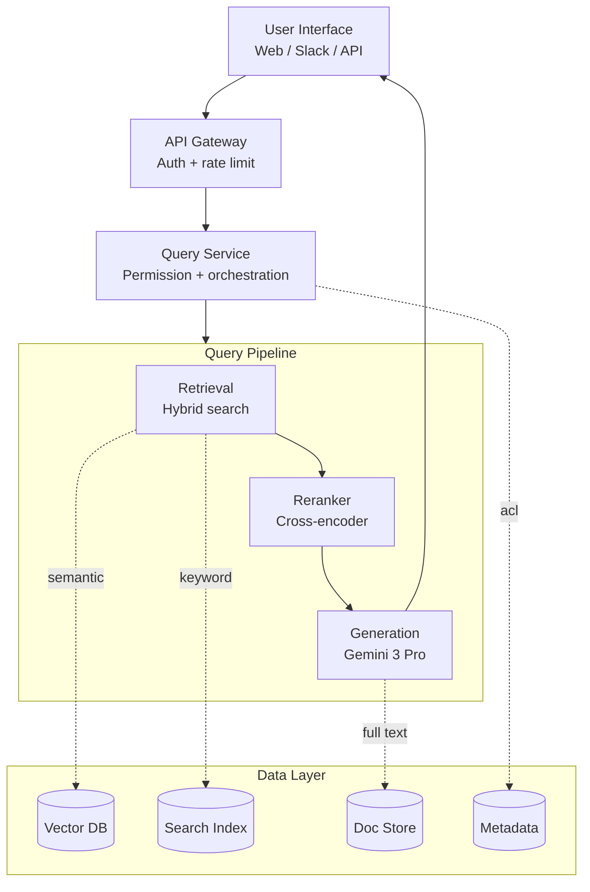
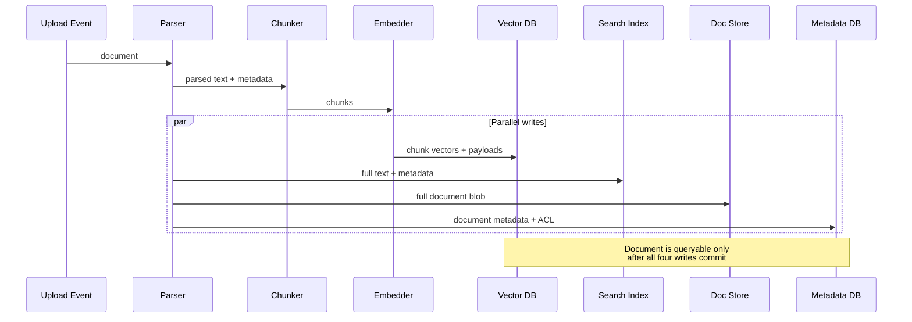
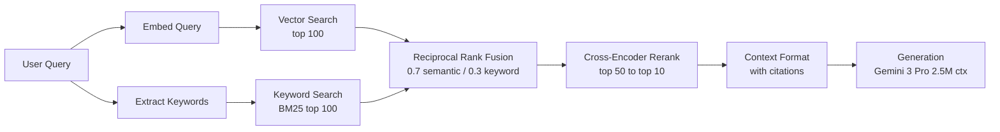

<a name="case-study-enterprise-rag-system"></a>
# 案例研究：企業級 RAG 系統

本案例研究詳細介紹如何為企業文件搜尋設計生產級 RAG 系統，涵蓋需求收集、架構決策與實作細節。

<a name="table-of-contents"></a>
## 目錄

- [問題陳述](#problem-statement)
- [需求分析](#requirements-analysis)
- [系統架構](#system-architecture)
- [元件深度解析](#component-deep-dives)
- [擴展考量](#scaling-considerations)
- [成本分析](#cost-analysis)
- [學到的經驗](#lessons-learned)
- [面試演練](#interview-walkthrough)

---

<a name="problem-statement"></a>
## 問題陳述

<a name="scenario"></a>
### 情境

一家金融服務公司希望為其內部文件建立 AI 驅動的搜尋系統：
- 500,000 份文件（政策、程序、研究報告）
- 5,000 名跨部門員工
- 文件每日更新
- 嚴格的合規與稽核要求
- 需要以附引用來源的方式回答問題

<a name="current-pain-points"></a>
### 現有痛點

- 員工每天花費 2 小時以上搜尋資訊
- 關鍵字搜尋回傳過多不相關結果
- 知識在各部門間形成孤島
- 新員工需要數月才能上手

---

<a name="requirements-analysis"></a>
## 需求分析

<a name="functional-requirements"></a>
### 功能需求

| 需求 | 優先級 | 備註 |
|------|--------|------|
| 自然語言問答 | P0 | 核心功能 |
| 來源引用 | P0 | 合規要求 |
| 跨文件推理 | P1 | 連結跨文件資訊 |
| 追問問題 | P1 | 對話上下文 |
| 文件摘要 | P2 | 長文件快速概覽 |

<a name="non-functional-requirements"></a>
### 非功能需求

| 需求 | 目標 | 理由 |
|------|------|------|
| 延遲（P95） | < 5 秒 | 使用者體驗 |
| 準確度 | > 90% | 信任與採用 |
| 可用性 | 99.9% | 業務關鍵 |
| 同時線上使用者 | 500 | 尖峰使用量 |
| 文件新鮮度 | < 1 小時 | 政策更新 |

<a name="security-requirements"></a>
### 安全需求

- 角色型存取控制（RBAC）
- 所有查詢的稽核日誌
- 資料不離開公司網路
- PII 偵測與處理

---

<a name="system-architecture"></a>
## 系統架構

<a name="high-level-architecture"></a>
### 高層架構

```
┌─────────────────────────────────────────────────────────────────────────┐
│                           User Interface                                │
│  (Web App, Slack Bot, API)                                             │
└─────────────────────────────┬───────────────────────────────────────────┘
                              │
                              ▼
┌─────────────────────────────────────────────────────────────────────────┐
│                          API Gateway                                    │
│  • Authentication    • Rate Limiting    • Request Routing              │
└─────────────────────────────┬───────────────────────────────────────────┘
                              │
                              ▼
┌─────────────────────────────────────────────────────────────────────────┐
│                        Query Service                                    │
│  • Query understanding   • Permission check   • Orchestration          │
└─────────────────────────────┬───────────────────────────────────────────┘
                              │
        ┌─────────────────────┼─────────────────────┐
        │                     │                     │
        ▼                     ▼                     ▼
┌───────────────┐   ┌───────────────┐   ┌───────────────┐
│   Retrieval   │   │   Reranking   │   │  Generation   │
│   Service     │   │   Service     │   │   Service     │
│               │   │               │   │               │
│ • Hybrid      │   │ • Cross-      │   │ • LLM         │
│   search      │   │   encoder     │   │ • Prompt      │
│ • Filtering   │   │ • Scoring     │   │   building    │
└───────┬───────┘   └───────────────┘   └───────────────┘
        │
        ▼
┌─────────────────────────────────────────────────────────────────────────┐
│                        Data Layer                                       │
│                                                                         │
│  ┌─────────────┐  ┌─────────────┐  ┌─────────────┐  ┌─────────────┐   │
│  │  Vector DB  │  │ Search Index│  │  Doc Store  │  │  Metadata   │   │
│  │  (Qdrant)   │  │ (Elastic)   │  │   (S3)      │  │  (Postgres) │   │
│  └─────────────┘  └─────────────┘  └─────────────┘  └─────────────┘   │
│                                                                         │
└─────────────────────────────────────────────────────────────────────────┘

┌─────────────────────────────────────────────────────────────────────────┐
│                      Ingestion Pipeline                                 │
│  Document Upload → Parse → Chunk → Embed → Index → Store Metadata      │
└─────────────────────────────────────────────────────────────────────────┘
```

以流程圖呈現（分層系統在查詢管道中展開，並透過資料層匯聚）：



<a name="technology-choices-dec-2025-update"></a>
### 技術選型（2025 年 12 月更新）

| 元件 | 選擇 | 理由 |
|------|------|------|
| **主要 LLM** | Gemini 3.0 Pro | 原生 **250 萬 token 上下文**，可直接處理 100+ 份文件而不需切割 |
| **代理人 LLM** | GPT-5.2 | 業界領先的工具使用準確度，適合複雜跨文件分析 |
| **檢索器** | Gemini 3 Flash | 在大量上下文視窗上低成本檢索 |
| **嵌入** | text-embedding-3-large | 品質經驗證且具成本效益 |
| **向量資料庫** | Qdrant（自行託管） | 效能、過濾能力與本地合規需求 |
| **重排序器** | BGE-Reranker-v2-X | 適合本地隔離的開源最佳模型 |

> [!NOTE]
> **趨勢轉變：** 生產團隊已從「小型區塊 RAG」轉向**「均衡上下文 RAG」**。所有主流前沿模型都具備 1M–2M token 的上下文視窗，我們不再需要找到「完美的 512 token 區塊」。我們改為檢索整個文件片段（10k–50k token），讓模型原生的注意力機制來處理細節。

---

<a name="component-deep-dives"></a>
## 元件深度解析

<a name="document-ingestion-pipeline"></a>
### 文件攝取管道

```python
class IngestionPipeline:
    def __init__(self):
        self.parser = DocumentParser()
        self.chunker = SemanticChunker(
            chunk_size=512,
            chunk_overlap=50
        )
        self.embedder = OpenAIEmbedder(model="text-embedding-3-large")
        self.vector_db = QdrantClient()
        self.metadata_db = PostgresClient()
    
    async def ingest(self, document: Document, user_context: UserContext):
        # 1. Parse document
        parsed = self.parser.parse(document)
        
        # 2. Extract metadata
        metadata = self.extract_metadata(parsed, document)
        
        # 3. Chunk
        chunks = self.chunker.chunk(parsed.text)
        
        # 4. Generate embeddings (batch)
        embeddings = await self.embedder.embed_batch([c.text for c in chunks])
        
        # 5. Store in vector DB with metadata
        points = [
            {
                "id": f"{document.id}_{i}",
                "vector": embedding,
                "payload": {
                    "document_id": document.id,
                    "chunk_index": i,
                    "text": chunk.text,
                    "department": metadata.department,
                    "access_level": metadata.access_level,
                    "created_at": metadata.created_at.isoformat()
                }
            }
            for i, (chunk, embedding) in enumerate(zip(chunks, embeddings))
        ]
        
        await self.vector_db.upsert(collection="documents", points=points)
        
        # 6. Store full document
        await self.doc_store.put(document.id, parsed.text)
        
        # 7. Store metadata
        await self.metadata_db.insert_document(document.id, metadata)
        
        # 8. Index in Elasticsearch for keyword search
        await self.es_client.index(
            index="documents",
            id=document.id,
            body={"text": parsed.text, **metadata.to_dict()}
        )
```

程式碼看起來是線性序列，但有四個寫入操作是平行進行的。用時序圖呈現分流更清楚，有助於理解部分失敗的模式：



<a name="query-processing"></a>
### 查詢處理

```python
class QueryService:
    def __init__(self):
        self.retriever = HybridRetriever()
        self.reranker = CohereReranker()
        self.generator = LLMGenerator()
        self.guardrails = GuardrailPipeline()
    
    async def process_query(
        self,
        query: str,
        user_context: UserContext,
        conversation_history: list[Message] = None
    ) -> QueryResponse:
        
        # 1. Input guardrails
        guardrail_result = self.guardrails.check_input(query)
        if not guardrail_result.passed:
            return QueryResponse(
                answer="I cannot help with that request.",
                blocked=True,
                reason=guardrail_result.reason
            )
        
        # 2. Query understanding (optional: rewrite query)
        processed_query = await self.understand_query(query, conversation_history)
        
        # 3. Retrieve candidates with permission filtering
        candidates = await self.retriever.search(
            query=processed_query,
            filters=self.build_permission_filter(user_context),
            top_k=50
        )
        
        # 4. Rerank
        reranked = await self.reranker.rerank(
            query=processed_query,
            documents=candidates,
            top_k=10
        )
        
        # 5. Build context
        context = self.build_context(reranked)
        
        # 6. Generate answer
        answer = await self.generator.generate(
            query=query,
            context=context,
            conversation_history=conversation_history
        )
        
        # 7. Output guardrails
        guardrail_result = self.guardrails.check_output(answer, context)
        if not guardrail_result.passed:
            answer = self.fallback_response()
        
        # 8. Build response with citations
        return QueryResponse(
            answer=answer,
            sources=[self.format_source(doc) for doc in reranked[:5]],
            confidence=self.calculate_confidence(reranked)
        )
    
    def build_permission_filter(self, user_context: UserContext) -> dict:
        return {
            "should": [
                {"key": "access_level", "match": {"value": "public"}},
                {"key": "department", "match": {"value": user_context.department}},
                {"key": "access_list", "match": {"any": [user_context.user_id]}}
            ]
        }
```

<a name="hybrid-retrieval"></a>
### 混合式檢索

```python
class HybridRetriever:
    def __init__(self, vector_weight: float = 0.7, keyword_weight: float = 0.3):
        self.vector_db = QdrantClient()
        self.es_client = ElasticsearchClient()
        self.embedder = OpenAIEmbedder()
        self.vector_weight = vector_weight
        self.keyword_weight = keyword_weight
    
    async def search(
        self,
        query: str,
        filters: dict,
        top_k: int = 50
    ) -> list[Document]:
        
        # Parallel retrieval
        vector_results, keyword_results = await asyncio.gather(
            self.vector_search(query, filters, top_k * 2),
            self.keyword_search(query, filters, top_k * 2)
        )
        
        # Reciprocal Rank Fusion
        fused = self.rrf_fusion(
            [vector_results, keyword_results],
            weights=[self.vector_weight, self.keyword_weight],
            k=60
        )
        
        return fused[:top_k]
    
    async def vector_search(self, query: str, filters: dict, top_k: int):
        query_embedding = await self.embedder.embed(query)
        
        results = await self.vector_db.search(
            collection="documents",
            query_vector=query_embedding,
            query_filter=filters,
            limit=top_k
        )
        
        return [
            Document(
                id=r.payload["document_id"],
                chunk_id=r.id,
                text=r.payload["text"],
                score=r.score,
                metadata=r.payload
            )
            for r in results
        ]
    
    def rrf_fusion(self, result_lists: list, weights: list, k: int = 60) -> list:
        scores = defaultdict(float)
        docs = {}
        
        for results, weight in zip(result_lists, weights):
            for rank, doc in enumerate(results):
                rrf_score = weight / (k + rank + 1)
                scores[doc.chunk_id] += rrf_score
                docs[doc.chunk_id] = doc
        
        sorted_ids = sorted(scores.keys(), key=lambda x: scores[x], reverse=True)
        return [docs[id] for id in sorted_ids]
```

混合式檢索流程一覽。兩個平行檢索器，再由 RRF 以加權排名融合，接著由交叉編碼器對前幾名候選進行重排序，最後進行上下文格式化：



<a name="generation-with-massive-context-dec-2025"></a>
### 大規模上下文生成（2025 年 12 月）

```python
class GeminiGenerator:
    def __init__(self):
        self.client = genai.GenerativeModel("gemini-3.0-pro")
    
    async def generate(
        self,
        query: str,
        context_docs: list[Document],
        conversation_history: list[Message] = None
    ) -> str:
        # 2.5M context allows passing ENTIRE documents, not just snippets
        system_instruction = """
        You are an enterprise knowledge assistant. 
        Analyze the provided documents to answer the query accurately.
        Cite every claim using [[DocName:PageNumber]] format.
        """
        
        contents = [{"text": doc.text} for doc in context_docs]
        contents.append({"text": f"User Query: {query}"})
        
        response = await self.client.generate_content_async(
            contents,
            generation_config=genai.types.GenerationConfig(temperature=0.0)
        )
        return response.text
```

> [!TIP]
> **生產選擇 vs. 前沿技術**
> 雖然 Gemini 3.1 Pro 提供 100 萬 token 的上下文視窗，許多生產系統仍以 **Claude Sonnet 4.6** 或 **GPT-5.5** 作為主要生成器。
> 
> **原因：**
> - **成熟度**：超過 12 個月的生產追蹤記錄。
> - **可預測性**：已知的延遲模式，長尾請求上較少出現「幻覺飆升」。
> - **SDK 穩定性**：與 LangGraph 和 LlamaIndex 等框架深度整合。
> - **成本**：針對高量標準 RAG 最佳化的定價。

---

<a name="scaling-considerations"></a>
## 擴展考量

<a name="handling-500k-documents"></a>
### 處理 50 萬份文件

```python
# Sharding strategy for Qdrant
qdrant_config = {
    "collection": "documents",
    "vectors": {
        "size": 3072,  # text-embedding-3-large
        "distance": "Cosine"
    },
    "optimizers": {
        "indexing_threshold": 20000  # Build index after 20K points
    },
    "replication_factor": 2,  # High availability
    "shard_number": 4  # Distribute across nodes
}
```

<a name="handling-500-concurrent-users"></a>
### 處理 500 位同時線上使用者

```
Load Balancer
     │
     ├──► Query Service (replica 1)
     ├──► Query Service (replica 2)
     ├──► Query Service (replica 3)
     └──► Query Service (replica 4)
            │
            ├──► Vector DB (3-node cluster)
            ├──► LLM API (with retry/fallback)
            └──► Elasticsearch (3-node cluster)
```

<a name="caching-strategy"></a>
### 快取策略

```python
class QueryCache:
    def __init__(self):
        self.exact_cache = Redis(ttl=3600)  # 1 hour
        self.semantic_cache = SemanticCache(threshold=0.95, ttl=1800)
    
    async def get_or_compute(self, query: str, user_context: UserContext) -> QueryResponse:
        # Check exact cache
        cache_key = self.make_key(query, user_context.permissions)
        cached = await self.exact_cache.get(cache_key)
        if cached:
            return cached
        
        # Check semantic cache
        similar = await self.semantic_cache.find_similar(query, user_context.permissions)
        if similar:
            return similar
        
        # Compute
        response = await self.query_service.process_query(query, user_context)
        
        # Cache result
        await self.exact_cache.set(cache_key, response)
        await self.semantic_cache.add(query, user_context.permissions, response)
        
        return response
```

---

<a name="cost-analysis"></a>
## 成本分析

<a name="monthly-cost-estimate-500-users-100-queriesuserday"></a>
### 每月成本估算（500 位使用者，每人每天 100 次查詢）

| 元件 | 計算方式 | 每月成本 |
|------|----------|----------|
| LLM（Claude Sonnet） | 150 萬次查詢 × 2K token × $3/1M 輸入 + 500 token × $15/1M 輸出 | ~$20,250 |
| 嵌入 | 150 萬次查詢 × $0.13/1M | ~$200 |
| 重排序（Cohere） | 150 萬 × 50 份文件 × $0.001/1K | ~$75 |
| 向量資料庫（Qdrant Cloud） | 3 節點叢集 | ~$1,500 |
| Elasticsearch | 3 節點叢集 | ~$2,000 |
| 運算（查詢服務） | 4 個執行個體 | ~$1,000 |
| **合計** | | **~$25,000/月** |

<a name="cost-optimization-opportunities"></a>
### 成本最佳化機會

1. **快取**：30% 快取命中率 → LLM 節省 $6K
2. **模型路由**：將簡單查詢路由至較便宜的模型 → 節省 40%
3. **批次嵌入**：使用非同步批次處理 → 節省 20%
4. **自行託管重排序器**：以開源替換 Cohere → 消除 $75

---

<a name="lessons-learned"></a>
## 學到的經驗

<a name="what-worked-well"></a>
### 成效良好之處

1. **混合式搜尋**：結合語意 + 關鍵字顯著提升召回率
2. **重排序**：前 5 名精確度提升 15%
3. **清晰的引用**：建立使用者信任
4. **在檢索時進行權限過濾**：無需事後過濾

<a name="challenges-encountered"></a>
### 遭遇的挑戰

1. **表格擷取**：含複雜表格的 PDF 需要自訂解析
2. **縮寫詞**：特定領域縮寫需要展開處理
3. **新鮮度**：1 小時的新鮮度要求需要串流攝取
4. **長文件**：超過 100 頁的文件需要層次化分塊

<a name="what-we-would-do-differently"></a>
### 如果重來會有哪些不同

1. 更早建立更好的文件解析
2. 在擴展之前先建立評估管道
3. 從第一天起就實作查詢日誌
4. 更快與使用者建立回饋迴圈

---

<a name="interview-walkthrough"></a>
## 面試演練

<a name="how-to-present-this-in-an-interview"></a>
### 如何在面試中呈現

**開場（2 分鐘）：**
「我將設計一個用於內部文件搜尋的企業級 RAG 系統。讓我先釐清幾個需求……」

**需求（3 分鐘）：**
- 詢問規模、延遲、準確度目標
- 釐清安全需求
- 了解文件類型與更新頻率

**高層設計（5 分鐘）：**
- 繪製架構圖
- 說明關鍵元件
- 說明技術選型理由

**深度解析（10 分鐘）：**
- 檢索策略（混合式搜尋，原因）
- 安全性（查詢時進行權限過濾）
- 生成（提示工程、引用）
- 擴展性（分片、快取、副本）

**取捨（5 分鐘）：**
- 成本 vs. 延遲（模型選擇）
- 準確度 vs. 延遲（重排序增加時間）
- 新鮮度 vs. 成本（串流 vs. 批次）

**監控（2 分鐘）：**
- 關鍵指標（延遲、準確度、使用者回饋）
- 如何偵測問題
- 持續改善迴圈

---

*下一章：[案例研究：對話式 AI 代理人](02-conversational-agent.md)*
