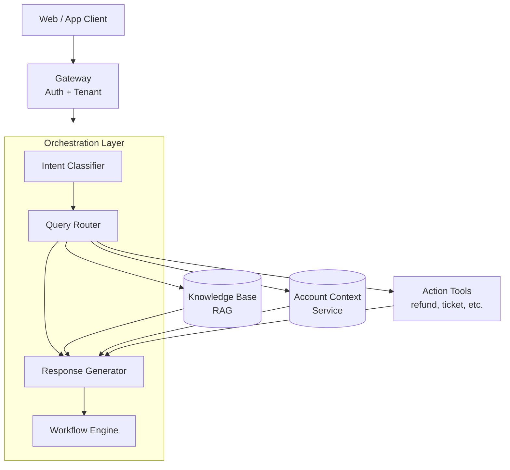
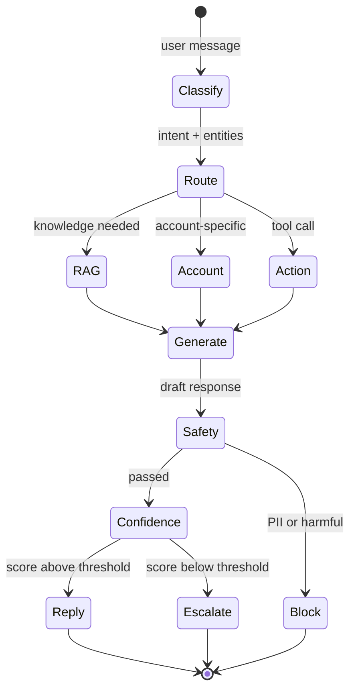
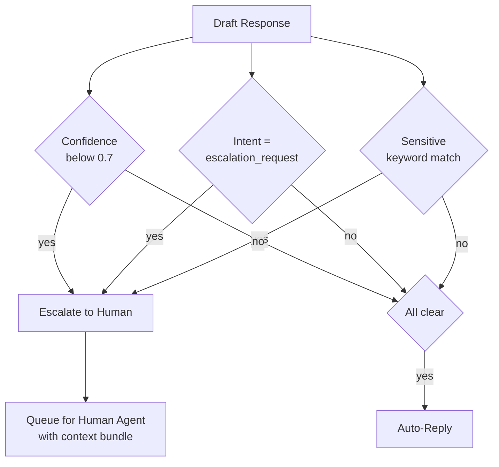

<a name="case-study-customer-support-conversational-agent"></a>
# 案例研究：客戶支援對話式代理人

本案例研究詳細介紹如何為一家 B2B SaaS 公司設計生產級客戶支援代理人。

<a name="table-of-contents"></a>
## 目錄

- [問題陳述](#problem-statement)
- [需求分析](#requirements-analysis)
- [架構設計](#architecture-design)
- [元件深度解析](#component-deep-dives)
- [可靠性模式](#reliability-patterns)
- [評估與監控](#evaluation-and-monitoring)
- [成本分析](#cost-analysis)
- [學到的經驗](#lessons-learned)
- [面試演練](#interview-walkthrough)

---

<a name="problem-statement"></a>
## 問題陳述

**公司：** 擁有 5 萬個企業客戶的 B2B SaaS 平台

**現況：**
- 每月 50 萬張支援票券
- 平均回應時間：4 小時
- 客戶滿意度（CSAT）：72%
- 支援團隊：100 名專員

**目標：**
- 將常見查詢的回應時間縮短至 5 分鐘以內
- 將 CSAT 提升至 85% 以上
- 60% 的票券無需人工介入即可處理
- 維持升級票券的品質

---

<a name="requirements-analysis"></a>
## 需求分析

<a name="functional-requirements"></a>
### 功能需求

| 需求 | 說明 | 優先級 |
|------|------|--------|
| 查詢理解 | 分類意圖、提取實體 | P0 |
| 知識檢索 | 搜尋產品文件、FAQ、過去票券 | P0 |
| 帳戶上下文 | 存取使用者的訂閱與歷史記錄 | P0 |
| 回應生成 | 自然、準確、有幫助的回應 | P0 |
| 對話記憶 | 多輪對話上下文 | P0 |
| 動作執行 | 建立票券、觸發工作流程 | P1 |
| 人工升級 | 需要時無縫交接 | P0 |
| 帳單查詢 | 處理敏感財務資料 | P1 |

<a name="non-functional-requirements"></a>
### 非功能需求

| 需求 | 目標 | 理由 |
|------|------|------|
| 延遲（TTFT） | < 1 秒 | 聊天的使用者預期 |
| 延遲（完整） | < 5 秒 | 維持參與度 |
| 可用性 | 99.9% | 業務關鍵 |
| 準確度 | > 95% | 客戶信任 |
| 升級率 | < 40% | 成本效率 |
| CSAT | > 85% | 業務目標 |

<a name="security-requirements"></a>
### 安全需求

- 日誌中不得有 PII
- 租戶隔離（客戶只能看到自己的資料）
- 所有動作的稽核記錄
- SOC 2 合規

---

<a name="architecture-design"></a>
## 架構設計

<a name="high-level-architecture"></a>
### 高層架構

```
┌─────────────────────────────────────────────────────────────────┐
│                      CUSTOMER SUPPORT AGENT                      │
├─────────────────────────────────────────────────────────────────┤
│                                                                  │
│  ┌─────────────┐     ┌─────────────┐     ┌─────────────┐        │
│  │   Web/App   │────▶│   Gateway   │────▶│    Auth     │        │
│  │   Client    │     │             │     │  + Tenant   │        │
│  └─────────────┘     └──────┬──────┘     └─────────────┘        │
│                             │                                    │
│                             ▼                                    │
│  ┌──────────────────────────────────────────────────────────┐   │
│  │                   ORCHESTRATION LAYER                     │   │
│  │  ┌────────────────────────────────────────────────────┐  │   │
│  │  │  Intent        Query          Response    Workflow │  │   │
│  │  │  Classifier → Router →        Generator → Engine   │  │   │
│  │  └────────────────────────────────────────────────────┘  │   │
│  └──────────────────────────────────────────────────────────┘   │
│                             │                                    │
│         ┌───────────────────┼───────────────────┐               │
│         ▼                   ▼                   ▼               │
│  ┌─────────────┐     ┌─────────────┐     ┌─────────────┐        │
│  │  Knowledge  │     │   Account   │     │   Action    │        │
│  │    Base     │     │   Context   │     │   Tools     │        │
│  │   (RAG)     │     │   Service   │     │             │        │
│  └─────────────┘     └─────────────┘     └─────────────┘        │
│                                                                  │
└─────────────────────────────────────────────────────────────────┘
```

以分層流程圖呈現。協調層分派至三個平行上下文來源，再由回應生成器組合：



<a name="conversation-flow"></a>
### 對話流程

```
User Message
    │
    ▼
┌─────────────────┐
│ Intent Classify │─── billing, technical, account, general, escalation
└────────┬────────┘
         │
         ▼
┌─────────────────┐
│ Query Routing   │─── Which knowledge sources? Which tools?
└────────┬────────┘
         │
    ┌────┴────┬────────────┐
    ▼         ▼            ▼
┌───────┐ ┌───────┐ ┌──────────┐
│  RAG  │ │Account│ │ Actions  │
│ Query │ │Context│ │ (if any) │
└───┬───┘ └───┬───┘ └────┬─────┘
    │         │          │
    └────┬────┴──────────┘
         │
         ▼
┌─────────────────┐
│    Generate     │
│    Response     │
└────────┬────────┘
         │
         ▼
┌─────────────────┐
│  Safety Check   │─── PII, harmful, off-topic
└────────┬────────┘
         │
         ▼
┌─────────────────┐
│  Confidence     │─── Low confidence? Escalate
│    Check        │
└────────┬────────┘
         │
         ▼
    Response / Escalation
```

一輪對話是一個狀態機。對成本與信任最重要的兩個閘道是*安全性*（離開系統前必須通過）和*信心值*（決定升級 vs. 自動回覆）：



---

<a name="component-deep-dives"></a>
## 元件深度解析

<a name="intent-classification-dec-2025"></a>
### 意圖分類（2025 年 12 月）

```python
class IntentClassifier:
    async def classify(self, message: str, history: list[dict]) -> dict:
        # Using GPT-5.5-mini for <100ms classification latency
        result = await client.chat.completions.create(
            model="gpt-5.2-mini",
            messages=[{"role": "user", "content": message}],
            response_format={"type": "json_object"}
        )
        return json.loads(result.choices[0].message.content)
```

<a name="knowledge-base-gemini-3-flash-rag"></a>
### 知識庫（Gemini 3 Flash RAG）

```python
class SupportKnowledgeBase:
    async def retrieve(self, query: str, context_window: int = 1_000_000) -> list[dict]:
        # Using Gemini 3 Flash for massive context retrieval
        # No more 'reranking' needed for many standard support tasks
        results = await self.sources.search(query, limit=50) 
        return results
```

<a name="response-generation-claude-sonnet-46"></a>
### 回應生成（Claude Sonnet 4.6）

```python
class ResponseGenerator:
    async def generate(self, query: str, context: list[dict]) -> dict:
        # Claude Sonnet 4.6 for 'Hybrid Reasoning'
        # Toggle 'Thinking' mode for complex billing issues
        is_complex = self.detect_complexity(query)
        
        response = await self.anthropic.messages.create(
            model="claude-3-7-sonnet-20250219",
            thinking={"enabled": is_complex, "budget_tokens": 2048},
            messages=[{"role": "user", "content": f"Context: {context}\nQuery: {query}"}]
        )
        return {"response": response.content[0].text}
```

> [!NOTE]
> **生產實務智慧：** 雖然 Gemini 3 Flash 非常適合高量檢索，但對於許多已花費數月針對其特定個性和拒絕模式微調安全護欄的支援團隊而言，**Claude 3.5 Sonnet** 仍然是最「穩定」的生成器。

---

<a name="reliability-patterns"></a>
## 可靠性模式

<a name="confidence-based-escalation"></a>
### 基於信心值的升級

```python
class EscalationHandler:
    def __init__(self, confidence_threshold: float = 0.7):
        self.threshold = confidence_threshold
    
    async def check_escalation(
        self,
        response: dict,
        intent: str,
        user_request: str
    ) -> dict:
        should_escalate = False
        reason = None
        
        # Low confidence
        if response["confidence"] < self.threshold:
            should_escalate = True
            reason = "low_confidence"
        
        # Explicit escalation request
        if intent == "escalation_request":
            should_escalate = True
            reason = "user_requested"
        
        # Sensitive topics
        if await self.is_sensitive(user_request):
            should_escalate = True
            reason = "sensitive_topic"
        
        if should_escalate:
            return await self.create_escalation(response, reason)
        
        return {"escalate": False, "response": response}
    
    async def is_sensitive(self, message: str) -> bool:
        sensitive_keywords = [
            "legal", "lawsuit", "lawyer",
            "refund", "cancel subscription",
            "competitor", "data breach"
        ]
        return any(kw in message.lower() for kw in sensitive_keywords)
```

升級決策結合三個獨立信號，任一信號觸發即進行交接。以決策樹呈現 OR 語意更直觀，也更容易擴充第四個信號：



<a name="multi-turn-memory"></a>
### 多輪對話記憶

```python
class ConversationMemory:
    def __init__(self, max_turns: int = 10):
        self.max_turns = max_turns
        self.redis = Redis()
    
    async def get_history(self, session_id: str) -> list[dict]:
        key = f"conversation:{session_id}"
        history = await self.redis.get(key)
        if history:
            return json.loads(history)
        return []
    
    async def add_turn(
        self,
        session_id: str,
        user_message: str,
        assistant_message: str
    ):
        history = await self.get_history(session_id)
        
        history.append({"role": "user", "content": user_message})
        history.append({"role": "assistant", "content": assistant_message})
        
        # Trim to max turns
        if len(history) > self.max_turns * 2:
            history = history[-(self.max_turns * 2):]
        
        await self.redis.setex(
            f"conversation:{session_id}",
            3600,  # 1 hour TTL
            json.dumps(history)
        )
```

---

<a name="evaluation-and-monitoring"></a>
## 評估與監控

<a name="quality-metrics"></a>
### 品質指標

```python
class QualityMonitor:
    def __init__(self, sample_rate: float = 0.05):
        self.sample_rate = sample_rate
        self.judge = LLMJudge()
    
    async def evaluate(self, conversation: dict):
        if random.random() > self.sample_rate:
            return
        
        scores = await self.judge.evaluate(
            query=conversation["user_message"],
            response=conversation["assistant_message"],
            context=conversation["context"],
            criteria={
                "relevance": "Does the response address the user's question?",
                "accuracy": "Is the information correct based on the context?",
                "helpfulness": "Would this response help the user?",
                "tone": "Is the tone professional and empathetic?"
            }
        )
        
        # Record metrics
        for criterion, score in scores.items():
            metrics.record(f"quality_{criterion}", score)
```

<a name="dashboard-metrics"></a>
### 儀表板指標

| 指標 | 目標 | 實際 |
|------|------|------|
| 延遲（TTFT） | < 1 秒 | 0.8 秒 |
| 延遲（完整） | < 5 秒 | 3.2 秒 |
| 準確度 | > 95% | 94.3% |
| 升級率 | < 40% | 38% |
| CSAT | > 85% | 87% |
| 解決率 | > 60% | 62% |

---

<a name="cost-analysis"></a>
## 成本分析

<a name="per-conversation-cost-breakdown-dec-2025"></a>
### 每次對話成本細分（2025 年 12 月）

| 元件 | 成本 | 備註 |
|------|------|------|
| 意圖分類 | $0.0001 | GPT-5.5-mini（$0.10/1M） |
| RAG 檢索 | $0.0001 | Gemini 3 Flash（$0.05/1M） |
| 思考模式 | $0.0050 | Claude Sonnet 4.6 Thinking（平均 250 token） |
| 回應生成 | $0.0030 | Claude Sonnet 4.6（$3/1M 輸入） |
| 品質抽樣 | $0.0001 | 5% 抽樣率（GPT-5.5） |
| **合計** | **~$0.0083** | **每次對話（比 2024 年減少 62%）** |

<a name="monthly-cost-projection"></a>
### 每月成本預測

| 項目 | 計算方式 | 成本 |
|------|----------|------|
| 對話次數 | 50 萬 × $0.022 | $11,000 |
| 基礎架構 | 固定 | $2,000 |
| 人工升級 | 19 萬 × $5（人工成本） | $950,000 |
| **合計** | | $963,000 |
| **與全人工相比的節省** | 50 萬 × $5 - $963K | 每年 $150 萬 |

---

<a name="lessons-learned"></a>
## 學到的經驗

<a name="what-worked"></a>
### 成效良好之處

1. **基於意圖的路由**：透過聚焦於相關來源的檢索，減少了延遲
2. **基於信心值的升級**：在降低人工負擔的同時維持品質
3. **帳戶上下文**：使回應更個人化且準確
4. **較低溫度（0.3）**：改善了支援回應的一致性

<a name="what-did-not-work-initially"></a>
### 最初不成效之處

1. **對所有任務使用單一模型**：將不同任務路由至不同模型後，品質改善
2. **升級閾值設定太高**：初始信心值設為 0.9，導致升級次數過多
3. **完整對話歷史**：超出上下文限制，改用摘要方式處理

<a name="recommendations"></a>
### 建議

1. 從較高的升級率開始，隨著信心提升逐步降低
2. 依升級原因監控 CSAT，以識別弱點
3. 使用支援領域特定詞彙重新訓練嵌入模型
4. 建立回饋迴圈：讓專員標記升級對話作為訓練資料

---

<a name="interview-walkthrough"></a>
## 面試演練

**面試官：**「為一家 SaaS 公司設計 AI 客戶支援系統。」

**優質回答模式：**

1. **釐清需求**（2 分鐘）
   - 「票券量是多少？有哪些管道？目前的 CSAT 是多少？」

2. **明確說明限制條件**
   - 「關鍵限制：準確度優先於速度、無縫升級、租戶隔離」

3. **高層架構**（3 分鐘）
   - 繪製流程：意圖 → 路由 → RAG → 生成 → 安全性 → 回應／升級

4. **關鍵元件深度解析**（5 分鐘）
   - 「讓我詳細說明基於信心值的升級……」

5. **處理可靠性**（3 分鐘）
   - 「對於可靠性，我會對帳單查詢使用自洽性（self-consistency），並採用多供應商備援」

6. **指標與監控**（2 分鐘）
   - 「關鍵指標：CSAT、解決率、升級率、準確度抽樣」

7. **成本考量**（1 分鐘）
   - 「每月 50 萬次對話，每次對話的成本至關重要。模型路由有助於控制成本。」

---

<a name="references"></a>
## 參考資料

- Anthropic Customer Support Best Practices: https://docs.anthropic.com/claude/docs/customer-service
- LangChain Conversational Agents: https://python.langchain.com/docs/use_cases/chatbots

---

*下一章：[程式碼助手案例研究](03-code-assistant.md)*
