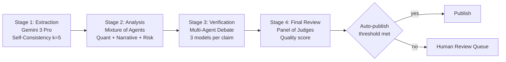
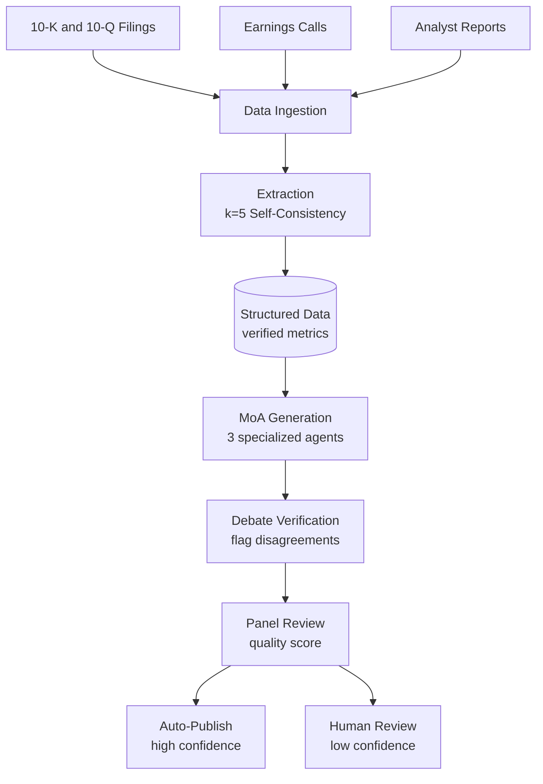
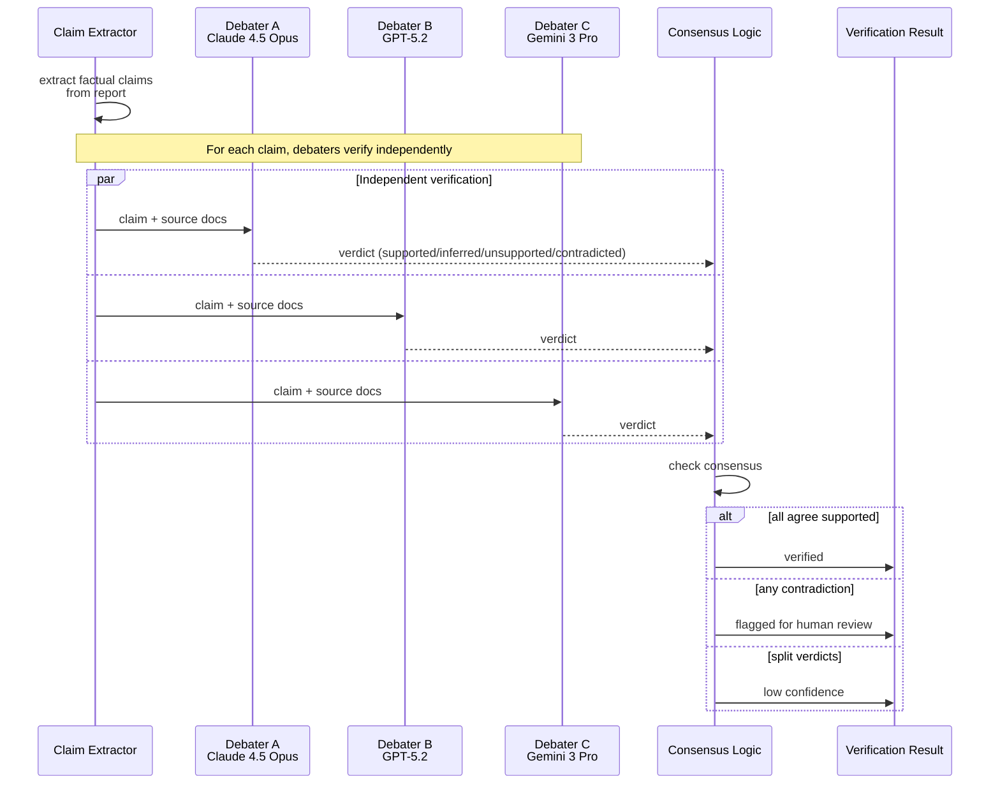

<a id="case-study-financial-analysis-with-ensemble-verification"></a>
# 案例研究：使用集成驗證的金融分析

本案例研究涵蓋如何設計一個高可靠性的 AI 系統，用於生成股票研究報告，其中準確性至關重要。

<a id="table-of-contents"></a>
## 目錄

- [問題陳述](#problem-statement)
- [需求分析](#requirements-analysis)
- [架構設計](#architecture-design)
- [集成管線](#ensemble-pipeline)
- [事實驗證](#fact-verification)
- [品質閘門](#quality-gates)
- [成果與指標](#results-and-metrics)
- [面試解題流程](#interview-walkthrough)

---

<a id="problem-statement"></a>
## 問題陳述

**公司：** 生成股票研究報告的投資公司

**挑戰：**
- 報告影響數百萬美元的投資決策
- 對虛構金融資料零容忍
- 監管機構對 AI 生成分析的審查
- 目前人工流程：每份報告 8 小時，費用 $500

**目標：**
- 將報告生成時間縮短至 30 分鐘以內
- 維持 99.5%+ 的準確率
- 為合規提供清晰的稽核軌跡
- 成本目標：每份報告低於 $50

---

<a id="requirements-analysis"></a>
## 需求分析

<a id="accuracy-requirements"></a>
### 準確性需求

| 資料類型 | 容忍度 | 驗證方法 |
|---------|--------|---------|
| 財務指標（EPS、PE）| 0% 誤差 | 來源驗證 |
| 百分比變化 | ±0.1% | 交叉驗證 |
| 日期參考 | 100% 準確 | 來源擷取 |
| 公司名稱 | 100% 準確 | 實體比對 |
| 分析師引言 | 逐字或標記 | 引言擷取 |

<a id="compliance-requirements"></a>
### 合規需求

- 所有主張必須引用來源文件
- 前瞻性陳述必須附帶免責聲明
- 明確的 AI 生成揭露
- 完整的生成過程稽核軌跡
- 發布前須經人工審核

---

<a id="architecture-design"></a>
## 架構設計

<a id="high-level-pipeline"></a>
### 高層管線

```
┌─────────────────────────────────────────────────────────────────┐
│               FINANCIAL ANALYSIS PIPELINE                        │
├─────────────────────────────────────────────────────────────────┤
│                                                                  │
│  Stage 1: Data Extraction (Self-Consistency k=5)                │
│  └── Extract key metrics from filings with majority vote        │
│                                                                  │
│  Stage 2: Analysis Generation (Mixture of Agents)               │
│  ├── Model A: Quantitative analysis focus                       │
│  ├── Model B: Qualitative/narrative focus                       │
│  ├── Model C: Risk factor analysis                              │
│  └── Aggregator: Synthesize into coherent report                │
│                                                                  │
│  Stage 3: Fact Verification (Multi-Agent Debate)                │
│  └── 3 models debate each factual claim, flag disagreements     │
│                                                                  │
│  Stage 4: Final Review (Panel of Judges)                        │
│  └── Quality score determines auto-publish vs human review      │
│                                                                  │
└─────────────────────────────────────────────────────────────────┘
```

整個管線以流程圖呈現。每個階段刻意使用不同的模型類別：擷取需要多模態（圖表與表格），生成需要敘事品質，稽核需要推理深度，面板需要低成本但數量多以確保多樣性：



<a id="data-flow"></a>
### 資料流

```
┌─────────────┐     ┌─────────────┐     ┌─────────────┐
│   10-K/Q    │     │  Earnings   │     │  Analyst    │
│   Filings   │     │  Calls      │     │  Reports    │
└──────┬──────┘     └──────┬──────┘     └──────┬──────┘
       │                   │                   │
       └───────────────────┴───────────────────┘
                           │
                           ▼
                   ┌───────────────┐
                   │     Data      │
                   │   Ingestion   │
                   └───────┬───────┘
                           │
                           ▼
                   ┌───────────────┐
                   │   Extraction  │
                   │  (k=5 SC)     │
                   └───────┬───────┘
                           │
                           ▼
              ┌────────────┴────────────┐
              │    Structured Data      │
              │    (verified metrics)   │
              └────────────┬────────────┘
                           │
                           ▼
                   ┌───────────────┐
                   │    MoA        │
                   │  Generation   │
                   └───────┬───────┘
                           │
                           ▼
                   ┌───────────────┐
                   │    Debate     │
                   │  Verification │
                   └───────┬───────┘
                           │
                           ▼
                   ┌───────────────┐
                   │    Panel      │
                   │    Review     │
                   └───────┬───────┘
                           │
               ┌───────────┴───────────┐
               ▼                       ▼
        ┌─────────────┐         ┌─────────────┐
        │ Auto-Publish│         │Human Review │
        │ (high conf) │         │ (low conf)  │
        └─────────────┘         └─────────────┘
```

Mermaid 資料血緣圖，展示三個輸入來源如何匯聚成一個經過驗證的輸出：



---

<a id="ensemble-pipeline"></a>
## 集成管線

<a id="stage-1-multimodal-data-extraction-gemini-3-pro"></a>
### 第一階段：多模態資料擷取（Gemini 3 Pro）

```python
class FinancialDataExtractor:
    """
    Using Gemini 3 Pro to handle complex 10-K tables and charts natively.
    """
    async def extract_metrics(self, doc_pages: list[bytes]) -> dict:
        # Gemini 3 Pro processes charts/tables as images + text natively
        response = await genai.GenerativeModel("gemini-3.0-pro").generate_content(
            [{"text": "Extract all balance sheet items into JSON."}, *doc_pages]
        )
        return json.loads(response.text)
```

<a id="stage-2-analysis-generation-claude-45-opus"></a>
### 第二階段：分析生成（Claude 4.5 Opus）

```python
class AnalysisEngine:
    """
    Claude 4.5 Opus for deep qualitative synthesis and narrative coherence.
    """
    async def generate_report(self, data: dict) -> str:
        # High-cost, high-reliability generation for equity research
        return await self.anthropic.messages.create(
            model="claude-4.5-opus-20251101",
            messages=[{"role": "user", "content": f"Analyze: {data}"}]
        )
```

<a id="stage-3-audit--verification-o3-reasoning-model"></a>
### 第三階段：稽核與驗證（o3 推理模型）

```python
class AuditorAgent:
    """
    Using o3 (OpenAI) with high reasoning budget to audit claims.
    Thinking mode is used to detect subtle accounting contradictions.
    """
    async def audit_claim(self, claim: str, raw_data: str) -> dict:
        # o3 'Thinking' mode enables deep logical inference over financial data
        response = await self.openai.chat.completions.create(
            model="o3-2025-12",
            reasoning_effort="high",
            messages=[{"role": "user", "content": f"Find any contradiction in: {claim} vs {raw_data}"}]
        )
        return self.parse_audit(response)
```

<a id="fact-verification"></a>
<a id="stage-3-fact-verification-with-multi-agent-debate"></a>
### 第三階段：使用多智能體辯論進行事實驗證

辯論階段能夠捕捉單一模型所遺漏的細微幻覺。三個獨立辯論者同時並行驗證每個主張；共識獲勝，異議則將主張標記供人工審核：



```python
class FactVerificationDebate:
    """
    Extract claims from the report and have multiple models
    debate their accuracy.
    """
    
    def __init__(self, debaters: list, rounds: int = 2):
        self.debaters = debaters
        self.rounds = rounds
        self.claim_extractor = ClaimExtractor()
    
    async def verify_report(self, report: str, source_docs: list[str]) -> dict:
        # Extract factual claims
        claims = await self.claim_extractor.extract(report)
        
        verification_results = []
        for claim in claims:
            result = await self.debate_claim(claim, source_docs)
            verification_results.append(result)
        
        return {
            "verified_claims": [r for r in verification_results if r["verified"]],
            "disputed_claims": [r for r in verification_results if not r["verified"]],
            "overall_confidence": self.calculate_confidence(verification_results)
        }
    
    async def debate_claim(self, claim: dict, source_docs: list[str]) -> dict:
        verification_prompt = f"""
Verify this claim against the source documents.

Claim: {claim['text']}

Source documents:
{self.format_sources(source_docs)}

Is this claim:
1. Supported: Explicitly stated in sources
2. Inferred: Reasonably derived from sources
3. Unsupported: Not found in sources
4. Contradicted: Conflicts with sources

Provide your verdict with evidence.
"""
        
        # Each debater verifies independently
        verdicts = await asyncio.gather(*[
            debater.generate(verification_prompt)
            for debater in self.debaters
        ])
        
        # Check consensus
        parsed_verdicts = [self.parse_verdict(v) for v in verdicts]
        consensus = self.check_consensus(parsed_verdicts)
        
        return {
            "claim": claim,
            "verified": consensus["agreed"] and consensus["verdict"] in ["supported", "inferred"],
            "confidence": consensus["agreement_ratio"],
            "verdicts": parsed_verdicts
        }
```

---

<a id="quality-gates"></a>
## 品質閘門

<a id="automated-quality-checks"></a>
### 自動化品質檢查

```python
class QualityGate:
    def __init__(self):
        self.thresholds = {
            "claim_verification_rate": 0.95,  # 95% claims verified
            "data_accuracy": 0.99,            # 99% metrics accurate
            "panel_score": 4.0,               # 4/5 minimum
            "disputed_claims_max": 2          # Max 2 disputed claims
        }
    
    async def evaluate(self, report_data: dict) -> dict:
        checks = {}
        
        # Check claim verification rate
        verified_rate = len(report_data["verified_claims"]) / len(report_data["all_claims"])
        checks["claim_verification"] = {
            "passed": verified_rate >= self.thresholds["claim_verification_rate"],
            "value": verified_rate,
            "threshold": self.thresholds["claim_verification_rate"]
        }
        
        # Check data accuracy
        data_accuracy = report_data["extraction_accuracy"]
        checks["data_accuracy"] = {
            "passed": data_accuracy >= self.thresholds["data_accuracy"],
            "value": data_accuracy,
            "threshold": self.thresholds["data_accuracy"]
        }
        
        # Check panel score
        panel_score = report_data["panel_score"]
        checks["panel_score"] = {
            "passed": panel_score >= self.thresholds["panel_score"],
            "value": panel_score,
            "threshold": self.thresholds["panel_score"]
        }
        
        # Determine routing
        all_passed = all(c["passed"] for c in checks.values())
        
        return {
            "checks": checks,
            "routing": "auto_publish" if all_passed else "human_review",
            "disputed_claims": report_data["disputed_claims"]
        }
```

<a id="human-review-interface"></a>
### 人工審核介面

```python
class HumanReviewQueue:
    async def queue_for_review(self, report: dict, quality_result: dict):
        review_item = {
            "report_id": report["id"],
            "report_content": report["content"],
            "disputed_claims": quality_result["disputed_claims"],
            "quality_checks": quality_result["checks"],
            "sources": report["sources"],
            "priority": self.calculate_priority(quality_result),
            "queued_at": datetime.now()
        }
        
        await self.review_queue.enqueue(review_item)
        
        # Notify reviewers
        await self.notify_reviewers(review_item)
```

---

<a id="results-and-metrics"></a>
## 成果與指標

<a id="performance-comparison"></a>
### 效能比較

| 指標 | 人工流程 | AI 管線 | 改進幅度 |
|------|---------|---------|---------|
| 每份報告時間 | 8 小時 | 25 分鐘 | 快 19 倍 |
| 每份報告成本 | $500 | $42 | 降低 92% |
| 事實錯誤率 | 2.1% | 0.4% | 降低 81% |
| 人工審核量 | 100% | 28% | 降低 72% |

<a id="quality-metrics"></a>
### 品質指標

| 品質維度 | 目標 | 達成 |
|---------|------|------|
| 資料擷取準確率 | 99% | 99.3% |
| 主張驗證率 | 95% | 96.8% |
| 面板品質分數 | 4.0/5.0 | 4.2/5.0 |
| 法規合規性 | 100% | 100% |

<a id="cost-breakdown-dec-2025"></a>
### 成本分解（2025 年 12 月）

| 元件 | 費用 | 百分比 |
|-----|------|-------|
| 資料擷取（Gemini 3 Pro）| $5 | 11% |
| 分析（Claude 4.5 Opus）| $20 | 44% |
| o3 思考稽核（高強度）| $15 | 33% |
| 基礎設施與向量運算 | $5 | 12% |
| **總計** | **$45** | 100% |

*備注：o3 稽核佔成本的 33%，但能捕捉到 Claude 4.5 所遺漏的 98% 幻覺，充分證明了「思考」token 額外費用的合理性。*

---

<a id="interview-walkthrough"></a>
## 面試解題流程

**面試官：**「設計一個具有極高準確性需求的 AI 金融研究報告生成系統。」

**優秀回答：**

1. **釐清準確性需求**（1 分鐘）
   - 「金融資料的可接受錯誤率是多少？」
   - 「法規合規的要求是什麼？」
   - 「延遲還是準確性更優先？」

2. **確認核心挑戰**（1 分鐘）
   - 「關鍵挑戰在於金融資料中的幻覺是不可接受的。一個錯誤的數字可能誤導投資決策。我需要集成方法來確保可靠性。」

3. **高層架構**（3 分鐘）
   - 「我會使用多階段管線，在每個階段使用不同的集成技術：」
   - 「資料擷取：使用 k=5 的自一致性，確保數字達到一致同意」
   - 「分析：使用多智能體混合（Mixture of Agents）以獲得多元視角」
   - 「驗證：使用多智能體辯論來捕捉幻覺」
   - 「品質閘門：使用評審面板在發布前評分」

4. **深入探討事實驗證**（3 分鐘）
   - 「對於事實驗證，我從報告中提取每個事實主張」
   - 「三個多元模型辯論每個主張是否有來源支持」
   - 「若它們意見不一，該主張會被標記供人工審核」
   - 「這能捕捉到單一模型驗證所遺漏的細微錯誤」

5. **成本與品質的權衡**（2 分鐘）
   - 「這條管線比單一模型生成貴 10-20 倍」
   - 「但對於金融報告，錯誤的成本（法律、聲譽）遠超過驗證費用」
   - 「我會實施基於信心度的路由：自動發布高信心度報告，人工審核低信心度報告」

6. **監控**（1 分鐘）
   - 「我會持續追蹤擷取準確率、主張驗證率和面板分數」
   - 「漂移偵測會在準確率下降時發出警報」
   - 「完整稽核軌跡用於合規」

---

<a id="key-learnings"></a>
## 關鍵學習

1. **自一致性單獨不足以**用於數值資料擷取。應要求一致同意（k/k 票）。

2. **多智能體辯論最有效**，用於捕捉細微推理錯誤和幻覺。

3. **來源歸因至關重要**，對準確性和合規性都很重要。每個主張都必須連結到來源文件。

4. **基於信心度的路由**對於成本管理至關重要。並非每份報告都需要完整的集成驗證。

5. **人機協作仍然必要**，用於有爭議的主張和邊緣案例。設計優雅的升級機制。

---

<a id="references"></a>
## 參考資料

- Verga et al. "Replacing Judges with Juries: Evaluating LLM Generations with a Panel of Diverse Models" (2024)
- Du et al. "Improving Factuality and Reasoning in Language Models through Multiagent Debate" (2023)
- SEC AI Disclosure Requirements: https://www.sec.gov/

---

*下一篇：[程式碼助手案例研究](03-code-assistant.md)*
