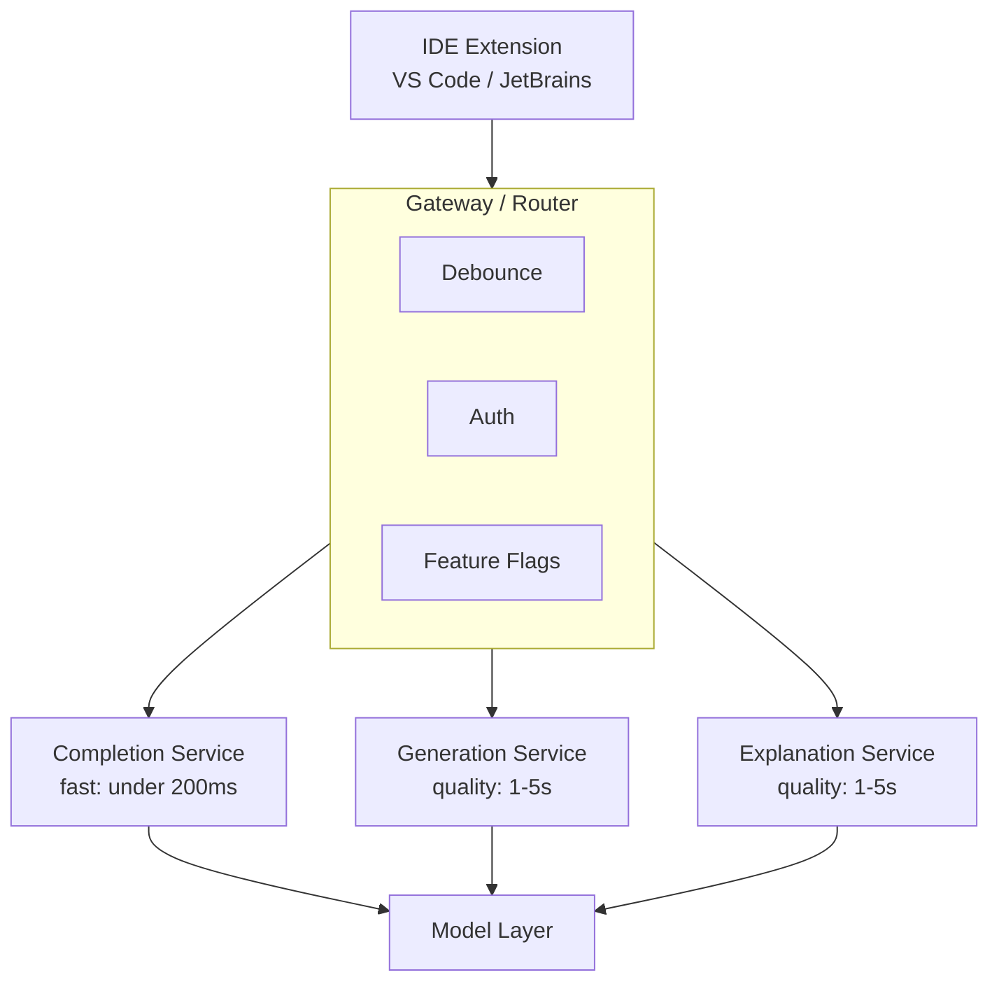
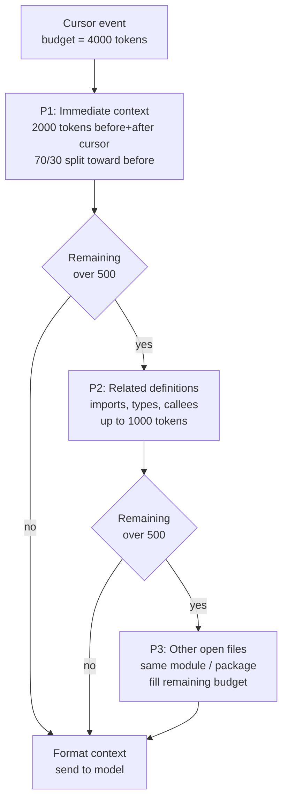
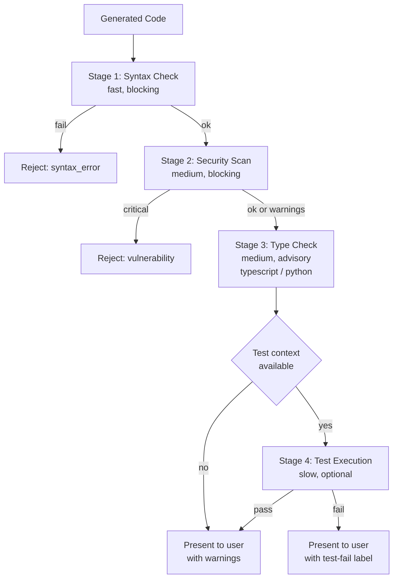

<a id="case-study-ai-code-assistant"></a>
# 案例研究：AI 程式碼助手

本案例研究涵蓋如何設計一個生產級程式碼助手，提供即時建議、程式碼生成與除錯協助。

<a id="table-of-contents"></a>
## 目錄

- [問題陳述](#problem-statement)
- [需求分析](#requirements-analysis)
- [架構設計](#architecture-design)
- [程式碼生成管線](#code-generation-pipeline)
- [品質保證](#quality-assurance)
- [效能優化](#performance-optimization)
- [成果與指標](#results-and-metrics)
- [面試解題流程](#interview-walkthrough)

---

<a id="problem-statement"></a>
## 問題陳述

**公司：** 開發 IDE 擴充功能的開發者工具公司

**目標：**
- 開發者輸入時即時補全程式碼
- 從自然語言生成多行程式碼
- 程式碼解說與除錯協助
- 支援 20 種以上程式語言

**限制：**
- 補全的延遲 < 200ms（維持打字流暢度）
- 生成的延遲 < 3s（可接受的停頓）
- 安全性：程式碼不離開客戶基礎設施（企業選項）
- 成本：在大規模下可持續（數百萬開發者）

---

<a id="requirements-analysis"></a>
## 需求分析

<a id="functional-requirements"></a>
### 功能需求

| 功能 | 說明 | 延遲目標 |
|-----|------|---------|
| 行內補全 | 補全目前行/區塊 | < 200ms |
| 多行生成 | 從註解生成函式/類別 | < 3s |
| 程式碼解說 | 解說選取的程式碼 | < 5s |
| 錯誤修正 | 建議錯誤的修正方案 | < 2s |
| 重構 | 建議改進方案 | < 5s |
| 文件 | 生成 docstring | < 2s |

<a id="quality-requirements"></a>
### 品質需求

| 維度 | 目標 | 衡量方式 |
|-----|------|---------|
| 採納率 | > 30% | 被採納的建議 / 顯示的建議 |
| 語法正確率 | > 99% | 成功編譯/解析 |
| 安全性 | 0 個漏洞 | SAST 掃描通過率 |
| 相關性 | > 85% | 使用者評分 |

---

<a id="architecture-design"></a>
## 架構設計

<a id="high-level-architecture"></a>
### 高層架構

```
┌─────────────────────────────────────────────────────────────────┐
│                    CODE ASSISTANT ARCHITECTURE                   │
├─────────────────────────────────────────────────────────────────┤
│                                                                  │
│  ┌─────────────┐                                                │
│  │     IDE     │                                                │
│  │  Extension  │                                                │
│  └──────┬──────┘                                                │
│         │                                                        │
│         ▼                                                        │
│  ┌─────────────────────────────────────────────────────────┐    │
│  │                    GATEWAY / ROUTER                      │    │
│  │  ┌──────────┐  ┌──────────┐  ┌──────────┐              │    │
│  │  │ Debounce │  │  Auth    │  │ Feature  │              │    │
│  │  │          │  │          │  │  Flags   │              │    │
│  │  └──────────┘  └──────────┘  └──────────┘              │    │
│  └─────────────────────────┬───────────────────────────────┘    │
│                            │                                     │
│         ┌──────────────────┼──────────────────┐                 │
│         ▼                  ▼                  ▼                 │
│  ┌─────────────┐    ┌─────────────┐    ┌─────────────┐         │
│  │  Completion │    │ Generation  │    │ Explanation │         │
│  │   Service   │    │  Service    │    │  Service    │         │
│  │  (fast)     │    │ (quality)   │    │ (quality)   │         │
│  └──────┬──────┘    └──────┬──────┘    └──────┬──────┘         │
│         │                  │                  │                  │
│         └──────────────────┼──────────────────┘                 │
│                            ▼                                     │
│                    ┌─────────────┐                              │
│                    │   Model     │                              │
│                    │   Layer     │                              │
│                    └─────────────┘                              │
│                                                                  │
└─────────────────────────────────────────────────────────────────┘
```

整個架構以流程圖呈現。三個服務層依延遲與品質分層（補全需低於 200ms，生成與解說優先品質），共用同一個模型層：



<a id="context-assembly"></a>
### 上下文組裝

```python
class CodeContextAssembler:
    """
    Assemble context for code completion.
    Challenge: Balance context richness with latency.
    """
    
    def __init__(self, max_tokens: int = 4000):
        self.max_tokens = max_tokens
    
    def assemble(
        self,
        cursor_position: dict,
        file_content: str,
        open_files: list[dict],
        project_context: dict
    ) -> str:
        context_parts = []
        remaining_tokens = self.max_tokens
        
        # Priority 1: Immediate context (before and after cursor)
        immediate = self.get_immediate_context(
            file_content, cursor_position, tokens=2000
        )
        context_parts.append(immediate)
        remaining_tokens -= count_tokens(immediate)
        
        # Priority 2: Related imports and definitions
        if remaining_tokens > 500:
            related = self.get_related_definitions(
                file_content, cursor_position, tokens=min(1000, remaining_tokens)
            )
            context_parts.append(related)
            remaining_tokens -= count_tokens(related)
        
        # Priority 3: Other open files (same module/package)
        if remaining_tokens > 500:
            other_files = self.get_relevant_open_files(
                open_files, cursor_position, tokens=remaining_tokens
            )
            context_parts.append(other_files)
        
        return self.format_context(context_parts)
    
    def get_immediate_context(
        self,
        content: str,
        cursor: dict,
        tokens: int
    ) -> str:
        lines = content.split("\n")
        cursor_line = cursor["line"]
        
        # Get lines before cursor (more important)
        before_ratio = 0.7
        before_tokens = int(tokens * before_ratio)
        after_tokens = tokens - before_tokens
        
        # Expand outward from cursor
        before_lines = lines[:cursor_line]
        after_lines = lines[cursor_line:]
        
        # Truncate to fit
        before_text = self.truncate_to_tokens(
            "\n".join(before_lines), before_tokens, from_end=True
        )
        after_text = self.truncate_to_tokens(
            "\n".join(after_lines), after_tokens, from_end=False
        )
        
        return f"{before_text}\n<CURSOR>\n{after_text}"
```

上下文組裝採用優先級驅動的預算分配機制。模型只能看到在 4000 token 上限內存活的內容，因此順序至關重要：首先是立即程式碼（一定放得下），其次是相關定義，最後在預算足夠時才加入其他開啟的檔案：



---

<a id="code-generation-pipeline"></a>
## 程式碼生成管線

<a id="completion-service-dec-2025"></a>
### 補全服務（2025 年 12 月）

```python
class DeepCompletion:
    """
    Sub-150ms latency using o4-mini with speculative decoding.
    """
    def __init__(self):
        self.model = "o4-mini"  # Native code-optimized mini
        self.draft_model = "nano-code-1b" # Local on-device model
    
    async def complete(self, context: str) -> str:
        # Speculative decoding: 1B model drafts, o4-mini verifies
        return await self.openai.generate(
            model=self.model,
            draft_model=self.draft_model,
            prompt=context,
            max_tokens=64
        )
```

<a id="generation-service-the-claude-code-era"></a>
### 生成服務（Claude Code 時代）

```python
class AgenticGeneration:
    """
    Using Claude Sonnet 4.6 (Hybrid) for autonomous refactoring.
    """
    async def refactor_module(self, folder_path: str):
        # Claude Sonnet 4.6 with 'Thinking' enabled for architecture consistency
        agent = ClaudeCodeAgent(
            model="claude-3-7-sonnet",
            tools=["ls", "read_file", "write_file", "test_runner"]
        )
        
        # Agent explores codebase, understands dependencies, and applies fix
        return await agent.run(f"Refactor {folder_path} to use async/await.")
```

> [!TIP]
> **生產選擇：** 雖然 Claude Opus 4.7 是程式碼生成的強力選手，但在 2025 年 12 月，**Claude Sonnet 4.6** 是 IDE 的首選生產方案，因其具備**混合推理**能力：開發者可切換「思考」模式處理困難 bug，或切換「快速」模式處理樣板程式碼。

---

<a id="quality-assurance"></a>
## 品質保證

<a id="multi-stage-verification"></a>
### 多階段驗證

驗證器是一個快速失敗的關卡。便宜的檢查（語法）先執行且強制阻擋；昂貴的檢查（測試執行）最後執行，且僅在上下文允許時進行。任何阻擋性失敗都會短路後續流程：



```python
class CodeVerifier:
    """
    Verify generated code before presenting to user.
    """
    
    async def verify(self, code: str, language: str, context: str) -> VerificationResult:
        results = {}
        
        # Stage 1: Syntax check (fast, blocking)
        syntax_ok = self.check_syntax(code, language)
        if not syntax_ok:
            return VerificationResult(passed=False, reason="syntax_error")
        
        # Stage 2: Security scan (medium, blocking)
        security = await self.security_scan(code, language)
        if security.has_critical:
            return VerificationResult(passed=False, reason="security_vulnerability")
        results["security"] = security
        
        # Stage 3: Type check if applicable (medium)
        if language in ["typescript", "python"]:
            type_result = await self.type_check(code, context, language)
            results["types"] = type_result
        
        # Stage 4: Test execution if available (slow, optional)
        if self.has_test_context(context):
            test_result = await self.run_tests(code, context)
            results["tests"] = test_result
        
        return VerificationResult(
            passed=True,
            details=results,
            warnings=security.warnings if security else []
        )
    
    def check_syntax(self, code: str, language: str) -> bool:
        parsers = {
            "python": self.parse_python,
            "javascript": self.parse_javascript,
            "typescript": self.parse_typescript,
            # ... other languages
        }
        
        parser = parsers.get(language)
        if not parser:
            return True  # Cannot verify, assume OK
        
        try:
            parser(code)
            return True
        except SyntaxError:
            return False
    
    async def security_scan(self, code: str, language: str) -> SecurityResult:
        # Run static analysis
        if language == "python":
            result = await self.run_bandit(code)
        elif language in ["javascript", "typescript"]:
            result = await self.run_eslint_security(code)
        else:
            result = await self.run_semgrep(code, language)
        
        return result
```

<a id="acceptance-optimization"></a>
### 採納率優化

```python
class AcceptanceOptimizer:
    """
    Learn from user acceptance patterns to improve suggestions.
    """
    
    def __init__(self):
        self.feedback_store = FeedbackStore()
    
    async def record_feedback(
        self,
        suggestion_id: str,
        accepted: bool,
        edited: bool,
        context_hash: str
    ):
        await self.feedback_store.record({
            "suggestion_id": suggestion_id,
            "accepted": accepted,
            "edited": edited,
            "context_hash": context_hash,
            "timestamp": datetime.now()
        })
    
    async def should_show_suggestion(
        self,
        suggestion: str,
        confidence: float,
        user_context: dict
    ) -> bool:
        # Historical acceptance rate for similar suggestions
        historical_rate = await self.get_historical_rate(
            user_context["user_id"],
            user_context["language"],
            confidence
        )
        
        # Threshold based on user preferences
        threshold = user_context.get("suggestion_threshold", 0.3)
        
        # Only show if likely to be accepted
        return (confidence * historical_rate) > threshold
```

---

<a id="performance-optimization"></a>
## 效能優化

<a id="latency-optimization"></a>
### 延遲優化

| 技術 | 效益 | 實作方式 |
|-----|------|---------|
| 請求防抖（Debounce）| -50ms | IDE 中 150ms 防抖 |
| 連線池化 | -30ms | 持久化 HTTP/2 |
| 模型預熱 | -100ms | 預先載入模型 |
| 推測性解碼 | -40% | 草稿模型 + 驗證 |
| 邊緣快取 | -80ms | CDN 快取常見模式 |

<a id="caching-strategy"></a>
### 快取策略

```python
class CompletionCache:
    """
    Multi-level cache for completions.
    """
    
    def __init__(self):
        self.local_cache = LRUCache(max_size=10000)  # In-memory
        self.redis_cache = Redis()  # Distributed
    
    def get_cache_key(self, context: str) -> str:
        # Hash context for cache key
        # Include language and cursor position
        return hashlib.sha256(context.encode()).hexdigest()[:16]
    
    async def get(self, context: str) -> str | None:
        key = self.get_cache_key(context)
        
        # Check local first
        local = self.local_cache.get(key)
        if local:
            return local
        
        # Check distributed
        remote = await self.redis_cache.get(f"completion:{key}")
        if remote:
            self.local_cache.set(key, remote)
            return remote
        
        return None
    
    async def set(self, context: str, completion: str):
        key = self.get_cache_key(context)
        
        # Set in both caches
        self.local_cache.set(key, completion)
        await self.redis_cache.setex(
            f"completion:{key}",
            3600,  # 1 hour TTL
            completion
        )
```

---

<a id="results-and-metrics"></a>
## 成果與指標

<a id="performance-results"></a>
### 效能成果

| 指標 | 目標 | 達成 |
|-----|------|------|
| 補全延遲（p50）| < 200ms | 145ms |
| 補全延遲（p99）| < 500ms | 380ms |
| 生成延遲（p50）| < 3s | 2.1s |
| 語法正確率 | > 99% | 99.5% |
| 安全性（0 個高嚴重性）| 100% | 99.8% |
| 採納率 | > 30% | 34% |

<a id="cost-analysis-dec-2025"></a>
### 成本分析（2025 年 12 月）

| 元件 | 每百萬次建議成本 | 備注 |
|-----|----------------|------|
| **補全（o4-mini）** | $0.20 | 針對大量請求極致優化 |
| **智能體任務（Claude Sonnet 4.6）** | $45.00 | 假設 10k tokens + 思考模式 |
| **驗證（本地）** | $0.00 | 轉移至設備端 Nano |
| **基礎設施** | $15.00 | 託管 GPU 服務 |
| **總計（混合）** | **~$12.00** | **與 2024 年相比降低 90%** |

*混合成本假設 98% 為補全請求，2% 為高價值智能體重構。*

---

<a id="interview-walkthrough"></a>
## 面試解題流程

**面試官：**「設計一個 IDE 的 AI 程式碼助手。」

**優秀回答：**

1. **釐清需求**（1 分鐘）
   - 「補全與生成的目標延遲分別是多少？」
   - 「是否需要支援企業本地部署選項？」
   - 「需要支援哪些程式語言？」

2. **識別關鍵挑戰**（1 分鐘）
   - 「核心矛盾在於延遲與品質之間的取捨。補全需要低於 200ms 以維持打字流暢度，但優質程式碼需要豐富的上下文與驗證。」

3. **雙層架構**（3 分鐘）
   - 「我會將補全（快速）與生成（品質）分開：」
   - 「補全：較小的模型、最少的上下文、推測性解碼」
   - 「生成：前沿模型、N 選最佳、語法與安全性驗證」

4. **上下文組裝**（2 分鐘）
   - 「上下文至關重要。優先順序：立即程式碼 > 匯入/定義 > 開啟的檔案」
   - 「對於補全，我限制在 2K tokens 以確保速度」
   - 「對於生成，我可使用 8K+ tokens 以獲得更好的理解」

5. **品質保證**（2 分鐘）
   - 「每個建議都要通過：語法檢查、安全掃描、選擇性型別檢查」
   - 「對於生成，我使用 N 選最佳（8 個候選），過濾無效項，評分後選擇」
   - 「這能在漏洞到達開發者之前就將其攔截」

6. **延遲優化**（2 分鐘）
   - 「IDE 中的請求防抖、連線池化、模型預熱」
   - 「推測性解碼降低 40% 延遲」
   - 「快取常見模式（匯入、樣板程式碼）」

---

<a id="references"></a>
## 參考資料

- GitHub Copilot Architecture: https://github.blog/
- Codestral: https://mistral.ai/news/codestral/
- CodeLlama: https://ai.meta.com/blog/code-llama/

---

*下一篇：[內容審核案例研究](04-content-moderation.md)*
