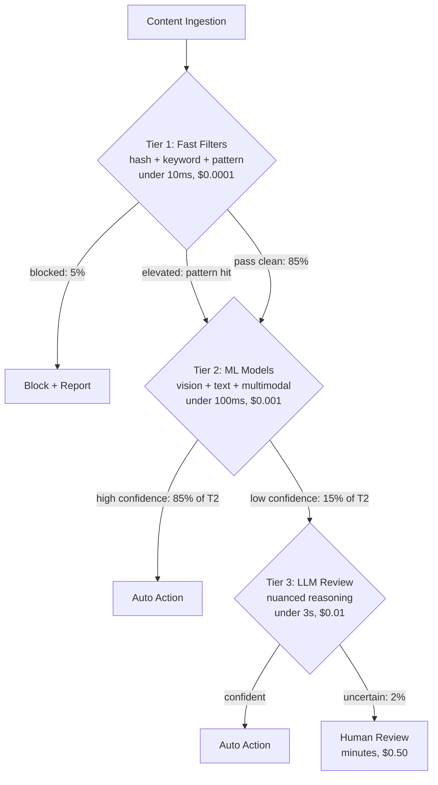
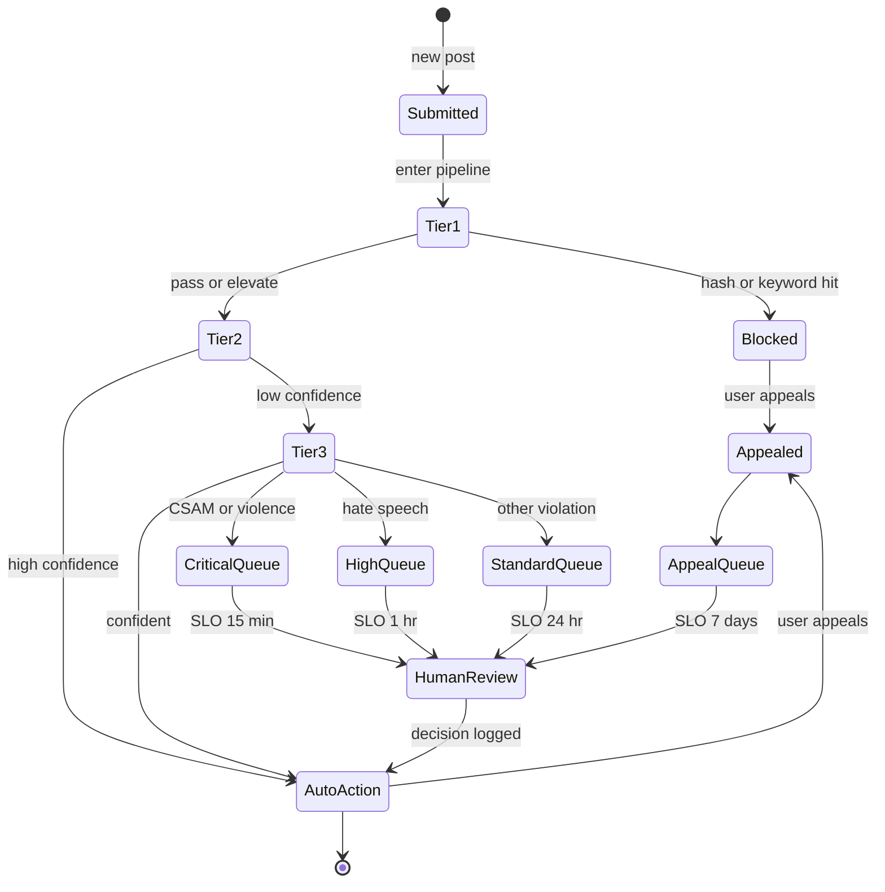

<a id="case-study-content-moderation-at-scale"></a>
# 案例研究：大規模內容審核

本案例研究涵蓋如何為每日處理數百萬則貼文的社交平台設計 AI 驅動的內容審核系統。

<a id="table-of-contents"></a>
## 目錄

- [問題陳述](#problem-statement)
- [需求分析](#requirements-analysis)
- [架構設計](#architecture-design)
- [分類管線](#classification-pipeline)
- [人機協作](#human-in-the-loop)
- [對抗性魯棒性](#adversarial-robustness)
- [成果與指標](#results-and-metrics)
- [面試解題流程](#interview-walkthrough)

---

<a id="problem-statement"></a>
## 問題陳述

**公司：** 每日活躍用戶 5000 萬的社交媒體平台

**現狀：**
- 每日 1000 萬則貼文
- 500 名人工審核員
- 平均審核時間：4 小時
- 假陽性率：15%
- 有害內容觸達用戶比率：2%

**目標：**
- 將有害內容曝光率降低至 < 0.1%
- 在 < 15 分鐘內審核優先內容
- 將假陽性率降低至 < 5%
- 在不線性增加審核員人數的情況下擴展規模

---

<a id="requirements-analysis"></a>
## 需求分析

<a id="content-categories"></a>
### 內容類別

| 類別 | 嚴重程度 | 處置方式 | 延遲 |
|-----|---------|---------|------|
| CSAM | 極高 | 封鎖 + 通報 | 立即 |
| 暴力/血腥 | 高 | 封鎖 + 審核 | < 1 分鐘 |
| 仇恨言論 | 高 | 封鎖 + 審核 | < 5 分鐘 |
| 騷擾 | 中 | 審核 + 警告 | < 15 分鐘 |
| 垃圾訊息 | 中 | 降低優先級 | < 1 小時 |
| 錯誤資訊 | 中 | 標記 + 審核 | < 1 小時 |
| 成人內容 | 低 | 年齡限制 | < 1 小時 |

<a id="accuracy-requirements"></a>
### 準確性需求

| 指標 | 目標 | 理由 |
|-----|------|------|
| 召回率（有害內容）| > 99% | 最小化有害曝光 |
| 精確率 | > 95% | 最小化假陽性 |
| 延遲（極高）| < 1 分鐘 | 防止擴散 |
| 延遲（標準）| < 15 分鐘 | 平衡資源 |

---

<a id="architecture-design"></a>
## 架構設計

<a id="high-level-architecture"></a>
### 高層架構

```
┌─────────────────────────────────────────────────────────────────┐
│                  CONTENT MODERATION PIPELINE                     │
├─────────────────────────────────────────────────────────────────┤
│                                                                  │
│  ┌─────────────┐                                                │
│  │   Content   │                                                │
│  │   Ingestion │                                                │
│  └──────┬──────┘                                                │
│         │                                                        │
│         ▼                                                        │
│  ┌─────────────────────────────────────────────────────────┐    │
│  │                   TIER 1: FAST FILTERS                   │    │
│  │  ┌──────────┐  ┌──────────┐  ┌──────────┐              │    │
│  │  │  Hash    │  │ Keyword  │  │  Known   │              │    │
│  │  │ Matching │  │ Blocklist│  │ Patterns │              │    │
│  │  └──────────┘  └──────────┘  └──────────┘              │    │
│  └──────────────────────────┬──────────────────────────────┘    │
│                             │                                    │
│         ┌───────────────────┼───────────────────┐               │
│         │ Blocked           │ Pass              │ Elevated      │
│         ▼                   ▼                   ▼               │
│  ┌─────────────┐    ┌─────────────────────────────────────┐    │
│  │   Block +   │    │          TIER 2: ML MODELS          │    │
│  │   Report    │    │  ┌────────┐  ┌────────┐  ┌────────┐│    │
│  └─────────────┘    │  │ Vision │  │  Text  │  │ Multi- ││    │
│                     │  │ Model  │  │ Model  │  │ modal  ││    │
│                     │  └────────┘  └────────┘  └────────┘│    │
│                     └──────────────────┬──────────────────┘    │
│                                        │                        │
│         ┌──────────────────────────────┼──────────────────┐    │
│         │ High Confidence              │ Low Confidence   │    │
│         ▼                              ▼                   │    │
│  ┌─────────────┐              ┌─────────────────────────┐ │    │
│  │ Auto Action │              │    TIER 3: LLM REVIEW   │ │    │
│  └─────────────┘              │  (nuanced cases)        │ │    │
│                               └────────────┬────────────┘ │    │
│                                            │               │    │
│                        ┌───────────────────┼──────────────┐│    │
│                        │ Confident         │ Uncertain    ││    │
│                        ▼                   ▼              ││    │
│                 ┌─────────────┐    ┌─────────────┐       ││    │
│                 │ Auto Action │    │   Human     │       ││    │
│                 └─────────────┘    │   Review    │       ││    │
│                                    └─────────────┘       ││    │
│                                                          ││    │
└──────────────────────────────────────────────────────────┘│    │
```

分層管線以決策樹呈現。每一層只將自己無法低成本決策的內容往上升級。第一層與第四層之間的每次決策成本比約為 1:5000，因此路由的準確性是單位經濟的主要槓桿：



<a id="processing-tiers"></a>
### 處理層級

| 層級 | 方法 | 延遲 | 費用 | 覆蓋率 |
|-----|------|------|------|-------|
| 1 | 雜湊/關鍵字 | < 10ms | $0.0001 | 5% 封鎖 |
| 2 | ML 分類器 | < 100ms | $0.001 | 85% 自動決策 |
| 3 | LLM 審核 | < 3s | $0.01 | 8% 細緻判斷 |
| 4 | 人工審核 | 分鐘級 | $0.50 | 2% 升級 |

---

<a id="classification-pipeline"></a>
## 分類管線

<a id="tier-1-fast-filters"></a>
### 第一層：快速過濾器

```python
class FastFilters:
    """
    Immediate blocking for known harmful content.
    No false positives for matches.
    """
    
    def __init__(self):
        self.hash_db = PhotoDNADatabase()  # CSAM detection
        self.keyword_filter = KeywordBlocklist()
        self.pattern_matcher = RegexPatterns()
    
    async def filter(self, content: Content) -> FilterResult:
        # CSAM hash matching (highest priority)
        if content.has_media:
            hash_match = await self.hash_db.check(content.media_hashes)
            if hash_match:
                return FilterResult(
                    action="block_report",
                    reason="csam_hash_match",
                    confidence=1.0,
                    tier=1
                )
        
        # Keyword blocklist
        if content.text:
            keyword_match = self.keyword_filter.check(content.text)
            if keyword_match and keyword_match.severity == "critical":
                return FilterResult(
                    action="block_review",
                    reason=f"keyword_{keyword_match.category}",
                    confidence=0.99,
                    tier=1
                )
        
        # Pattern matching (phone numbers in suspicious context, etc)
        pattern_match = self.pattern_matcher.check(content.text)
        if pattern_match:
            return FilterResult(
                action="elevate",
                reason=f"pattern_{pattern_match.type}",
                confidence=pattern_match.confidence,
                tier=1
            )
        
        return FilterResult(action="continue", tier=1)
```

<a id="tier-2-ml-classification"></a>
### 第二層：ML 分類

```python
### Tier 2: Native Multimodal Classification (Gemini 3 Flash)

```python
class MultimodalSafety:
    """
    Dec 2025 Shift: No separate OCR/Vision models.
    Gemini 3 Flash handles interleaved text/images natively for <$0.10 / 1M posts.
    """
    async def classify(self, content: Content) -> dict:
        # Native multimodal understanding catches context (e.g., text on a protest sign)
        response = await genai.submit(
            model="gemini-3-flash",
            content=[content.text, content.image_bytes],
            schema=SafetySchema
        )
        return response
```

<a id="tier-3-nuanced-llm-review-gpt-52-mini"></a>
### 第三層：細緻 LLM 審核（GPT-5.2-mini）

```python
class NuanceReviewer:
    """
    Using GPT-5.2-mini for nuanced context (sarcasm, regional slang).
    Reasoning capabilities of 2025-mini models exceed 2024-frontier models.
    """
    async def review(self, content: Content, context: dict) -> dict:
        result = await client.chat.completions.create(
            model="gpt-5.2-mini",
            messages=[
                {"role": "system", "content": "Analyze for regional hate speech slang."},
                {"role": "user", "content": content.text}
            ],
            response_format={"type": "json_object"}
        )
        return json.loads(result)
```
```

---

<a id="human-in-the-loop"></a>
## 人機協作

<a id="review-queue-management"></a>
### 審核佇列管理

每則內容都會經歷從提交到終態的生命週期。以狀態機呈現的生命週期讓 SLO 更加具體：每個優先級通道有不同的目標處理時間，申訴可使狀態轉回待處理：



```python
class ReviewQueueManager:
    """
    Prioritize and route content to human moderators.
    """
    
    def __init__(self):
        self.queues = {
            "critical": PriorityQueue(),  # CSAM, violence - immediate
            "high": PriorityQueue(),      # Hate speech - < 15 min
            "standard": PriorityQueue(),  # Other violations - < 1 hour
            "appeals": PriorityQueue()    # User appeals
        }
    
    async def enqueue(self, content: Content, result: ReviewResult):
        priority = self.calculate_priority(content, result)
        
        item = ReviewItem(
            content_id=content.id,
            content=content,
            ai_analysis=result,
            priority=priority,
            enqueued_at=datetime.now()
        )
        
        queue_name = self.get_queue(result.severity)
        await self.queues[queue_name].put(item)
        
        # Alert if critical
        if queue_name == "critical":
            await self.alert_moderators(item)
    
    def calculate_priority(self, content: Content, result: ReviewResult) -> float:
        priority = 0.0
        
        # Severity weight
        severity_weights = {"critical": 100, "high": 50, "medium": 20, "low": 5}
        priority += severity_weights.get(result.severity, 0)
        
        # Reach weight (viral content prioritized)
        priority += min(content.reach_score * 10, 50)
        
        # Confidence inverse (less confident = higher priority)
        priority += (1 - result.confidence) * 30
        
        return priority
```

<a id="moderator-interface"></a>
### 審核員介面

```python
class ModeratorDecision:
    async def submit(
        self,
        moderator_id: str,
        content_id: str,
        decision: str,
        reason: str,
        notes: str = None
    ):
        # Record decision
        await self.store_decision({
            "content_id": content_id,
            "moderator_id": moderator_id,
            "decision": decision,
            "reason": reason,
            "notes": notes,
            "ai_recommendation": await self.get_ai_result(content_id),
            "decided_at": datetime.now()
        })
        
        # Execute action
        await self.execute_action(content_id, decision)
        
        # Update ML models with feedback
        await self.feedback_loop.record(
            content_id=content_id,
            ai_prediction=await self.get_ai_result(content_id),
            human_decision=decision
        )
```

---

<a id="adversarial-robustness"></a>
## 對抗性魯棒性

<a id="evasion-techniques-and-defenses"></a>
### 逃避技術與防禦措施

| 逃避技術 | 防禦措施 |
|---------|---------|
| 字元替換（h@te）| 正規化 + 同形字映射 |
| 圖片文字（圖片中的文字）| OCR 管線 |
| 不可見字元 | Unicode 正規化 |
| 上下文操控 | 多輪分析 |
| 編碼內容 | 解碼管線 |
| 對抗性圖片 | 強健視覺模型 |

<a id="defensive-pipeline"></a>
### 防禦管線

```python
class AdversarialDefense:
    def __init__(self):
        self.normalizer = TextNormalizer()
        self.ocr = OCRPipeline()
        self.decoder = ContentDecoder()
    
    def preprocess(self, content: Content) -> Content:
        processed = content.copy()
        
        # Normalize text
        if processed.text:
            processed.text = self.normalizer.normalize(processed.text)
            processed.text = self.decoder.decode_obfuscation(processed.text)
        
        # Extract text from images
        if processed.has_images:
            for image in processed.images:
                extracted_text = self.ocr.extract(image)
                if extracted_text:
                    processed.text = f"{processed.text}\n[IMAGE TEXT]: {extracted_text}"
        
        return processed
    
    def normalize(self, text: str) -> str:
        # Homoglyph normalization
        text = self.homoglyph_map(text)
        
        # Unicode normalization
        text = unicodedata.normalize("NFKC", text)
        
        # Remove zero-width characters
        text = re.sub(r"[\u200b-\u200f\u2028-\u202f]", "", text)
        
        # Leetspeak normalization
        text = self.leetspeak_decode(text)
        
        return text
```

---

<a id="results-and-metrics"></a>
## 成果與指標

<a id="performance-comparison"></a>
### 效能比較

| 指標 | 改善前 | 改善後 | 改進幅度 |
|-----|-------|-------|---------|
| 有害內容曝光率 | 2% | 0.08% | 降低 96% |
| 審核延遲（極高）| 4 小時 | 8 分鐘 | 快 30 倍 |
| 假陽性率 | 15% | 4.2% | 降低 72% |
| 審核員效率 | 50 則/天 | 200 則/天 | 提升 4 倍 |

<a id="cost-analysis-dec-2025"></a>
### 成本分析（2025 年 12 月）

| 元件 | 每 1000 萬則貼文 | 備注 |
|-----|----------------|------|
| 第一層過濾器 | $0.10 | 可忽略不計 |
| 第二層多模態 | $0.50 | Gemini 3 Flash（$0.05/百萬）|
| 第三層 LLM（GPT-5.2）| $0.20 | 10% 流量的細緻檢查 |
| 人工審核 | $15.00 | 僅針對 1% 的流量 |
| **總計** | **$15.80** | **與 2024 年相比降低 40%** |

> [!TIP]
> **生產實踐：** 將重要工作從「第二層視覺/OCR」遷移至**原生多模態（Gemini 3 Flash）**，將管線複雜度降低了 70%，延遲降低了 400ms。

*人工審核仍然佔主要成本，但專注於困難案例*

---

<a id="interview-walkthrough"></a>
## 面試解題流程

**面試官：**「設計一個社交媒體平台的內容審核系統。」

**優秀回答：**

1. **釐清規模與需求**（1 分鐘）
   - 「流量是多少？內容類型有哪些？可接受的假陽性率是多少？」
   - 「是否有法規要求（CSAM 通報、GDPR）？」

2. **多層架構**（3 分鐘）
   - 「我會使用逐層遞增精密度的串聯式架構：」
   - 「第一層：雜湊比對、關鍵字過濾——即時、確定」
   - 「第二層：ML 分類器——快速、專業化」
   - 「第三層：LLM 審核——細緻、具上下文感知」
   - 「第四層：人工審核——最終仲裁」
   - 「每一層處理前一層無法決策的內容」

3. **優先排序是關鍵**（2 分鐘）
   - 「並非所有有害內容都同等重要。CSAM 和暴力需要立即行動。仇恨言論是優先項但不需立即處理。垃圾訊息可以等待。」
   - 「根據嚴重程度、觸及範圍和信心度設置優先佇列」

4. **人機協作設計**（2 分鐘）
   - 「人工負責低信心度決策和申訴」
   - 「AI 自動處理 95%+ 的內容，使人工審核在經濟上可行」
   - 「回饋迴圈：人工決策改善 ML 模型」

5. **對抗性魯棒性**（2 分鐘）
   - 「用戶會試圖逃避偵測。防禦措施包括：」
   - 「文字正規化，處理混淆字元」
   - 「圖片中文字的 OCR 處理」
   - 「隨逃避手段演進持續更新模型」

6. **指標**（1 分鐘）
   - 「主要指標：有害內容曝光率（目標 < 0.1%）」
   - 「次要指標：假陽性率（用戶體驗）」
   - 「營運指標：審核延遲、審核員吞吐量」

---

<a id="references"></a>
## 參考資料

- Meta Content Moderation: https://transparency.fb.com/
- Google Perspective API: https://perspectiveapi.com/
- OpenAI Moderation: https://platform.openai.com/docs/guides/moderation

---

*下一篇：[附錄 A：LLM 定價參考](../appendices/a-pricing-reference.md)*
