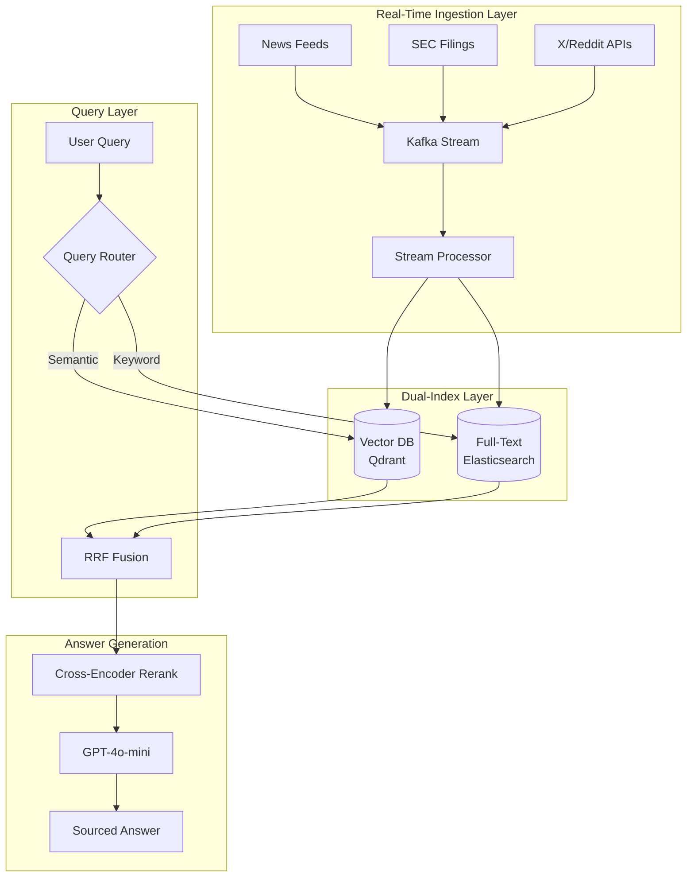

<a id="case-study-real-time-ai-search-engine"></a>
# 案例研究：即時 AI 搜尋引擎

<a id="the-problem"></a>
## 問題

一家金融科技新創公司需要建立一個**即時市場情報平台**，讓分析師能夠就即時市場資料、新聞及公司申報文件提問自然語言問題。

**面試中給定的限制條件：**
- 資料新鮮度：查詢結果必須反映過去 5 分鐘的資訊
- 規模：10,000 名並發用戶，每小時 50,000 次查詢
- 準確性：不得虛構金融資料
- 延遲：p95 響應時間低於 3 秒

---

<a id="the-interview-question"></a>
## 面試問題

> 「設計一個系統，讓用戶能詢問『過去一小時 Tesla 的市場情緒如何？』，並在 3 秒內得到準確且有來源依據的答案。」

---

<a id="solution-architecture"></a>
## 解決方案架構



---

<a id="key-design-decisions"></a>
## 關鍵設計決策

<a id="1-why-kafka-for-ingestion"></a>
### 1. 為何使用 Kafka 進行資料攝取？

面試官想確認你理解**串流與批次處理**的差異。

**回答：** Kafka 提供 exactly-once 傳遞，並允許多個消費者。我們有一個消費者寫入向量資料庫，另一個寫入 Elasticsearch。若向量索引出現落後，全文索引仍可繼續服務查詢。這是提升韌性的**雙寫模式**。

<a id="2-why-hybrid-search-vector--full-text"></a>
### 2. 為何使用混合搜尋（向量 + 全文）？

**回答：** 金融查詢混合了語義搜尋（「Tesla 的情緒」）與關鍵字搜尋（「TSLA 10-K 申報」）。純向量搜尋會遺漏精確的股票代號比對。我們使用**倒數排名融合（RRF，Reciprocal Rank Fusion）**來合併結果。

<a id="3-why-gpt-4o-mini-instead-of-gpt-4o"></a>
### 3. 為何使用 GPT-4o-mini 而非 GPT-4o？

**回答：** 為了在每小時 50K 次查詢下達成 3 秒 p95 延遲目標，我們需要快速生成。GPT-4o-mini 每秒可輸出 100+ token，而 GPT-4o 僅有 40 token/秒。重新排序器負責保證準確性；LLM 只需綜合已驗證的內容。

---

<a id="handling-the-freshness-requirement"></a>
## 處理資料新鮮度需求

此問題最困難的部分，在於確保索引反映過去 5 分鐘的資料。

**解決方案：基於 TTL 的索引**

```python
# Each document gets a timestamp field
doc = {
    "content": "Tesla announces new factory...",
    "timestamp": datetime.now(UTC),
    "source": "Reuters",
    "ttl_hours": 24  # Auto-delete after 24 hours
}

# Query filters to last N minutes
def search_recent(query: str, minutes: int = 60):
    cutoff = datetime.now(UTC) - timedelta(minutes=minutes)
    return vector_db.search(
        query=query,
        filter={"timestamp": {"$gte": cutoff}}
    )
```

---

<a id="cost-analysis"></a>
## 成本分析

| 元件 | 每月費用（每小時 50K 查詢）|
|-----|--------------------------|
| Kafka（MSK）| $2,500 |
| Qdrant（托管）| $1,800 |
| Elasticsearch | $2,000 |
| GPT-4o-mini（生成）| $3,500 |
| 交叉編碼器重新排序 | $800 |
| **總計** | **$10,600/月** |

---

<a id="interview-follow-up-questions"></a>
## 面試追問

**Q：如何防止虛構金融資料？**

A：三層防護：（1）LLM 只總結已擷取的內容，絕不自行生成事實。（2）每個主張都必須引用來源文件。（3）生成後驗證器檢查回答中的任何數字是否在來源中逐字出現。

**Q：如果 Kafka 在新聞爆發期間落後怎麼辦？**

A：我們透過消費者延遲監控實施反壓機制。若延遲超過 2 分鐘，則在攝取端使用取樣進行負載削減。即時查詢命中只包含最近一小時資料的「近期」索引；批次作業回填完整索引。

---

<a id="key-takeaways-for-interviews"></a>
## 面試重點心得

1. **即時 AI 搜尋需要串流基礎設施**，而非批次 ETL
2. **混合搜尋（語義 + 關鍵字）優於純向量搜尋**，適用於結構化領域
3. **延遲預算驅動模型選擇**：使用快速模型進行綜合，保留昂貴模型用於推理
4. **新鮮度是過濾器，而非功能**：在索引層實作，而非在提示層實作

---

*相關章節：[混合搜尋](../06-retrieval-systems/05-hybrid-search.md)、[服務基礎設施](../04-inference-optimization/06-serving-infrastructure.md)*
