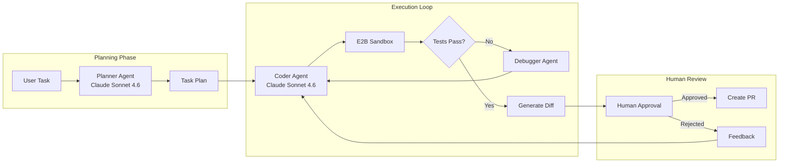
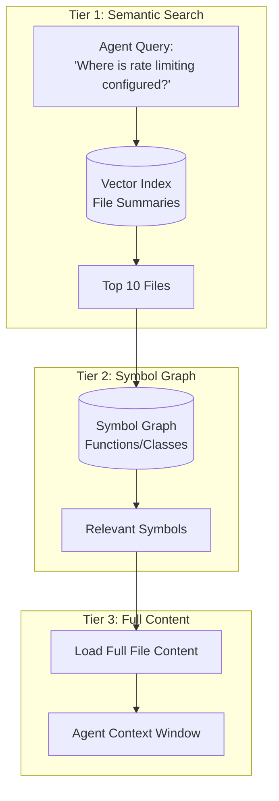

<a name="case-study-autonomous-coding-agent"></a>
# 案例研究：自主程式碼代理

<a name="the-problem"></a>
## 問題描述

一家開發者工具公司希望打造一款 **AI 程式碼助理**，能夠自主完成跨多檔案的任務，例如：「為這個 Express API 新增身份驗證」或「將此模組重構為使用依賴注入」。

**面試中給定的限制：**
- 必須能處理超過 1,000 個檔案的程式碼庫
- 不得破壞現有功能（測試必須通過）
- 人類必須在提交前審核變更
- 預算：每次任務完成費用低於 $0.50

---

<a name="the-interview-question"></a>
## 面試題目

> 「設計一個程式碼代理，能夠接受『為所有 API 端點新增速率限制』這類任務，並產出可運作、已測試的 Pull Request。」

---

<a name="solution-architecture"></a>
## 解決方案架構



---

<a name="key-design-decisions"></a>
## 關鍵設計決策

<a name="1-why-separate-planner-and-coder-agents"></a>
### 1. 為何要將規劃者與程式碼代理分開？

**解答：** 規劃任務需要**對整個程式碼庫進行推理**（需觸碰哪些檔案、存在哪些依賴關係）。程式碼生成任務則需要**精確的語法輸出**。透過分離這兩者，我們可以在規劃時使用延伸思考模式，在程式碼生成時使用快速生成模式。這也讓我們能在規劃完成後設置檢查點，由人類在執行前審核整體方向。

<a name="2-why-e2b-sandbox-instead-of-local-execution"></a>
### 2. 為何使用 E2B Sandbox 而非本機執行？

**解答：** 安全性。代理會生成並執行程式碼。在本機執行會暴露主機系統。E2B 提供隔離的容器，每次會話結束後重置。若代理生成 `rm -rf /`，也只會毀掉沙盒本身。

<a name="3-why-claude-sonnet-46-for-both"></a>
### 3. 為何兩者都使用 Claude Sonnet 4.6？

**解答：** Claude Opus 4.7 在 SWE-bench Pro 以 64.3% 位居榜首，而 Claude Sonnet 4.6 能以約 40% 的費用提供其約 90% 的品質，是每任務需多輪執行的代理的最佳平衡點。我們僅在除錯迴圈中啟用「Extended Thinking」，而非在初始生成階段啟用，以控制成本。

---

<a name="the-codebase-understanding-problem"></a>
## 程式碼庫理解問題

代理無法將 1,000 個檔案全部放入上下文。我們透過**分層檢索**來解決這個問題：



**實作方式：**
1. **索引檔案摘要**（由較小的模型在初始化時生成）
2. **使用 tree-sitter 建立符號圖**，進行 AST 解析
3. **分階段檢索**：摘要 → 符號 → 完整內容

---

<a name="the-self-correction-loop"></a>
## 自我修正迴圈

代理會發生失敗。可靠性的關鍵在於**結構化的自我修正**：

```python
async def execute_with_retry(task: str, max_attempts: int = 3):
    for attempt in range(max_attempts):
        # Generate code
        code_changes = await coder_agent.generate(task)
        
        # Apply to sandbox
        sandbox.apply_changes(code_changes)
        
        # Run tests
        test_result = await sandbox.run_tests()
        
        if test_result.passed:
            return code_changes
        
        # Feed failure back to agent
        task = f"""
        Previous attempt failed. Error:
        {test_result.error}
        
        Original task: {task}
        
        Fix the issue.
        """
    
    raise MaxRetriesExceeded()
```

---

<a name="cost-breakdown"></a>
## 成本明細

| 階段 | 模型 | Token 數（平均） | 費用 |
|-------|-------|--------------|------|
| 規劃 | Claude Sonnet 4.6（延伸模式） | 輸入 8,000 / 輸出 2,000 | $0.06 |
| 檔案檢索 | Embeddings | 50,000 | $0.01 |
| 程式碼生成（每次嘗試） | Claude Sonnet 4.6 | 輸入 15,000 / 輸出 3,000 | $0.09 |
| 測試（平均 3 次） | - | - | $0.00 |
| **總計（平均 1.5 次嘗試）** | | | **$0.21** |

每次任務費用 $0.21，符合預算。

---

<a name="interview-follow-up-questions"></a>
## 面試追問問題

**問：如何處理需要跨 20 個以上檔案進行變更的任務？**

答：我們在規劃階段將其拆解為子任務。規劃者輸出帶有依賴關係的變更 DAG，執行者按拓撲順序處理，逐步執行測試。若第 5 步失敗，只需重新執行第 5 步及之後的步驟，而非重跑整個任務。

**問：如果代理陷入無限重試迴圈怎麼辦？**

答：三道防護：(1) 最大嘗試次數限制（3 次）。(2) 若同一測試以相同錯誤連續失敗兩次，則升級至人工處理。(3) 每個任務的 Token 總預算（$0.50）觸發終止。

**問：如何防止代理引入安全漏洞？**

答：我們在沙盒中將靜態分析工具（Semgrep）作為測試套件的一部分執行。違反安全規則視為測試失敗，並回饋給代理進行修正。

---

<a name="key-takeaways-for-interviews"></a>
## 面試重點整理

1. **將規劃與執行分離**，以便設置檢查點並控制成本
2. **所有生成的程式碼都在沙盒中執行**，確保安全性（E2B、Docker 等）
3. **分層檢索解決大型程式碼庫的規模問題**：摘要 → 符號 → 內容
4. **自我修正迴圈需要硬性限制**：嘗試次數、Token 數、時間

---

*相關章節：[工具使用與 MCP](../07-agentic-systems/03-tool-use-and-mcp.md)、[錯誤處理](../07-agentic-systems/07-error-handling-and-recovery.md)*
