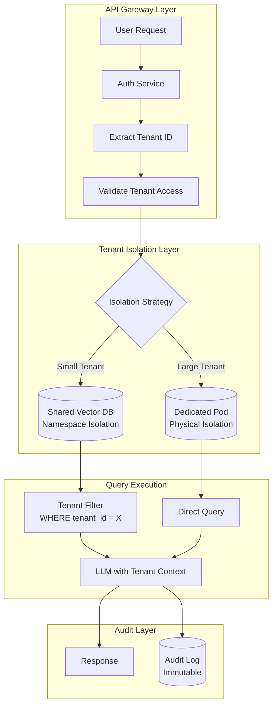
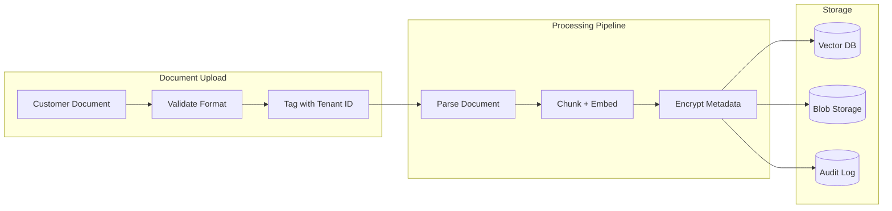

<a id="case-study-multi-tenant-ai-saas-platform"></a>
# 案例研究：多租戶 AI SaaS 平台

<a id="the-problem"></a>
## 問題描述

一家 B2B 新創公司正在打造一個 **AI 驅動的文件分析平台**，每位客戶可上傳自己的合約，並由 AI 回答相關問題。客戶群中包含競爭對手，彼此的資料絕對不能互相洩漏。

**面試中給定的限制：**
- 500 家企業客戶，每家擁有 10,000 至 100,000 份文件
- 絕對的資料隔離：客戶 A 的資料不得洩漏至客戶 B
- 共用基礎架構以降低成本
- 合規要求：SOC 2 Type II、GDPR
- 查詢延遲低於 2 秒

---

<a id="the-interview-question"></a>
## 面試題目

> 「設計一個多租戶 RAG 系統，讓可口可樂與百事可樂都能成為客戶，且跨租戶資料洩漏的風險為零。」

---

<a id="solution-architecture"></a>
## 解決方案架構



---

<a id="key-design-decisions"></a>
## 關鍵設計決策

<a id="1-hybrid-isolation-namespace-vs-physical"></a>
### 1. 混合隔離：命名空間隔離 vs 實體隔離

**解答：** 純實體隔離（每個租戶一個資料庫）成本極高。純命名空間隔離（共用資料庫加 tenant_id 過濾）若發生過濾器漏洞則有洩漏風險。我們採用**分層方式**：

| 層級 | 租戶規模 | 隔離方式 | 原因 |
|------|-------------|------------------|-----|
| 標準 | 文件數 < 50K | 共用 Qdrant 的命名空間隔離 | 成本效益 |
| 進階 | 文件數 50K–500K | 專屬 Qdrant Collection | 效能隔離 |
| 企業 | 文件數 > 500K | 專屬 Qdrant Pod | 實體隔離 + 法規遵循 |

<a id="2-defense-in-depth-for-data-isolation"></a>
### 2. 資料隔離的縱深防禦

**解答：** 我們絕不依賴單一層級。我們的隔離堆疊：

1. **API Gateway**：從 JWT 驗證 tenant_id，拒絕跨租戶請求
2. **資料庫層**：資料列層級安全性（RLS）在資料庫層強制執行 tenant_id 過濾
3. **應用層**：ORM 封裝器自動注入租戶過濾條件
4. **LLM 層**：系統提示明確說明「您正在為租戶 X 提供答覆」
5. **輸出層**：生成後過濾器掃描任何不屬於該租戶的文件 ID

<a id="3-why-not-one-vector-db-per-tenant"></a>
### 3. 為何不為每個租戶建立獨立的 Vector DB？

**解答：** 500 個租戶 × 每個託管實例 $100/月 = 僅資料庫就需 $50,000/月。透過對 80% 的租戶採用命名空間隔離，可將此成本降至 $8,000/月。其餘 20% 使用專屬基礎架構，支付進階方案費用。

---

<a id="the-data-ingestion-pipeline"></a>
## 資料攝取管線



**重要：** tenant_id 在**最早的可能時間點**（上傳驗證時）附加，並隨著文件流經每個處理階段。它不是在後續步驟中推導或查詢得到的。

---

<a id="handling-the-compliance-requirements"></a>
## 處理合規要求

<a id="soc-2-type-ii"></a>
### SOC 2 Type II

| 控制項 | 實作方式 |
|---------|----------------|
| 存取日誌 | 每次查詢均記錄 tenant_id、user_id、時間戳記 |
| 靜態加密 | Blob 儲存使用 AES-256，Vector DB 使用原生資料庫加密 |
| 傳輸加密 | 全面採用 TLS 1.3 |
| 存取審查 | 從稽核日誌自動產生季度報告 |

<a id="gdpr-right-to-deletion"></a>
### GDPR 刪除權

```python
async def delete_tenant_data(tenant_id: str):
    # 1. Delete from vector DB
    await vector_db.delete(filter={"tenant_id": tenant_id})
    
    # 2. Delete from blob storage
    await blob_storage.delete_prefix(f"tenants/{tenant_id}/")
    
    # 3. Anonymize audit logs (cannot delete for compliance)
    await audit_log.anonymize(tenant_id=tenant_id)
    
    # 4. Generate deletion certificate
    return generate_deletion_certificate(tenant_id)
```

---

<a id="cost-analysis-500-tenants"></a>
## 成本分析（500 個租戶）

| 元件 | 每月費用 |
|-----------|--------------|
| 共用 Vector DB（Qdrant Cloud） | $2,500 |
| 專屬 Pod（20 個企業租戶） | $4,000 |
| LLM 費用（共用池，GPT-4o-mini） | $8,000 |
| Blob 儲存（S3） | $1,500 |
| 稽核日誌（CloudWatch） | $500 |
| **總計** | **$16,500/月** |
| **每租戶平均** | **$33/月** |

---

<a id="interview-follow-up-questions"></a>
## 面試追問問題

**問：如果 ORM 中的漏洞繞過了租戶過濾器怎麼辦？**

答：縱深防禦。即使 ORM 失效，資料庫仍會強制執行 RLS（資料列層級安全性）。查詢 `SELECT * FROM documents` 在內部會變成 `SELECT * FROM documents WHERE tenant_id = current_tenant()`，這是在 Postgres 層級強制執行的，而非應用程式層級。

**問：如何處理想匯出所有資料的租戶？**

答：我們提供資料可攜性 API，以串流方式傳送所有文件及其嵌入向量和中繼資料。匯出由管理員觸發，記錄在稽核日誌中，並傳送至客戶自控的 S3 儲存桶（而非我們的基礎架構）。

**問：如果 LLM 從訓練資料中幻覺出符合競爭對手機密資訊的內容怎麼辦？**

答：這是真實存在的風險。我們的緩解措施：(1) 僅使用以檢索為基礎的生成（LLM 若無檢索到的文件則無法回答）。(2) 過濾輸出中任何無法追溯至租戶已上傳文件的內容。(3) 提供「私有模型」方案，僅針對租戶自身資料進行微調。

---

<a id="key-takeaways-for-interviews"></a>
## 面試重點整理

1. **多租戶依靠層級架構**：絕不依賴單一隔離機制
2. **分層隔離平衡成本與安全性**：並非所有租戶都需要專屬基礎架構
3. **租戶 ID 必須不可變且盡早附加**：在上傳時標記，而非查詢時
4. **合規是架構關切事項**：從第一天起就為稽核、刪除和可攜性而設計

---

*相關章節：[多租戶 RAG 隔離](../12-security-and-access/04-multi-tenant-rag-isolation.md)、[AI 系統的 RBAC](../12-security-and-access/02-rbac-for-ai-systems.md)*
