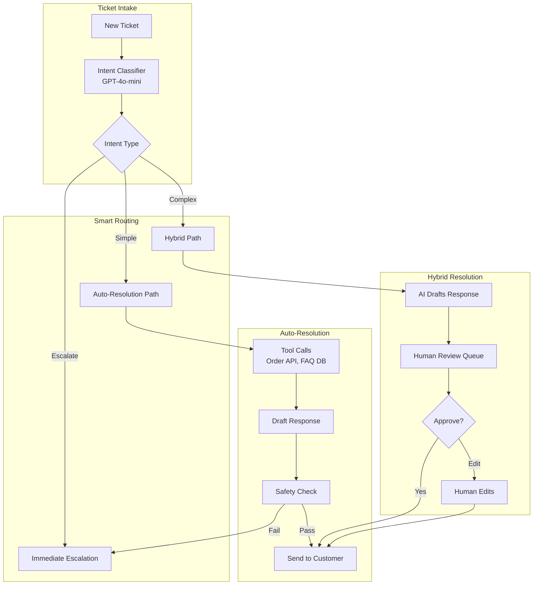
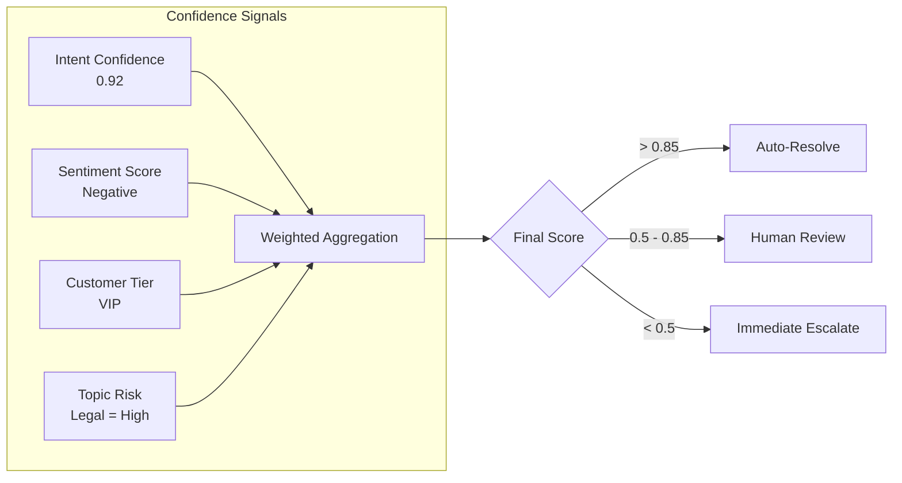
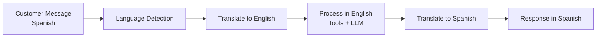

<a id="case-study-ai-powered-customer-support"></a>
# 案例研究：AI 驅動的客戶支援

<a id="the-problem"></a>
## 問題描述

一家電商公司每月處理 **200 萬張支援工單**。他們希望打造一套 AI 系統，能在無需人工介入的情況下自動解決 60% 的工單，同時將複雜問題無縫升級至人工客服。

**面試中給定的限制：**
- 全天候運作，支援 12 種語言
- 必須與現有的 Zendesk 和 Salesforce 整合
- 不得做出虛假承諾（退款、出貨日期）
- 人工客服必須能在對話中途接手
- 成本目標：每張已解決工單 $0.05

---

<a id="the-interview-question"></a>
## 面試題目

> 「設計一個客戶支援 AI，能自動處理『我的訂單在哪裡？』，但在遇到『我要控告你們詐欺』時知道應升級至人工處理。」

---

<a id="solution-architecture"></a>
## 解決方案架構



---

<a id="key-design-decisions"></a>
## 關鍵設計決策

<a id="1-three-tier-routing-auto--hybrid--escalate"></a>
### 1. 三層路由（自動 / 混合 / 升級）

**解答：** 並非所有工單都一樣。我們將其分類為三條路徑：

| 路徑 | 判斷條件 | 範例 | 人工參與程度 |
|------|----------|---------|-------------------|
| **自動** | 高信心、低風險 | 「我的訂單在哪裡？」 | 無 |
| **混合** | 中等信心或中等風險 | 「我要退款」 | 審核 AI 草稿 |
| **升級** | 法律、威脅、VIP、低信心 | 「這是詐欺」 | 全程人工處理 |

<a id="2-tool-based-resolution-not-pure-generation"></a>
### 2. 以工具為基礎的解決方式，而非純生成

**解答：** AI 並不「知道」訂單在哪裡——它呼叫 Order API 工具。這對準確性至關重要：

```python
@tool
def get_order_status(order_id: str) -> dict:
    """Retrieve real-time order status from OMS."""
    order = oms_client.get_order(order_id)
    return {
        "status": order.status,
        "shipped_date": order.shipped_at,
        "estimated_delivery": order.eta,
        "tracking_url": order.tracking_url
    }
```

LLM 協調工具的呼叫，但絕不捏造資料。

<a id="3-why-safety-check-before-send"></a>
### 3. 為何在發送前進行安全性檢查？

**解答：** 即使是自動解決的工單，也需通過安全性過濾器：

1. **承諾偵測**：標記「我保證」或「我們將支付」等陳述
2. **情緒不符**：捕捉 AI 在客戶憤怒時語氣歡快的情況
3. **PII 洩漏**：確保內部備註或其他客戶資料不會出現
4. **提及競爭對手**：標記 AI 推薦競爭對手的情況

---

<a id="the-escalation-intelligence"></a>
## 升級智能

最困難的部分是知道**何時**升級。我們使用帶有多重訊號的信心分數：



**關鍵洞察：** 即使 VIP 客戶提出簡單問題，仍會進入混合路徑，因為出錯的代價更高。

---

<a id="multilingual-support"></a>
## 多語言支援

12 種語言，無需 12 個獨立模型：



**為何不使用原生多語言模型？**

成本考量。GPT-4o 能良好處理全部 12 種語言。為每種語言使用專屬模型需要 12 套部署。翻譯會增加延遲，但能保持基礎架構的簡潔性。

---

<a id="human-takeover-mid-conversation"></a>
## 人工接管（對話中途）

當人工客服接手時，需要完整的上下文：

```python
def handoff_to_human(conversation_id: str, agent_id: str):
    conversation = get_conversation(conversation_id)
    
    # Generate summary for human agent
    summary = llm.generate(f"""
    Summarize this conversation for a human agent:
    - Customer issue
    - What AI already tried
    - Why escalation happened
    
    Conversation:
    {conversation.messages}
    """)
    
    # Create handoff package
    return {
        "summary": summary,
        "customer_sentiment": conversation.sentiment,
        "attempted_solutions": conversation.tool_calls,
        "full_transcript": conversation.messages,
        "customer_tier": conversation.customer.tier
    }
```

---

<a id="cost-analysis"></a>
## 成本分析

| 元件 | 每張工單費用 |
|-----------|-----------------|
| 意圖分類（GPT-4o-mini） | $0.002 |
| 工具呼叫（Order API、FAQ 搜尋） | $0.001 |
| 回覆生成（GPT-4o-mini） | $0.008 |
| 安全性檢查 | $0.003 |
| 翻譯（如需要，約 30% 的工單） | $0.004 |
| **平均總計** | **$0.018** |

以 60% 自動解決率計算：**每張已解決工單 $0.03**（遠低於 $0.05 目標）

---

<a id="interview-follow-up-questions"></a>
## 面試追問問題

**問：如果 AI 一直道歉卻從未真正解決問題怎麼辦？**

答：我們追蹤「解決有效性」，而非僅記錄「已發送回覆」。若客戶在 24 小時內就同一問題再次回覆，該工單會被標記為「未解決」，且 AI 的模式會被標記以供審查。我們也會每週進行分析：「哪些措辭與客戶後續追蹤相關聯？」

**問：如何處理堅持要與人工客服對話的客戶？**

答：明確的升級語句（「和真人說話」、「找主管」）會觸發立即移交，不論信心分數為何。我們絕不與升級請求爭辯。

**問：如果客戶試圖對支援 AI 進行越獄攻擊怎麼辦？**

答：輸入過濾加上嚴格的純工具回應。AI 無法被提示揭露系統提示，因為它不生成自由格式的答覆：它呼叫工具並彙整輸出結果。系統提示也極為狹窄：「您協助處理 [公司] 的訂單問題。您不能討論其他主題。」

---

<a id="key-takeaways-for-interviews"></a>
## 面試重點整理

1. **分層路由在自動化與風險之間取得平衡**：並非每張工單都應自動解決
2. **以工具為基礎的接地防止幻覺**：AI 擷取事實，而非生成事實
3. **信心是多維度的**：意圖清晰度 + 情緒 + 客戶層級 + 主題風險
4. **人工移交需要上下文**：提供摘要，而非直接傾倒完整對話紀錄

---

*相關章節：[人在迴圈中的模式](../07-agentic-systems/08-human-in-the-loop-patterns.md)、[防護欄實作](../13-reliability-and-safety/01-guardrails-implementation.md)*
