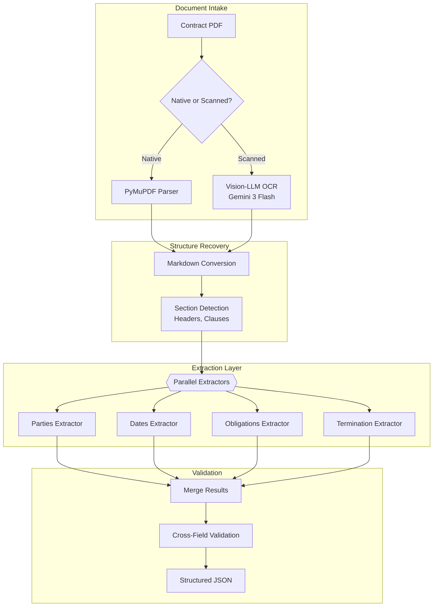
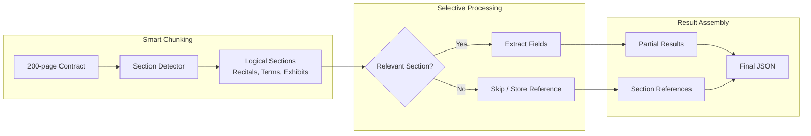

<a name="case-study-document-intelligence-pipeline"></a>
# 案例研究：文件智能管線

<a name="the-problem"></a>
## 問題描述

一家法律科技公司每月需處理 **50,000 份合約**，擷取關鍵條款（當事人、日期、義務、終止條款），並將其載入可搜尋的資料庫。

**面試中給定的限制：**
- 文件頁數從 2 頁到 200 頁不等
- 混合掃描 PDF 與原生數位文件
- 多語言（英文、德文、法文、西班牙文）
- 關鍵欄位擷取準確率：95% 以上
- 成本目標：每份文件低於 $0.50

---

<a name="the-interview-question"></a>
## 面試題目

> 「設計一條管線，能夠讀取 100 頁的合約 PDF，並將當事人、生效日期、終止條件和付款條款等結構化資料擷取為 JSON。」

---

<a name="solution-architecture"></a>
## 解決方案架構



---

<a name="key-design-decisions"></a>
## 關鍵設計決策

<a name="1-vision-llm-for-ocr-instead-of-traditional-ocr"></a>
### 1. 使用 Vision-LLM 進行 OCR 而非傳統 OCR

**解答：** 掃描合約通常含有印章、手寫批注以及複雜版面（表格、多欄排列）。傳統 OCR（Tesseract）會產生混亂的輸出。Gemini 3 Flash 能「看懂」版面，並產出保留表格的乾淨 Markdown。成本較高，但準確率的提升物有所值。

| 方法 | 100 頁掃描合約 | 準確率 | 費用 |
|--------|---------------------------|----------|------|
| Tesseract | 雜訊多、表格破損 | 60% | $0.02 |
| AWS Textract | 較佳，版面仍有困難 | 75% | $0.15 |
| Gemini 3 Flash | 乾淨 Markdown，表格完整 | 92% | $0.35 |

<a name="2-parallel-extractors-vs-single-pass"></a>
### 2. 並行擷取器 vs 單次提取

**解答：** 以單一提示要求所有欄位的效果，比使用專門擷取器更差。每個擷取器都有針對性的提示與 Schema：

```python
parties_schema = {
    "type": "object",
    "properties": {
        "party_a": {"type": "object", "properties": {
            "name": {"type": "string"},
            "role": {"type": "string"},
            "address": {"type": "string"}
        }},
        "party_b": {"type": "object", "properties": {...}}
    }
}

# Each extractor runs in parallel
async def extract_all(document: str):
    results = await asyncio.gather(
        extract_parties(document, parties_schema),
        extract_dates(document, dates_schema),
        extract_obligations(document, obligations_schema),
        extract_termination(document, termination_schema)
    )
    return merge_results(results)
```

<a name="3-cross-field-validation"></a>
### 3. 跨欄位驗證

**解答：** 擷取錯誤往往會透過不一致性顯現出來：
- 若 `effective_date`（生效日期）晚於 `termination_date`（終止日期），表示有問題
- 若 `party_a` 的名稱出現在 `obligations`（義務）中但拼法不同，標記以供審查
- 若 `payment_amount`（付款金額）已擷取但 `payment_frequency`（付款頻率）為空，表示不完整

---

<a name="handling-200-page-documents"></a>
## 處理 200 頁文件

上下文視窗的挑戰：



**關鍵洞察：** 並非所有 200 頁都含有可擷取的欄位。附件（所附原始文件）儲存為參照，而非進行處理。「條款與條件」章節通常佔文件的 80%，但包含大多數關鍵欄位。

---

<a name="multilingual-handling"></a>
## 多語言處理

德文合約使用與英文合約不同的結構。我們維護各語言專屬的擷取器：

```python
EXTRACTORS = {
    "en": {
        "parties": EnglishPartiesExtractor(),
        "dates": StandardDatesExtractor(),
        "termination": EnglishTerminationExtractor()
    },
    "de": {
        "parties": GermanPartiesExtractor(),  # Handles "GmbH", "AG" patterns
        "dates": GermanDatesExtractor(),       # DD.MM.YYYY format
        "termination": GermanTerminationExtractor()  # "Kündigung" patterns
    }
}
```

---

<a name="cost-breakdown"></a>
## 成本明細

| 階段 | 每份 100 頁文件費用 |
|-------|----------------------|
| OCR（Gemini 3 Flash，掃描文件） | $0.18 |
| 章節偵測（GPT-4o-mini） | $0.03 |
| 欄位擷取（4 個並行，GPT-4o-mini） | $0.12 |
| 驗證 | $0.02 |
| **總計（掃描文件）** | **$0.35** |
| **總計（原生 PDF）** | **$0.17** |

平均（60% 原生，40% 掃描）：**每份文件 $0.24**（低於 $0.50 目標）

---

<a name="interview-follow-up-questions"></a>
## 面試追問問題

**問：如果擷取信心度較低怎麼辦？**

答：我們為每個欄位輸出信心分數。低於 0.8 的欄位會標記以供人工審查。UI 會顯示「審查佇列」，讓人工只需驗證不確定的欄位，而非整份文件。這將人工工作量平均減少至每份文件 30 秒。

**問：如何處理版面非標準的合約？**

答：我們維護一個已知合約範本的「版面資料庫」。章節偵測器首先嘗試比對已知範本。若無匹配，則回退至啟發式偵測（尋找編號章節、全大寫標題等）。未知版面會被標記，並在人工審查後加入資料庫。

**問：如果關鍵條款在附件中定義怎麼辦？**

答：我們偵測交叉引用（「如附件 A 所定義」）並加以解析。當主文件引用附件時，擷取提示會包含相關附件內容。這可防止因答案在附加文件中而導致的「空值」擷取。

---

<a name="key-takeaways-for-interviews"></a>
## 面試重點整理

1. **Vision-LLM 在複雜版面上勝過傳統 OCR**（表格、批注）
2. **並行專門擷取器在結構化擷取上優於單次提取**
3. **跨欄位驗證在資料入庫前捕捉擷取錯誤**
4. **並非所有頁面都需要處理**：偵測相關章節，略過附件

---

*相關章節：[OCR 與版面](../10-document-processing/01-ocr-and-layout.md)、[結構化生成](../05-prompting-and-context/06-structured-generation.md)*
