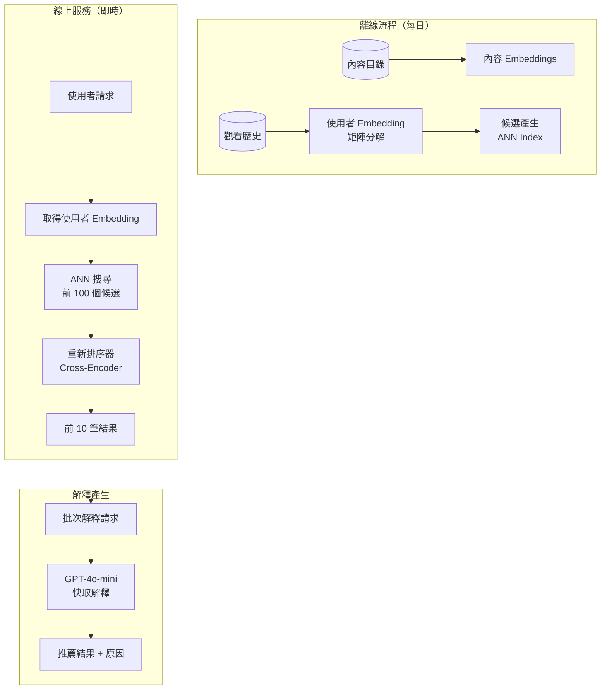
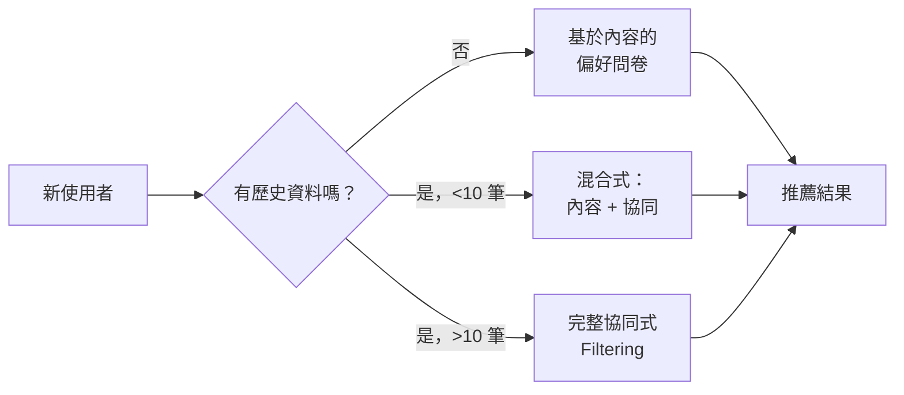

<a id="case-study-ai-powered-recommendation-engine"></a>
# 案例研究：AI 驅動推薦引擎

<a id="the-problem"></a>
## 問題

一家擁有 **5,000 萬使用者** 的串流平台，需要建置一套推薦系統，將協同過濾與 LLM 生成解釋結合起來：「因為你喜歡《Inception》，你可能也會喜歡《Tenet》，因為它同樣具有燒腦的時間機制。」

**面試中給定的限制條件：**
- 即時推薦（p95 低於 200ms）
- 必須說明每個推薦的原因
- 需要處理新使用者的 cold start
- 隱私：不能在使用者之間洩漏觀看歷史
- 每日活躍：500 萬使用者，每人會查看 10+ 組推薦

---

<a id="the-interview-question"></a>
## 面試題目

> 「設計一個能在大規模情況下推薦電影，並以自然語言解釋推薦原因的系統。」

---

<a id="solution-architecture"></a>
## 解決方案架構



---

<a id="key-design-decisions"></a>
## 關鍵設計決策

<a id="1-why-not-just-use-llm-for-everything"></a>
### 1. 為什麼不直接把所有事情都交給 LLM？

**答案：** 規模化的成本效益。若對 5,000 萬使用者、每天 10 組推薦都呼叫一次 LLM，等於每天 5 億次 LLM 呼叫。以每次呼叫 $0.001 計算，就是每天 $50 萬。改用下列方式：

| 元件 | 角色 | 每位使用者 / 每日成本 |
|-----------|------|-------------------|
| Embedding lookup | 取得預先計算的向量 | $0.00001 |
| ANN search | 找出候選項目 | $0.0001 |
| Cross-encoder rerank | 對前 100 名重新評分 | $0.001 |
| LLM explanation | 產生自然語言說明 | $0.005 |
| **總計** | | **$0.006** |

LLM 只用於最後的解釋，不負責實際排序。

<a id="2-explanation-caching"></a>
### 2. 解釋快取

**答案：** 大多數解釋都可以快取。「因為你看過 Inception」這種說法適用於成千上萬位使用者。我們在 (content_pair, reason_type) 層級進行快取：

```python
cache_key = f"{source_movie}:{target_movie}:{reason_type}"
# Example: "inception:tenet:time_mechanics"

explanation = cache.get(cache_key)
if not explanation:
    explanation = generate_explanation(source_movie, target_movie, reason_type)
    cache.set(cache_key, explanation, ttl=86400)
```

快取命中率在暖機後可達 85% 以上。

<a id="3-cold-start-handling"></a>
### 3. Cold-Start 處理

**答案：** 新使用者沒有可用於協同過濾的歷史資料，因此我們採用 **Hybrid Approach**：



---

<a id="the-personalized-explanation-challenge"></a>
## 個人化解釋的挑戰

解釋必須讓人感覺是量身打造，而不是千篇一律：

**不佳：**「Tenet 是一部熱門驚悚片。」
**良好：**「因為你喜歡《Inception》燒腦的劇情，《Tenet》由同一位導演執導，也提供類似的時間操控謎題。」

我們透過在 prompt 中加入使用者上下文來做到這點：

```python
prompt = f"""
Generate a 1-sentence explanation for why this user would enjoy {target_movie}.

User context:
- Recently watched: {recent_movies}
- Preferred genres: {genres}
- Dislikes: {dislikes}

Source movie that triggered this recommendation: {source_movie}
Reason category: {reason_type}

Explanation:
"""
```

---

<a id="latency-budget"></a>
## 延遲預算

| 階段 | 目標 | 實際 p95 |
|-------|--------|------------|
| User embedding lookup | 5ms | 3ms |
| ANN search (top 100) | 20ms | 15ms |
| Cross-encoder rerank | 50ms | 45ms |
| LLM explanation (cached) | 10ms | 8ms |
| LLM explanation (miss) | 500ms | 450ms |
| **總計（快取命中）** | **85ms** | **71ms** |
| **總計（快取未命中）** | **575ms** | **513ms** |

為了達成 200ms p95，我們必須讓解釋快取命中率維持在 95% 以上，並對新的內容配對以非同步方式產生解釋。

---

<a id="interview-follow-up-questions"></a>
## 面試延伸追問

**Q：如何避免 LLM 對電影內容產生幻覺？**

A：LLM 會收到每部電影的結構化 factsheet（導演、演員、主題、獎項）作為上下文，只能使用這份資料中的資訊。我們也有後處理驗證器，會把生成內容與目錄中的 metadata 比對。

**Q：如果使用者的喜好快速改變怎麼辦？**

A：我們使用 **recency-weighted embedding update**。近期觀看的權重是較舊資料的 3 倍。為了提升即時反應能力，我們也維護一個能反映當前 session 行為的「session embedding」，再與歷史 embedding 混合。

**Q：如何對推薦演算法進行 A/B test？**

A：我們對 user_id 做雜湊，將使用者穩定分配到不同實驗 bucket。每個 bucket 都可以使用不同的候選生成、排序或解釋策略。我們再按 bucket 追蹤互動指標（點擊率、觀看時間、跳過率）。

---

<a id="key-takeaways-for-interviews"></a>
## 面試重點整理

1. **LLMs 用於解釋，不用於排序**：擴展性靠傳統 ML，個人化靠 LLM
2. **積極快取**：內容配對的解釋可以跨使用者重複使用
3. **Cold-start 是光譜，不是二分法**：全新使用者 → content-based；有部分歷史 → hybrid；完整歷史 → collaborative
4. **延遲預算需要對應的快取命中率目標**：依據延遲 SLA 來設計快取

---

*相關章節： [Semantic Caching](../08-memory-and-state/05-semantic-caching.md), [Cost Optimization](../04-inference-optimization/07-cost-optimization-playbook.md)*
