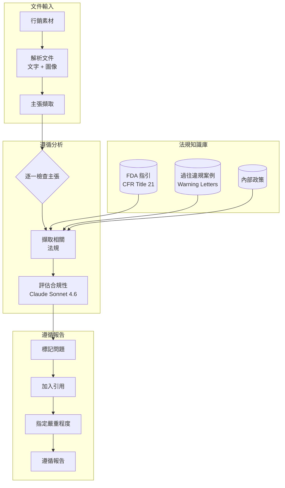
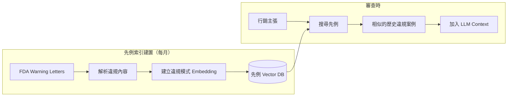
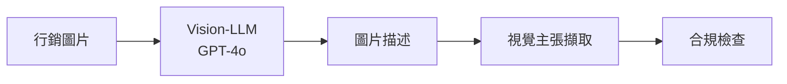

<a id="case-study-regulatory-compliance-automation"></a>
# 案例研究：法規遵循自動化

<a id="the-problem"></a>
## 問題

一家製藥公司必須確保所有行銷素材都符合 **FDA regulations**。目前每份素材的法務審查要花 2 週。他們希望用 AI 先進行預審並標記問題，把法務審查時間縮短到 2 天。

**面試中給定的限制條件：**
- 必須引用具體法規條文，而不只是說「這看起來有問題」
- False negative（漏掉違規）不可接受
- False positive（過度標記）應低於 20%
- 每月 500 份行銷素材
- 為了法規稽核，必須保留 audit trail

---

<a id="the-interview-question"></a>
## 面試題目

> 「設計一個能審查製藥行銷素材，並以引用說明具體法規違規項目的系統。」

---

<a id="solution-architecture"></a>
## 解決方案架構



---

<a id="key-design-decisions"></a>
## 關鍵設計決策

<a id="1-claim-extraction-before-compliance-check"></a>
### 1. 先做主張擷取，再做合規檢查

**答案：** 行銷素材資訊密集，若直接把整份文件拿去對照法規會很沒效率。我們會先擷取個別 **claims**：

```python
claims = extract_claims(document)
# Example output:
# [
#   {"text": "Reduces symptoms by 80%", "type": "efficacy", "location": "page 2, para 3"},
#   {"text": "No side effects reported", "type": "safety", "location": "page 3, header"},
#   {"text": "Recommended by doctors", "type": "endorsement", "location": "page 1, image"}
# ]
```

接著再將每個 claim 分別對照相關法規進行檢查。

<a id="2-why-rag-over-fine-tuning-for-regulations"></a>
### 2. 為什麼法規場景用 RAG，而不是 Fine-Tuning？

**答案：** 法規會變動。FDA 每月都會更新 guidance documents。若採用 Fine-Tuning，每次更新後都要重新訓練；RAG 則讓我們可以：
- 在新指引發布時立即更新法規索引
- 追蹤每次審查實際使用的是哪個版本的法規（audit trail）
- 向法務審查人員展示精確的原文段落

<a id="3-conservative-flagging-strategy"></a>
### 3. 保守的標記策略

**答案：** False negative（漏判違規）是災難性的；false positive（多做一些審查）只是多花時間。因此我們使用 **threshold hierarchy**：

| 信心程度 | 動作 |
|------------|--------|
| >90% 違規 | 標記為 HIGH severity |
| 70-90% 可能違規 | 標記為 MEDIUM，附上疑慮說明 |
| 50-70% 不明確 | 標記為 LOW，註記模糊性 |
| <50% 可能合規 | 不標記，但保留 audit log |

我們絕不在沒有記錄推理過程的情況下直接輸出「合規」。

---

<a id="the-precedent-database"></a>
## 先例資料庫

法規常常帶有模糊空間，而先前的 FDA warning letters 能說明規則實際上如何被執行：



**這很重要的原因：** 像「clinically proven」這種說法，單看法規文字可能沒問題；但若我們找到 5 份 warning letters，顯示 FDA 曾因缺乏具體試驗資料而對公司使用「clinically proven」開罰，這就是明確的危險訊號。

---

<a id="the-audit-trail-requirement"></a>
## Audit Trail 要求

每一個決策都必須可追溯：

```python
compliance_decision = {
    "claim_id": "claim_003",
    "claim_text": "No side effects reported",
    "decision": "VIOLATION",
    "severity": "HIGH",
    "regulation_cited": "21 CFR 202.1(e)(5)",
    "regulation_text": "Advertisements shall not contain claims that...",
    "precedent_cited": "Warning Letter 2023-FDA-04521",
    "reasoning": "Claim implies absolute safety, which contradicts...",
    "model_used": "claude-3-7-sonnet-20251022",
    "timestamp": "2025-12-21T10:30:00Z",
    "reviewer_id": null,  # Filled when human reviews
    "final_decision": null  # Filled after legal review
}
```

---

<a id="handling-images-and-video"></a>
## 處理圖片與影片

製藥行銷也包含視覺性主張（快樂的病患、治療前後對照圖）：



**例子：** 一張顯示病患正在跑步的圖片，暗示藥物有效。若該藥物是治療關節炎，我們就要檢查臨床試驗是否支持「改善行動能力」這類主張。

---

<a id="cost-analysis"></a>
## 成本分析

| 階段 | 每份素材成本 |
|-------|----------------|
| 文件解析 | $0.05 |
| 主張擷取 | $0.15 |
| 法規擷取 | $0.02 |
| 合規評估（每個 claim，平均 12 個 claims） | $1.80 |
| 圖像分析（平均 5 張圖片） | $0.75 |
| 報告生成 | $0.10 |
| **總計** | **$2.87** |

每月 500 份素材：**$1,435 / 月**（相比等量法務工時的 $50K+ / 月）

---

<a id="interview-follow-up-questions"></a>
## 面試延伸追問

**Q：如何處理需要人類判斷的法規？**

A：我們不是取代人，而是做分流。系統會依信心分數標記問題。低信心標記交給資深法律顧問，高信心且明確的項目則可跳過詳細審查。這讓人力能聚焦在邊界案例，把 2 週審查縮短到 2 天。

**Q：如果 FDA 在月中更新法規怎麼辦？**

A：我們有一個「Regulation Watch」服務，會監控 FDA RSS feeds 與 Federal Register 更新。一旦偵測到相關異動，就會重新建立索引，並標記近期可能受影響的審查結果。

**Q：在 audit 時，如何向監管機關解釋 AI 的推理？**

A：每個決策都包含完整推理鏈：被擷取的 claim、找到的法規、引用的先例，以及模型的評估結果。我們可以連同所有元件的版本號，精準展示該決策為何成立。

---

<a id="key-takeaways-for-interviews"></a>
## 面試重點整理

1. **先做主張擷取**：把複雜文件拆成可審查的單位
2. **先例資料庫優於只看法規原文**：規則如何被執行同樣重要
3. **高風險領域應採保守閾值**：優先最佳化 recall，而非 precision
4. **Audit trail 本身就是架構的一部分**：從第一天起就要為 explainability 設計

---

*相關章節： [RAG Fundamentals](../06-retrieval-systems/01-rag-fundamentals.md), [Guardrails Implementation](../13-reliability-and-safety/01-guardrails-implementation.md)*
