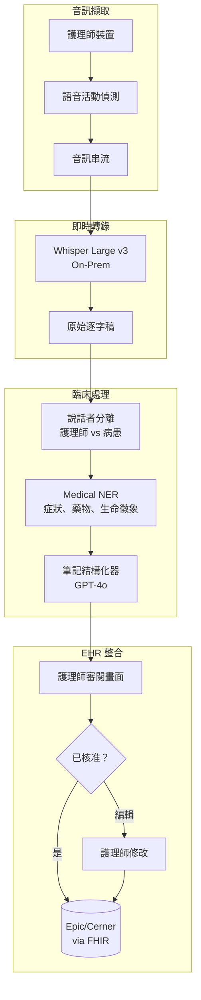
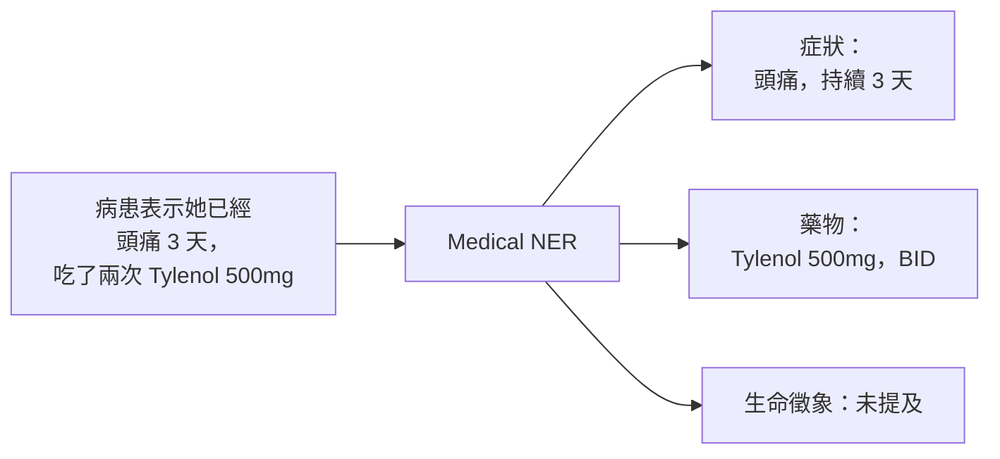

<a id="case-study-voice-ai-assistant-for-healthcare"></a>
# 案例研究：醫療用 Voice AI 助理

<a id="the-problem"></a>
## 問題

某醫院體系希望導入一套 **voice-based AI assistant**，協助護理師記錄病患接觸過程。護理師以自然方式說話，AI 則即時產出結構化的臨床筆記。

**面試中給定的限制條件：**
- HIPAA compliance（PHI handling）
- 必須能在嘈雜的醫院環境中運作
- 即時轉錄（延遲低於 500ms）
- 必須正確使用醫療術語
- 要能整合既有 EHR（Epic/Cerner）

---

<a id="the-interview-question"></a>
## 面試題目

> 「設計一個讓護理師在病患看診時可直接對話的語音助理，並在 EHR 中產生結構化臨床筆記。」

---

<a id="solution-architecture"></a>
## 解決方案架構



---

<a id="key-design-decisions"></a>
## 關鍵設計決策

<a id="1-on-premise-asr-for-hipaa"></a>
### 1. 為了 HIPAA 採用 On-Premise ASR

**答案：** 若沒有加密與 BAA，PHI 不能離開醫院網路。因此我們把 Whisper Large v3 部署在本地 GPU 伺服器，而不是使用 cloud APIs：

| 選項 | 延遲 | HIPAA | 成本 |
|--------|---------|-------|------|
| Cloud ASR (OpenAI) | 200ms | 需要 BAA，資料會離開網路 | $0.006/min |
| On-prem Whisper | 150ms | 完整控制，無資料外流 | $0.002/min（GPU 攤提） |

On-prem 在延遲與合規性上都更有優勢。

<a id="2-speaker-diarization-who-said-what"></a>
### 2. Speaker Diarization：誰說了什麼

**答案：** 臨床筆記必須分辨「病患表示頭痛」與「護理師觀察到病患皺眉」。我們使用：

```python
# Pyannote for speaker diarization
diarization = pipeline("audio.wav")
# Output: [(0.0, 1.5, "SPEAKER_0"), (1.5, 4.2, "SPEAKER_1"), ...]

# Map speakers based on voice profile
roles = identify_roles(diarization, known_nurse_voiceprint)
# Output: {"SPEAKER_0": "nurse", "SPEAKER_1": "patient"}
```

護理師裝置在初始設定時會擷取 voiceprint，用來做角色識別。

<a id="3-medical-ner-for-structured-extraction"></a>
### 3. 用 Medical NER 做結構化擷取

**答案：** 我們需要的是結構化資料，而不只是一般 prose。Medical NER 會擷取：



我們使用經過 fine-tuning 的 BioBERT 模型來做 NER，而不是依賴 LLM，因為 NER 必須夠快且具可決定性。

---

<a id="handling-noisy-environments"></a>
## 處理嘈雜環境

醫院環境很吵，因此我們採用多種策略：

1. 護理師裝置使用 **指向性麥克風**，聚焦附近語音
2. 採用 **抗噪 ASR 模型**（Whisper 已使用含噪資料訓練）
3. **信心閾值**：若 ASR 信心 <0.7，就標記給護理師審閱，而不是猜測
4. **Keyword spotting**：醫療術語使用客製化發音模型

---

<a id="the-structured-note-format"></a>
## 結構化筆記格式

LLM 會產生 SOAP 格式的筆記：

```python
note_prompt = f"""
Generate a clinical SOAP note from this encounter transcript.

Transcript:
{transcript_with_speakers}

Extracted entities:
- Symptoms: {symptoms}
- Medications: {medications}
- Vitals: {vitals}

Output format:
S (Subjective): Patient's reported symptoms
O (Objective): Nurse's observations and measurements
A (Assessment): Clinical impression
P (Plan): Next steps, orders
"""
```

---

<a id="ehr-integration-fhir"></a>
## EHR 整合（FHIR）

輸出必須是 EHR 可機器讀取的格式：

```json
{
  "resourceType": "DocumentReference",
  "status": "current",
  "type": {
    "coding": [{"system": "http://loinc.org", "code": "34117-2", "display": "History and physical note"}]
  },
  "subject": {"reference": "Patient/12345"},
  "author": [{"reference": "Practitioner/nurse789"}],
  "content": [{
    "attachment": {
      "contentType": "text/plain",
      "data": "base64-encoded-soap-note"
    }
  }],
  "context": {
    "encounter": {"reference": "Encounter/visit456"}
  }
}
```

---

<a id="latency-budget"></a>
## 延遲預算

| 階段 | 目標 | 實際 |
|-------|--------|--------|
| Audio capture to VAD | 50ms | 30ms |
| ASR transcription | 200ms | 150ms |
| Diarization | 100ms | 80ms |
| NER extraction | 50ms | 40ms |
| LLM structuring | 500ms | 450ms |
| **端到端總計** | **900ms** | **750ms** |

為了讓體感接近即時，我們會一邊串流部分逐字稿，一邊在完整句子結束後執行 NER 與 LLM。

---

<a id="interview-follow-up-questions"></a>
## 面試延伸追問

**Q：如何處理醫療縮寫與術語？**

A：我們維護一份客製 vocabulary list，將縮寫（PRN、BID、SOB）對應到完整術語。這份清單會同時注入 ASR 模型（提升辨識效果）與 LLM prompt（讓筆記展開正確）。

**Q：如果護理師在一句話中途修正內容怎麼辦？**

A：我們會偵測修正模式（「其實，我是說……」、「不對，應該是……」），並只採用修正後版本。LLM 也會被指示在資訊衝突時優先採用較後面的陳述。

**Q：如何確保 AI 不會漏掉關鍵資訊？**

A：我們有一個「completeness check」，會確認筆記是否包含所有擷取出的實體。若 NER 找到「胸痛」，但 SOAP note 沒有提到，就會標記給護理師審閱。我們也會執行「safety critical」偵測器，對自殺意念、虐待或其他強制通報觸發條件進行升級處理。

---

<a id="key-takeaways-for-interviews"></a>
## 面試重點整理

1. **醫療場景偏向 on-prem**：HIPAA 常要求本地處理
2. **Diarization 很關鍵**：臨床上必須知道是誰說了什麼
3. **混合式擷取**：用快速 NER 做結構化，用 LLM 產生 prose
4. **一定要有人類審閱**：尤其是臨床文件

---

*相關章節： [Multimodal Models](../02-model-landscape/04-multimodal-models.md), [Reliability Patterns](../15-ai-design-patterns/05-reliability-patterns.md)*
