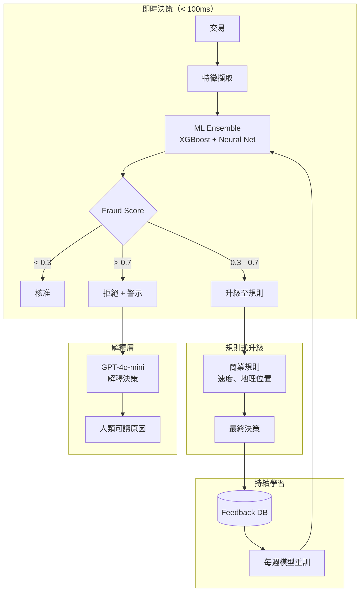
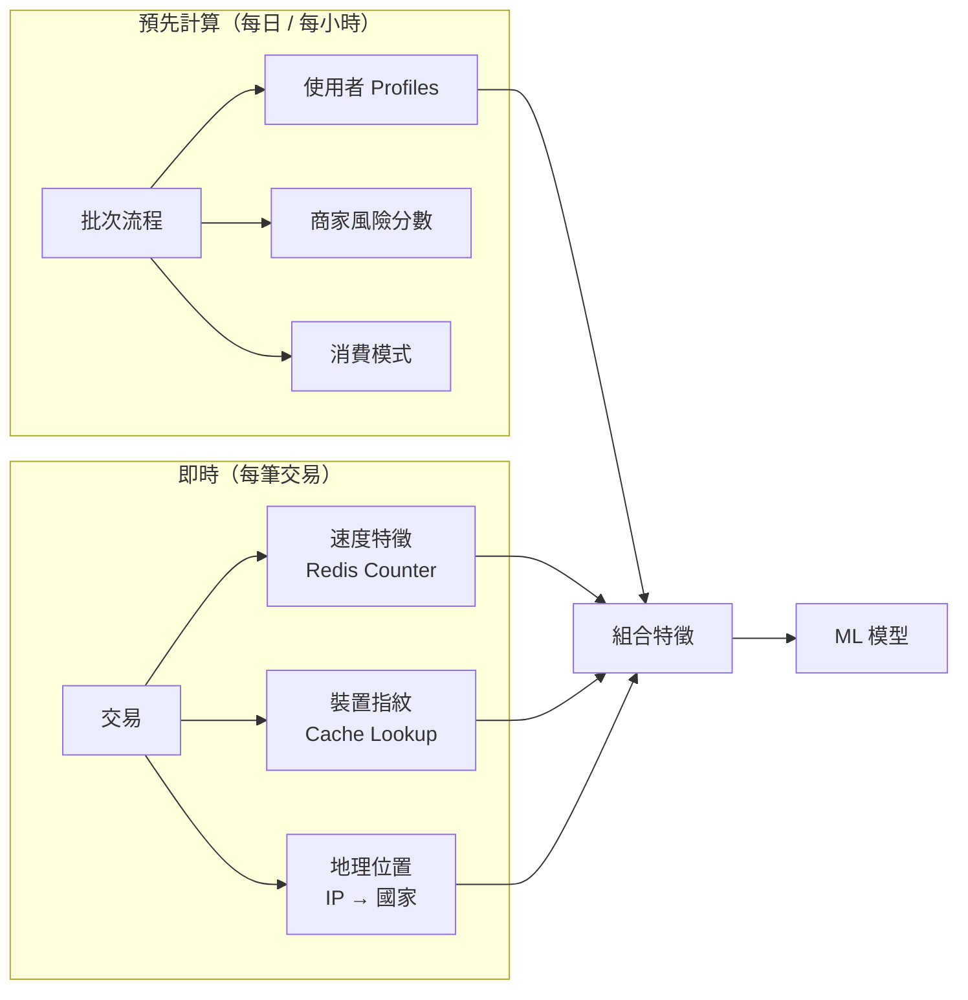
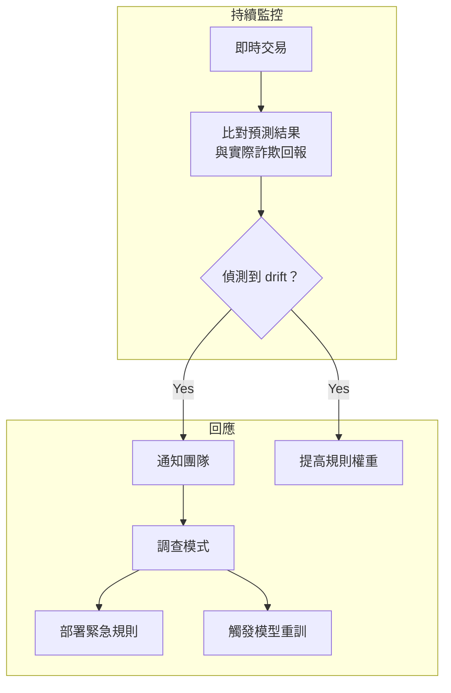

<a id="case-study-real-time-fraud-detection"></a>
# 案例研究：即時詐欺偵測

<a id="the-problem"></a>
## 問題

一家支付處理商每天處理 **1,000 萬筆交易**。他們需要在交易完成前即時偵測並攔截詐欺交易，同時盡量降低會讓合法客戶受挫的 false positives。

**面試中給定的限制條件：**
- 決策延遲：低於 100ms
- False positive rate：低於 0.1%（1/1,000）
- 必須說明交易被標記的原因
- 法規要求保留 7 年 audit trail
- 詐欺模式持續演化

---

<a id="the-interview-question"></a>
## 面試題目

> 「設計一個能在 100ms 內決定核准、拒絕或升級信用卡交易，且能解釋該決策的系統。」

---

<a id="solution-architecture"></a>
## 解決方案架構



---

<a id="key-design-decisions"></a>
## 關鍵設計決策

<a id="1-why-ml--rules-not-just-ml"></a>
### 1. 為什麼是 ML + Rules，而不是只有 ML？

**答案：** 純 ML 模型像黑盒。監管機關在爭議處理時要求可解釋的決策。我們用 ML 進行評分，再套用透明的規則做最後決策：

| 層級 | 角色 | 速度 | 可解釋性 |
|-------|------|-------|----------------|
| ML Ensemble | 捕捉複雜模式 | 10ms | 低 |
| Business Rules | 編碼已知詐欺類型 | 5ms | 高 |
| Combined | 同時兼顧兩者優勢 | 15ms | 中高 |

規則範例：「若 1 小時內在不同國家發生 5+ 筆交易就封鎖」這類規則，能清楚向監管機關說明。

<a id="2-three-way-decision-approve--escalate--reject"></a>
### 2. 三向決策：Approve / Escalate / Reject

**答案：** 二元的 approve/reject 太過粗糙。「灰色區間」（分數 0.3-0.7）會送往 rule-based escalation，或針對高金額交易進行人工審查：

```python
def decide(transaction, fraud_score):
    if fraud_score < 0.3:
        return "APPROVE", None
    elif fraud_score > 0.7:
        reason = explain_rejection(transaction, fraud_score)
        return "REJECT", reason
    else:
        # Gray zone: apply business rules
        if check_velocity_rules(transaction):
            return "REJECT", "Velocity limit exceeded"
        if check_geography_rules(transaction):
            return "ESCALATE", "Unusual location"
        return "APPROVE", None
```

<a id="3-why-llm-for-explanation-not-shaplime"></a>
### 3. 為什麼用 LLM 做解釋，而不是 SHAP/LIME？

**答案：** SHAP values 只會告訴你「feature X 對分數貢獻了 0.3」。客戶與監管機關真正想聽的是：「這筆交易被標記，是因為它來自一台新裝置、發生在你從未到過的國家，且金額是你平常消費的 10 倍。」

我們以 feature importance 作為輸入，生成自然語言解釋：

```python
prompt = f"""
Explain why this transaction was flagged as potentially fraudulent.

Transaction details:
- Amount: ${amount}
- Merchant: {merchant}
- Location: {location}
- Device: {device}

Top contributing factors:
1. {factors[0]['feature']}: {factors[0]['contribution']}
2. {factors[1]['feature']}: {factors[1]['contribution']}
3. {factors[2]['feature']}: {factors[2]['contribution']}

Write a 2-sentence explanation for the cardholder.
"""
```

---

<a id="feature-engineering-for-speed"></a>
## 為速度而生的特徵工程

100ms 的預算代表特徵必須預先計算：



**關鍵洞察：** 使用者 profile（平均消費、常見商家、常用地區）在離線計算完成；即時階段只需補上交易特定特徵。

---

<a id="handling-evolving-fraud-patterns"></a>
## 處理持續演化的詐欺模式

詐欺者會適應系統。上個月的模型，可能漏掉這個月的攻擊。



**緊急規則** 可以在幾分鐘內部署（只需更新設定），而模型重訓要花上數天，但能抓到更細微的模式。

---

<a id="interview-follow-up-questions"></a>
## 面試延伸追問

**Q：如何處理模型延遲突然升高？**

A：我們有一套 **fallback stack**。若 ML 模型在 50ms 內沒有回應，就退回只用 rule-based scoring。這些規則涵蓋最常見的詐欺模式。若所有系統都變慢，對於低於 $10 的交易還會有「default approve」。

**Q：如何處理協同式詐欺攻擊？**

A：我們維護全域速度計數器，而不只看單一使用者。若看到 1 分鐘內有 100 筆來自不同卡片、但都流向同一個冷門商家的交易，就會觸發商家層級封鎖，即使單筆交易看起來正常也一樣。

**Q：如何在防詐與客戶體驗間取得平衡？**

A：我們追蹤「insult rate」：被誤擋的合法客戶比例。每個產品團隊都有 insult budget。若 fraud model 的 insult rate 超出預算，系統會自動放寬閾值並通知團隊。相較於惹怒忠誠客戶，接受稍多一點詐欺有時更划算。

---

<a id="key-takeaways-for-interviews"></a>
## 面試重點整理

1. **ML 負責評分，rules 負責可解釋性**：受監管領域需要兩者結合
2. **三向決策可降低 false positives**：灰色區間要額外審查
3. **凡是能預先計算的都先計算**：即時階段只應負責組合
4. **持續重訓不可少**：詐欺模式每週都在變化

---

*相關章節： [Evaluation and Observability](../14-evaluation-and-observability/), [Reliability Patterns](../15-ai-design-patterns/05-reliability-patterns.md)*
