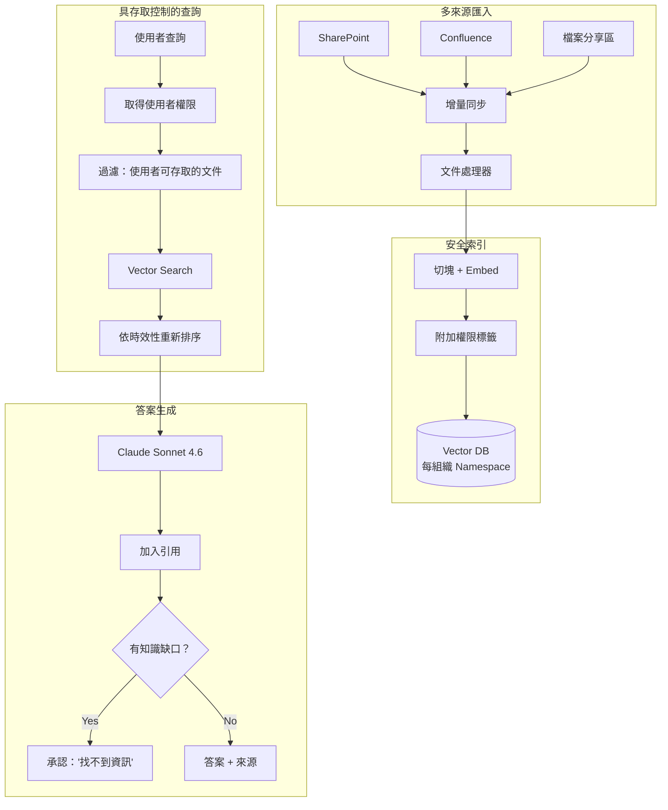
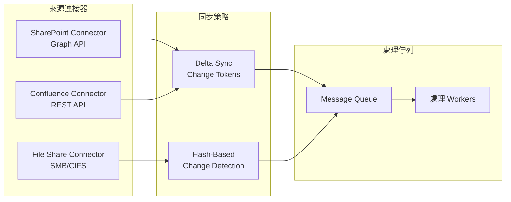

<a id="case-study-enterprise-knowledge-management"></a>
# 案例研究：企業知識管理

<a id="the-problem"></a>
## 問題

一家有 **10,000 名員工** 的顧問公司，累積了數十年的專案報告、方法論文件與專業知識，散落在 SharePoint、Confluence 與檔案分享區中。他們想要一套 AI 系統，讓顧問可以詢問「我們過去如何為汽車客戶做供應鏈最佳化？」並取得從內部知識整合出的答案。

**面試中給定的限制條件：**
- 來自 15 個資料來源的 200 萬份文件
- 存取控制：associate 不能看到 partner 等級內容
- 每一項主張都必須引用來源
- 舊資料處理：舊方法論不能蓋過新的方法論
- 對知識缺口要能明確指出，而不是 hallucinate

---

<a id="the-interview-question"></a>
## 面試題目

> 「設計一個內部知識助理，讓 junior consultant 只能根據自己有權查看的文件提出問題並取得答案。」

---

<a id="solution-architecture"></a>
## 解決方案架構



---

<a id="key-design-decisions"></a>
## 關鍵設計決策

<a id="1-permission-aware-retrieval"></a>
### 1. 具權限意識的 Retrieval

**答案：** 每個 chunk 都會攜帶來自來源系統的權限 metadata：

```python
chunk = {
    "content": "Our approach to automotive supply chain...",
    "source": "sharepoint://projects/acme-motors/final-report.docx",
    "permissions": {
        "read_groups": ["partners", "managers", "automotive-team"],
        "classification": "confidential"
    },
    "last_modified": "2024-03-15",
    "author": "jane.doe@firm.com"
}
```

查詢時，我們會先過濾再檢索：

```python
def search(query: str, user: User):
    user_groups = get_user_groups(user.id)
    
    return vector_db.search(
        query=query,
        filter={
            "permissions.read_groups": {"$in": user_groups}
        }
    )
```

<a id="2-recency-weighted-ranking"></a>
### 2. Recency-Weighted Ranking

**答案：** 對同一個主題來說，2024 年的方法論文件應該排在 2019 年之前。我們使用 **decay function**：

```python
def recency_boost(doc_date):
    age_days = (today - doc_date).days
    # Half-life of 365 days
    return 0.5 ** (age_days / 365)

final_score = semantic_score * 0.7 + recency_boost(doc.date) * 0.3
```

這能避免過時做法淹沒最新指引。

<a id="3-knowledge-gap-detection"></a>
### 3. 知識缺口偵測

**答案：** 我們必須分清楚「我沒找到東西」和「我在亂編」：

```python
def generate_answer(query: str, retrieved_docs: list):
    if len(retrieved_docs) == 0 or max_relevance_score < 0.5:
        return {
            "answer": "I could not find relevant information in our knowledge base for this query.",
            "confidence": "low",
            "suggestion": "Try contacting the Automotive Practice lead directly."
        }
    
    # Generate from retrieved content
    answer = llm.generate(query, context=retrieved_docs)
    return {"answer": answer, "confidence": "high", "sources": [d.source for d in retrieved_docs]}
```

---

<a id="multi-source-synchronization"></a>
## 多來源同步



**關鍵洞察：** SharePoint 與 Confluence 支援 change tokens（delta sync）；file shares 則需要做 hash comparison。兩者最後都會匯入同一個處理佇列。

---

<a id="handling-conflicting-information"></a>
## 處理相互衝突的資訊

不同文件可能給出互相衝突的指引，我們會將其明確呈現：

```python
def detect_conflicts(retrieved_docs):
    # Group by topic
    topics = cluster_by_topic(retrieved_docs)
    
    for topic, docs in topics.items():
        if has_contradictions(docs):
            return {
                "warning": "Found conflicting guidance",
                "perspectives": [
                    {"source": d.source, "date": d.date, "view": summarize(d)}
                    for d in docs
                ],
                "recommendation": "Defer to most recent document or consult practice lead."
            }
```

---

<a id="cost-analysis"></a>
## 成本分析

| 元件 | 每月成本 |
|-----------|--------------|
| Embedding（200 萬份文件 × 更新） | $500 |
| Vector DB（Pinecone Enterprise） | $2,000 |
| LLM generation（5 萬次查詢） | $3,000 |
| 同步基礎設施（connectors） | $500 |
| **總計** | **$6,000 / 月** |

ROI：顧問平均每週可少花 2 小時找資料。以 10,000 位顧問 × $100/小時 × 2 小時 × 4 週計算，等於每月增加 $8M 的生產力。系統投資回收超過 1,300 倍。

---

<a id="interview-follow-up-questions"></a>
## 面試延伸追問

**Q：如何處理權限混合的文件？**

A：我們以 section 為單位切塊，每個 section 會繼承祖先節點中最嚴格的權限。若一個整體為「internal」的文件中，有一段落位於「confidential」區段，該段落就會被標記為「confidential」。

**Q：那即時協作文件（Google Docs、動態 Confluence 頁面）呢？**

A：我們有獨立的「live document」流程，會更頻繁同步（每 5 分鐘一次，而非靜態檔案的每日同步）。在定稿前，這些文件在搜尋結果中會被標記為「draft」。

**Q：如何避免系統成為未授權資料的 leaky abstraction？**

A：我們絕不把未授權內容放進 LLM context，甚至不會用來說「我不能顯示這個」。系統會表現得像那些文件根本不存在。這可避免使用者透過反覆詢問「你有沒有 X 的資訊？」來推測機密專案是否存在的 inference attack。

---

<a id="key-takeaways-for-interviews"></a>
## 面試重點整理

1. **權限必須在 retrieval 階段強制執行，而不是 generation**：在 LLM 看到內容前就先過濾
2. **時效性加權可避免陳舊知識主導結果**：舊文件的相關性應衰減
3. **要承認缺口，不要 hallucinate**：用信心閾值與 fallback 訊息處理
4. **多來源同步本身就很複雜**：不同 API 需要不同策略

---

*相關章節： [RAG Fundamentals](../06-retrieval-systems/01-rag-fundamentals.md), [Multi-Tenant Isolation](../12-security-and-access/04-multi-tenant-rag-isolation.md)*
