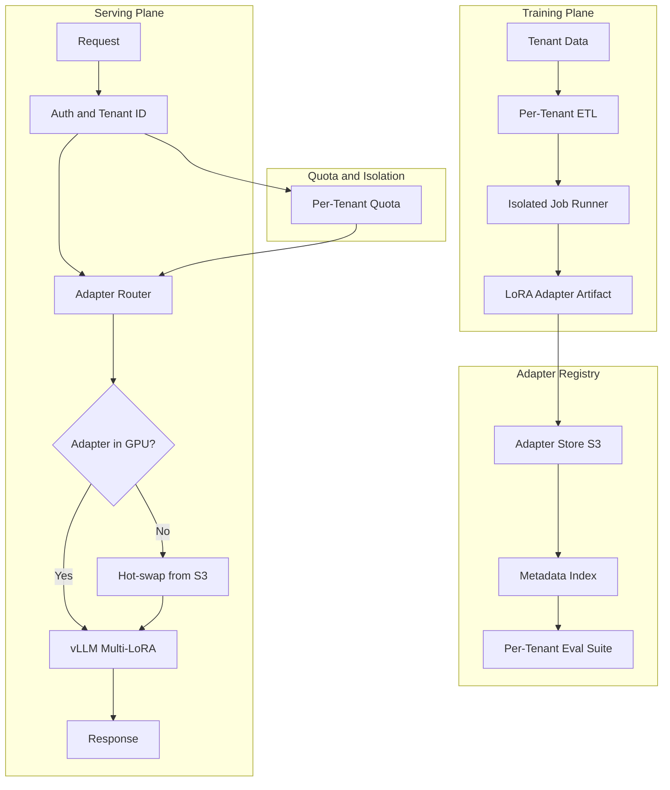
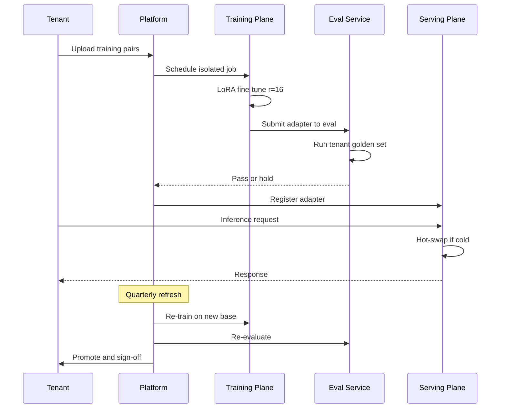

# 案例研究：多租戶 Fine-Tuning 平台

一家 vertical AI 供應商以單一 base model 搭配每租戶 LoRA adapters 服務 280 個客戶，並實作隔離式訓練、每租戶 eval-as-PRD，以及 noisy-neighbor 緩解，使 p99 延遲維持在 1.2 秒以下。

## 業務問題

一家 legal-tech 的 vertical SaaS 供應商經營合約分析產品。其 280 家企業客戶都期待 model 能遵循他們的範本、判例語料，以及偏好的起草風格。現成 prompting 並不足夠：客戶會拿 generic models 做盲測 A/B，一旦輸出偏離他們的 house style，就會拒絕產品。為每個 tenant 各自部署一個 fine-tuned model 也不可行：在 70B 參數規模下，每個 model 的磁碟大小達 140 GB，且 serving 需要專屬 H100，單位經濟完全不成立。

來自 2026 年 5 月現實條件的限制：

- 280 個付費 tenants，且每年翻倍成長
- 每個 tenant 擁有 1,000 到 250,000 筆歷史合約配對資料（輸入加上偏好編修）
- Tenants 要求以自己的測試集證明模型適配度的 eval 報告
- 每次查詢的延遲預算：p99 低於 1.2 秒
- 不同 tenants 位於不同合規 regime：SOC 2、ISO 27001、HIPAA、FedRAMP Moderate

團隊選擇在共享 base model 上使用 per-tenant LoRA adapters。LoRA（[Hu et al., 2021](https://arxiv.org/abs/2106.09685)）與 QLoRA（[Dettmers et al., 2023](https://arxiv.org/abs/2305.14314)）已相當成熟；vLLM 的 multi-LoRA serving（[docs](https://docs.vllm.ai/en/latest/models/lora.html)）以及 SGLang 的 adapter swapping，讓許多 adapters 可以共享 GPU 記憶體中的同一個 base model。Anyscale 與 Together AI 都已發表這種模式的正式案例研究（[Anyscale 2024 post](https://www.anyscale.com/blog/fine-tuning-llms-lora-or-full-parameter-an-in-depth-analysis)、[Together AI multi-LoRA serving](https://www.together.ai/blog/multi-lora-inference)）。

## 架構

### 元件

| 層級 | 技術 | 用途 |
|-------|------|---------|
| Base model | Llama 4 70B int8 | 所有 tenants 共用 |
| Adapter | 注意力層上的 LoRA r=16，每租戶約 120 MB | 每租戶客製化 |
| Training | 8x H100 nodes 上的 DeepSpeed ZeRO-3 | Tenant 隔離的訓練工作 |
| Serving | 搭配 PagedAttention 與 multi-LoRA 的 vLLM 0.7+ | 一個 base，多個 adapters |
| Adapter store | 使用 per-tenant KMS keys 的 S3 | 靜態加密 |
| Eval store | 每租戶 golden set，每次 retrain 都執行 | 每租戶 eval-as-PRD |

### 訓練時的資料流

1. 客戶透過每租戶專屬的 S3 bucket 上傳訓練配對資料，並使用獨立 IAM role；KMS keys 亦為每租戶分開。
2. ETL job 在該 tenant 專屬的 Kubernetes namespace 中執行；node selector 確保它不會與其他 tenant 的 job 共用排程。
3. 訓練通常在 8x H100 pod 上執行 4 到 10 小時；LoRA r=16 可在每張 H100 的 80 GB 中容納，還留有 activation memory 空間。
4. Eval 會自動對 tenant 的 golden set 執行；若指標退步超過門檻，artifact 就會停留在 staging。
5. Adapter artifact（對 70B base 搭配 r=16 attention adapters 約 120 MB）會上傳到 registry，並更新 metadata index。

### Serving 時的資料流

1. 請求帶著 tenant JWT 進入 gateway。
2. Router 解析出該 tenant 應使用的 adapter 版本。
3. 若 adapter 已常駐於 GPU 記憶體（每節點有 200 個 adapters 的 LRU cache），即可直接推論。
4. 若為冷啟動，則在 200 到 600 ms 內自 S3 hot-swap 載入 adapter。我們會根據 tenant 的流量模式預熱，以隱藏此延遲。
5. vLLM 套用該 adapter 執行請求；PagedAttention 能在 tenants 之間安全共享 KV cache，因為 KV 是 request-scoped，而非 adapter-scoped。

## 關鍵設計決策

### 1. 採用 LoRA r=16，而不是 full fine-tuning

為每個 tenant 做完整的 70B fine-tune，單次運算成本約 4,500 美元，會產生 140 GB artifact，並長期占用一張 H100。LoRA r=16 每次 retrain 只要 80 到 400 美元，artifact 為 120 MB，且 GPU 可以共享。在我們內部的合約分析 eval 上，兩者的準確率差距是複合指標上的 1.6 分。我們接受這個差距，因為成本差異高達 50 倍，而且營運面故事（hot-swap、ephemeral artifacts）也簡單得多。前面提到的 Anyscale 文章做了類似比較，結論相同。

### 2. Adapter swap 預算與 noisy-neighbor 問題

vLLM 的 multi-LoRA 支援可將 adapters 保留在 GPU 記憶體中，但每個 adapter 仍會消耗數百 MB。在 80 GB H100 上，以 int8 執行 70B base（約 40 GB）後，尚餘約 30 GB 可供 adapters 與 KV cache 使用。這大致可容納約 200 個常駐 adapters。我們使用 LRU 搭配流量感知預熱與長尾 tenant pinning：有嚴格延遲 SLA 的 30 個 tenants 會被固定，不被驅逐；其餘則輪替。若 tenant 的 adapter 不在 cache 中，就要承受 200 到 600 ms 的尾部延遲。我們在 tenant SLA 中明確把這件事列為 cold-start 預算。

Noisy-neighbor 失敗模式是：某個 tenant 的流量突然暴增 10 倍，導致其他 adapters 被擠出 cache。緩解方式：在 gateway 層針對 tenant 實施 token-bucket rate limit，再加上動態 adapter eviction protection，保護任何在最近 60 秒內服務過請求的 adapter。

### 3. 以每租戶 eval suite 作為 gate

我們將 tenant 的 golden set 視為產品需求文件。每次 retrain 後，訓練 pipeline 都會在該資料集上執行新 adapter；若複合指標退步超過 2 分，artifact 就會被擋下，並向 tenant 的 CSM 發送 Slack ping。這就是 Hamel Husain 所寫的「eval-as-PRD」模式（[How to construct domain-specific evals](https://hamel.dev/blog/posts/evals/)），而我們將它延伸到每個 tenant。每位 tenant 的 golden set 都會在 onboarding 時與他們的法務團隊共同策劃（60 到 90 分鐘的 workshop），並於每季刷新。

### 4. 透過 Kubernetes namespaces 與 network policy 實作訓練期隔離

多租戶是一個 defense-in-depth 問題。訓練工作在每租戶專屬 namespace 中執行；network policies 限制 egress 只能到該 tenant 的 S3 prefix 與中央 metrics service；node selectors 則防止共排程。我們也為每個 tenant 提供獨立的 KMS key，用於 bucket encryption 與 model artifact encryption。即使解密金鑰外洩，也只會暴露單一 tenant，而非全部。

### 5. Serving 期隔離：共享 GPU 可以，但 KV cache 不行

Base model 是共享的，adapter 是 per-tenant，KV cache 則是 per-request。PagedAttention（[vLLM paper](https://arxiv.org/abs/2309.06180)）保證 KV blocks 以 request 為隔離單位，因此即使 Tenant A 與 Tenant B 在同一批推論中共享同一張 GPU，它們的 attention computations 與 KV state 也不會混合。我們用 red-team prompts 稽核過這件事：在 5 萬組對抗式配對中，沒有出現跨租戶洩漏。

### 6. Model 生命週期與 base model refresh

Base model 每 6 到 9 個月升級一次。升級時，所有 adapters 都必須在新 base 上重新訓練。我們會用各 tenant 保留下來的訓練資料自動重訓，執行他們的 eval suite，並在升級推到正式環境前讓 tenant 簽核。對 280 個 tenants 而言，完整 base-refresh 週期在 4 台專用訓練節點上約需 3 週；我們會公開共享此排程。未通過 eval 的 adapters 會被標示為需人工審查，舊的 base+adapter 組合則維持服役直到問題解決。

### 7. 為什麼特別選 r=16

若草率閱讀 LoRA 論文，很容易以為標準選項是 r=4 或 r=8。但我們針對自身領域做了 sweep：對於擁有 5 萬筆以上訓練配對的 tenants，r=4 會 underfit；r=8 可接受；r=16 已捕捉到升到 r=32 時可取得效益的 95%。r=32 會使 artifact size 與訓練成本加倍，卻換不到 1 分的指標提升。我們最終在所有 attention layers（Q、K、V、O）統一採用 r=16，並跳過 MLP layers。這也與 [Anyscale post](https://www.anyscale.com/blog/fine-tuning-llms-lora-or-full-parameter-an-in-depth-analysis) 針對類似工作負載的建議一致。

### 8. Cold start 工程

從 S3 hot-swap 載入 adapter 的冷啟動耗時為 200 到 600 ms。我們透過流量感知的預熱隱藏這段延遲：sidecar process 會讀取前 60 分鐘的 tenant 流量，並在每分鐘邊界預先載入前 50 個可能轉冷的 adapters。以尾部延遲衡量，預熱命中率為 78%；剩餘的冷 miss 多半來自新 tenant 或閒置後回流的 tenant，這兩種情況都可以接受。

## Tenant 生命週期序列

## 失敗模式與緩解措施

### F1：Retrain 後 adapter 品質退化

一次 retrain 在 tenant 的 golden set 上表現比前一版更差。緩解方式：eval gate 會阻擋 promotion；上一版 adapter 會維持上線；團隊與 tenant 都會收到警報。我們為每個 tenant 保留前 3 個 adapter 版本，以便 rollback。回滾中位時間：6 分鐘。

### F2：訓練時的跨租戶資料滲漏

ETL pipeline 的 bug 讀取了錯誤 tenant 的 S3 bucket。緩解方式：每租戶獨立的 IAM roles；訓練工作啟動時只會 assume 該 tenant 的 role，對其他 buckets 完全沒有憑證。回歸測試會驗證：在 Tenant A role 下執行的 job 無法列出 Tenant B bucket；此測試會在每次 CI build 中執行。

### F3：流量突增下的 adapter cache thrash

某場 trade show 讓 30 個 tenants 同時暴增流量，導致大多數其他 adapters 被驅逐，p99 延遲從 1.1 秒飆到 4.8 秒。緩解方式：gateway 對每個 tenant 做 rate limit；cache 對高階 tenants 保留固定 slots；我們也保留 20% 的 cache 容量作為預備。若日曆上有已知活動，我們會在離峰時預熱。

### F4：劣質訓練資料污染 adapter

某個 tenant 不小心上傳了含有客戶 PII 的合約，或屬於錯誤司法轄區的合約，導致 adapter 對錯誤模式過度擬合。緩解方式：訓練前先對輸入執行自動 PII detector；eval suite 會捕捉司法轄區相關案例的漂移；tenants 也可在 dashboard 中抽樣檢查訓練集，再決定是否啟動 retrain。

### F5：Base model 升級破壞舊 adapter

新 base model 使用不同 tokenizer 或 layer naming，使 adapter matrix 形狀不再相容。緩解方式：每次 base 升級都視為強制 retrain。我們絕不會將 adapter 用在它未訓練過的 base 上。Serving plane 中有 guard，若 adapter 沒有相符的 base version，會拒絕載入。

### F6：Training plane 成本失控

一個設定錯誤的 job 在某個 training step 中迴圈，耗掉 80 個 H100-hours 卻沒產出 checkpoint。緩解方式：每租戶每月訓練預算、每 job timeout（硬上限 24 小時），以及當 loss plateau 超過 2 小時時通知 SRE 的 watchdog。過去 6 個月我們中止了 14 個這類 jobs。

### F7：訓練中途 GPU node 故障

8 張 H100 中有一張在訓練中途發生硬體故障，導致整個 job 崩潰。緩解方式：DeepSpeed 每 30 分鐘 checkpoint 一次；自動在新節點上恢復；我們保留一小池已預熱的備援節點。平均恢復時間：18 分鐘。Job 層級重試預算：3 次，之後才通知人工。

### F8：Adapter 簽章金鑰輪替破壞舊 client

我們會對 adapter manifests 簽章以偵測竄改。若未協調就輪替簽章金鑰，會讓 serving plane 的驗證步驟失敗。緩解方式：輪替窗口內採雙重簽章；clients 在 7 天內接受舊金鑰與新金鑰；待所有 clients 都以新金鑰驗證成功後，才退役舊金鑰。

### F9：共享 eval 基礎設施造成租戶交叉污染

Eval runner 不小心將結果寫入錯誤 tenant 的 metrics bucket。緩解方式：發佈 eval 結果時使用 per-tenant credentials；寫入時會驗證目標 tenant-id 是否與目前 job 相符；若不符就拒絕寫入並發警報。

### F10：Adapter 版本蔓生

經過 3 年與 280 個 tenants 後，registry 中累積超過 10,000 個 adapter 版本。儲存很便宜，但 metadata service 會開始吃不消。緩解方式：分層儲存，舊版本在 90 天後自動封存到 cold storage；metadata service 只索引每租戶目前版與前 3 個版本；cold archive 的 rollback 提取 SLA 為 1 分鐘。

### F11：Serving 載入時 adapter checksum 不符

S3 hot-swap 過程中的網路抖動損毀了 adapter bytes；vLLM 雖載入成功，但推論輸出變成胡言亂語。緩解方式：每個 adapter 都在 metadata 中存有 SHA-256 checksum；serving plane 載入時驗證 checksum，若不匹配就拒絕服務；同時通知 SRE 並重試載入。

## 營運考量

### 監控與 SLO

| SLO | 目標 | 量測內容 |
|-----|--------|-----------------|
| Serving p99 延遲 | 熱快取下低於 1.2 秒 | 任意時刻有 95% 的 tenants 處於 warm-cached |
| Cold-start p99 | 額外延遲低於 1.0 秒 | adapter 自 S3 載入時間 |
| 訓練 job 成功率 | 高於 98% | 成功推進到 adapter promotion 的 jobs |
| Eval gate 通過率 | 高於 90% | 通過 tenant golden set 的 adapters |
| 跨租戶稽核發現 | 0 | 每季自動 red-team |

### 成本模型

以我們混合流量下的每租戶經濟模型：

- 訓練：每次 retrain 80 到 400 美元；每季 refresh
- Serving：共享 GPU；每百萬 input token 0.18 美元、每百萬 output token 0.36 美元（與 Llama 4 的 vendor 等價成本接近）
- Adapter storage：每月每 tenant 0.04 美元（120 MB）
- Eval：每次 retrain 5 美元
- 每租戶總計：每季 80 到 800 美元，視流量而定

在 280 個 tenants 下，每月 compute 約 18 萬美元，對應 72 萬美元的總收入，符合 75% 毛利率的規劃。

### On-call 作業手冊

- 許多 tenants 的 p99 同時飆升：檢查 adapter cache hit rate；若過低，節流突發 tenant 並預熱 hot set。
- 單一 tenant 的 regression 警報：檢查 eval delta；若屬實，回滾到前一版 adapter；通知 CSM。
- Training queue backlog：擴增訓練節點（我們保留 2 台待命）；若持續發生，通知 platform team 做容量規劃。
- 訓練 job 卡住：檢查 checkpoint 時間戳；若 2 小時內無進度，殺掉 job 並自上一個 checkpoint 恢復；loss curve 異常可能代表資料品質有問題。
- Tenant onboarding 瓶頸：長杆環節是 eval workshop；我們預留 3 週 lead time，並準備一批預建的 golden-set templates。

### Onboarding 儀式

新 tenant onboarding 需時 4 到 6 週：1 週完成法務與 DPA 審查、1 週進行 eval-set workshop、2 週完成首次訓練、1 週做 canary rollout。我們會在 runbook 中記錄每個 tenant 的 onboarding，並由 CSM 負責行事曆。Eval workshop 是最有槓桿的一小時：就是在那時，客戶的領域專家把他們的判斷準則編碼進我們的測試集。

### Tenant offboarding

Offboarding 是一個乾淨流程：我們刪除 tenant 的訓練資料，將所有 adapter 版本退至 90 天冷封存（以應對爭議），90 天後撤銷其 KMS keys，並提供 deletion certificate。這條 pipeline 已自動化；由 CSM 簽核。

### 合規姿態

我們持有 SOC 2 Type II，並通過 ISO 27001 認證。提供給客戶的 audit pack 包含：每租戶資料駐留證明、含 KMS key IDs 的靜態加密證據、training-job logs，以及 eval reports。我們每月從平台自動生成這份資料包。

## 優秀面試候選人會涵蓋的重點

- 他們會點名 vLLM 的 multi-LoRA serving 與 PagedAttention，並解釋為何 KV cache 隔離是共享 GPU 多租戶的核心。
- 他們會區分每租戶的 eval-as-PRD 與單一全域 eval；對 vertical AI 而言，前者是必要條件。
- 他們會以具體數字估算 LoRA 與 full FT 的取捨（成本比、準確率差距、artifact 大小）。
- 他們會點出 noisy-neighbor 問題，並提出至少三種緩解方式（rate limit、pinning、eviction protection）。
- 他們會完整走過 base-model refresh 儀式；這種不性感但關鍵的營運現實，正是已出貨平台與 prototype 的差異。
- 他們會明確處理 rank selection 問題（為何是 r=16，而不是 r=4 或 r=32），且以實證數據而非業界傳說來回答。

## 參考資料

- Hu et al., [LoRA: Low-Rank Adaptation of Large Language Models](https://arxiv.org/abs/2106.09685)
- Dettmers et al., [QLoRA: Efficient Finetuning of Quantized LLMs](https://arxiv.org/abs/2305.14314)
- [vLLM Multi-LoRA serving docs](https://docs.vllm.ai/en/latest/models/lora.html)
- Kwon et al., [Efficient Memory Management for LLM Serving with PagedAttention](https://arxiv.org/abs/2309.06180)
- Anyscale, [Fine-tuning LLMs: LoRA or full-parameter](https://www.anyscale.com/blog/fine-tuning-llms-lora-or-full-parameter-an-in-depth-analysis)
- Together AI, [Multi-LoRA inference at scale](https://www.together.ai/blog/multi-lora-inference)
- Hamel Husain, [How to construct domain-specific evals](https://hamel.dev/blog/posts/evals/)
- Eugene Yan, [Evals: Constructed for LLM Apps](https://eugeneyan.com/writing/evals/)
- Microsoft, [DeepSpeed ZeRO-3](https://www.deepspeed.ai/training/)
- [SGLang adapter swapping](https://github.com/sgl-project/sglang)
- [Kubernetes Multi-Tenancy WG patterns](https://github.com/kubernetes-sigs/multi-tenancy)

相關章節：[LoRA and Fine-Tuning](../03-training-and-adaptation/02-lora-and-peft.md)、[Multi-Tenant Isolation](../12-security-and-access/04-multi-tenant-rag-isolation.md)、[Inference Optimization](../04-inference-optimization/01-inference-fundamentals.md)。
