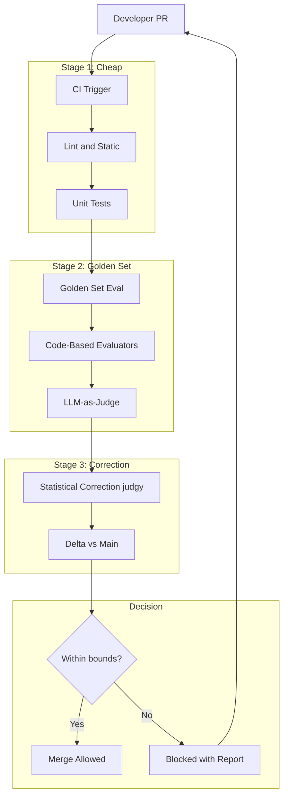
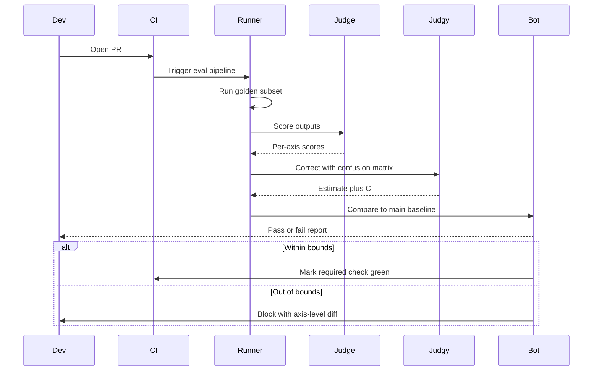

# 案例研究：AI 產品的 Eval-Gated CI/CD

一個 28 人的 AI 產品團隊以 eval-gated CI 取代 merge 後才開始的 regression 追查：每個 PR 都會在出現 merge 按鈕前執行 golden sets、搭配統計校正的 LLM-as-judge，以及 failure-mode taxonomies。

## 業務問題

一家 AI-first SaaS 公司推出一個面向客戶的 answer-bot，底層是 RAG pipeline 加上一個 agent loop。六個月前，團隊發布了一個「小」prompt 變更，結果讓特定合約類型問題的回答品質退化，並在客戶發現後損失了一筆 400 萬美元的續約。事故後檢討找出三件事：這次變更沒有針對該合約類型的測試集做評估；spot checks 中使用的 LLM-as-judge 指標漂移了 11 個百分點卻無人察覺；以及本可在 2 天內回滾的修復，因為沒有安全可回退的 baseline，最後拖了 9 天。

來自 2026 年 5 月現實條件的限制：

- 28 位工程師分屬 4 個團隊；每週約有 50 個 PR 會碰到 AI surface
- 受監管產業的客戶無法接受其領域特定查詢出現 regression
- 每個 PR 的 eval 預算：model spend 低於 40 美元；完整執行預算低於 1,200 美元
- p95 PR-to-merge 時間目標：包含 eval 在內低於 90 分鐘
- 稽核人員每季都要對 eval 方法論簽核

在 2026 年 5 月的現實中，eval-gated CI 已不再是加分題。Hamel Husain 的 [eval blog series](https://hamel.dev/blog/posts/evals/)、Eugene Yan 的文章（[evals](https://eugeneyan.com/writing/evals/)），以及用於統計校正的 [judgy library](https://github.com/ai-evaluation/judgy)，都已收斂成一套 playbook。Phoenix、Langfuse、Braintrust 與 Galileo 也都提供 CI 整合。問題已不再是「該不該做」，而是「怎麼做才不會讓 cycle time 翻倍」。

## 架構

### 元件

| 層級 | 技術 | 用途 |
|-------|------|---------|
| Golden sets | repo 中的 YAML，每個 surface 1,200 到 4,000 個案例 | 穩定測試基底 |
| Code evaluators | 搭配自訂 assertions 的 Pytest | 便宜、可重現的檢查 |
| LLM judges | 用於判斷的 Claude Sonnet 4.7 | 主觀品質評估 |
| Statistical correction | [judgy](https://github.com/ai-evaluation/judgy) | 將 judge scores 轉為含 CI 的估計值 |
| Pipeline | GitHub Actions 加自訂 runner | CI 編排 |
| Trace store | Langfuse | 每個 PR 的可觀測性 |
| Annotation | self-hosted Argilla | judge calibration 的人工重標註 |

### 資料流

1. PR 開啟，GitHub Actions 觸發；Stage 1（lint、unit、type checks）在 2 分鐘內完成。
2. Stage 2 針對代表性的子集啟動 golden-set eval（預設為完整資料集的 10% 到 25%；若是 protected branches 或貼有 `full-eval` label，則跑 100%）。
3. 每個 golden-set case 都會送入新 build，產生輸出後，再由（a）適合做 deterministic checks 的 code-based evaluators（JSON schema、regex、factual lookups）與（b）針對品質維度的 LLM judge 共同評分。
4. Stage 3 使用 `judgy` 配合 judge prompt 的 train/dev/test split 對 judge scores 進行校正。
5. 經校正的估計值（附 confidence interval）會與 `main` 上最近一次綠燈 build 比較；若 CI lower bound 仍在容忍範圍內，PR 可 merge；否則會以詳細報告擋下。

## 關鍵設計決策

### 1. Golden set 的建構與輪替

每個 golden set 由三個來源組成：過去 90 天的 production trace samples（依 error analysis 得出的 failure modes 分層抽樣）、由另一個 red-team LLM 生成的 synthetic adversarial cases，以及來自 customer support tickets 的人工整理邊界案例。我們每季輪替 10% 到 15% 的案例；從不刪除案例（舊案例會封存到凍結的「historical regressions」集合中，僅於夜間執行）。這可避免 eval set 跟著產品一起漂移，導致過擬合。

規模估算：每個 surface 至少要 1,200 個案例；低於此數量時，校正後分數的 CI 太寬，無法在 95% 信心水準下偵測 2 分 regression。Eugene Yan 討論過這種 sizing 數學；我們也針對自己的指標重新推導過。

### 2. Judge 的 train/dev/test split

LLM judge 本身也是一個有 prompt 參數與 few-shot examples 的 model。我們將 judge prompt 視為 model，並套用 train/dev/test 紀律：60% 的人工標註案例用於調整 judge prompt，20% 用於挑選最佳 prompt 變體，剩下 20% 是 hold-out，只會在 judge prompt 有重大變更前才拿來查驗。這正是 [judgy methodology](https://github.com/ai-evaluation/judgy) 與 Hamel eval 文章中的核心模式。

重新校準頻率：每 30 天，會有 50 個新案例由 2 位人工重新標註（要求 Cohen's kappa 高於 0.7）；若 judge 在 dev set 上的準確率低於 80%，就重新調參。

### 3. 使用 judgy 做統計校正

在我們的領域中，主觀類別上的原始 LLM-as-judge 準確率大約只有 75% 到 88%。直接使用原始 judge score 會有偏差。`judgy` 會利用 hold-out set 上的 confusion matrix，計算真實通過率的校正估計值，並回傳 confidence interval。我們以 CI 的 lower bound 是否在容忍範圍內作為 gate。這表示我們不會單因 judge noise 而擋下一個 PR，也不會放行一個只是剛好被 judge 漏掉的 regression。

數學上，如果 judge 在 hold-out set 上的 precision 為 85%、recall 為 92%，而新 build 的 judge-reported pass rate 為 89%，則校正後估計約為 87%，95% CI 大約落在 83% 到 91%。若此 CI 的 lower bound 與 `main` 相比最多只低 2 分，我們就允許 merge。（[Reference: judgy README math](https://github.com/ai-evaluation/judgy#statistical-correction)）

### 4. 以 failure-mode taxonomy 作為 assertion surface

我們不以單一數字評估「品質」。我們沿著 failure-mode taxonomy 的各軸評分：hallucination、retrieval-miss、format violation、refusal、persona break、citation error。這套 taxonomy 來自對 6 個月內 800 個正式環境失敗案例進行 error analysis 後的輸出（將 [Hamel 的 open-coding + axial-coding pipeline](https://hamel.dev/blog/posts/field-guide/) 套用進來）。依軸分數使我們即使在整體品質提升的情況下，也能單獨攔下 hallucination regression。

### 5. 每個 PR 的 eval 預算

完整跑一次 eval set 需花 80 到 200 美元，取決於 model spend。若每週 50 個 PR 都這樣跑，天真的成本就是每週 4,000 到 10,000 美元。我們透過以下方式限制：

- 預設 PR 只跑 golden set 的 10% 到 25%，並依 failure mode 分層抽樣（確保每種 failure mode 都有代表）。
- `full-eval` label 會觸發 100%。
- 每夜 cron 會在 `main` 上跑 100%，捕捉我們漏掉的漂移。
- 一旦 judge prompt 有變更，就會在凍結的 historical set 上執行 100%。

如此可將單個 PR 成本壓在 40 美元以下，且每週總成本控制在 1,200 美元以下。

### 6. Judge prompt 漂移偵測

即使有 calibration，judge prompts 仍會漂移：底層 model 更新了、few-shot examples 代表性下降、prompt 的措辭對 model 而言開始顯得過時。我們透過以下方式監控漂移：

- 每月重跑一次 hold-out set，回報與前月相比的準確率差異。
- 追蹤 inter-judge agreement（我們平行跑兩個 judge prompts；隨時間出現分歧就代表其中一個在漂移）。
- 在 git 中 version 控制 judge prompt；回滾只需 1 個 commit。

當漂移超過 3 分，或 kappa 低於 0.65，就開 maintenance ticket。

### 7. 快取 eval pipeline

一個典型 golden-set case 先產生輸出，再送去判斷。只要 prompt 與 model version 不變，輸出就是 deterministic 的。我們將 `(prompt-hash, model-version)` 快取到 `(output, judge-score)`，因此重跑相同 eval 幾乎免費。對於只改 orchestration code 而未改 prompts 的 PR，快取命中率約為 70%；這類變更的成本可降低 3 倍。

### 8. PR 級別的 instrumentation

每個 PR 的 eval report 都包含：各軸通過率相較 main 的變化、各軸新失敗案例、各軸新通過案例、judge-correction 的 CI 範圍、總成本，以及指向 trace store 的連結，讓工程師能重播任何失敗案例。報告會在執行完成後 3 分鐘內以 GitHub comment 形式貼出。

## CI Pipeline 序列

## 失敗模式與緩解措施

### F1：Judge prompt 漂移未被察覺

在 model 升級後，judge 逐漸低估 hallucinations。緩解方式：每月重播 hold-out、追蹤 inter-judge agreement，以及為 protected branches 啟用「freeze judge」模式，即使有更新 model 可用，也將 judge model version 固定住。先前讓我們出事的漂移事故正是這種類型；現在我們能在一個週期內抓到。

### F2：Eval set 變得過擬合

少數案例被反覆除錯，prompt 便在無意中朝它們微調。緩解方式：每季輪替；保留永不在 failure reports 中顯示給工程師看的 adversarial cases（只顯示結果）。Hold-out set 由獨立的 red-team team 負責。

### F3：單一 PR 只跑到 eval 的角落，導致漏掉 regression

我們使用分層抽樣：確保每個 PR 的 10% 樣本中，至少包含 12 種 failure modes 各 1 個案例。完整的夜間執行仍會在 `main` 上進行。單一 PR 的覆蓋有限，但不會是零。

### F4：意外 full run 導致成本超支

若每個 PR 都被加上 `full-eval` label，成本會增為三倍。緩解方式：該 label 需要來自 CODEOWNERS 檔案的核准；自動提醒也會 ping 套用它的人。我們也將每月 eval spend 設為 5,000 美元硬上限，任何超出上限的 job 一律拒絕啟動。

### F5：Block rate 過高，開發者開始忽略

若 35% 的 PR 都被擋下，開發者就不再閱讀報告，反而會開始找規避方法。緩解方式：調整 gating tolerance，讓 block-rate 維持在 5% 到 12%；我們把 block-rate 視為 SLI；當它飆升時會調查原因（通常是 judge 對某個新 failure mode 過度嚴格）。目標是揭露真實 regression，而不是當作擋人的玩具。

### F6：Holdout set 洩漏進訓練或 prompts

某個 hold-out case 被放進 few-shot example。緩解方式：hold-out set 儲存在獨立 repo 與獨立存取清單中；工程師無法直接讀取；只有 eval runner 擁有 deploy key。對於 hold-out failures，failure reports 顯示的是 hash，而非原始案例。

### F7：Judge model 停用

供應商宣布 judge model 即將 end-of-life。緩解方式：我們至少同步校準兩個 judge models；一旦收到停用通知，就有 60 天窗口可完成切換，同時維持 kappa thresholds。Judge prompts 的 git 歷史加上 calibration data，使這成為例行工作。

### F8：Eval runner 佇列飽和

發版前夕 PR 暴增，evals 在佇列裡排了 30 分鐘。緩解方式：專用 eval-runner GPU pool 搭配 autoscaling；protected branches 擁有優先通道；若 queue depth 超過 20，會自動將非 protected PR 降為 5% 樣本，以更快清空 backlog。

## 營運考量

### 監控

| SLO | 目標 |
|-----|--------|
| PR-to-merge p95 | 低於 90 分鐘 |
| 每個 PR 的 eval cost p95 | 低於 40 美元 |
| Block-rate（false negatives + true regressions） | 5% 到 12% |
| Judge inter-rater kappa | 高於 0.7 |
| Holdout-set replay accuracy delta 月比月 | 低於 3 分 |
| 正式環境 regression 漏網（部署後） | 每季少於 1 次 |

### 成本模型

以每週 50 個 PR 計算：

- 預設抽樣：平均每個 PR 25 美元；每週 1,250 美元
- Full-eval runs（每週約 8 次）：每次 100 美元；每週 800 美元
- Nightly cron：每次 200 美元；每週 1,400 美元
- Judge 重新校準：每月 50 美元
- 總計：每月約 1.4 萬美元

只要避免一次 regression，這筆錢就值回票價。我們對那筆流失的 400 萬美元續約做的事後估算顯示，即使一年只救回一次，也綽綽有餘。

### On-call 作業手冊

- Block-rate 飆升：檢查最近是否有 judge prompt 或 golden set 變更導致；將各軸分數與 baseline 比較。
- Eval cost 飆升：檢查 sample rate 設定；限制 `full-eval` label。
- Judge drift 警報：觸發 calibration cycle；若漂移嚴重，將 judge 切換到備援 model。
- Holdout breach（hash collision）：立即隔離並重新生成受影響案例。
- Eval runner 故障：PR 會以明確的「eval pending」狀態排隊；runner 故障期間絕不 auto-merge；SRE 會在 15 分鐘內收到通知。

### 季度檢視

每季，AI team 都會檢討：failure-mode taxonomy（類別是否仍對應正式環境真實錯誤？）、golden set 輪替（哪些 10% 到 15% 的案例已過時？）、judge calibration 歷史（漂移是否加速？），以及 block-rate 趨勢（這道 gate 是否開始流於形式？）。此檢視會輸入下一季的 eval roadmap。我們沿用 [Hamel field-guide](https://hamel.dev/blog/posts/field-guide/) 的儀式：針對最近 50 個失敗案例做 open-coding sessions，再透過 axial coding 更新 taxonomy。

### 稽核資料包

Eval pipeline 會產出季度 auditor pack：方法論文件（版本控管於 git 中）、golden set 摘要（各 failure mode 的案例數）、judge calibration 結果（隨時間變化的 Cohen's kappa）、block-rate 直方圖，以及一組被擋下 PR 的樣本與理由。資料包會自動生成，並由工程主管簽章。

### 為什麼我們不用單一綜合品質分數

最大的誘惑，是將所有軸合併成一個數字再據以做 gate。我們不這麼做。Composite score 會掩蓋 regression：hallucination regression 可能被 format compliance 改善抵銷。我們對每一軸分別做 gate，讓每一軸都有自己的 confidence interval 與 block。代價是報告雜訊更多；好處是我們不會在關鍵維度上默默退步。

## 優秀面試候選人會涵蓋的重點

- 他們會區分 code-based evaluators（便宜、可重現）與 LLM-as-judge（昂貴、主觀），並在不同階段同時使用兩者。
- 他們會明確提到 statistical correction；理解原始 judge score 是有偏估計，confidence intervals 才是正確的 gating 抽象。
- 他們會從 error analysis 定義出 failure-mode taxonomy，並以每軸分數而非單一 composite 做 gate。
- 他們會為 judge 本身定義 train/dev/test 紀律，包括重新校準所需的 kappa thresholds。
- 他們會明確限制 eval 成本；知道完整執行不可能套用到每個 PR，而 stratified sampling 就是關鍵槓桿。
- 他們會為 judge-prompt drift 提出方案：監控、版本控制 prompt，以及可回滾計畫。
- 他們會用 hashes 與獨立 access list 保護 hold-out set，避免洩漏。

## 參考資料

- Hamel Husain, [Your AI product needs evals](https://hamel.dev/blog/posts/evals/)
- Hamel Husain, [A field guide to rapidly improving AI products](https://hamel.dev/blog/posts/field-guide/)
- Eugene Yan, [Evals: Constructed for LLM apps](https://eugeneyan.com/writing/evals/)
- Eugene Yan, [LLM-as-judge](https://eugeneyan.com/writing/llm-evaluators/)
- [judgy library](https://github.com/ai-evaluation/judgy)
- [Phoenix evals](https://docs.arize.com/phoenix/evaluation/concepts-evals)
- [Langfuse evaluations](https://langfuse.com/docs/scores/overview)
- [Braintrust](https://www.braintrust.dev/docs)
- [Galileo evaluate](https://www.rungalileo.io/blog/llm-evaluation)
- Zheng et al., [Judging LLM-as-a-Judge](https://arxiv.org/abs/2306.05685)
- [Argilla annotation platform](https://docs.argilla.io/)
- [pytest-html report integration](https://pytest-html.readthedocs.io/)

相關章節：[Evaluation and Observability](../14-evaluation-and-observability/01-evaluation-fundamentals.md)、[Reliability and Safety](../13-reliability-and-safety/01-reliability-fundamentals.md)、[AI Evals Comprehensive Guide](../ai_evals_comprehensive_study_guide.md)。
