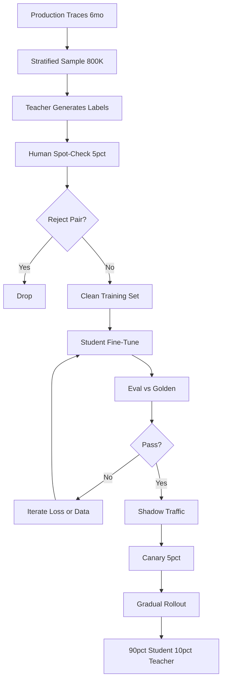

# 案例研究：客戶專屬 Distillation Pipeline

一家 Series-B AI 產品公司利用 6 個月的正式環境 traces 對 7B student model 進行 distillation，將 frontier-model 開銷從每月 5 萬美元降到 4 千到 6 千美元，投資回收期為 3 個月，並每 4 到 6 個月重新 distill 一次。

## 業務問題

一個已擴張的 AI 產品（每月約 800 萬次使用者請求）目前運行在 frontier model 上。2026 年初，成本線突破每月 5 萬美元，且每季成長 18%，財務團隊因此要求提出方案。團隊得到一個很清楚的結論：大約 90% 的正式流量，都落在少數重複任務模式中（intent classification、structured extraction、document summarization，以及三類 triage）。對這些任務來說，frontier model 是大材小用；用 frontier 自己的輸出微調出更小的 model，就能以一小部分成本承擔這些工作。

來自 2026 年 5 月現實條件的限制：

- Frontier-model 成本每月 5 萬美元，且持續成長
- 延遲預算：高流量任務的 p95 低於 350 ms
- 品質門檻：在客戶 golden set 上的 regression 低於 2%
- 合規：客戶資料不能離開特定 cloud region
- 人力：1 位 ML engineer 加上兼職 platform 支援

Distillation 模式已相當成熟：DistilBERT（[Sanh et al., 2019](https://arxiv.org/abs/1910.01108)）、TinyBERT、Alpaca 風格 instruction distillation（[Taori et al., 2023](https://github.com/tatsu-lab/stanford_alpaca)），以及較新的 chain-of-thought distillation 研究（[Hsieh et al., 2023](https://arxiv.org/abs/2305.02301)），都顯示 7B 到 13B 的 student 可在聚焦任務上恢復 92% 到 98% 的 teacher 表現。Frontier labs 的 FDE teams（Anthropic Field Engineering、OpenAI Solutions）也曾在公開演講中走過這筆帳；以下數字與這些團隊對客戶提出的估算相符。

## 架構

```mermaid
flowchart LR
    subgraph Collect["Trace Collection"]
        PROD[Production Traffic] --> TRACES[Trace Store]
        TRACES --> SAMPLER[Stratified Sampler]
        SAMPLER --> CURATE[Curation Queue]
    end

    subgraph Label["Labeling"]
        CURATE --> TEACHER[Teacher Frontier Model]
        TEACHER --> LABELS[Distillation Pairs]
        LABELS --> HUMAN[Human Spot-Check]
        HUMAN --> CLEAN[Clean Pairs]
    end

    subgraph Train["Distillation"]
        CLEAN --> FT[Student Fine-Tune 8x H100]
        FT --> EVAL[Eval Suite]
        EVAL --> CANARY[Canary Cohort]
    end

    subgraph Serve["Serving"]
        CANARY --> SHADOW[Shadow Traffic]
        SHADOW --> ROLLOUT[Gradual Rollout]
        ROLLOUT --> STUDENT[Student Model Serving]
    end
```

### 元件

| 層級 | 技術 | 用途 |
|-------|------|---------|
| Teacher | Frontier model（Claude Opus 4.7 或同級） | 標籤來源 |
| Student | Llama 4 7B int4 或 Qwen 3.6 7B | 正式 serving |
| Trace store | S3 加 Langfuse | 抽樣與重播 |
| Trainer | 8x H100 上的 DeepSpeed 加 FSDP | 為期一週的訓練 |
| Eval | 每任務 golden set，發生 regression 就通知 on-call | 品質 gate |
| Serving | 搭配 FP8 的 vLLM | 350 ms p95 |

### 資料流

1. 六個月的 production traces 累積於 Langfuse 與 S3。
2. Sampler 依任務類別做分層抽樣，並重新平衡以確保罕見類別也有代表性。
3. Teacher（frontier model）為每個樣本生成目標輸出；若任務適合 reasoning distillation，通常也會產生 chain-of-thought reasoning traces。
4. 領域專家對 5% 的樣本做人類 spot-check，以抓出 teacher 錯誤；我們採用 rejection sampling，只保留人工審閱也認同的配對。
5. Student 會在 8x H100 上 fine-tune 約 1 週（約 2.2 萬美元 compute），產出一個 7B model。
6. 該 model 通過各任務 eval 後，先在正式環境做 2 週 shadow，再分三週逐步 rollout：5%、20%、50%、90%，並以即時品質指標連接 auto-rollback。

## 關鍵設計決策

### 1. 用真實 production traces 做 distill，而不是 synthetic data

最誘人的做法，是讓 LLM 生成 synthetic prompts，再用 teacher 為它們標註。我們試過；這會產出一個對 synthetic prompts 很強、但在真實流量上退步 4 到 7 分的 model。Production traces 捕捉到真正重要的分布漂移、怪異情況與長尾案例。我們收集 6 個月 traces、按任務類別分層抽樣，並以真實 prompts 作為 distillation 來源。這也符合 frontier labs 的 FDE teams 所建議的實務。

### 2. 以人工 spot-check 搭配 reject sampling

Teacher 的錯誤會傳染到 student。若 teacher precision 為 92%，你對所有 teacher outputs 都拿來訓練，student precision 可能只剩 90%。我們會對隨機樣本中 5% 的 teacher labels 做人工 spot-check；只要人工不同意，就把該 pair 丟棄。這會淘汰大約 4% 的 labels，卻可讓最終 student 在我們的 composite metric 上提升 2 到 4 分。成本：每次重新 distill，除了 compute 外，還需約 1,800 美元的人工作業。

### 3. 只在值得時使用 chain-of-thought distillation

對於偏重推理的任務（我們案例中的 triage 類別），我們採用 Hsieh 等人 [distillation with rationales](https://arxiv.org/abs/2305.02301) 的方法：teacher 同時輸出答案與推理軌跡；student 也被訓練成輸出兩者。這可讓 student 獲得光靠 input-output pairs 無法學到的結構化思考。我們不在 classification 或 extraction 任務中使用此法（沒有額外收益，卻會增加延遲）。

### 4. 以人工標註建構 eval set

我們的 eval set 與 training set 分開策劃，包含高流量任務類別中的 1,800 個案例，由 3 位領域專家採多數決標註。每季會重標其中 200 個案例，以追蹤分布漂移。Eval set 是 canary rollout 的 gating signal；只要 composite 指標退步 2 分，就不得部署到正式環境。訓練資料抽樣期間，我們絕不查看 eval-set 範例。

### 5. Canary rollout 與 shadow traffic

即使 eval 通過，正式流量中仍存在 eval set 捕捉不到的尾部行為。我們的 rollout 如下：

- 第 1 週：只跑 shadow traffic，對使用者零影響。我們在 100% 流量上比較 student 與 teacher 輸出，並用 delta classifier 標出差異供人工審查。
- 第 2 週：5% live traffic。若發生以下任何情況即 auto-rollback：（a）latency p95 超過 500 ms、（b）live user thumbs-up rate 下跌超過 1 分、（c）某個領域專屬 guardrail 觸發率升高。
- 第 3 週：20%。相同 guardrails。
- 第 4 週：50%。
- 第 5 週：90%。另有 10% 永久導向 teacher，以持續蒐集 traces 並供下次 distillation。

這種保守升坡在過去一年中，抓到兩次 eval set 漏掉的 regression。

### 6. 重新 distill 的頻率

世界會漂移。新產品功能會改變任務分布；使用者會形成新行為；teacher 本身也會隨新 model 版本而進步。我們每 4 到 6 個月重新 distill 一次。此 pipeline 部分自動化：trace sampling、teacher labeling 與 training 都已腳本化；人工 spot-check 與 eval review 仍需要人參與。每次重新 distill 的總成本約 2.6 萬美元（2.2 萬美元 compute、1,800 美元標註，加上其他 overhead），耗時 4 到 6 週。

### 7. 何時 distillation 並不合理

Distillation 並非總是正確選擇。以下是反指標：

- 流量很低（每月低於 20 萬次請求）。投資回收永遠出不來。
- 任務高度多變。若每個請求都獨一無二，student 就無法學到有用分布。
- Teacher 本身不穩定或快速演化。對移動中的目標做 re-distill 只會浪費精力。
- 品質要求極高（需要超過 99% fidelity）。Distillation gap 是真實存在的；若無法容忍，就繼續使用 teacher。

我們用一個 quick-screen heuristic：至少 60% 的流量落在 5 種以下的任務模式，且這些任務的每月支出超過 2 萬美元。只要兩者有一項不成立，我們就放棄 distillation。

### 8. Quantization 選擇

我們以 int4 提供 7B student 服務（GPTQ via vLLM，搭配 FP8 KV cache）。相較於 FP16，int4 可將記憶體壓縮約 4 倍，並在 H100 上將吞吐提升約 2.3 倍。我們量測到 composite 指標僅損失 0.4 分，完全在容忍範圍內。我們也考慮過 int8（損失較小、加速較少）與 FP8（生態系較不成熟）；最終 int4 在單位請求成本上勝出。

### 9. 訓練資料的隱私考量

Production traces 依定義就含有使用者 PII。訓練前，我們會執行 redaction pass：一個 fine-tuned NER model 會標示 PII spans，並用類別 token（`[EMAIL]`、`[PERSON_NAME]`）取代。如此 student 能學到結構模式，卻不會記住特定身分。該 redaction model 本身也會在人工標註樣本上評估，precision 高於 98%、recall 高於 95%。

## 成本與回收

| 項目 | 金額 |
|-----------|--------|
| Trace collection（6 個月） | 已包含在 observability 支出中 |
| Teacher labeling（約 80 萬組 pairs） | 一次性 42K 美元 |
| Human spot-check | 一次性 8K 美元 |
| Compute（8x H100 一週，加上重試） | 一次性 32K 美元 |
| Eval set curation | 一次性 14K 美元 |
| Platform engineering（overhead） | 一次性 24K 美元 |
| **前期總成本** | **120K 美元** |

| 每月 run-rate | 之前 | 之後 |
|------------------|--------|-------|
| Frontier model（10% 流量保留，加上 re-distillation harness） | $50K | $5K |
| Student model serving（dedicated H100s 上的 vLLM） | $0 | $1,200 |
| **每月總計** | **$50K** | **$6.2K** |

每月節省：約 4.4 萬美元。投資回收：120K / 44K，約 2.7 個月。對財務部門我們會四捨五入成「3 個月回本」。

平均每 5 個月一次的 re-distillation 成本約 2.6 萬美元，我們將其攤提到同一條節省線中。年度淨節省：約 47 萬美元。

## Distillation Pipeline

## 失敗模式與緩解措施

### F1：Teacher 升級讓 student 過時

Frontier-model 供應商發布新一代 model，teacher 品質明顯提升，而我們的 student 相對於市場期待開始落後。緩解方式：每月監控 teacher 與 student 的 comparative eval；當差距超過 4 分，就加速 re-distillation。對更強 teacher 做 re-distill 很直接；pipeline 不變。

### F2：訓練與 serving 之間的分布漂移

某個新產品功能一夜之間改變了使用者行為（例如通知活動帶來異常查詢、或新定價方案改變了用戶族群）。Student 的訓練分布不再符合正式流量。緩解方式：線上 drift monitor 會在輸入 embedding 分布偏移超過門檻時發出訊號；若為結構性漂移，就觸發緊急 re-distillation；若只是短期波動，就將受影響切片導向 teacher。

### F3：Teacher 的 hallucinations 被烙印進 student

Teacher 偶爾會 hallucinate；reject sampling 能抓住大部分，但不是全部。於是 student 會更自信地 hallucinate，因為該模式已進入訓練分布。緩解方式：在 eval set 上做 faithfulness 檢查；只要 hallucination rate 相對 baseline 增加，就重新清洗訓練資料。

### F4：過度導向 teacher 造成成本回升

原本保留的 10% teacher fallback 比例逐漸上升，因為工程師為各種邊界情況加入更多 fallback。緩解方式：為 teacher spend 設預算警報；每季稽核 fallback routes；每條 fallback rule 都必須有 justification 與到期日。

### F5：Canary rollout 漏掉尾部 regression

Eval set 與 shadow traffic 看起來都正常，但 5% live traffic 暴露出會傷害特定客戶分群的 regression。緩解方式：在 live traffic 上按分群計算品質指標，並支援 per-segment auto-rollback；我們會依客戶等級、語言與任務類別分群監控。

### F6：合規違規：訓練資料駐留

客戶合約要求資料必須留在特定區域，而我們預設的訓練運算在另一個區域。緩解方式：維持區域在地訓練能力；每位客戶的訓練資料綁定在其區域；絕不把原始 traces 複製出該區域。Orchestrator 若發現 job 會違反 residency，便拒絕啟動。

### F7：罕見任務上的災難性遺忘

Student 忘記了只在訓練中看過兩次的類別。緩解方式：分層抽樣保證罕見類別的最低覆蓋；eval suite 明確包含罕見類別案例；canary rollout 亦會分別監控各類別品質。

### F8：Teacher 與 student 之間的成本追蹤失效

有些查詢在 shadow 階段同時送往 student 與 teacher；若無明確標記，成本統計就會重複計算。緩解方式：每次呼叫都加上成本標籤（shadow、primary、fallback），並以每日 reconciliation report 抓出標記錯誤的流量。

## 營運考量

### 監控

| SLO | 目標 |
|-----|--------|
| Student p95 延遲 | 低於 350 ms |
| 相較 teacher 的品質差異（校正後） | 在 2 分以內 |
| Teacher fallback rate | 目標 10%，超過 15% 警報 |
| 每 1K requests 成本 | 低於 distillation 前的 30% |
| Re-distillation 頻率 | 每 4 到 6 個月 |

### 成本模型

每月穩態：serving 6.2K 美元，加上攤提後的 re-distillation（每月 5.2K 美元）。相較於單用 teacher 的 50K 美元，在完整攤提後每月仍可淨省約 3.8 萬美元。年化淨節省約 45.6 萬美元。

### On-call 作業手冊

- 品質退化警報：先以人工重播 eval set 確認；若屬實，就把受影響分群路由回 teacher，直到下一輪訓練；同時開 priority ticket。
- 成本超支：檢查 fallback routes；若流量模式已變，安排 re-distillation；必要時節流。
- 延遲飆升：檢查 GPU utilization；若是 noisy neighbor，就隔離 student node。
- Drift 警報：檢查輸入 embedding histograms；若漂移幅度大且持續存在，就觸發緊急 re-distillation。
- Eval-set 洩漏：若發現某個 hold-out eval case 進入訓練資料，立即淘汰該案例並執行 deduplication pass；在當季內刷新 eval set。

### Comparative eval 頻率

每月一次，我們執行 comparative eval：抽樣 500 個案例，student 對 teacher，由 LLM-as-judge 評分，並加上 50 個案例的人類樣本。輸出是一個由 AI team 負責的單一 dashboard tile。差距變大，就是需要重新 distill 的早期警訊。

### Re-distillation 儀式

一旦排定重新 distill，我們就遵循一個 4 週儀式：第 1 週抽取新 traces，並以目前 teacher 標註；第 2 週訓練與評估；第 3 週 shadow traffic；第 4 週逐步 rollout。整套流程已做成 checklist；ML engineer 可在 platform 支援 gradual rollout 的情況下單獨執行。

### 對客戶的溝通

當我們將客戶流量切到 distilled student 時，會主動告知。對客戶的措辭是：「您的高流量查詢現在由我們依據您的流量微調後的 model 提供服務，並針對 latency 與成本進行最佳化。您季度報告中的 eval 證據顯示，其品質與 frontier baseline 相差不超過 2 分。」大多數客戶只在品質守住時並不在意；少數（金融服務、醫療）則要求明確簽核，除非他們選擇加入，否則這些查詢仍會走 teacher。

## 優秀面試候選人會涵蓋的重點

- 他們會把預算數學講清楚並放在一開始：前期成本、回收期、持續 re-distillation 成本。
- 他們會點名 distillation 論文（DistilBERT、Alpaca、distillation with rationales），並使用 student、teacher、rejection sampling 這套語言。
- 他們會解釋為什麼 production traces 勝過 synthetic data，以及為何人工 spot-check teacher labels 很重要。
- 他們會用具體百分比與 auto-rollback gates 走過 canary rollout，並點出 shadow-only traffic 漏掉的 regression 類型。
- 他們會說清楚 distillation 何時沒有幫助，證明他們真的做過，而不只是讀過。
- 他們會處理 teacher 升級情境：當 frontier 變強，student 與 teacher 的差距會擴大，而 re-distillation 就是解法。
- 他們會把隱私工作（訓練資料中的 PII redaction）納入 pipeline，而不是事後補救。

## 參考資料

- Sanh et al., [DistilBERT, a distilled version of BERT](https://arxiv.org/abs/1910.01108)
- Hinton et al., [Distilling the Knowledge in a Neural Network](https://arxiv.org/abs/1503.02531)
- Taori et al., [Stanford Alpaca: An Instruction-following LLaMA model](https://github.com/tatsu-lab/stanford_alpaca)
- Hsieh et al., [Distilling Step-by-Step](https://arxiv.org/abs/2305.02301)
- Jiao et al., [TinyBERT: Distilling BERT for Natural Language Understanding](https://arxiv.org/abs/1909.10351)
- Anthropic, [On distillation patterns](https://www.anthropic.com/research)
- OpenAI, [Distillation in the platform](https://platform.openai.com/docs/guides/distillation)
- [vLLM FP8 inference](https://docs.vllm.ai/en/latest/quantization/fp8.html)
- [Langfuse trace sampling](https://langfuse.com/docs/observability/sampling)
- Hamel Husain, [Field guide to rapidly improving AI products](https://hamel.dev/blog/posts/field-guide/)
- [DeepSpeed for training](https://www.deepspeed.ai/training/)
- [Together AI distillation case study](https://www.together.ai/blog/distillation)

相關章節：[Fine-Tuning and Distillation](../03-training-and-adaptation/03-distillation.md)、[Inference Optimization](../04-inference-optimization/01-inference-fundamentals.md)、[Cost Management](../11-infrastructure-and-mlops/05-cost-management.md)。
