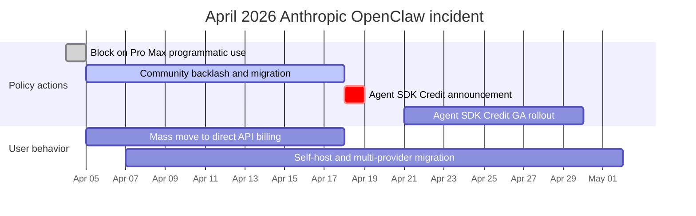

<a id="openclaw-deep-dive-the-open-source-personal-ai-agent"></a>
# OpenClaw 深入解析：開源個人 AI Agent

OpenClaw 是一個**開源、自行託管的個人 AI agent**，透過訊息平台作為主要介面，使用 LLM 來執行任務。你可以透過 WhatsApp、Telegram、Slack、Discord 或 Signal 與它對話，而它會回應你——執行 shell 指令、控制瀏覽器、管理行事曆、處理電子郵件，以及編排多步驟工作流程。

<a id="table-of-contents"></a>
## 目錄

- [什麼是 OpenClaw](#what-is-openclaw)
- [歷史：從 Clawdbot 到 Moltbot 再到 OpenClaw](#history)
- [架構深入解析](#architecture)
- [AgentSkills 系統](#agentskills)
- [LLM 供應商設定](#llm-providers)
- [訊息平台整合](#messaging-integrations)
- [安全模型](#security-model)
- [部署模式](#deployment-patterns)
- [效能最佳化與擴展](#performance)
- [真實世界使用案例](#use-cases)
- [限制，以及何時**不要**使用 OpenClaw](#limitations)
- [與替代方案的比較](#comparison)
- [快速上手：快速設定指南](#getting-started)
- [系統設計面試切入角度](#system-design-interview)
- [參考資料](#references)

---

<a id="what-is-openclaw"></a>
## 什麼是 OpenClaw

OpenClaw 是：

- **個人 AI agent**：不是 chatbot——而是會代表你採取行動的自主 agent
- **自行託管**：可在你的機器、VPS 或 Raspberry Pi 上執行——你的資料由你掌控
- **訊息原生**：存在於你已經在使用的聊天 App 中（WhatsApp、Telegram、Slack、Discord、Signal、iMessage，以及其他 20+ 個平台）
- **LLM 無關**：可搭配 Claude、GPT-4、Gemini、DeepSeek 或本地模型使用
- **技能可擴充**：提供 100+ 個預先設定的 skills，也有簡單格式可撰寫自訂 skill
- **開源**：採 MIT 授權，截至 2026 年初 GitHub 星數超過 25 萬

```
# The simplest way to start
git clone https://github.com/openclaw/openclaw.git
cd openclaw
docker compose up -d

# Or via npm
npm install -g openclaw
openclaw start
```

**它與 chatbot 的關鍵差異：**
- ChatGPT/Claude.ai：你輸入，它回覆文字
- OpenClaw：你輸入，它會**真的做事**——執行指令、編輯檔案、寄送電子郵件、控制智慧家庭裝置、管理你的行事曆

---

<a id="history"></a>
## 歷史

<a id="the-naming-timeline"></a>
### 命名時間線

| 日期 | 名稱 | 事件 |
|------|------|-------|
| 2025 年 11 月 | **Clawdbot** | Peter Steinberger 發布第一個原型，約一小時內完成 |
| 2026 年 1 月 | 2,000 stars | 早期採用者發現了這個專案 |
| 2026 年 1 月 27 日 | **Moltbot** | 因 Anthropic 商標投訴而重新命名（保留龍蝦主題） |
| 2026 年 1 月 30 日 | **OpenClaw** | 再次更名——Steinberger 覺得「Moltbot」念起來很拗口 |
| 2026 年 2 月 | 145,000+ stars | 爆炸性成長，超越許多成熟的開源專案 |
| 2026 年 2 月 14 日 | -- | Steinberger 加入 OpenAI，表示這讓他能取得擴展所需的資源 |
| 2026 年 3 月 | 250,000+ stars | 在 GitHub 上超越 React；成為有史以來成長最快的 OSS 專案之一 |

<a id="the-creator"></a>
### 創作者

Peter Steinberger 是來自奧地利的軟體工程師，在 2024 年出售公司之前，他曾花 13 年打造 PSPDFKit——一套被全球開發者使用的 PDF 工具組。他形容自己是「vibe coder」，也以「我會發布自己沒讀過的程式碼」這句名言聞名——這體現了新的 AI-first 開發哲學：人類提供意圖，AI 提供實作。

<a id="why-it-went-viral"></a>
### 為什麼會爆紅

OpenClaw 之所以打中市場痛點，是因為它解決了一個真實問題：LLM 很強大，但沒有狀態。每一次對話都從零開始。OpenClaw 為 LLM 帶來了**持久性**（跨 session 記憶）、**能動性**（不只會說，還能做事），以及**觸及範圍**（整合你已在使用的 App）。此外，它是自行託管且開源，代表任何人都能在不把資料託付給第三方服務的情況下自行運行。

---

<a id="architecture"></a>
## 架構

<a id="high-level-overview"></a>
### 高階概觀

```
                         OPENCLAW ARCHITECTURE
 ============================================================

  Messaging Platforms              OpenClaw Gateway           LLM Providers
 ┌──────────────┐              ┌─────────────────────┐     ┌──────────────┐
 │  WhatsApp    │──┐           │                     │     │  Anthropic   │
 │  (Baileys)   │  │           │   GATEWAY            │     │  (Claude)    │
 ├──────────────┤  │  Channel  │   ┌──────────────┐  │     ├──────────────┤
 │  Telegram    │──┼──Adapters─┼──>│  Router      │  │     │  OpenAI      │
 │  (grammY)    │  │           │   │  (sessions,  │  │     │  (GPT-4)     │
 ├──────────────┤  │           │   │   bindings)  │  │     ├──────────────┤
 │  Slack       │──┤           │   └──────┬───────┘  │     │  Google      │
 │  (Bolt)      │  │           │          │          │     │  (Gemini)    │
 ├──────────────┤  │           │   ┌──────▼───────┐  │     ├──────────────┤
 │  Discord     │──┤           │   │ Agent Runtime│──┼────>│  DeepSeek    │
 │  (discord.js)│  │           │   │ (AI loop,    │  │     ├──────────────┤
 ├──────────────┤  │           │   │  tool calls, │  │     │  Local/      │
 │  Signal      │──┤           │   │  memory)     │  │     │  Ollama      │
 │  (signal-cli)│  │           │   └──────┬───────┘  │     └──────────────┘
 ├──────────────┤  │           │          │          │
 │  iMessage    │──┤           │   ┌──────▼───────┐  │     Tools & Skills
 │  (BlueBubbles│  │           │   │  Tool Layer  │  │     ┌──────────────┐
 ├──────────────┤  │           │   │  (skills,    │──┼────>│  Shell exec  │
 │  Teams       │──┘           │   │   browser,   │  │     │  Browser     │
 │  IRC, Matrix │              │   │   files,     │  │     │  File I/O    │
 │  20+ more... │              │   │   cron)      │  │     │  Calendar    │
 └──────────────┘              │   └──────────────┘  │     │  Email       │
                               │                     │     │  100+ more   │
                               │   ┌──────────────┐  │     └──────────────┘
                               │   │  Memory &    │  │
                               │   │  State       │  │     Storage
                               │   │  (sessions,  │──┼────>┌──────────────┐
                               │   │   workspace) │  │     │  ~/.openclaw/│
                               │   └──────────────┘  │     │  (state,     │
                               └─────────────────────┘     │   memory,    │
                                                           │   config)    │
                                localhost:18789             └──────────────┘
```

<a id="core-components"></a>
### 核心元件

**1. Gateway**

Gateway 是一個長時間執行的 WebSocket 伺服器（預設：`localhost:18789`），作為 sessions、routing 與 channel connections 的單一事實來源（single source of truth）。它負責：

- 透過 channel adapters 接受所有訊息平台的連線
- 將訊息路由到正確的 agent
- session 管理與狀態持久化
- 驗證與存取控制
- 熱重載設定變更

**2. Channel Adapters**

當任一平台傳來訊息時，channel adapter 會先將其正規化為標準內部格式。每個 adapter 都包裝了一個平台專用函式庫：

| 平台 | Adapter 函式庫 | 協定 |
|----------|----------------|----------|
| WhatsApp | Baileys | WebSocket（非官方） |
| Telegram | grammY | Bot API |
| Slack | Bolt | Events API |
| Discord | discord.js | Gateway API |
| Signal | signal-cli | D-Bus |
| iMessage | BlueBubbles | REST API |
| IRC | irc-framework | IRC 協定 |
| Matrix | matrix-js-sdk | Matrix 協定 |
| Microsoft Teams | Bot Framework | REST API |

**3. Agent Runtime**

Agent Runtime 就是 AI loop。對於每一則傳入訊息，它會：

1. 從 session 歷史、workspace 記憶與相關 skills 組裝 context
2. 將組裝好的 prompt 傳送給已設定的 LLM
3. 從模型接收 tool calls
4. 對系統能力執行 tool calls
5. 把結果回傳給模型進行下一輪迭代
6. 持久化更新後的狀態（記憶、檔案、session 歷史）

**4. Multi-Agent Routing**

OpenClaw 支援在單一 Gateway process 內執行多個 agents。每個 agent 都有自己的 workspace、agentDir、sessions 與 tool 設定。傳入訊息會透過 bindings 被路由到 agents：

```json
{
  "agents": {
    "list": [
      {
        "name": "work-assistant",
        "agentDir": "./agents/work",
        "channels": ["slack-work"]
      },
      {
        "name": "home-assistant",
        "agentDir": "./agents/home",
        "channels": ["whatsapp-personal", "telegram"]
      },
      {
        "name": "devops-bot",
        "agentDir": "./agents/devops",
        "channels": ["discord-infra"]
      }
    ]
  }
}
```

這代表你可以讓工作助理跑在 Slack、個人助理跑在 WhatsApp，而 DevOps bot 跑在 Discord——全都由同一個 Gateway 驅動，且記憶與權限彼此完全隔離。

---

<a id="the-agentskills-system"></a>
<a id="agentskills"></a>
## AgentSkills 系統

<a id="how-skills-work"></a>
### Skills 如何運作

Skills 是 OpenClaw 取得基本對話能力以外其他能力的機制。每個 skill 都是一個目錄，其中包含 `SKILL.md` 檔案，裡面有 YAML frontmatter（中繼資料）與 markdown instructions（行為說明）。

```
~/.openclaw/skills/
  weather/
    SKILL.md           # Required: metadata + instructions
    scripts/
      fetch_weather.py # Optional: executable scripts
    references/
      api_docs.md      # Optional: supplementary docs

  email-manager/
    SKILL.md
    scripts/
      process_inbox.py
```

<a id="skillmd-format"></a>
### SKILL.md 格式

```yaml
---
name: weather-lookup
description: >
  Fetch current weather and forecasts for any location.
  Responds to queries about temperature, rain, and conditions.
triggers:
  - weather
  - temperature
  - forecast
  - "is it going to rain"
tools:
  - web_search
  - bash
---

# Weather Lookup Skill

When the user asks about weather:

1. Use the web_search tool to find current conditions
2. Extract temperature, humidity, wind, and forecast
3. Present in a concise, readable format
4. Include both metric and imperial units

## Example Response Format

"Currently 72F (22C) and partly cloudy in San Francisco.
Forecast: Clear skies through Thursday, rain expected Friday."
```

<a id="skill-resolution-order"></a>
### Skill 解析順序

Skills 可以存在於多個位置。當名稱衝突時，越本地的副本優先：

```
Priority (highest first):
  1. <workspace>/skills/        # Project-specific skills
  2. ~/.openclaw/skills/        # User-global skills
  3. <installed-packages>/      # npm-installed skills
  4. <bundled>/skills/          # Ships with OpenClaw
```

<a id="selective-injection"></a>
### 選擇性注入

OpenClaw **不會**把每個 skill 都注入到每個 prompt 中。Runtime 只會根據 skill 描述與 trigger keywords，選擇性注入與目前這一輪相關的 skills。這能避免 prompt 膨脹，並維持良好的模型效能。

<a id="creating-a-custom-skill"></a>
### 建立自訂 Skill

```bash
# Create the skill directory
mkdir -p ~/.openclaw/skills/deploy-checker
cd ~/.openclaw/skills/deploy-checker

# Create the SKILL.md
cat > SKILL.md << 'EOF'
---
name: deploy-checker
description: >
  Monitor deployment status across staging and production.
  Checks health endpoints, recent commits, and CI status.
triggers:
  - deploy
  - deployment
  - "is staging up"
  - "prod status"
tools:
  - bash
  - web_search
---

# Deploy Checker

When asked about deployment status:

1. Run `curl -s https://staging.myapp.com/health` to check staging
2. Run `curl -s https://myapp.com/health` to check production
3. Check recent git log: `git log --oneline -5`
4. Report status in a clear format

## Response Format

Staging: [UP/DOWN] - version X.Y.Z - deployed 2h ago
Production: [UP/DOWN] - version X.Y.Z - deployed 1d ago
Last 3 commits: ...
EOF
```

<a id="community-skills-ecosystem"></a>
### 社群 Skills 生態系

OpenClaw 的 skills 生態系成長很快，社群維護的集合涵蓋 DevOps、家庭自動化、內容創作、資料分析等類別，累積了數千個 skills。不過，這種開放性也伴隨風險——安裝第三方 skills 前務必先審查，因為早期目錄中曾出現惡意腳本事件。

---

<a id="llm-provider-configuration"></a>
<a id="llm-providers"></a>
## LLM 供應商設定

<a id="configuration-file"></a>
### 設定檔

OpenClaw 會從 `~/.openclaw/openclaw.json` 讀取設定（JSON5 格式——允許註解與尾隨逗號）。Gateway 會監看這個檔案，並透過 hot reload 自動套用變更。

```json5
{
  // Model provider configuration
  "models": {
    "providers": {
      "anthropic": {
        "baseUrl": "https://api.anthropic.com",
        "apiKey": "${ANTHROPIC_API_KEY}",  // env var substitution
        "models": {
          "claude-sonnet-4": {
            "maxTokens": 8192
          }
        }
      },
      "openai": {
        "baseUrl": "https://api.openai.com/v1",
        "apiKey": "${OPENAI_API_KEY}",
        "models": {
          "gpt-4o": {
            "maxTokens": 4096
          }
        }
      },
      "custom-deepseek": {
        "api": "openai",  // OpenAI-compatible API
        "baseUrl": "https://api.deepseek.com/v1",
        "apiKey": "${DEEPSEEK_API_KEY}",
        "models": {
          "deepseek-chat": {
            "maxTokens": 4096
          }
        }
      },
      "local-ollama": {
        "api": "openai",
        "baseUrl": "http://localhost:11434/v1",
        "apiKey": "ollama",  // Ollama accepts any key
        "models": {
          "llama3.1:70b": {
            "maxTokens": 2048
          }
        }
      }
    }
  },

  // Default agent model
  "agents": {
    "defaults": {
      "model": "anthropic/claude-sonnet-4"
    }
  }
}
```

<a id="provider-selection-strategy"></a>
### 供應商選擇策略

| 供應商 | 最適合用途 | 取捨 |
|----------|----------|------------|
| Anthropic (Claude) | 複雜推理、程式設計任務、長 context | 成本較高、品質最佳 |
| OpenAI (GPT-4o) | 通用用途、快速回應 | 速度與品質平衡良好 |
| Google (Gemini) | 注重預算的測試、慷慨的免費額度 | 推理品質較低 |
| DeepSeek | 最便宜的 frontier-class 選項（V4 Flash 每 1M 為 $0.14/$0.28，V4 Pro 在 2026/05/22 永久折扣後為 $0.435/$0.87）；1M context；最適合高流量、cache 友善的工作負載 | 可用性不穩定；open weights 版本也可自行託管 |
| Local (Ollama) | 隱私要求高、離線使用 | 需要強大硬體，品質較低 |

<a id="model-routing-within-openclaw"></a>
### OpenClaw 內部的模型路由

你可以為不同 agent 設定不同模型，以達成成本最佳化：

```json5
{
  "agents": {
    "defaults": {
      "model": "openai/gpt-4o-mini"  // Cheap default
    },
    "list": [
      {
        "name": "coding-agent",
        "model": "anthropic/claude-sonnet-4"  // Premium for code
      },
      {
        "name": "reminder-bot",
        "model": "google/gemini-2.0-flash"  // Cheap for simple tasks
      }
    ]
  }
}
```

---

<a id="messaging-platform-integrations"></a>
<a id="messaging-integrations"></a>
## 訊息平台整合

OpenClaw 透過其 channel adapter 架構支援 20+ 個訊息平台：

<a id="supported-platforms"></a>
### 支援的平台

| 平台 | 函式庫 | 狀態 | 備註 |
|----------|---------|--------|-------|
| WhatsApp | Baileys | Stable | 非官方 API；需要個人帳號 |
| Telegram | grammY | Stable | 官方 Bot API；最可靠的 channel |
| Slack | Bolt | Stable | 需要安裝 workspace app |
| Discord | discord.js | Stable | 需要 bot token |
| Signal | signal-cli | Stable | 需要已連結裝置 |
| iMessage | BlueBubbles | Stable | 僅限 macOS；需要 BlueBubbles server |
| Google Chat | Chat API | Stable | 需要 workspace 管理員核准 |
| Microsoft Teams | Bot Framework | Beta | 2026 Q2 正式完整發布 |
| IRC | irc-framework | Stable | 傳統協定支援 |
| Matrix | matrix-js-sdk | Stable | 聯邦式、對 self-hosted 友善 |
| Mattermost | API | Stable | self-hosted 的 Slack 替代方案 |
| LINE | Messaging API | Stable | 在日本／東南亞很流行 |
| Feishu (Lark) | Open API | Stable | 在中國很流行 |
| Twitch | TMI.js | Stable | 僅聊天 |
| WeChat | -- | Beta | 需要自訂 bridge |
| Nostr | -- | Beta | 去中心化協定 |
| WebChat | Built-in | Stable | 瀏覽器型 fallback |

<a id="unified-context-across-channels"></a>
### 跨 Channel 的統一 Context

一個關鍵的架構決策：Gateway 在所有 channels 之間維護**一套統一記憶系統**。如果你在 WhatsApp 上告訴 agent 某件事，之後從 Slack 傳訊時它也會記得。這代表無論你透過哪個 App 接觸它，你的 AI agent 都擁有一致的 context。

```
          WhatsApp ──┐
          Telegram ──┤     ┌─────────────────────┐
          Slack    ──┼────>│  Shared Memory Pool  │
          Discord  ──┤     │  (per-agent, cross-  │
          Signal   ──┘     │   channel sessions)  │
                           └─────────────────────┘
```

---

<a id="security-model"></a>
## 安全模型

<a id="security-philosophy"></a>
### 安全哲學

OpenClaw 的安全模型假設的是「個人助理」威脅模型：一位受信任的操作員，可能搭配多個 agents。其優先順序是：

1. **身分優先**：誰可以和 bot 對話？
2. **範圍其次**：bot 被允許在哪裡採取行動？
3. **模型最後**：假設模型可能被操控，因此要限制爆炸半徑

<a id="permission-layers"></a>
### 權限層次

```
 Layer 1: Channel Authentication
 ─────────────────────────────────
 Who can message the bot?
 Configured per-channel with allowlists.

 Layer 2: Agent Tool Allow/Deny
 ─────────────────────────────────
 Which tools can this agent use?
 Configured per-agent in agents.list[].tools.

 Layer 3: Sandbox Tool Policy
 ─────────────────────────────────
 Separate from agent permissions.
 Even if agent allows a tool, sandbox may block it.

 Layer 4: Elevated Access
 ─────────────────────────────────
 Some tools require host-level access.
 Gated per-channel and per-user with allowFrom lists.
```

<a id="sandbox-isolation"></a>
### Sandbox 隔離

對於非主 session（sub-agents、cron jobs、隔離任務），OpenClaw 支援 Docker sandbox isolation：

```yaml
# docker-compose.sandbox.yml
services:
  openclaw-sandbox:
    image: openclaw/sandbox:latest
    network_mode: "none"        # No network access
    read_only: true             # Read-only root filesystem
    volumes:
      - ./workspace:/workspace  # Restricted workspace only
    security_opt:
      - no-new-privileges:true
```

當設定 `network: "none"` 時，被 sandbox 的 sub-agent 無法發出對外請求、無法外洩資料，也無法觸及外部服務——即使執行的是惡意程式碼也一樣。

<a id="critical-security-warnings"></a>
### 關鍵安全警告

**預設信任 localhost**：預設情況下，OpenClaw 會信任來自 localhost 的連線而不需驗證。如果 Gateway 位於設定不當、把所有請求都轉送到 localhost 的 reverse proxy 後方，外部攻擊者就能取得完整存取權。遠端部署時務必設定驗證。

**Skill 供應鏈**：社群 skills 目錄曾出現惡意套件事件。安裝第三方 skills 前務必先審查。固定 skill 版本。對不受信任的 skills 使用 sandbox。

<a id="hardening-checklist"></a>
### 強化檢查清單

```
[x] Set state directory permissions to 700
[x] Configure channel allowlists (do not leave open)
[x] Enable sandbox for sub-agents and cron jobs
[x] Use environment variables for API keys, never hardcode
[x] Put Gateway behind authenticated reverse proxy for remote access
[x] Review all third-party skills before installation
[x] Set up monitoring for unusual tool invocations
[x] Restrict elevated tool access to specific users
[x] Run Gateway as non-root user
[x] Enable TLS for WebSocket connections
```

---

<a id="deployment-patterns"></a>
## 部署模式

<a id="option-1-local-development-fastest-start"></a>
### 選項 1：本機開發（最快上手）

```bash
# Clone and run
git clone https://github.com/openclaw/openclaw.git
cd openclaw
cp .env.example .env
# Edit .env: add ANTHROPIC_API_KEY or OPENAI_API_KEY

npm install
npm start
```

**需求**：Node.js 20+、512MB RAM、任意作業系統。

<a id="option-2-docker-recommended-for-production"></a>
### 選項 2：Docker（正式環境推薦）

```yaml
# docker-compose.yml
version: "3.8"
services:
  openclaw:
    image: openclaw/openclaw:latest
    container_name: openclaw-gateway
    restart: unless-stopped
    ports:
      - "18789:18789"
    volumes:
      - ./state:/app/state         # Persistent state
      - ./openclaw.json:/app/openclaw.json  # Configuration
    environment:
      - ANTHROPIC_API_KEY=${ANTHROPIC_API_KEY}
      - OPENAI_API_KEY=${OPENAI_API_KEY}
    mem_limit: 2g
    logging:
      driver: json-file
      options:
        max-size: "10m"
        max-file: "3"
```

```bash
docker compose up -d
docker logs -f openclaw-gateway  # Watch logs
```

<a id="option-3-cloud-vps-always-on"></a>
### 選項 3：雲端 VPS（常駐執行）

OpenClaw 很輕量——任何擁有 512MB RAM 與 1 個 CPU core 的機器都足夠。每月 4–6 美元的 VPS 就能運作。

**快速部署選項：**
- **DigitalOcean**：內建安全強化的 1-Click App
- **Railway**：從 GitHub README 一鍵部署（約 5 分鐘）
- **Contabo**：VPS 方案提供免費 1-click OpenClaw 外掛
- **AWS Lightsail**：每月 $3.50 的實例也能輕鬆執行
- **Raspberry Pi**：在配備 4GB RAM 的 Pi 4 上運作良好

<a id="production-architecture"></a>
### 正式環境架構

```
                    PRODUCTION DEPLOYMENT
 ====================================================

  Internet
     │
     ▼
 ┌───────────────┐
 │  Cloudflare   │     SSL termination
 │  (CDN/WAF)    │     DDoS protection
 └───────┬───────┘
         │
         ▼
 ┌───────────────┐
 │  Nginx        │     Reverse proxy
 │  (with auth)  │     Rate limiting
 └───────┬───────┘     WebSocket upgrade
         │
         ▼
 ┌───────────────────────────────────────┐
 │  Docker                              │
 │  ┌─────────────────────────────────┐ │
 │  │  openclaw-gateway               │ │
 │  │  (main process)                 │ │
 │  └────────────┬────────────────────┘ │
 │               │                      │
 │  ┌────────────▼────────────────────┐ │
 │  │  openclaw-sandbox               │ │
 │  │  (isolated sub-agents)          │ │
 │  │  network: none                  │ │
 │  └─────────────────────────────────┘ │
 │                                      │
 │  Volume: ./state (700 permissions)   │
 └──────────────────────────────────────┘
         │
         ▼
    LLM APIs
    (Anthropic, OpenAI, etc.)
```

<a id="nginx-configuration-for-remote-access"></a>
### 遠端存取的 Nginx 設定

```nginx
# /etc/nginx/sites-available/openclaw
server {
    listen 443 ssl http2;
    server_name openclaw.yourdomain.com;

    ssl_certificate /etc/letsencrypt/live/openclaw.yourdomain.com/fullchain.pem;
    ssl_certificate_key /etc/letsencrypt/live/openclaw.yourdomain.com/privkey.pem;

    location / {
        proxy_pass http://127.0.0.1:18789;
        proxy_http_version 1.1;
        proxy_set_header Upgrade $http_upgrade;
        proxy_set_header Connection "upgrade";
        proxy_set_header Host $host;
        proxy_set_header X-Real-IP $remote_addr;

        # Basic auth for web interface
        auth_basic "OpenClaw";
        auth_basic_user_file /etc/nginx/.htpasswd;
    }
}
```

---

<a id="performance-optimization-and-scaling"></a>
<a id="performance"></a>
## 效能最佳化與擴展

<a id="memory-guidelines"></a>
### 記憶體指引

| 部署情境 | 建議 RAM | 理由 |
|------------|----------------|-----------|
| 個人、輕量使用 | 512MB - 1GB | skills 少、對話較短 |
| 個人、日常使用 | 4GB | skill 數量中等、會用到瀏覽器自動化 |
| 團隊或高頻率使用 | 8GB | 多個 agents、並行 sessions |
| 正式標準環境 | 16GB | 完整 skill 套件、重度自動化 |

<a id="context-window-management"></a>
### Context Window 管理

LLM 的注意力成本會隨 context 長度平方成長。當 context 從 50K 增加到 100K tokens，模型的工作量會變成四倍。實務上的最佳化方式：

- **限制 context window**：100K tokens 對多數任務已足夠
- **開始新對話**：長歷史會累積數百則訊息；應定期重啟
- **停用未使用的 skills**：每個載入的 skill 都會吃掉 context 預算

<a id="skill-optimization"></a>
### Skill 最佳化

```
 DO: Enable only skills you actively use
 DO: Write concise SKILL.md descriptions
 DO: Use specific trigger keywords

 DON'T: Enable everything "just in case"
 DON'T: Write verbose skill instructions
 DON'T: Load 50+ skills simultaneously
```

每個啟用的 skill 都會增加 agent 在每一輪必須評估的 context。如果你過去一週都沒用到某個 skill，就把它停用。

<a id="latency-reduction"></a>
### 降低延遲

1. **關閉冗長 thinking**：`thinkingDefault` 設定控制內部推理。對即時互動來說，略過 chain-of-thought 可將處理時間大致砍半
2. **使用更快的模型**：把簡單任務（提醒、查詢）路由到較小的模型
3. **讓供應商就近部署**：選擇與你的伺服器距離較近的 LLM 供應商與區域
4. **用 Docker 監控**：使用 `docker stats openclaw-gateway` 即時查看資源用量

---

<a id="real-world-use-cases"></a>
<a id="use-cases"></a>
## 真實世界使用案例

<a id="1-development-workflow-orchestrator"></a>
### 1. 開發工作流程協調器

一個名為「Patch」的 supervisor agent 透過 Telegram 協調 5–20 個平行的 Claude Code instances。開發者從手機發送高階指令，supervisor 便會啟動 coding agents、指派任務、審查輸出、執行測試，並合併程式碼。

```
Developer (phone)
     │
     ▼ Telegram message: "Fix auth bug and add rate limiting"
┌─────────────┐
│  Patch      │ (OpenClaw supervisor agent)
│  Agent      │
└──────┬──────┘
       │ Spawns parallel workers
       ├──> Claude Code instance 1: Fix auth bug
       ├──> Claude Code instance 2: Add rate limiting
       └──> Claude Code instance 3: Update tests
              │
              ▼
       Results merged, tests pass
       PR created automatically
```

<a id="2-email-triage-at-scale"></a>
### 2. 大規模電子郵件分流

有位開發者使用 himalaya CLI 整合，讓 OpenClaw 能存取一個擁有 15,000 封郵件的電子郵件帳號。Agent 處理了整個積壓——取消垃圾郵件訂閱、依緊急程度分類，並草擬回覆供人工審閱。

<a id="3-home-automation-hub"></a>
### 3. 家庭自動化中樞

一個名為「Claudette」的 agent 透過 Home Assistant 控制整棟房子，並使用 ha-mcp skill 存取所有 Home Assistant entities。它能控制 Philips Hue 燈光、Elgato 裝置，並根據天氣預報調整鍋爐設定——全部都透過 WhatsApp 指令完成。

<a id="4-content-production-pipeline"></a>
### 4. 內容製作管線

使用平行的 Discord-based workers 建立多 agent 內容工作流程：
- Agent 1：研究與擬定大綱
- Agent 2：撰寫草稿
- Agent 3：產生縮圖與社群媒體素材
- Supervisor：審查、編修並發布

<a id="5-cicd-monitoring"></a>
### 5. CI/CD 監控

一個常駐 agent 會監看 GitHub Actions、GitLab CI 或 Jenkins，當 build 失敗、測試報錯或部署完成時，透過 Telegram 發出警示。它也能自動分流失敗事件並建立 issue。

<a id="6-automated-client-onboarding"></a>
### 6. 自動化客戶導入

當新客戶簽約後，agent 會啟動完整工作流程：建立專案資料夾、寄送歡迎信、安排 kickoff call，並在任務清單中加入後續提醒。

---

<a id="limitations-and-when-not-to-use-openclaw"></a>
<a id="limitations"></a>
## 限制，以及何時**不要**使用 OpenClaw

<a id="known-limitations"></a>
### 已知限制

**過度自主**：OpenClaw 的自主性可能反而成為負擔。你請它做一件事，它可能在推理迴圈中越走越遠、重複呼叫工具，或在執行途中重新詮釋你的目標。結果需要人工審查。

**設定複雜**：要把 OpenClaw 跑得好，得管理環境、權限、工具連接器與執行 sandbox。許多使用者表示，他們花在設定上的時間比實際使用還多。

**記憶脆弱**：session 內的聊天歷史是暫時性的，Gateway 重啟後就會遺失。Workspace 檔案只會持久保留那些被明確儲存的內容。如果一段對話從未寫入 memory files，之後就沒有東西可取回。

**資源消耗**：當載入許多 skills 時，container 可使用超過 2GB 的 RAM。長對話歷史會讓情況更嚴重。

**非官方 API**：WhatsApp 整合使用的是 Baileys（非官方）。這可能隨著 WhatsApp 更新而失效，也可能違反服務條款。其他非官方 adapters 也有類似風險。

<a id="when-not-to-use-openclaw"></a>
### 何時**不要**使用 OpenClaw

| 情境 | 為什麼不適合 | 更好的替代方案 |
|----------|---------|-------------------|
| Multi-tenant SaaS | 並非為敵對多使用者隔離而設計 | 具備正確租戶邊界的自訂 agent framework |
| 高風險自動化 | 執行路徑不可預測，難以稽核 | 決定性工作流程引擎（Temporal、Prefect） |
| 即時系統 | LLM 延遲（每輪 1–5 秒）太慢 | Event-driven architecture |
| 受監管產業 | 沒有合規認證，audit trails 也很基礎 | 具備 SOC2/HIPAA 的企業 AI 平台 |
| 超過 10 人的團隊 | 單一操作員信任模型無法擴展 | 具備適當 RBAC 的共享 agent 平台 |
| 模糊的真實世界任務 | 最適合用在範圍明確、犯錯成本低的環境 | 人類操作員 |

---

<a id="the-april-2026-anthropic-block-and-reverse-incident"></a>
## 2026 年 4 月 Anthropic 封鎖與撤回事件

OpenClaw 過去仰賴 Claude Pro 與 Claude Max 訂閱來驅動 agent 工作；直到 2026 年 4 月前，這一直被視為一種成本控制特性：使用者可以讓 OpenClaw 使用既有的個人 Claude 方案，而不用支付 API 計價。2026 年 4 月 4 日，Anthropic 改變了政策。新的執行條款封鎖第三方 agent framework 以程式化中介方式使用 Pro 與 Max 訂閱。數小時內，指向 Pro 與 Max 帳號的 OpenClaw instances 開始回傳錯誤。大約 13.5 萬個活躍 OpenClaw 部署受到影響，其中相當一部分使用者改用直接 API 計費，實際成本變成原先的 5 倍或更高。社群的不滿情緒在 Hacker News 與 X 上延燒近兩週。

Anthropic 在 4 月中旬撤回政策，並推出名為 Agent SDK Credit 的新產品：這是一種包含在 Pro 與 Max 方案中的計量額度（Max 額度更高），明確授權可透過 Anthropic Agent SDK 進行程式化 agent 使用。整合 Agent SDK 的 frameworks（包括 OpenClaw）因此又能再次驅動個人訂閱，但前提是必須在透明配額內，且只能透過 Agent SDK 路徑。直接抓取 Claude.ai 網頁 session 仍然被禁止。

<a id="timeline-of-the-incident"></a>
### 事件時間線



<a id="what-it-means-architecturally"></a>
### 從架構角度代表什麼

這起事件不是安全事件，而是產品政策事件，只是它帶來了安全與可靠性上的後果。可歸納出三個教訓：

**供應商政策是你架構的一部分。** 從可用性的角度來看，廠商在 Acceptable Use 執行上的一條規則，功能上就等同於一次服務中斷——而且會持續到政策解除為止。如果你的 agent 平台經濟模型仰賴特定供應商方案，那麼供應商的政策團隊就是你關鍵路徑的一部分。要把他們的 Terms of Service 視為執行期依賴，而不是法律文件。

**多供應商抽象是營運衛生，不是最佳化。** 那些同時設定 Anthropic 與 OpenAI 供應商、並對不同 agent 設定模型路由規則的 OpenClaw 使用者，在封鎖期間仍能以較差品質繼續運作。反之，那些在每個 agent 定義裡都硬編碼單一供應商的使用者則完全停擺。抽象層建置成本很低，而它涵蓋的失敗模式卻真實存在。

**對個人資料 agent 而言，自行託管的後備路徑很重要。** 有一部分 OpenClaw 部署在兩週內把預設 agent 切換到本地 Ollama 模型（最常見選擇是 Llama 3.3 70B），接受較低品質以換取可用性保證。重點不是本地模型能和 frontier models 競爭，而是即使品質退化，仍有可運作的 fallback path，這本身就是嚴肅部署的一部分。

<a id="vendor-risk-checklist"></a>
### 供應商風險檢查清單

- 每個 agent 定義都必須經過 provider-abstraction layer；不能有 agent 硬編碼單一供應商模型名稱。
- 設定中應包含每個 agent 的文件化 fallback provider，並附上經過測試的切換腳本。
- 對涉及個人資料或營收關鍵的 agents，至少一條 fallback path 應使用可自行託管的模型（Ollama、vLLM 或具租戶隔離的雲端供應商）。
- 部署 runbook 應把供應商 Terms of Service 與 Acceptable Use 視為需監控文件，並訂閱供應商安全公告與政策更新郵件清單。
- agent 設定中的成本預算應以現實最壞情況（直接 API 費率）為基準，而不是樂觀情境。
- 每週的 canary test 應透過抽象層呼叫每個供應商，並在 4xx 變化時發出警示，讓政策變動在打到正式流量前就先被發現。

**來源：**
- [Axios：Anthropic 封鎖 OpenClaw 第三方 agents](https://www.axios.com/2026/04/06/anthropic-openclaw-subscription-openai)
- [VentureBeat：以 Agent SDK credit 撤回對 OpenClaw 的限制](https://venturebeat.com/technology/anthropic-reinstates-openclaw-and-third-party-agent-usage-on-claude-subscriptions-with-a-catch)

---

<a id="comparison-with-alternatives"></a>
<a id="comparison"></a>
## 與替代方案的比較

| 功能 | OpenClaw | Hermes Agent | Claude Code | Open Interpreter |
|---------|----------|-------------|-------------|-----------------|
| **主要介面** | 訊息 App | 訊息 App | Terminal/CLI | Terminal/CLI |
| **架構** | Gateway + Channel Adapters | Learning loop + Skill memory | Agentic CLI | 簡單 REPL |
| **LLM 支援** | 任意（Claude、GPT、Gemini、本地） | 任意 | 僅 Claude | 任意 |
| **訊息平台** | 20+（WhatsApp、Telegram、Slack 等） | 6（Telegram、Discord、Slack、WhatsApp、Signal、email） | 無（僅 terminal） | 無（僅 terminal） |
| **記憶** | 每個 assistant 跨 session | 多層級（session、persistent、skill） | 僅 session（以 `CLAUDE.md` 提供 context） | 僅 session |
| **Skills/Plugins** | 100+ 內建，具社群生態系 | 自我學習的 skill system | MCP tools | 有限外掛 |
| **自行託管** | 是（必須） | 是（必須） | 否（Anthropic 託管） | 是 |
| **GitHub stars** | 250K+ | 22K+ | N/A（閉源） | 55K+ |
| **最適合** | 多 channel 個人 AI 助理 | 會隨時間學習的個人 agent | 軟體開發 | 快速本地自動化 |
| **最不擅長** | 可預測性、企業用途 | 平台覆蓋範圍 | 非程式任務 | 複雜工作流程 |

<a id="choosing-the-right-tool"></a>
### 如何選擇正確工具

```
Need multi-channel messaging?          --> OpenClaw
Need an agent that learns from usage?  --> Hermes Agent
Need autonomous coding specifically?   --> Claude Code
Need quick one-off local automation?   --> Open Interpreter
Need enterprise-grade reliability?     --> Custom solution or commercial platform
```

---

<a id="getting-started"></a>
## 快速上手

<a id="minimal-setup-5-minutes"></a>
### 最小設定（5 分鐘）

```bash
# 1. Clone the repository
git clone https://github.com/openclaw/openclaw.git
cd openclaw

# 2. Copy and edit environment file
cp .env.example .env
# Add your LLM API key:
# ANTHROPIC_API_KEY=sk-ant-...
# or OPENAI_API_KEY=sk-...

# 3. Start with Docker
docker compose up -d

# 4. Check logs
docker logs -f openclaw-gateway
```

<a id="connect-your-first-channel-telegram"></a>
### 連接你的第一個 Channel（Telegram）

Telegram 是最容易設定的 channel：

```json5
// ~/.openclaw/openclaw.json
{
  "channels": {
    "telegram": {
      "enabled": true,
      "token": "${TELEGRAM_BOT_TOKEN}",  // From @BotFather
      "allowedUsers": ["your_telegram_id"]
    }
  },
  "models": {
    "providers": {
      "anthropic": {
        "apiKey": "${ANTHROPIC_API_KEY}"
      }
    }
  },
  "agents": {
    "defaults": {
      "model": "anthropic/claude-sonnet-4"
    }
  }
}
```

<a id="install-your-first-skill"></a>
### 安裝你的第一個 Skill

```bash
# Install a community skill
cd ~/.openclaw/skills
git clone https://github.com/example/weather-skill.git weather

# Or create your own (see AgentSkills section above)
mkdir my-skill && cat > my-skill/SKILL.md << 'EOF'
---
name: my-first-skill
description: A simple greeting skill
---
When the user says hello, respond warmly and offer to help.
EOF
```

<a id="verify-everything-works"></a>
### 驗證一切正常運作

```bash
# Check Gateway health
curl http://localhost:18789/health

# Check logs for errors
docker logs openclaw-gateway --tail 50

# Send a test message via Telegram to your bot
# It should respond within 2-5 seconds
```

---

<a id="system-design-interview-angle"></a>
<a id="system-design-interview"></a>
## 系統設計面試切入角度

<a id="prompt-design-a-personal-ai-assistant-platform-like-openclaw"></a>
### 題目：「設計一個像 OpenClaw 的個人 AI 助理平台」

這是一個很出色的 system design 題目，因為它涵蓋了訊息系統、agent orchestration、安全性、多租戶，以及即時通訊。

<a id="requirements-gathering"></a>
### 需求蒐集

**功能性：**
- 使用者透過訊息平台互動（WhatsApp、Slack、Telegram）
- agent 可執行任務：執行指令、管理檔案、寄送電子郵件、控制裝置
- 記憶可跨 sessions 與 channels 持久化
- 支援每位使用者擁有多個彼此隔離的 agents
- 可擴充的 skill/plugin 系統

**非功能性：**
- 低延遲（含 LLM inference 在內的回應時間 < 5 秒）
- 可自行託管（使用者掌控自己的資料）
- 安全（sandbox 執行、權限控制）
- 可靠（適合 always-on assistant 的 24/7 uptime）

<a id="high-level-design"></a>
### 高階設計

```
                     SYSTEM DESIGN

 ┌──────────────────────────────────────────────────────┐
 │                   API Gateway                         │
 │  ┌────────────┐  ┌────────────┐  ┌────────────┐     │
 │  │ WhatsApp   │  │ Telegram   │  │ Slack      │     │
 │  │ Webhook    │  │ Webhook    │  │ Events API │     │
 │  └─────┬──────┘  └─────┬──────┘  └─────┬──────┘     │
 │        └───────────────┼───────────────┘             │
 │                        ▼                              │
 │              ┌─────────────────┐                     │
 │              │ Message Router  │                     │
 │              │ (user lookup,   │                     │
 │              │  agent binding) │                     │
 │              └────────┬────────┘                     │
 └───────────────────────┼──────────────────────────────┘
                         │
          ┌──────────────▼──────────────┐
          │       Agent Orchestrator     │
          │  ┌───────────────────────┐  │
          │  │ Context Assembler     │  │
          │  │ (memory + skills +    │  │
          │  │  session history)     │  │
          │  └───────────┬───────────┘  │
          │              ▼              │
          │  ┌───────────────────────┐  │
          │  │ LLM Router           │  │
          │  │ (model selection,    │  │
          │  │  fallback, caching)  │  │
          │  └───────────┬───────────┘  │
          │              ▼              │
          │  ┌───────────────────────┐  │
          │  │ Tool Executor        │  │
          │  │ (sandboxed, gated,   │  │
          │  │  audited)            │  │
          │  └───────────────────────┘  │
          └─────────────────────────────┘
                         │
          ┌──────────────▼──────────────┐
          │       Storage Layer          │
          │  ┌──────┐ ┌──────┐ ┌─────┐ │
          │  │Memory│ │State │ │Audit│ │
          │  │Store │ │Store │ │ Log │ │
          │  └──────┘ └──────┘ └─────┘ │
          └─────────────────────────────┘
```

<a id="key-design-decisions"></a>
### 關鍵設計決策

**1. 為什麼使用單一 Gateway process（而不是 microservices）？**

OpenClaw 以單一 process 執行，因為個人助理這個使用情境不需要水平擴展。一個使用者就對應一個 Gateway。這消除了分散式系統的複雜度（service discovery、服務間驗證、最終一致性），也讓部署足夠簡單，連 Raspberry Pi 都能負擔。

**2. 為什麼使用 channel adapters，而不是統一訊息 API？**

每個訊息平台都有獨特限制（訊息大小上限、媒體支援、typing indicators、read receipts）。每個平台一個薄 adapter，能在正規化核心訊息格式的同時保留平台特性。這就是 Gang of Four 的 Adapter Pattern。

**3. 如何處理 tool execution 的安全性？**

做法是 defense-in-depth： (a) agent 層級的 tool allowlists 定義 agent 理論上可使用哪些工具。(b) sandbox 層級的政策另外限制哪些工具實際可執行。(c) elevated access 需要依使用者與 channel 個別授權。(d) 對 sub-agents 使用 Docker 隔離，確保即使惡意 prompt 誘導模型，爆炸半徑也能被限制。

**4. 如何在不使用 vector database 的情況下管理記憶？**

OpenClaw 使用簡單的檔案式記憶系統（state directory 中的 markdown 檔）而非 vector database。對單一使用者 agent 而言，對數百個記憶檔案做全文搜尋已經夠快。這避免了執行與維護 vector DB 的營運負擔。

**5. 如何處理多 channel session 連續性？**

所有 channels 都會經過同一個 Router，它把平台專屬的 user ID 映射到統一的內部使用者身分。記憶儲存是以 agent 為 key（而非 channel），所以在對話中途從 WhatsApp 切到 Slack 仍能保有 context。概念上很像 CRM 把 email、電話與聊天都連到同一份客戶紀錄。

<a id="scaling-discussion"></a>
### 擴展討論

| 規模 | 架構 | 備註 |
|-------|-------------|-------|
| 1 位使用者 | VPS 上的單一 process | OpenClaw 的預設設計 |
| 10 位使用者 | 每位使用者一個 Gateway instance | 每個人各自 self-host |
| 1,000 位使用者 | 託管式 multi-tenant 平台 | 需要完全重新設計：正確隔離、共享基礎設施、計費 |
| 100K+ 位使用者 | 具有 agent pools 的分散式系統 | 需要水平擴展、佇列式派發、共享 skill registry |

從「個人助理」跨到「multi-tenant 平台」在架構上是巨大跳躍。OpenClaw 刻意不跨越這條界線，這同時是它的優點（簡單）與限制（若不大幅重構，就無法擴展成 SaaS 產品）。

<a id="follow-up-questions-an-interviewer-might-ask"></a>
### 面試官可能追問的問題

**Q: 你會如何加入 vector database 來支援長期記憶？**
加入 RAG pipeline：當 agent 儲存記憶時，先做 embedding 並存入 vector DB（Qdrant、Weaviate）。每一輪再取回 top-K 個最相關記憶並注入 context。這是以儲存複雜度換取更好的長期召回，而不會讓 context window 無限制膨脹。

**Q: 你會如何讓它變成 multi-tenant？**
在 container 層級隔離：每個 tenant 擁有自己的 Gateway container、獨立 storage volume、network namespace 與 API key 設定。以 Kubernetes 的 per-tenant namespaces 管理。前方再加一層 routing，將 tenant 網域映射到對應 containers。

**Q: 你會如何處理 rate limiting 來控制 LLM 成本？**
分三層：(a) Gateway 端的 per-user 訊息速率限制，(b) orchestrator 中追蹤的 per-agent token 預算，(c) 把簡單查詢路由到便宜模型的模型路由策略。當使用者接近預算時發出提醒，並提供可設定的每日／每月上限。

---

<a id="references"></a>
## 參考資料

- OpenClaw 官方文件 -- https://docs.openclaw.ai
- OpenClaw GitHub 儲存庫 -- https://github.com/openclaw/openclaw
- OpenClaw Wikipedia -- https://en.wikipedia.org/wiki/OpenClaw
- OpenClaw Skills 文件 -- https://docs.openclaw.ai/tools/skills
- OpenClaw 安全架構 -- https://docs.openclaw.ai/gateway/security
- OpenClaw 設定參考 -- https://docs.openclaw.ai/gateway/configuration
- OpenClaw Multi-Agent Routing -- https://docs.openclaw.ai/concepts/multi-agent
- Milvus Blog：OpenClaw 完整指南 -- https://milvus.io/blog/openclaw-formerly-clawdbot-moltbot-explained-a-complete-guide-to-the-autonomous-ai-agent.md
- DigitalOcean：什麼是 OpenClaw -- https://www.digitalocean.com/resources/articles/what-is-openclaw
- awesome-openclaw-agents（社群 Skills） -- https://github.com/mergisi/awesome-openclaw-agents

---

*下一步：請參考 [Claude Code 深入解析](../09-frameworks-and-tools/09-claude-code.md)，比較 Anthropic 以程式設計為重心的 agent 方法。*
