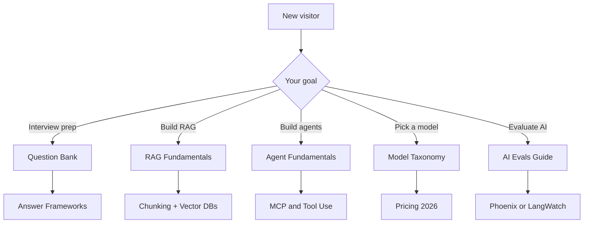
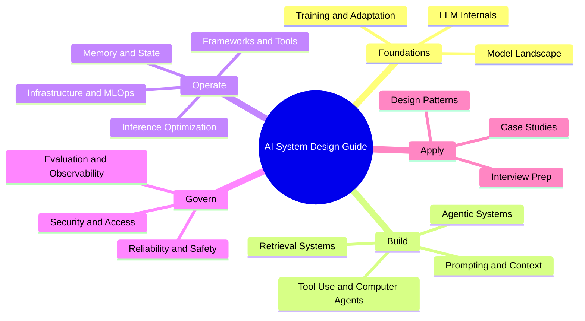

<a id="-ai-system-design-guide"></a>
# 🧠 AI 系統設計指南
<a id="the-complete-interview--production-reference"></a>
### 完整的面試與生產環境參考指南

<p align="center">
  <a href="https://github.com/ombharatiya"></a>
  <a href="https://x.com/ombharatiya"></a>
  <a href="https://linkedin.com/in/ombharatiya"></a>
</p>

<p align="center">
  <a href="https://github.com/ombharatiya/ai-system-design-guide/commits/main"></a>
  <a href="LICENSE"></a>
  <a href="#-contributing"></a>
  <a href="https://github.com/ombharatiya/ai-system-design-guide/stargazers"></a>
  <a href="https://github.com/ombharatiya/ai-system-design-guide/graphs/contributors"></a>
  <a href="https://github.com/ombharatiya/ai-system-design-guide/issues"></a>
</p>

> **生產級 AI 系統的活文件參考書。** 持續更新，深度足以應付面試。

這是一份實用且持續更新的 AI 系統設計指南，涵蓋 AI 系統設計、RAG 架構、LLM 工程、agentic AI、MCP 與 A2A 協定，以及 AI engineering 面試準備。內容包含生產環境模式、模型選型、評估方法，以及來自 staff-level 面試的真實案例研究。

**第一次來這裡？** 直接查看 [110 題面試題庫](00-interview-prep/01-question-bank.md)、[RAG Fundamentals 章節](06-retrieval-systems/01-rag-fundamentals.md)，或先選出[適合生產環境的 LLM](02-model-landscape/01-model-taxonomy.md)。

---

<a id="-quick-navigation"></a>
## 📚 快速導覽

| 我想要... | 從這裡開始 |
|--------------|------------|
| **準備面試** | [題庫](00-interview-prep/01-question-bank.md) → [回答框架](00-interview-prep/02-answer-frameworks.md) |
| **快速學會 AI 系統** | [LLM Internals](01-foundations/01-llm-internals.md) → [RAG Fundamentals](06-retrieval-systems/01-rag-fundamentals.md) |
| **建構生產級 RAG** | [Chunking](06-retrieval-systems/02-chunking-strategies.md) → [Vector DBs](06-retrieval-systems/04-vector-databases.md) → [Reranking](06-retrieval-systems/06-reranking-strategies.md) → [Production RAG](06-retrieval-systems/14-production-rag-at-scale.md) |
| **進階檢索** | [Contextual Retrieval](06-retrieval-systems/10-contextual-retrieval.md) → [ColBERT](06-retrieval-systems/11-late-interaction-colbert.md) → [Multi-modal RAG](06-retrieval-systems/12-multimodal-rag.md) |
| **設計多租戶 AI** | [Isolation Patterns](12-security-and-access/04-multi-tenant-rag-isolation.md) → [案例研究](16-case-studies/08-multi-tenant-saas.md) |
| **打造 agents** | [Agent Fundamentals](07-agentic-systems/01-agent-fundamentals.md) → [MCP & A2A](07-agentic-systems/03-tool-use-and-mcp.md) → [LangGraph](09-frameworks-and-tools/02-langgraph-orchestration.md) |
| **Tool-use 與 computer agents** | [Landscape](17-tool-use-and-computer-agents/01-tool-use-landscape.md) → [OpenClaw](17-tool-use-and-computer-agents/03-openclaw-deep-dive.md) → [Safety](17-tool-use-and-computer-agents/07-safety-and-governance.md) |
| **自主 coding agents** | [Claude Code](09-frameworks-and-tools/09-claude-code.md) → [OpenCoder Landscape](09-frameworks-and-tools/10-opencoderguide.md) |
| **挑選合適模型（2026）** | [Model Taxonomy](02-model-landscape/01-model-taxonomy.md) → [Pricing](02-model-landscape/03-pricing-and-costs.md) |
| **在生產環境評估 AI** | [AI Evals 指南（Phoenix/Langfuse）](ai_evals_comprehensive_study_guide.md) → [AI Evals 指南（LangWatch/Langfuse）](ai_evals_complete_guide_langwatch_langfuse.md) |
| **找到最適合學 AI 的課程** | [推薦課程與學習路徑](COURSES.md) |
| **從目前職務轉向 AI** | [職涯轉換指南](TRANSITION_GUIDE.md) |
| **了解 2026 AI 就業市場** | [就業市場趨勢 - 2026 年 5 月](00-interview-prep/06-job-market-trends-2026.md) |
| **快速查常見問題答案** | [FAQ](00-interview-prep/07-faq.md)（RAG、agents、models、eval、inference、memory、security） |
| **查詢術語** | [Glossary](GLOSSARY.md)（每個術語都有定義） |

<a id="pick-a-path"></a>
### 選擇你的路徑



---

<a id="-why-this-guide"></a>
## 🎯 為什麼要看這份指南

**傳統書籍在出版前就已經過時。** 這是一份活文件：當新模型發布、模式演進時，內容也會同步更新。

| 本指南 | 紙本書 |
|------------|---------------|
| 2026 年 5 月的模型（Claude Opus 4.7、GPT-5.5、Gemini 3.1 Pro、DeepSeek V4 Pro、Llama 4、Kimi K2.6、Qwen 3.6、Mistral Medium 3.5、Gemma 4） | 還停留在 GPT-4 |
| MCP 2.0、A2A v1.0、OpenClaw、Computer Use、Agentic RAG、ColBERT、latent reasoning、MoE serving | 根本還不存在 |
| 附有 2026 年 5 月驗證日期的真實定價 | 早就不準 |
| Staff-level 面試問答（截至 2026 年 5 月共 110 題）+ 就業市場趨勢 | 只有泛泛問題 |

**快速模型選擇（2026 年 5 月）：** Claude Opus 4.7 適合 tool-use 與長上下文推理，GPT-5.5 適合一般生產環境，Gemini 3.1 Pro 適合 multimodal，DeepSeek V4 Flash（每 1M tokens 為 $0.14/$0.28）或 V4 Pro（5 月 22 日永久降價後為 $0.435/$0.87）適合低成本 frontier-class 輸出，Llama 4 適合 self-hosted。完整比較請見 [Model Taxonomy](02-model-landscape/01-model-taxonomy.md)。

---

<a id="-what-this-guide-is-and-is-not"></a>
## 🎯 這份指南是什麼（以及不是什麼）

**這份指南是：**
- 為設計生產級 AI 系統（RAG、agents、MCP、eval pipelines、多租戶隔離）而寫的 staff-level 參考資料。
- AI 面試準備夥伴，提供截至 2026 年 5 月的 110+ 真實題目、回答框架與白板練習。
- 一份會隨新模型發布、協定變化與新興模式上線而持續追蹤更新的活文件。
- 明確討論取捨：latency vs cost、accuracy vs faithfulness、single-agent vs multi-agent。
- 免費、MIT 授權，並歡迎實務工作者提交 PR。

**這份指南不是：**
- Python、PyTorch 或基礎 ML fundamentals 教學（請先從課程開始；參見 [COURSES.md](COURSES.md)）。
- 假裝 vendor-neutral 的折衷內容；它會直接點名具體模型、價格與框架，因為真實系統需要真實選擇。
- 實作經驗的替代品；請把它和專案一起讀，而不是取代動手做。
- 論文摘要集；只有在論文確實改變實務作法時才會引用，而非為了求全。

---

<a id="-guide-structure"></a>
## 📖 指南結構

```
├── 00-interview-prep/           # Questions (110), frameworks, exercises, job-market trends (May 2026)
├── 01-foundations/              # Transformers, attention, embeddings
├── 02-model-landscape/          # Claude Opus 4.7, GPT-5.5, Gemini 3.1, DeepSeek V4, Llama 4, Kimi K2.6, Qwen 3.6, Mistral Medium 3.5
├── 03-training-and-adaptation/  # Fine-tuning, LoRA, DPO, distillation
├── 04-inference-optimization/   # KV cache, PagedAttention, vLLM
├── 05-prompting-and-context/    # Prompt engineering, CoT, Extended Thinking, DSPy, prompt injection
├── 06-retrieval-systems/        # RAG, chunking, GraphRAG, Agentic RAG, ColBERT, Contextual Retrieval
├── 07-agentic-systems/          # MCP 2.0, A2A protocol, multi-agent, computer-use
├── 08-memory-and-state/         # L1-L3 memory tiers, Mem0, caching
├── 09-frameworks-and-tools/     # LangGraph, DSPy, LlamaIndex, Claude Code, OpenCoder
├── 10-document-processing/      # Vision-LLM OCR, multimodal parsing
├── 11-infrastructure-and-mlops/ # GPU clusters, LLMOps, cost management
├── 12-security-and-access/      # RBAC, ABAC, multi-tenant isolation
├── 13-reliability-and-safety/   # Guardrails, red-teaming
├── 14-evaluation-and-observability/ # RAGAS, LangSmith, drift detection
├── 15-ai-design-patterns/       # Pattern catalog, anti-patterns
├── 16-case-studies/             # Real-world architectures with diagrams
├── 17-tool-use-and-computer-agents/ # OpenClaw, Computer Use, tool agents, safety
├── GLOSSARY.md                  # Every term defined
│
├── ai_evals_comprehensive_study_guide.md      # 🔬 Deep-dive: AI Evals (Phoenix + Langfuse)
└── ai_evals_complete_guide_langwatch_langfuse.md  # 🔬 Deep-dive: AI Evals (LangWatch + Langfuse)
└── COURSES.md                   # 🎓 Recommended courses & learning paths
└── TRANSITION_GUIDE.md          # 🔄 Transition from Backend/QA/PM/EM to AI roles
```

<a id="chapters-by-ai-system-lifecycle-stage"></a>
### 依 AI 系統生命週期階段劃分的章節



---

<a id="-featured-case-studies"></a>
## 🔥 精選案例研究

真實面試題，附完整解法與圖解：

| 案例研究 | 問題 | 核心模式 |
|------------|---------|--------------|
| [即時搜尋](16-case-studies/06-real-time-search.md) | 大規模下維持 5 分鐘資料新鮮度 | Streaming + Hybrid Search |
| [Coding Agent](16-case-studies/07-autonomous-coding-agent.md) | 自主完成多檔案修改 | Sandboxing + Self-Correction |
| [多租戶 SaaS](16-case-studies/08-multi-tenant-saas.md) | Coca-Cola 和 Pepsi 共用同一套基礎設施 | Defense-in-Depth Isolation |
| [客戶支援](16-case-studies/09-customer-support-automation.md) | 60% 自動解決率 | Tiered Routing + Escalation |
| [文件智慧](16-case-studies/10-document-intelligence.md) | 每月擷取 5 萬份合約 | Vision-LLM + Parallel Extractors |
| [推薦引擎](16-case-studies/11-recommendation-engine.md) | 在 5,000 萬用戶規模下提供個人化解釋 | ML Ranking + LLM Explanations |
| [合規自動化](16-case-studies/12-compliance-automation.md) | FDA 法規預審 | Claim Extraction + Precedent DB |
| [語音醫療](16-case-studies/13-voice-ai-healthcare.md) | 即時生成臨床筆記 | On-Prem ASR + HIPAA |
| [詐欺偵測](16-case-studies/14-fraud-detection.md) | 100ms 內完成可解釋決策 | ML + Rules Hybrid |
| [知識管理](16-case-studies/15-knowledge-management.md) | 200 萬份文件加上存取控制 | Permission-Aware RAG |
| [Computer-Use Agent](16-case-studies/16-computer-use-agent-production.md) | 跨 3 套舊式 UI 自動化報銷流程 | Firecracker VMs + Action Gate + IPI Defense |
| [多租戶 Fine-Tuning](16-case-studies/17-multi-tenant-fine-tuning-platform.md) | 280 個租戶共享 base model + 每租戶 LoRA | LoRA Hot-Swap + Eval-as-PRD per Tenant |
| [由 eval 把關的 CI/CD](16-case-studies/18-eval-gated-cicd.md) | 阻擋讓 AI 品質退步的 PR | Golden Sets + LLM Judges + Statistical Correction |
| [客戶蒸餾](16-case-studies/19-customer-distillation-pipeline.md) | 將每月 $50K frontier 支出降到 $6K，3 個月回本 | Trace-Based Distillation + Canary Rollout |
| [MCP 知識 Agent](16-case-studies/20-mcp-knowledge-agent.md) | 從 Snowflake/Confluence/Jira/Slack 跨系統回答問題 | MCP + OAuth Resource Server + Capability Gating |

---

<a id="-bonus-deep-dive-guides"></a>
## 🔬 額外深度指南

兩份配套指南（各超過 3,000 行），完整涵蓋端到端 AI evaluation——適合 Engineers、PMs 與 QAs：

| 指南 | 涵蓋平台 | 內容包含 |
|-------|------------------|---------------|
| [AI Evals：完整學習指南](ai_evals_comprehensive_study_guide.md) | Arize Phoenix + Langfuse | LLM-as-a-Judge、RAG eval、多輪 eval、生產安全、使用 `judgy` 進行統計校正、30 天學習路徑 |
| [AI Evals：LangWatch + Langfuse 指南](ai_evals_complete_guide_langwatch_langfuse.md) | LangWatch + Langfuse | 相同 syllabus，加上 LangWatch 內建 40+ evaluators、平台並列比較與選型建議 |

**兩份指南共同涵蓋的主題：**
- Tracing 與 observability 設定（Phoenix、LangWatch、Langfuse）
- 錯誤分析：open coding → axial coding → failure mode taxonomy
- 以 Train/Dev/Test split 與 ground truth calibration 建立 LLM judges
- 程式碼型 evaluators（regex、JSON schema、format validators）
- RAG 專屬 evals：faithfulness、context recall、answer relevance
- 多步驟 pipeline evaluation 與多輪對話 eval
- 生產 guardrails、安全監控、即時 drift detection
- 使用 `judgy` 套件做統計校正
- 人工標註最佳實務與 inter-rater reliability
- 大規模 eval pipelines 的 cost/latency 最佳化

---

<a id="-for-interview-prep"></a>
## 🎓 面試準備專區

AI engineering 與 system design 面試常會問這類問題：

> 「設計一個多租戶 RAG 系統，讓競爭對手彼此看不到對方資料。」

> 「你的 agent 明明是 3 步任務卻跑了 15 步，你要怎麼 debug？」

這份指南會提供 **具體模式**、**真實取捨** 與 **生產環境失敗模式**：這正是高階面試官期待看到的深度。

➡️ 從 [Interview Prep](00-interview-prep/) 開始

---

<a id="-frequently-asked-questions"></a>
## ❓ 常見問題

<a id="what-is-ai-system-design"></a>
### 什麼是 AI 系統設計？
AI 系統設計是圍繞 LLM、retrieval、agents 與 evaluation 來架構生產級系統的學科。它涵蓋模型選型、RAG pipelines、agent orchestration、memory、observability 與 safety。若想先建立整體觀念，請參考 [LLM Internals](01-foundations/01-llm-internals.md) 與 [AI Design Patterns](15-ai-design-patterns/)。

<a id="how-do-i-prepare-for-an-ai-engineering-interview"></a>
### 我要如何準備 AI engineering 面試？
先從 [Question Bank](00-interview-prep/01-question-bank.md) 開始（截至 2026 年 5 月共有 110 題），再搭配 [Answer Frameworks](00-interview-prep/02-answer-frameworks.md) 與 [Whiteboard Exercises](00-interview-prep/04-whiteboard-exercises.md) 練習。大多數 senior 面試都會考 RAG 設計、agent debugging、多租戶隔離，以及 cost/latency 取捨，而這些都收錄在 [Case Studies](16-case-studies/) 中。

<a id="what-is-rag-retrieval-augmented-generation"></a>
### 什麼是 RAG（Retrieval-Augmented Generation）？
RAG 是一種模式：LLM 會先從外部知識來源（vector DB、search index、graph）擷取相關上下文，再生成答案，藉此降低 hallucinations，並讓回覆有你的資料作為依據。完整流程可參考 [RAG Fundamentals](06-retrieval-systems/01-rag-fundamentals.md)，而大規模實作則見 [Production RAG at Scale](06-retrieval-systems/14-production-rag-at-scale.md)。

<a id="what-are-ai-agents-and-how-are-they-different-from-chatbots"></a>
### 什麼是 AI agents？它們和 chatbots 有什麼不同？
AI agents 是由 LLM 驅動、能規劃、呼叫工具並透過多步驟完成目標的系統；chatbots 則通常只在單輪回應。Agents 會引入迴圈、memory、錯誤復原，以及透過 MCP 等協定進行 tool-use。建議先閱讀 [Agent Fundamentals](07-agentic-systems/01-agent-fundamentals.md)。

<a id="what-is-mcp-model-context-protocol-and-how-does-it-compare-to-a2a"></a>
### 什麼是 MCP（Model Context Protocol）？它和 A2A 相比如何？
MCP 是一種開放協定，讓 LLM 能以標準化方式發現並呼叫外部工具與資料來源。A2A（Agent-to-Agent）則是用於 agent 間通訊的互補協定。兩者解決的是不同層次的問題：MCP 是工具邊界，A2A 是 agent 邊界。詳見 [Tool Use and MCP](07-agentic-systems/03-tool-use-and-mcp.md)。

<a id="which-llm-should-i-use-in-production-claude-gpt-gemini-or-open-source"></a>
### 在生產環境中，我該用哪個 LLM：Claude、GPT、Gemini，還是 open-source？
這取決於 latency 預算、context length、每百萬 tokens 成本、tool-use 品質以及資料落地需求。[Model Taxonomy](02-model-landscape/01-model-taxonomy.md) 與 [Pricing](02-model-landscape/03-pricing-and-costs.md) 章節，會針對截至 2026 年 5 月的 Claude Opus 4.7、GPT-5.5、Gemini 3.1 Pro、DeepSeek V4、Llama 4 等模型做正面比較。

<a id="how-do-i-evaluate-an-llm-or-rag-system-in-production"></a>
### 我要如何在生產環境中評估 LLM 或 RAG 系統？
將離線 evals（經過 ground-truth calibration 的 LLM-as-a-judge）、線上指標（faithfulness、context recall、answer relevance）以及持續 tracing 結合起來。兩份配套深度指南 [AI Evals: Phoenix + Langfuse](ai_evals_comprehensive_study_guide.md) 與 [AI Evals: LangWatch + Langfuse](ai_evals_complete_guide_langwatch_langfuse.md) 會一步步帶你完整走過。

<a id="how-do-i-build-a-multi-tenant-rag-system-safely"></a>
### 我要如何安全地建構多租戶 RAG 系統？
採用 defense-in-depth：為每個租戶建立獨立 index 或 namespace、在查詢時做 access checks，並加入 prompt 層防護。[Multi-Tenant RAG Isolation](12-security-and-access/04-multi-tenant-rag-isolation.md) 章節與 [Multi-Tenant SaaS Case Study](16-case-studies/08-multi-tenant-saas.md) 說明了能在面試與生產環境都站得住腳的模式。

<a id="what-is-agentic-rag"></a>
### 什麼是 agentic RAG？
Agentic RAG 把 retrieval 與 agent loop 結合，系統可以決定該搜尋什麼、何時重新查詢、何時升級處理，而不是只跑一次固定的 retrieve-then-generate 流程。它的架構與取捨可參考 [Agentic RAG](06-retrieval-systems/08-agentic-rag.md)。

<a id="is-this-guide-free-can-i-contribute"></a>
### 這份指南免費嗎？我可以貢獻嗎？
可以，這份指南採 MIT 授權且免費。歡迎提交 PR；請參考 [Contributing Guide](CONTRIBUTING.md)。如果你有生產環境失敗模式、新模型 benchmark，或想補充面試題，歡迎直接開 PR。

<a id="how-often-is-this-guide-updated"></a>
### 這份指南多久更新一次？
持續更新。新模型發布、協定變更（MCP、A2A）與新興模式一上線就會補進來。近期新增內容包含 [Tool-Use and Computer Agents](17-tool-use-and-computer-agents/01-tool-use-landscape.md) 與 [2026 年 5 月就業市場趨勢](00-interview-prep/06-job-market-trends-2026.md)。

<a id="can-i-use-this-guide-if-i-am-transitioning-from-backend-qa-pm-or-em-into-ai"></a>
### 如果我正從 backend、QA、PM 或 EM 轉向 AI，也能使用這份指南嗎？
可以。[Role Transition Guide](TRANSITION_GUIDE.md) 會把既有技能對應到 AI engineering、MLE 與 AI architect 路線，並依角色提供閱讀路徑。可再搭配 [COURSES.md](COURSES.md) 取得精選學習資源。

---

<a id="-living-book"></a>
## 🔄 活文件

這份指南持續追蹤：
- 新模型發布與真實世界表現
- 新興模式（MCP、Agentic RAG、Flow Engineering）
- 更新後的定價與 rate limits
- 棄用項目與最佳實務變化

**⭐ 按下 Star 和 Watch**，就能在更新推送時收到通知。

---

<a id="-contributing"></a>
## 🤝 貢獻方式

發現內容過時？有生產經驗想分享？歡迎提交 PR。
請參考 [Contributing Guide](CONTRIBUTING.md)。

---

<a id="-license"></a>
## 📄 授權

MIT License。詳見 [LICENSE](LICENSE)。

---

<p align="center">
  <b>由 <a href="https://github.com/ombharatiya">Om Bharatiya</a> 打造</b><br/>
  <a href="https://github.com/ombharatiya"></a>
  <a href="https://x.com/ombharatiya"></a>
  <a href="https://linkedin.com/in/ombharatiya"></a>
</p>
